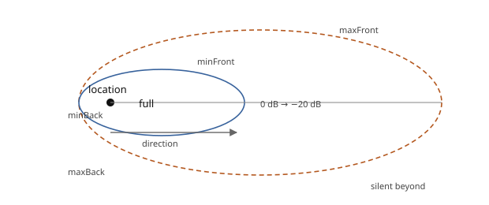

Spatial Audio
=============

.. rst-class:: introduction

OpenGLContext plays sound from positions in the scene. An emitter under a
``Transform`` is heard from that transform's position. Its volume falls with
distance, it can be aimed like a spotlight, and it pans between the ears as
the listener moves past it. The data model is glTF's `KHR_audio_emitter
<https://github.com/omigroup/gltf-extensions/tree/main/extensions/2.0/KHR_audio_emitter>`__
extension, which follows the Web Audio ``PannerNode`` model, so a scene
authored in Blender or Godot keeps its sound when loaded. VRML97's ``Sound``
node plays through the same code. The mixing is done in numpy, so no copyleft
audio library is needed, and each gain curve is a function of geometry that
can be tested on its own. The indented technical notes point at the code.

The audio engine is a separate package, `omi_audio
<https://github.com/mcfletch/omi_audio>`__, which OpenGLContext depends on in
the same way as it depends on ``omi_physics``. ``omi_audio`` holds the data
model, the gain curves, the clip cache, the mixer, the device interface and
the engine, and has no scenegraph code. OpenGLContext adds the
``AudioEmitter``, ``AudioSource`` and ``Sound`` nodes, and a per-context
engine that the render pass drives. A project with no renderer, or with a
different one, can use ``omi_audio`` without OpenGLContext.

.. _audio-quickstart:

Playing a sound in a scene
--------------------------

Put an ``AudioEmitter`` under a ``Transform``. There is no engine to create,
no device to open and nothing to update each frame:

.. code-block:: python

   from OpenGLContext.scenegraph.basenodes import (
       AudioEmitter, AudioSource, Transform,
   )

   fountain = Transform(translation=(3, 0, -5), children=[
       AudioEmitter(
           gain=0.8,                 # linear, not decibels
           refDistance=2.0,          # full volume within 2 metres
           rolloffFactor=1.0,        # how fast it fades past that
           sources=[AudioSource(url=['water.ogg'], loop=True)],
       ),
   ])

While the render pass collects the frame's nodes, it finds the emitter,
computes its position from the transforms above it, and aims it relative to
the camera. The camera is the listener.

.. rst-class:: technical

The nodes are in ``OpenGLContext/scenegraph/audio.py``. The pass calls
``FlatPass.renderAudio()``, which delegates to
``OpenGLContext.audio.scene.update()``.

No audio device is opened and no audio thread is started until a frame that
contains something audible is drawn. A scene with no sound in it does no audio
work.

Repeating a sound
~~~~~~~~~~~~~~~~~

A source plays once, loops, or repeats after a pause. Use the repeat for
occasional sounds, such as a distant rumble every half minute, a drip or a
creak. A loop would make them continuous.

.. list-table::
   :widths: auto
   :header-rows: 1

   * - Wanted
     - Fields
   * - Plays once and is done
     - the default
   * - Continuous
     - ``loop=True``
   * - Every 30 seconds or so
     - ``repeatInterval=30.0, repeatVariance=5.0``

.. code-block:: python

   AudioSource(url=['distant-thunder.wav'],
               repeatInterval=30.0,      # seconds of quiet between plays
               repeatVariance=5.0)       # ±5s, so two of them drift apart

The interval is measured from the frame in which the clip is found to have
ended, so a long clip and a short one leave the same gap of quiet.
``repeatVariance`` varies each wait, so two sources of the same sound drift
apart instead of playing in step. The wait is never negative. Both fields are
ignored while ``loop`` is set.

``repeatInterval``, ``repeatVariance`` and ``priority`` are not part of
``KHR_audio_emitter``; the extension has no fields for them.

A one-shot that has finished stays finished. Without the repeat fields,
nothing restarts it. A looping source that has stopped is different: a loop
only stops when its voice is stolen, so it takes a voice again when one is
free. Ambience silenced during a busy moment comes back afterwards.

.. _gltf:

Loading sound from glTF
-----------------------

The :doc:`glTF loader <gltf>` reads a document's ``KHR_audio_emitter`` block
into the ``omi_audio`` model and turns it into scenegraph nodes while it
builds the scene. A node's emitters become children of that node's
``Transform``. A scene's emitters, which the extension requires to be
``global``, are attached to the root, where no transform applies.

.. code-block:: python

   from OpenGLContext.loaders.gltf import loader
   scene = loader.load_gltf('room.gltf')   # its emitters are already in there

Audio can be stored in the three ways glTF allows, and all three are read: a
``uri`` beside the document, an inline ``data:`` URI, and a ``bufferView``
inside the file, as in a ``.glb``.

Resolving audio references
~~~~~~~~~~~~~~~~~~~~~~~~~~

``omi_audio`` never resolves, opens or interprets a document's ``uri``. A
scene file may come from a third party, and a reference in it may be
relative, absolute, percent-encoded, a ``data:`` URI, an ``http:`` URL, or an
attempt to escape the content directory. Only the loader has the document's
location and the rules for what it may reach.

Audio references therefore go through the same ``Resolver`` as every other
external reference: same-origin http(s) only, or confined to the base
directory, with a size limit (see :doc:`untrusted`). The resolved bytes go to
``omi_audio.AudioLibrary``, which decodes them and keeps the result for the
document. A reference the resolver refuses silences that one sound; the rest
of the scene loads.

.. rst-class:: technical

In ``loaders/gltf/scene.py``, ``audio_library`` builds the ``AudioLibrary``
with ``_fetch_audio`` as its fetch callback. ``_audio_emitters`` resolves a
node's or a scene's references through
``omi_audio.model.AudioDocument.emitters_for_node`` and
``emitters_for_scene``; the latter enforces the extension's rule that a
scene, which has no transform, carries only ``global`` emitters. The model
reader is ``omi_audio.model.from_gltf``. ``omi_audio.model.to_gltf`` writes the
model back out, leaving out every field that is at its default.

.. _vrml:

The VRML97 ``Sound`` node
-------------------------

:doc:`VRML97's <vrml97>` own ``Sound`` and ``AudioClip`` nodes play, with the
fields pyvrml97 declares for them:

.. code-block:: python

   Sound(
       source=AudioClip(url=['ambience.wav'], loop=True, pitch=1.0),
       location=(0, 1, 0), direction=(0, 0, -1),
       minFront=2.0, minBack=2.0, maxFront=40.0, maxBack=10.0,
       intensity=0.8, priority=0.2, spatialize=True,
   )

``startTime`` and ``stopTime`` bound when the clip plays, ``loop`` repeats
it, and ``pitch`` sets the playback rate. The ``isActive`` and
``duration_changed`` events are sent. A clip whose ``startTime`` has already
passed starts from its beginning; seeking into a clip that started before the
scene did is not supported. With ``spatialize=FALSE`` the sound still fades
with distance but stays in the middle of the stereo field, as the
specification says. The node's gain model is described under
:ref:`audio-ellipsoids`.

.. rst-class:: technical

The geometry is ``omi_audio.spatial.ellipsoid_gain_at(location, direction,
listener_position, ...)``, which takes three world-space vectors and computes
the distance and the angle itself. The node transforms its ``location`` and
``direction`` into world space, multiplies by ``intensity``, and pans. A
sound with a zero ``direction`` has no front or back, so its ``front``
distances apply in every direction.

.. _api:

Playing sounds from code
------------------------

To play a sound without adding a node to the scene, such as a gunshot, call
the engine directly. It is the same engine the nodes use:

.. code-block:: python

   from OpenGLContext.audio import scene as audioscene

   engine = audioscene.engine_for(self)          # None if audio is switched off
   if engine is not None:
       engine.play('weapon/rocket_fire.wav',
                   emitter=emitter_record,        # an omi_audio.model.AudioEmitter
                   position=muzzle_world_position,
                   gain=1.0, priority=0.8)

.. list-table::
   :widths: auto
   :header-rows: 1

   * - Call
     - Does
   * - ``engine.play(source, ...)``
     - Starts a clip or a named file. Returns a ``VoiceHandle``, or None when
       the clip does not resolve or the voice pool refuses it. None is not an
       error.
   * - ``engine.aim(handle, emitter, position, forward)``
     - Re-aims a playing sound. Accepts a None handle.
   * - ``engine.gains_for(emitter, position, forward, gain)``
     - Returns the two ear gains without playing anything. Use it in tests, or
       to decide whether a sound is worth starting.
   * - ``engine.listen(view_platform)``
     - Moves the listener. The render pass calls it every frame.
   * - ``engine.master_gain``
     - The application's mix level. Set it once. It is separate from the
       player's volume and is never overwritten by it.
   * - ``engine.volume``
     - The player's volume, copied every frame from
       ``definition.audio.volume``. Write the field, not this.
   * - ``engine.muffle``
     - Low-pass blend on the whole mix, from 0 (clear) to 1 (underwater). See
       :ref:`audio-muffle`.
   * - ``audioscene.describe(context)``
     - Returns a dict for a debug overlay: device, voice count, volume, muffle.

.. _audio-synth:

Generated sounds
~~~~~~~~~~~~~~~~

``omi_audio.synth`` generates clips from arithmetic: tones, swept chirps,
white noise, percussive impacts and rumble. They need no asset files, which is
why the demo ships none, and they work as placeholders while a game is being
built and tuned.

.. code-block:: python

   from omi_audio import synth
   engine.clips.put('ping', synth.impact(0.4, seed=1))
   engine.play('ping', priority=1.0)

To put a generated clip in a scene, give it to an ``AudioSource`` with
``useClip()``. It needs no name and no registration. From then on it follows
the same path as a decoded clip: it is positioned, attenuated, panned and
given a voice like any other sound.

.. code-block:: python

   source = AudioSource(loop=True, gain=0.0)
   source.useClip(synth.tone(400.0, 2.0, harmonics=7, fade=0.0))
   emitter = AudioEmitter(sources=[source])
   ...
   source.gain = 0.3            # every frame, from whatever is being simulated
   source.playbackRate = 1.8

Use this for sounds that the game computes: an engine note whose pitch
follows road speed, wind whose level follows the square of the speed, or
footsteps varied so that two in a row differ. The clip is resampled to the
engine's sample rate if needed, because the mixer runs at the rate the device
was opened at and a clip at another rate would play at the wrong pitch.
``ClipCache.put()`` does the same for a clip registered by name. A clip given
through ``useClip()`` takes precedence over ``url`` and over a document's audio
library.

A looped clip must end where it begins. By default every generator applies a
short ``fade`` at each end so that a one-shot does not click; in a loop, that
fade is heard as a pulse at the loop rate. For a loop, pass ``fade=0.0`` and
give ``tone()`` a whole number of cycles, or use ``rumble()`` with
``decay=0.0`` and ``attack=0.0``, which holds a constant level so the noise at
the end joins the noise at the start.

.. _audio-settings:

Settings and volume
-------------------

Audio settings are an ``AudioSettings`` node at ``definition.audio`` on the
``ContextDefinition``. As a node, it gets validation, defaults, serialisation
and a generated settings page from the field system.

.. list-table::
   :widths: auto
   :header-rows: 1

   * - Field
     - Environment
     - Default
     - Means
   * - ``audio.enabled``
     - ``OPENGLCONTEXT_AUDIO``
     - on
     - Off opens no device and starts no thread. Use it for capture runs,
       benchmarks and headless builds.
   * - ``audio.volume``
     - ``OPENGLCONTEXT_AUDIO_VOLUME``
     - 1.0
     - The *player's* volume. It is read every frame, so a settings slider
       takes effect at once.
   * - ``audio.voices``
     - —
     - 32
     - How many sounds can play at once. When more sounds want to play, the
       :ref:`least important are dropped first <audio-stealing>`.

The fields appear under *Sound* in the F10 :ref:`settings screen
<overlayui-settings>`. The environment variables are listed with the others
in :doc:`environment`.

Two volumes that multiply
~~~~~~~~~~~~~~~~~~~~~~~~~

There are two volume controls, and the mixer uses their product:

.. list-table::
   :widths: auto
   :header-rows: 1

   * -
     - Who owns it
     - Written by
   * - ``definition.audio.volume`` → ``engine.volume``
     - the **player**
     - the settings screen, a volume key. Re-read every frame.
   * - ``engine.master_gain``
     - the **application**
     - the application, once. How loud this scene is authored to be.

Do not copy one into the other every frame. If code does that, a change to
the overwritten value lasts one frame: the volume control shows a new number
and the sound does not change. A volume key writes
``context.contextDefinition.audio.volume``, not ``engine.master_gain``. That
field is the number the settings screen shows and saves.

.. _silence:

Running without sound
---------------------

Sound can be unavailable in two ways, and both have the same result:

- The package is missing - ``miniaudio`` is an optional dependency of
  ``omi_audio``. ``pip install OpenGLContext[audio]`` installs it, as does
  ``pip install omi_audio[playback]`` on its own.

- No device opens - a container with no ALSA or PulseAudio, a machine with no
  sound card, a device another program holds exclusively, or the backend
  falling back to its own null output, which is treated the same way.

In either case the engine logs one warning and the program runs silently. It
never raises an exception to the user and never refuses to start;
``open_device()`` does not raise. Many machines, including continuous
integration runners, have no sound, and the application runs the same on
them.

.. rst-class:: technical

In ``omi_audio``, ``tests/test_device.py`` covers the missing-package path, the
device-will-not-open path and the backend's own null output, including a test
that forces the import to fail. ``tests/test_clip.py`` covers decoding with
the backend removed.

.. _audio-dataflow:

How sound reaches the device
----------------------------

Two threads are involved. Everything expensive, everything that can fail, and
everything that needs to know about the world runs on the **control
thread**, which is the render loop. The **audio thread** only multiplies and
adds numbers.

   The left side runs once per frame, in the render loop. The right side runs
   on the device's own thread, tens of times a second, and uses only numpy
   arrays that already exist.

The only data passed between the threads is **a pair of gains for each
playing sound**. When an emitter moves, its sound is not restarted,
re-resolved or re-decoded. The voice's target gains are overwritten, and the
mixer ramps to them over the next block.

.. rst-class:: technical

``omi_audio/engine.py`` is the left side and ``omi_audio/mixer.py`` the
right. The mixer imports no path, no matrix and no listener: it receives gains
and produces blocks of samples.

.. _pipeline:

The module chain
----------------

The rows above *the package boundary* are the ``omi_audio`` package, which
has no scenegraph code. The rows below it are OpenGLContext's integration.

.. list-table::
   :widths: auto
   :header-rows: 1

   * - Module
     - Provides
     - Depends on
   * - ``omi_audio/model.py``
     - ``KHR_audio_emitter`` as typed records, with the extension's own field
       names and defaults; glTF round-trips through ``from_gltf``/``to_gltf``
     - ``spatial``
   * - ``omi_audio/spatial.py``
     - Every gain curve, and the listener's position
     - numpy
   * - ``omi_audio/clip.py``
     - Files decoded once to mono float32 samples
     - ``miniaudio`` (optional)
   * - ``omi_audio/synth.py``
     - Generated tones, noise, chirps and impacts
     - ``clip``
   * - ``omi_audio/mixer.py``
     - The voice pool and the block mixing
     - ``clip``, ``spatial``
   * - ``omi_audio/device.py``
     - The output device, and the silent fallback when there is none
     - ``miniaudio`` (optional)
   * - ``omi_audio/engine.py``
     - The one object an application holds
     - all of the above
   * - *— the package boundary —*
     -
     -
   * - ``OpenGLContext/audio/scene.py``
     - Attaching an engine to a context and driving it each frame
     - ``omi_audio.engine``
   * - ``OpenGLContext/audio/settings.py``
     - The player's switch, volume and voice budget, as a ``ContextDefinition``
       sub-node
     - the field system
   * - ``OpenGLContext/scenegraph/audio.py``
     - The ``AudioEmitter``, ``AudioSource`` and ``Sound`` nodes
     - ``omi_audio.model``, ``omi_audio.spatial``

.. _curves:

Gain curves
-----------

A sound's level at the listener is the **product of independent factors**.
Each is a small pure function, so each can be tested on its own and replaced
without changing the others.

.. code-block:: text

   level = source.gain
         × emitter.gain
         × distance_gain(distance, model, refDistance, maxDistance, rolloff)
         × cone_gain(angle, coneInnerAngle, coneOuterAngle, coneOuterGain)

   left, right = equal_power_pan(azimuth)
   voice.set_gain(level * left, level * right)

Distance
~~~~~~~~

There are three distance models, taken from ``KHR_audio_emitter``, which
takes them from Web Audio. ``refDistance`` is the radius inside which there is
no attenuation. ``d`` below is never less than ``refDistance``.

.. list-table::
   :widths: auto
   :header-rows: 1

   * - ``distanceModel``
     - Gain
     - Reaches silence?
   * - ``inverse`` (default)
     - ``ref / (ref + rolloff × (d − ref))``
     - No; it approaches zero. The closest to a real sound source.
   * - ``linear``
     - ``1 − rolloff × (d − ref) / (max − ref)``
     - Yes, at ``maxDistance``.
   * - ``exponential``
     - ``(d / ref) ^ (−rolloff)``
     - No; it approaches zero, faster than ``inverse``.

Only the ``linear`` model uses ``maxDistance``: the gain reaches zero there
and stays at zero beyond it. A ``linear`` emitter needs a ``maxDistance``
greater than its ``refDistance``. With the default of 0, it is heard at full
volume inside ``refDistance`` and not at all outside it. ``inverse`` and
``exponential`` ignore ``maxDistance``, so an emitter using them is faintly
audible at any distance. An application that wants ``maxDistance`` to act as a
cut-off for every model can test ``omi_audio.model``'s
``PositionalProperties.in_range()`` and not start sounds out of range; there, a
``maxDistance`` of 0 means no limit.

Use ``linear`` when a sound must be gone beyond a certain range, and
``inverse`` for a sound that should behave like a real object in a real room.

Direction: the cone
~~~~~~~~~~~~~~~~~~~

Set ``shapeType='cone'`` to make an emitter radiate like a spotlight. Both
angles are **angular diameters**, measured side to side, so each boundary is
at half its angle from the axis. Inside the inner cone there is no
attenuation. Outside the outer cone the gain is ``coneOuterGain``. Between the
two it changes linearly. Both angles default to a full turn (2π), so an
emitter that sets neither is not attenuated by direction. The emitter points
along its own **−Z**, as glTF cameras and ``KHR_lights_punctual`` lights do.

Panning
~~~~~~~

The source's position is converted to the listener's frame, giving an azimuth
in the horizontal plane: 0 straight ahead, positive to the right. The azimuth
sets a pair of ear gains on a quarter circle, with ``left² + right² = 1`` at
every angle. Panning therefore moves a sound across the stereo field without
changing its loudness. A sound straight ahead is −3 dB in each ear, as
constant-power panning requires.

A source *behind* the listener is folded onto its mirror image in front, so a
sound behind and to the right pans right. Two loudspeakers cannot place a
sound behind the listener, and Web Audio specifies this fold.

.. _aim-rate:

How often a playing sound is re-aimed
~~~~~~~~~~~~~~~~~~~~~~~~~~~~~~~~~~~~~

For a *playing* sound, the distance curve, the cone, the azimuth and the pan
are recomputed fifteen times a second, not every frame. The interval is
``OpenGLContext.scenegraph.audio.AIM_INTERVAL``.

The gains change slowly and smoothly: a listener walking at a few metres a
second changes them by a small fraction per frame, and the mixer ramps
between values instead of stepping. The computation costs time for every
emitter in a level, so a level with many sounds spends a measurable part of
each frame on it, about two milliseconds on the reference machine. At fifteen
times a second the steps are not audible, and the cost does not grow with the
frame rate.

The interval does not delay the **start** of a sound: a source is aimed the
first time it is seen, so it is placed before it is heard. The interval only
sets how often a playing sound is aimed again. Emitters are given staggered
phases, so they do not all re-aim in the same frame, which would cause a
stutter.

.. _audio-ellipsoids:

VRML97's ellipsoids
~~~~~~~~~~~~~~~~~~~

The ``Sound`` node uses a different model: **two ellipsoids sharing a focus at
the sound**, with a ramp between them that is linear in *decibels*.
OpenGLContext implements this model as the specification defines it, so a
VRML97 world sounds the way its author heard it.

   The sound is at a *focus* of both ellipsoids, not at their centre, so a
   forward-facing sound reaches much further ahead than behind. The reach at
   angle θ is ``2 f b / ((f+b) − (f−b) cos θ)``: the front and back distances
   along the axis, and their harmonic mean at right angles.

At the outer ellipsoid the ramp has reached −20 dB, which the specification
treats as inaudible, and beyond it the gain is zero. The step from 0.1 to 0 is
a discontinuity in the curve, but the mixer ramps every gain change across a
block, so it produces no click.

.. _mixer:

The mixer
---------

The mixer runs on the audio thread, which must never be late: a late block is
heard as a click. This sets how the mixer is built:

- Fixed voice pool - ``Voice`` slots are created once, when the mixer is
  constructed, and reused. Starting a sound configures a slot and allocates
  nothing, so a thousand sounds a second allocate no more than ten.

- Buffers made once - ``Mixer.mix()`` writes into pre-allocated arrays through
  numpy's ``out=`` parameters and returns a *view*. An allocation on the audio
  thread can start a garbage collection on the audio thread.

- No blocking work - the audio thread does not block, decode, resolve paths or
  log. That work happens on the control thread before a clip reaches a voice.

- Lock on the control side only - ``Mixer.play()`` takes a lock so that two
  *control* threads cannot claim the same slot. Mixing never takes it.

Gain ramping
~~~~~~~~~~~~

A gain that jumps between blocks makes a click. Each ear's gain is therefore
interpolated from its value at the end of the last block to the target the
control thread set, reaching the target on the block's last sample. A *new*
voice starts at its gain without a ramp, so that the attack of a sound such as
a gunshot stays sharp.

.. _audio-stealing:

Voice stealing
~~~~~~~~~~~~~~

When every voice is busy, a new sound is compared with the weakest sound
playing, first by ``priority`` and then by how loud it currently is. The new
sound either takes that voice or is refused. Stealing the quietest sound of
the lowest priority is the least audible choice.

Because a voice can be taken back, ``play()`` returns a ``VoiceHandle``, not
the slot itself. The handle records which sound it was for. Once that sound's
slot is reused, calls on the handle do nothing, so code still steering an old
sound cannot change a different sound that now uses the slot.

.. code-block:: python

   handle = engine.play('explosion.wav', priority=0.9)
   ...
   handle.set_gain(0.2, 0.4)   # does nothing once the sound has ended
   handle.stop()               # likewise; there is no need to check first

.. _audio-muffle:

Muffling
~~~~~~~~

``engine.muffle`` (the mixer's ``muffle``) runs from 0 (clear) to 1
(underwater). It blends the mix towards a low-passed copy of itself. The
filter is two cascaded moving averages, each computed as the difference of a
running sum, so a window of any length costs one pass over the block.

The filter's corner is a fixed frequency, **450 Hz**, not a fraction of the
sample rate. A corner set as a fraction of the Nyquist frequency would sit in
the middle of the audible range at 8 kHz and above everything audible at
44.1 kHz. The response at 44.1 kHz:

.. list-table::
   :widths: auto

   * - Frequency
     - 100 Hz
     - 330 Hz
     - 450 Hz
     - 660 Hz
     - 1 kHz
     - 2 kHz
     - 4 kHz
   * - Gain
     - −0.1 dB
     - −1.6 dB
     - −3.0 dB
     - −6.7 dB
     - −17.6 dB
     - −26.5 dB
     - −59 dB

The bass passes and the treble is removed, so the timbre changes, not only
the volume. A pure sine wave has nothing above its fundamental, so a low-pass
filter can only make it quieter. To hear the filter, use a sound with
harmonics, such as ``synth.tone(..., harmonics=N)``, as the demo does. The
muffle is a blend, not a switch, so an application can fade it in as the
listener goes under water:

.. code-block:: python

   engine.muffle = min(1.0, depth_below_surface / 0.5)

.. _formats:

Clips, formats and the cache
----------------------------

A ``Clip`` is the only audio format the mixer accepts: **one channel of
float32 samples at one sample rate**. Every sound is converted to that as it
is loaded, so the mixer's inner loop never has to handle different sample
formats, channel counts or rates.

Clips are mono because a sound is panned by its position in the world. A
stereo recording has already placed itself in the stereo field, so it could
not also be panned to its position in the scene. A stereo file is mixed down
to mono as it is decoded.

``miniaudio`` decodes ``.wav``, ``.mp3``, ``.ogg`` (Vorbis) and ``.flac``. It
resamples and converts channels while decoding, so the conversion takes one
pass. ``miniaudio`` is MIT-licensed, as is every decoder it bundles, and
``libopus``, used for :ref:`Opus <codecs>`, is BSD-licensed, so nothing in the
chain is copyleft.

``ClipCache`` is keyed by name, so a sound played many times is decoded once.
A name that fails to decode is cached as a failure: a missing file logs one
warning, not one per play, and plays as silence instead of raising an
exception. The cache does not normalise a name or check it against the
filesystem. The caller resolves the name before it reaches the cache; for a
glTF document, the resolver does that.

``AudioSource.url`` is a *list*, most preferred first, and the first entry
that decodes is played. This is how the glTF codec extensions work: a document
offers the better format first, then one that every player can decode.

Each entry is resolved against the document the source was read from, and is
limited to what that document may reach. A scene loaded from disk can play
audio **under its own directory**. A scene fetched over ``http(s)`` can play
**same-origin** audio. An entry outside those limits is skipped with a
warning, and the next entry is tried. A source created in application code has
no document behind it, so it is not limited. These are the same rules as for
every other external reference; see ``loaders/resolver.py`` and
:doc:`untrusted`.

A source built from a glTF document gets its samples from that document's
``omi_audio.AudioLibrary`` instead, through ``AudioSource.useLibrary()``.
``useLibrary()`` takes the document's source record, not an audio index,
because the library chooses between the encodings the source offers. A glTF
document identifies audio by index, and audio inside a ``.glb`` has no name at
all. For these sources, ``url`` records *where the sound is*, for display, and
the library supplies the bytes. ``url`` is empty for audio that has no
location: a ``bufferView``, a ``data:`` URI, or a reference the resolver
refuses.

.. _codecs:

Codec extensions
~~~~~~~~~~~~~~~~

``KHR_audio_emitter`` guarantees only MP3. A document can offer a better
encoding through a codec extension on the *source*. The extension names a
second entry in the same ``audio`` array that holds the same sound:

.. code-block:: json

   {"audio": 0, "extensions": {"OMI_audio_ogg_vorbis": {"audio": 1}}}

The source's own ``audio`` entry is the fallback, so the document plays
everywhere and uses the better encoding where it can be decoded. Both
extensions are read, kept, and written back unchanged; only decoding differs.

.. list-table::
   :widths: auto
   :header-rows: 1

   * - Extension
     - Container / MIME
     - Suffix
     - Plays
   * - ``OMI_audio_ogg_vorbis``
     - Ogg, ``audio/ogg``
     - ``.ogg``
     - **yes**
   * - ``OMI_audio_opus``
     - Ogg or WebM, ``audio/opus``, ``audio/webm``
     - ``.opus``, ``.webm``
     - **yes**, where ``libopus`` is available

``omi_audio.formats.decodable()`` asks each decoder which formats it reads,
so the answer follows what is installed. Vorbis is decoded by ``miniaudio``.
Opus is decoded by ``libopus`` through ``omi_audio._opus``, which uses the
library from the optional ``opuslib-next-bundled`` package
(``pip install omi_audio[opus]``) or, without it, a ``libopus`` already on the
system. Most Linux desktops have one; Windows and macOS need the package. The
two are reported separately: a machine with ``libopus`` and no ``miniaudio``
decodes Opus but not the MP3 fallback. Where the better encoding cannot be
decoded, the source plays its MP3 fallback. A document that offers a codec
with *no* fallback says so by listing the extension in ``extensionsRequired``.

Every encoding a source offers goes into ``url``, better first, including
encodings this build cannot decode, since ``url`` records where the sound is.
``AudioLibrary.clip_for()`` chooses which encoding is fetched, and requests
only codecs it can decode. If the better encoding cannot be resolved, it uses
the MP3. If the better encoding is still downloading, it waits for it, so that
a sound whose better encoding has not arrived yet does not play the MP3
instead. An application with its own decoder adds that encoding to
``library.encodings``, and the library requests it from then on.

.. _audio-testing:

Testing sound without a sound card
----------------------------------

Most of the engine is arithmetic on arrays, and tests can check arrays
directly. Build an engine on a ``NullDevice`` and read the mix:

.. code-block:: python

   from omi_audio.device import NullDevice
   from omi_audio.engine import AudioEngine
   from omi_audio import synth

   engine = AudioEngine(device=NullDevice(sample_rate=8000), voices=8)
   engine.mixer.play(synth.tone(440.0, 1.0, sample_rate=8000), pan=1.0)
   block = engine.mixer.mix(64)          # (64, 2) float32
   assert block[:, 0].max() < 1e-9       # nothing in the left ear
   assert block[:, 1].max() > 0.1        # and plenty in the right

``omi_audio``'s own suite tests the curves at known distances and angles,
panning on each side of the listener, voice stealing under load, the gain
ramp, the muffle's frequency response, the glTF round trip, both silent paths,
and the level in dBFS at the device for a source at a given position. One test
checks that mixing a full pool for twenty blocks allocates nothing
measurable. OpenGLContext's ``tests/unit/test_audio_*.py`` test what
OpenGLContext adds: the nodes, the per-context engine, the render-pass wiring
and the glTF import.

.. _audio-demos:

Demo
----

:doc:`tests/audio_spatial.py <tutorials/audio_spatial>` places three sounds in
a room for you to walk around. One circles you (panning), one is far away
(distance), and one is a cone you can hear only from in front. Press ``m`` to
muffle everything, and the space bar to play a one-shot. Every clip is
generated, so the demo ships no assets, and it runs silently on a machine with
no sound device.

.. code-block:: bash

   python tests/audio_spatial.py
