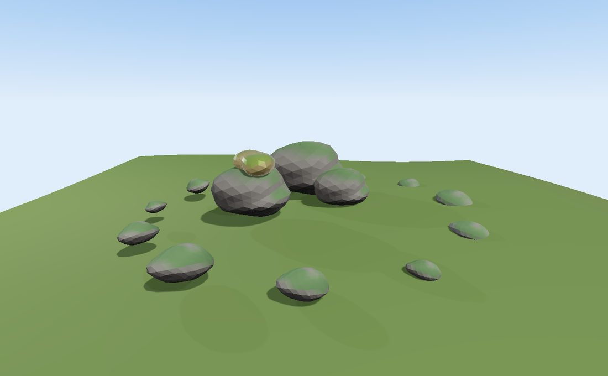

Baking a world
==============

.. rst-class:: introduction

A world larger than memory is not loaded, it is *streamed*: partitioned into a
tree of tiles, each holding the detail that suits the distance it is seen
from, and paged in as the camera approaches. OpenGLContext streams such a
world already (:doc:`Streamed 3D Tiles <tiles3d>`). This page is about
producing one.

Two halves, in two packages. The **glTF writer** is in the engine, because
writing a model is engine machinery and a game's build step may well call it.
The **baker** -- the spatial partition, the per-tile level of detail, the
tileset -- is in `OpenGLContext-editor
<https://github.com/mcfletch/openglcontext-editor>`__, a separate install,
because no shipped game needs it in its dependency tree.

Bake one now
------------

``glisteel-bake`` comes with :doc:`the track editor <glisteel-editor>` and
bakes the world that toolkit ships with -- hills, a river canyon, a lake, a
conifer forest and a circuit through them -- into a directory you can open
with the viewer:

.. code-block:: bash

   pip install glisteel-editor
   glisteel-bake --output /tmp/world
   oglc-view /tmp/world/tileset.json

``glisteel-bake --view`` runs both steps. The world's size, its tile detail
and how deep the tree refines are all on the command line:

.. code-block:: bash

   glisteel-bake --output /tmp/world --extent 8192 --depth 5 --resolution 65

``--extent``
   how many metres across the world is, centred on the origin.
``--depth``
   how many times the tree subdivides. Each level is four times the tiles and
   twice the ground detail, so depth is the main lever on both quality and bake
   time.
``--resolution``
   ground samples across each tile: the vertex budget one tile spends. Detail is
   this divided by the tile's size, so raising it is an alternative to raising
   ``--depth`` that costs bigger tiles rather than more of them.
``--tree-density``, ``--max-instances``, ``--seed``
   trees per square metre, the cap on instances written into any one tile, and
   the seed that makes a world reproducible.

.. _writing:

Writing glTF from your own code
-------------------------------

``OpenGLContext.loaders.gltf.writer`` is the mirror of the loader: it takes
the same ``PBRMesh`` geometry and ``PBRMaterial`` materials the loader
produces, and writes a binary ``.glb``. A mesh written is the mesh that loads
back.

.. code-block:: python

   from OpenGLContext.loaders.gltf import write_glb
   from OpenGLContext.scenegraph.pbrmesh import PBRMesh

   write_glb(PBRMesh(positions=points, normals=normals, indices=indices),
             path='tile.glb')

``write_glb`` takes a mesh, a list of meshes, or ``SceneNode``\ s that add a
name, a local transform and children. What is written is the subset the PBR
renderer reads: position, normal, UV, tangent and colour attributes;
metallic-roughness materials with their five texture channels and the
``KHR_materials_*`` factors; embedded images with their samplers. Index
buffers narrow to 16 bits where the vertex count allows. Skinning, animation
and morph targets are not written.

A material's ``DEF`` is written as its glTF material name, so a material an
application finds by name in one document is found by that name in a document
written from it — see :ref:`Driving a model by name <names>`.
``GLTFWriter.add_material( material, name=... )`` names one explicitly.

Many copies of one mesh
~~~~~~~~~~~~~~~~~~~~~~~

An ``InstanceSet`` on a node writes the standard ``EXT_mesh_gpu_instancing``
extension, so thousands of placements of one mesh ride in a single document
and arrive as one instanced draw:

.. code-block:: python

   from OpenGLContext.loaders.gltf import InstanceSet, SceneNode, write_glb

   write_glb(SceneNode(mesh=tree, instances=InstanceSet(
       translations=positions,        # (N,3)
       rotations=quaternions,         # (N,4) xyzw, optional
       scales=scales)),               # (N,3), optional
       path='trees.glb')

Textures
~~~~~~~~

A material's ``textures`` dict is written channel by channel, its PIL images
embedded as PNG. A map that is already a JPEG stays one -- re-encoding a
photographic texture as PNG multiplies a tile's weight for no visible gain:

.. code-block:: python

   from OpenGLContext.loaders.gltf.writer import EncodedImage

   material.textures['baseColor'] = EncodedImage.from_path('bark.jpg', srgb=True)

.. _roundtrip:

Seeing the round trip
~~~~~~~~~~~~~~~~~~~~~

   ``python tests/bake_demo.py`` — a scene built in code, written to a ``.glb``,
   loaded back and mounted. What is drawn is the file: three of the boulders
   reference one mesh, the twelve pebbles are one more mesh under an
   ``InstanceSet``, and the ground is a vertex-coloured ``terrain_patch`` placed
   by its node's translation. Press ``r`` to print the counts again; the written
   file is left on disk for opening in another viewer.

The demo counts what it wrote out of the document's JSON and what it got back
out of the loaded scenegraph, so the two columns are separate measurements
rather than two views of one number:

.. code-block:: bash

   $ python tests/bake_demo.py
   wrote /tmp/gltf-writer-demo-95gl6ypw/cairn.glb
                     written    read back
   nodes                   7            7
   meshes                  4            4
   materials               3            3
   vertices            4,480        4,480
   triangles           4,002        4,002
   instances              12           12
   bytes             203,692      227,224
   208,260 bytes on disk: that buffer, the JSON describing it, and the
   GLB headers. The loaded arrays weigh more because an index that is 16 bits
   in the file is 32 in the buffer the GPU is handed.

Seven nodes over four meshes is the sharing arriving intact: the boulder is
written once and placed three times, and it loads back as one ``PBRMesh``
under three ``Shape``\ s. The stone material is shared by the boulders and the
pebbles, so three materials cover the four meshes.

What an application writes to do the same:

.. code-block:: python

   from OpenGLContext.loaders.gltf import GLTFWriter, SceneNode, load_gltf
   from OpenGLContext.scenegraph.props import rock_mesh

   boulder = rock_mesh(radius=1.3, seed=3)                 # one mesh...
   writer = GLTFWriter()
   writer.add_node(SceneNode(name='cairn', children=[
       SceneNode(mesh=boulder, translation=(x, 0.0, z))    # ...placed three times
       for x, z in [(-1.7, 0.4), (1.6, -0.7), (0.3, -2.4)]]))
   writer.write('/tmp/cairn.glb')

   document = writer.document()
   print(len(document['meshes']), 'mesh,', len(document['nodes']), 'nodes')
   scene = load_gltf('/tmp/cairn.glb')                     # mount scene.group to draw

That prints ``1 mesh, 4 nodes``. Everything it imports ships with
OpenGLContext, and so does everything the demo imports: writing a document is
the engine's half of the split. The baker, the half that turns a world into a
streamable tileset, comes with `OpenGLContext-editor
<https://github.com/mcfletch/openglcontext-editor>`__.

What the baker produces
-----------------------

A directory holding one ``tileset.json``, a ``.glb`` per tile, and a
``CREDITS.txt`` naming the sources the world was made from. The tileset is OGC
3D Tiles 1.1, written so a 1.0 reader can load it too, and it is exactly what
``OpenGLContext.loaders.tiles3d`` streams.

The partition
~~~~~~~~~~~~~

The tree subdivides **in X and Z** by default. A world whose content sits on a
surface has one ground per column, and splitting the empty air above it buys
nothing but nodes. A world that is genuinely volumetric -- a city with levels,
a road tunnelling under a hillside -- passes ``split_axes=VOLUME_AXES`` and
gets the eight octants.

A tile's bounding volume is the box of what that tile actually wrote, unioned
with its children's, rather than the partition cell it came from. That keeps
the volume tight enough for the screen-space-error test to mean something, and
it guarantees what the traversal rests on: a parent culled from the frustum
has culled every descendant with it.

Level of detail
~~~~~~~~~~~~~~~

Refinement is ``REPLACE``: a tile's content stands in for its whole subtree,
so each level must be a coarser *version* of the same ground rather than a
different part of it. Two mechanisms carry that:

- **Terrain is re-sampled per tile.** Every tile is meshed at the same vertex
  count over its own footprint, so a child covers a quarter of the ground at the
  same budget and the ground gets four times finer per level.

- **Instances are thinned to a budget.** A tile writes at most ``max_instances``
  placements, chosen by an even stride so a coarse tile carries a sparse, evenly
  spread stand-in and the tiles beneath it fill the forest in. The stride is
  deterministic, so a re-bake produces the same world.

Each layer also picks its mesh by the tile's error: a detail ladder of
``(error, mesh)`` pairs lets distant tiles carry a billboard impostor where
near ones carry the real tree.

Geometric error
~~~~~~~~~~~~~~~

The root's error defaults to its width over the terrain's sampling rate -- the
scale at which drawing the root instead of its children is visibly wrong --
and halves at every level. Leaves claim zero, which is how a tileset says
nothing finer exists. The writer refuses a tree in which a child claims a
larger error than its parent, or sits outside its parent's bounds.

Describing a world of your own
------------------------------

A world is a list of *layers*. A layer answers one question -- what is in this
region, at this error? -- and the baker asks every layer at every node:

.. code-block:: python

   from OpenGLContext_editor.bake.bounds import BoundingBox
   from OpenGLContext_editor.bake.driver import bake_world
   from OpenGLContext_editor.bake.layers import HeightfieldLayer, InstanceLayer
   from OpenGLContext_editor.world.scatter import scatter_on_heightfield, yaw_quaternions

   ground = BoundingBox((-2048, 0, -2048), (2048, 0, 2048))
   terrain = HeightfieldLayer(height_fn=my_heights, extent=ground, resolution=33,
                              color_fn=my_colours, water_level=0.0)

   trees = scatter_on_heightfield(my_heights, ground, spacing=2.6, seed=11,
                                  slope_limit=38.0, height_range=(2.0, 130.0),
                                  slope_fn=terrain.field().slope)
   forest = InstanceLayer(positions=trees.positions,
                          rotations=yaw_quaternions(trees.yaws),
                          scales=trees.scales,
                          lods=[(0.0, conifer), (8.0, impostor)])

   result = bake_world([terrain, forest], '/tmp/world', depth=4,
                       credits=['Elevation: SRTM, public domain'])
   print(result.summary())

**Say how far apart, not how many, for anything you will thin afterwards.**
Uniform random candidates later cut down to a minimum separation is
dart-throwing: to saturate the packing it has to be handed several times the
number of instances it will keep, and every one costs a height lookup, a
distance-to-road query and four more lookups for the slope. A jittered grid at
the spacing asks for the answer directly. On the shipped four-kilometre world
that was eight million candidates for half a million trees and most of what a
bake spent; at a spacing it is two and a half million, and the same forest.

Two more things make the difference in a bake that asks about millions of
points. The filters run **cheapest first, each on what the last one left**.
And ``slope_fn`` lets a caller that has already sampled the ground — a bake
builds a height field for the terrain before it scatters anything on it —
answer "how steep is it here" with a lookup instead of four evaluations of a
conformed height function. It answers better, too: a central difference over a
metre reads every wrinkle of an earthwork as a cliff, and a tree cares about
the hillside.

``HeightfieldLayer``
   ground meshed from a height function, with a per-vertex colour function, an
   optional flat water level, and a skirt (in vertex spacings) that hides the
   seam between a coarse tile and the finer ones beside it.
``InstanceLayer``
   one mesh placed many times, with the detail ladder and the per-tile instance
   budget described above.
``MeshLayer``
   meshes at fixed positions -- a building, a bridge deck, a prop. Its
   ``maximum_error`` holds content back from tiles too coarse to be worth the
   bandwidth.
``RoadLayer``
   a route through the world as a drivable surface (:doc:`Roads <roads>`), on the
   embankments and in the cuttings it needs, with a deck or a bore where neither
   will do, split so each tile owns the length of road inside it and re-sampled
   coarser as the tiles coarsen.
``FieldTerrainLayer``
   the ground as one field rather than a tree of tiles — see below.
``VegetationLayer``
   the whole forest as one table beside the tileset — see below.

A layer is anything with ``bounds()`` and ``content(region, error)``, so a
world can add its own kind. Two further methods are optional:

``assets()``
   ``{filename: bytes}`` written once beside the tileset, for anything the
   content refers to rather than embeds. A road's surface texture is 440 KB, and
   a road crosses a great many tiles; written once and referred to by name, it is
   loaded once too.
``metadata()``
   a dictionary merged into the tileset's ``extras``, for what a consumer needs
   to know about the world that its geometry cannot say. A road puts its
   centreline here, because a game cannot find a track in a pile of triangles.
   Two layers may fill the same channel when it is a *list* — the props a gantry
   stands up and the boulders strewn over a landscape are one world's props, and
   a game reading them wants all of them. Two layers answering the same question
   stops the bake, because where a lap begins has one answer and taking the last
   one silently would make it whichever layer was listed later.

.. _field:

Ground as a field, not as tiles
~~~~~~~~~~~~~~~~~~~~~~~~~~~~~~~

A tiled ground gets finer as the tree refines, which is what a world larger
than memory needs. A world of a few kilometres does not need it: the whole
landscape fits in one height field, and drawing it as a :ref:`splat terrain
<terrain-heightfield>` — one mesh, one draw, detail materials blended per
pixel — costs less than a tree of vertex-coloured patches and carries crisp
ground right up to the camera. So a world chooses:

.. code-block:: python

   from OpenGLContext_editor.bake.field import FieldTerrainLayer

   ground = FieldTerrainLayer(height_fn=conformed, height_fn_at=conformed_at,
                              extent=footprint, resolution=1025,
                              layers=['grass', 'forest_floor', 'rock', 'dirt'],
                              rules=my_rules, road=circuit, road_layer=3)

It puts geometry in no tile at all. What it writes beside the tileset is a
16-bit height image and an RGBA :ref:`splat control map <controlmap>`, and
what it puts in ``extras.terrain`` is the four numbers needed to read them
back: ``extent``, ``base``, ``relief`` and ``resolution``, with the material
names. ``TilesTerrain`` mounts the field from that and exposes it as
``.field``, so a game builds its :ref:`colliders <fieldphysics>` from the same
landscape it is looking at.

``height_fn_at(spacing)`` is the same ground as a function of how far apart it
will be sampled, and is what a world with a road in it should give. A cutting
narrower than the grid is stepped straight over, however deep the height
function says it is at its centre; told the spacing, the function holds a
shelf that wide at the verge so a sample lands inside the corridor.
``conform_terrain_at`` produces one.

.. _vegetation:

A forest as a table, not as tile content
~~~~~~~~~~~~~~~~~~~~~~~~~~~~~~~~~~~~~~~~

Trees written into tiles arrive and leave with the tile they stand in, which
puts the level of detail in the tile's hands. A forest does not work that way:
what a tree is drawn as depends on how far it is from the *camera*, and the
tree a hundred metres ahead is the same tree whichever tile it happens to be
over. Baked per tile it also carries its bark and its leaves in every copy of
every tile it appears in.

.. code-block:: python

   from OpenGLContext.scenegraph.vegetation import TreeSpecies
   from OpenGLContext_editor.bake.vegetation import VegetationLayer

   forest = VegetationLayer(positions=trees.positions, yaws=trees.yaws,
                            heights=heights, species=my_species,
                            species_id=which_kind)

It writes the table as one compressed array file, copies each species' own
files into the world under ``trees/``, and names them from
``extras.vegetation``. A baked world is self-contained: it refers to no path
on the machine that made it. ``TilesTerrain`` builds a :ref:`VegetationField
<vegetationfield>` from it and feeds it the camera each tick.

The scatter is still decided at bake time. Where the trees stand, how tall
they are and which kind each is are decisions about the world, made once with
the road's corridor kept clear — not something a runtime should be re-rolling.

**Tree art carries its own licence.** The toolkit ships none, and a world
baked from assets that require attribution must carry it: pass the
attributions to ``bake_world``'s ``credits``, which writes them into the
tileset's copyright and its ``CREDITS.txt``.

.. _cover:

Ground cover as a recipe
~~~~~~~~~~~~~~~~~~~~~~~~

What grows on the ground *between* the trees goes the other way. There is far
too much ground to write a blade of grass for every square metre of it, and
none of those blades is a decision anybody made, so what travels is the
recipe:

.. code-block:: python

   from OpenGLContext.scenegraph.vegetation import CoverSpecies

   forest = VegetationLayer(..., cover=[
                                CoverSpecies(name='grass', card='grass_card.png',
                                             clump='grass.glb', density=11.0,
                                             height=0.15, patchiness=0.25),
                                CoverSpecies(name='fern', card='fern_card.png',
                                             clump='fern.glb', density=0.7,
                                             height=0.43, patchiness=0.7,
                                             canopy=(3.0, 16.0))],
                            cover_on=['grass', 'forest_floor'])

A *set* of plants, because a forest floor is grass and fern and nettle and
shrub rather than one plant repeated; one species on its own is still accepted
and means a set of one. Each says how densely it grows, how much it gathers
into beds, and what depth of tree cover it grows under — so a world comes out
with thickets where the trees thin and a bare floor where they do not.
``oglc-bake-plants`` is what turns published scans into them; see :ref:`where
the plants come from <coverassets>`.

Their files are copied in like a species' are, and a file two of them share —
two variants baked from one scan — is copied once. ``cover_on`` names the
ground layers they grow on. Where each clump stands is settled by the viewer
as the camera moves — see :ref:`what grows between the trees <groundcover>`.
Because the mask is the splat control map, **the control map has to be fine
enough to resolve the road**: a corridor thinner than one of its pixels is a
corridor the grass grows over. ``FieldTerrainLayer(control_size=…)``.

.. _baking-props:

Obstacles
~~~~~~~~~

``OpenGLContext_editor.bake.props.PropLayer`` writes a world's obstacles
twice: as one instanced node per kind into the tiles that hold them, and as a
list in the tileset's ``extras``. Both, because the geometry comes and goes
with a tile and the body must not — see :ref:`things in the way
<roads-props>`.

.. code-block:: python

   from OpenGLContext.scenegraph.props import Prop, rock_mesh
   from OpenGLContext_editor.bake.props import PropLayer

   PropLayer(props=[Prop.of(stone, kind='rock', position=at, scale=1.3)],
             prototypes={'rock': stone})

``prototypes`` is the mesh each kind is drawn as, at the origin with its base
at y=0; the placement scales and turns it. A prop measured with ``Prop.of``
takes its radius and height from that mesh, which is what a physics world
needs to stand a body up without being handed the geometry.

.. _baking-gantry:

The start/finish line
~~~~~~~~~~~~~~~~~~~~~

``OpenGLContext_editor.bake.gantry.GantryLayer`` writes a circuit's
start/finish marker: the frame and the line painted under it go into the tile
that holds them as one mesh reading one picture, and the two legs go into the
world's props so a car can hit them. Where it belongs comes off the road —
``world.gantry.start_finish`` takes the crown at the line, spans the
carriageway and its shoulders, and measures the ground under each leg:

.. code-block:: python

   from OpenGLContext_editor.bake.gantry import GantryLayer
   from OpenGLContext_editor.world.gantry import start_finish

   GantryLayer(placement=start_finish(circuit, ground=height_fn))

``station`` is how far along the road the line is drawn, zero — where a lap
begins — by default. See :ref:`the start/finish line <roads-gantry>` for the
object itself.

Bringing in authored assets
~~~~~~~~~~~~~~~~~~~~~~~~~~~

``meshes_from_gltf`` reads a designer's ``.glb`` and hands back its meshes
flattened into one frame -- transforms already applied -- ready to place.
``combined_mesh`` merges them into one, so a whole prototype rides a single
instanced node:

.. code-block:: python

   from OpenGLContext_editor.bake.assets import combined_mesh, meshes_from_gltf

   parts = meshes_from_gltf('assets/conifer.glb', scale=1.2)   # bark, needles
   crate = combined_mesh(meshes_from_gltf('assets/crate.glb'))  # one material

``combined_mesh`` refuses meshes that disagree on their material, because the
result can only wear one: a tree is a bark trunk and alpha-masked needles, and
merging them paints the needles in bark. Keep them apart — a rung of an
``InstanceLayer``'s ladder is however many meshes the prototype takes, written
as a node each over the same placements — or say which material the result
wears.

.. _manifest:

What a world *is*: the manifest
-------------------------------

A tileset says how to draw a world and nothing about what it is. Anything
offering somebody a **choice** of worlds needs more than that before it loads
one — what it is called, how far round its road goes, how much of that road is
carried on structures, and which picture shows it — and reading a tileset to
find out means loading the world being chosen between.

So a bake writes ``world.json`` beside the tileset, and a chooser reads a
directory of them:

.. code-block:: python

   from OpenGLContext.loaders.tiles3d.manifest import read_manifest

   found = read_manifest( '/worlds/ashdown-forest' )     # or its tileset, or the manifest
   print( found.summary() )                              # 'Ashdown Forest, 8.3 km'

``name`` is the only required field, because it is the only one that cannot be
done without: everything else is description, and a manifest written by an
older bake that lacks a field is read rather than refused. ``tileset`` and
``picture`` are named relative to the manifest, so a whole world is one
directory that can be moved or copied. ``roadLength`` is in metres and
``structures`` is how many metres of the road sit on each kind of structure —
what tells a bridge-and-tunnel circuit from a road that lies on the land.

.. code-block:: json

   {
     "baked": "2026-08-19",
     "closed": true,
     "extent": 4096.0,
     "name": "Ashdown Forest",
     "picture": "track.png",
     "roadLength": 8306.87,
     "seed": 11,
     "structures": { "bridge": 1529.5, "causeway": 515.9, "tunnel": 795.2 },
     "tileset": "tileset.json"
   }

It is written for a person as much as for a program — indented, keys spelled
out — so a world can be renamed or given a picture by editing it. A manifest
that will not parse reads as *absent* rather than raising: a chooser scanning
a directory of worlds should skip the broken one and offer the rest.

``glisteel-bake`` writes one for every bake, naming the world after the output
directory unless ``--name`` says otherwise.

Limits
------

- **Content is written in world coordinates**, with no per-tile transform.
  Positions are 32-bit floats, so a world within a few kilometres of the origin
  holds sub-millimetre precision; a world placed at its true position on the
  globe would not. Georeferenced placement is the terrain pipeline's next piece
  of work.

- **Dense near-field grass is not baked.** Grass at the density the eye expects,
  across a whole map, is orders of magnitude more geometry than a tileset can
  hold; it belongs to the runtime's camera-following vegetation field, which
  populates a radius around the player and reads baked 2D masks for its density.
  What the baker writes for grass is those masks.

- **A layer decides its own vertical extent.** The region a bake partitions
  defaults to everything the layers cover, height included. Passing an explicit
  ``bounds`` with no vertical extent partitions a slab of zero height and prunes
  almost everything.
