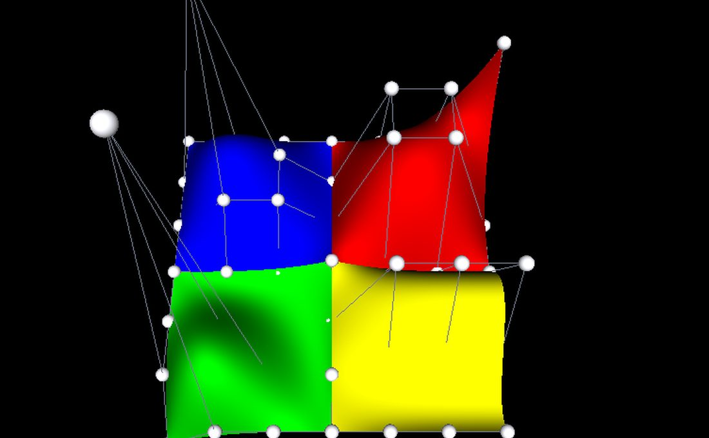
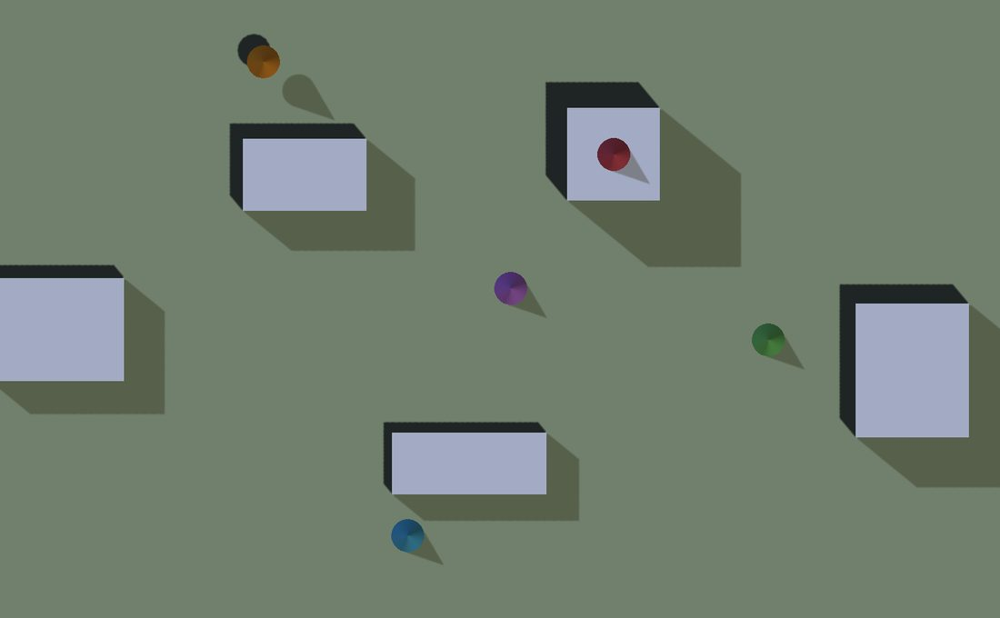

Building an editor
==================

.. rst-class:: introduction

A track editor, a level editor and a scene inspector all want the same things
of the engine: a pointer that does a different job in each tool, a view from
straight above to draw on, the point on the world under the cursor, and a way
to drag it. None of that is about tracks, levels or scenes, so it lives in
``OpenGLContext.edit`` and the second editor does not have to write it again.

Nothing here is needed to *play* a world, so a shipped game imports none of
it.

Tool modes: what the pointer does
---------------------------------

An editor's pointer does a different thing in each tool — placing a point,
dragging one, measuring, painting — and the camera wants the same pointer. The
rule is that **the tool in force is asked first and the camera gets whatever
the tool did not want**, so a tool that only cares about the left button
leaves the right one orbiting.

.. code-block:: python

   from OpenGLContext.edit.tools import Pointer, ToolManager, ToolMode

   class PlacePoint(ToolMode):
       def on_press(self, pointer):
           if pointer.button or not pointer.on_surface:
               return False          # not ours: let the camera have it
           self.route.append(pointer.world)
           return True

   tools = ToolManager([PlacePoint(name='place'), DragPoint(name='drag')])

Every hook — ``on_press``, ``on_drag``, ``on_release``, ``on_move``,
``on_key`` — returns whether the tool used what it was given, and the base
class uses nothing. So a subclass that overrides one hook leaves the rest of
the pointer alone rather than swallowing it.

A tool that takes a press **keeps the pointer until the release**. A drag that
wanders off whatever started it still ends where it should, and the tool
cannot be switched out from under a gesture it is half-way through:
``select()`` answers False while one is going on. Escape abandons a gesture
(``ToolMode.cancel``) and is left for the camera when there is nothing to
abandon.

``enter`` and ``leave`` bracket the time a tool is in force, which is where a
preview goes on screen and comes off again.

The tool palette
~~~~~~~~~~~~~~~~

A strip down the side of the window, one button per declared tool, the one in
force lit, and a click puts the pointer into that tool. It is a panel rather
than a HUD layer -- a HUD takes no events -- and it is not modal, so a click
that misses it reaches the world underneath.

.. code-block:: python

   from OpenGLContext.ui.toolpalette import ToolPalette

   palette = ToolPalette(tools=tools, reserved=MENU_BAR_ROOM)
   context.overlays.push(palette)
   status.reserved = (MENU_BAR_ROOM, 0.0, 0.0, palette.room(metrics))

``reserved`` is how much of the window's top something else has already taken,
in reference pixels, so the strip starts under a menu bar rather than through
it; ``edge`` is ``'left'`` or ``'right'``. ``room(metrics)`` answers how much
width the strip wants, also in reference pixels, which is what a
``HUDLayer.reserved`` is told so its read-outs stay clear of it.

A button reads the manager rather than keeping a copy, so a tool chosen by a
keyboard shortcut or by the application lights the same button a click would
have, and a manager that *refuses* the change -- which it does part-way
through a gesture -- leaves the strip saying what the pointer is really doing.
Call ``rebuild()`` when the set of tools changes.

A press anywhere on the strip is the strip's, including the gaps between
buttons: a palette stands over a document the pointer also draws on, and a
click that missed a button by two pixels must not put a point down on the map
underneath.

The pointer a tool is handed
~~~~~~~~~~~~~~~~~~~~~~~~~~~~

A ``Pointer`` is where the cursor is on the screen (``x``, ``y``) *and in the
world*: ``world`` is the point on whatever surface is under it, or ``None``
over the sky. ``on_surface``, ``shifted``, ``controlled`` and ``alted`` save a
tool from unpacking a modifier triple.

The point under the cursor
--------------------------

Where the user clicked on the world is **already read back by the pick**. The
selection pass writes depth as well as an object id, so a mouse event arrives
knowing how far away what it hit was; unprojecting that gives the point on the
surface. It is exact, it costs nothing extra, and it works for streamed
terrain because terrain writes depth like any other geometry.

.. code-block:: python

   from OpenGLContext.edit.surface import pointer_from
   pointer = pointer_from(event)      # pointer.world is where they clicked

Dragging cannot use that depth, because once something is being dragged the
depth under the cursor *is* the thing being dragged. A drag runs against a
plane instead — usually the level plane through where it began, so a point
moves across the ground without climbing whatever it passes over:

.. code-block:: python

   from OpenGLContext.edit.surface import horizon_plane, ray_from, ray_plane

   origin, direction = ray_from(event)
   moved_to = ray_plane(origin, direction, *horizon_plane(started_at[1]))

The ray is taken from the near and far planes rather than from the camera's
position, so it is right under any projection: an orthographic map view has no
eye point for rays to come from, and its rays are parallel.

The ground's *slope* comes from neither. Picking gives a point, not a normal;
the normal is the gradient of the height function, which an editor has:
``surface_normal(height_fn, x, z)``.

.. _gizmo:

Handles: moving a point along one axis
--------------------------------------

A drag against the ground plane is right for a point that lives on the ground.
A point in the air — a control point, a light, a camera — needs a direction
chosen for it, and that is what a **gizmo** is for: three arms stand at the
point, one per axis, and grabbing one holds the whole drag to that axis. The
point goes up, or east, and not somewhere diagonal that the eye ray happened
to sweep through.

.. code-block:: python

   from OpenGLContext.edit.gizmo import TranslationGizmo

   gizmo = TranslationGizmo(size=1.5)
   group.children = list(group.children) + [gizmo.node]
   gizmo.attach(point)                    # the arms appear there

   def OnPress(self, event):
       if gizmo.press(event) is not None: # landed on an arm: a drag has begun
           return

   def OnDrag(self, event):
       moved = gizmo.drag(event)          # None when no arm is held
       if moved is not None:
           self.put_it(moved)             # write it wherever it belongs

The arms are ordinary scenegraph nodes, so **the pick hit-tests them like any
other geometry** and there is no second hit-test to keep in step with what is
drawn. ``press`` reads the axis off the node path the selection pass resolved;
``release`` ends the drag and ``cancel`` abandons it, putting the point back
where it was grabbed, which is what Escape does.

A gizmo **works in the coordinates of the group it is put in**. Editors put it
beside the thing it is moving, and that group is often scaled or turned, so a
drag measured in window pixels has to come back as a distance in the units the
point is stored in. The gizmo takes the transform from the same node path,
pushes its anchor and its axis out to root coordinates for the arithmetic, and
answers in the units it was asked in.

That arithmetic is ``axis_parameter(origin, direction, anchor, axis)``: the
closest approach of the eye ray to the arm's line, as a distance along the
arm. It answers ``None`` for a ray running along the arm, where every point of
it is equally near and the pointer is not saying where to go — so an edge-on
drag holds still rather than lurching. What is recorded on the press is how
far along the arm the pointer took hold, and the rest of the drag is measured
from there, so the handle does not jump to the cursor.

Arms are a fixed length in the surrounding group's units, so a gizmo far from
the camera is drawn small.

The control points of a NURBS surface
~~~~~~~~~~~~~~~~~~~~~~~~~~~~~~~~~~~~~

A NURBS surface is one shape, so a pick aimed at it answers "the surface"
however carefully it was aimed: there is nothing in the frame that *is* the
third control point. ``ControlNet`` supplies one — a marker standing on every
control point — so a picked marker is a control point by name, and moving it
is an edit to the geometry.

**The lines between the points matter as much as the points.** A marker on its
own says where one control point is; the row and the column it lies on say
which points it is *between*, and that is what tells a designer what a pull is
about to do — the cage bends first and the surface follows it. So the net
draws a polyline along every row and every column of the control grid (one
polyline through the lot, for a curve) and moves them with the points. The
cage is ``pickable=False``: it is there to be read rather than aimed at, and a
line lying over a marker must not swallow a click meant for the point or the
surface behind it (see :doc:`click-through picking <instancing>`).

.. code-block:: python

   from OpenGLContext.edit.controlnet import ControlNet

   net = ControlNet(shape.geometry)       # any node with a controlPoint field
   group.children = list(group.children) + [net.node]
   ...
   index = net.index_for(event.getObjectPaths())
   if index is not None:
       net.select(index)                  # the marker takes the selected colour
       gizmo.attach(net.point(index))
   ...
   net.move(index, gizmo.drag(event))     # the surface retessellates

``move`` *assigns* the ``controlPoint`` field rather than writing through it,
because the cached tessellation depends on that field and a cache watches for
it being set; an in-place write would leave the old surface on screen under
the new net. ``controlPoint`` is the field name VRML97 gives both
``NurbsSurface`` and ``NurbsCurve``, so a net serves either.

The markers share one geometry and one appearance, so a whole net is a single
instanced draw rather than a draw per point (see :doc:`Instanced rendering
<instancing>`), and the cage is a second. The selected marker is the
exception: it is given its own appearance for as long as it is selected, which
is both what takes it out of the batch and what makes it visibly the one being
worked on.

   ``python tests/molehill_edit.py`` — the :doc:`Molehill <tutorials/molehill>`
   surfaces with their control net made draggable, as the demo opens. Click a
   marker to select it and the tri-axis handle stands on it; drag one of the
   three arms and the surface retessellates as the point travels. The two
   markers standing well above everything, with their long cage lines, are the
   control points Molehill raises the green and blue hills by: the cage is what
   makes that legible. Escape abandons a drag, or puts the handle away.

Reading relief off a plan view
------------------------------

A map lit from straight overhead is flat: every surface faces the light
equally, and a ridge and a valley come out the same colour. A map is *read*,
so the ground is shaded by which way it faces relative to a fixed low sun —
the cartographic hillshade — and the shape of the land is legible with no
shadow crossing the line drawn on it.

.. code-block:: python

   from OpenGLContext.edit.relief import shade_colors

   colors = shade_colors(colors, normals)     # then draw the mesh unlit

The sun is a convention, not a light: it sits in the **north west** at 45°,
where every printed relief map has put it for a century. Lighting relief from
anywhere east of north makes hills read as hollows, and the illusion is strong
enough to send a road along the wrong side of a ridge.

The shading goes into the vertex colours and the mesh is drawn unlit, so a
plan view needs no lights, builds no shadow maps, and costs one dot product a
vertex.

.. list-table::
   :widths: auto
   :header-rows: 1

   * - Argument
     - Means
     - Default
   * - ``azimuth``
     - degrees clockwise from north
     - 315
   * - ``altitude``
     - degrees above the horizon
     - 45
   * - ``ambient``
     - light reaching ground turned away from the sun, so nothing on the map goes to
       black
     - 0.35
   * - ``exaggeration``
     - how much steeper the land is made before it is lit
     - 4

The exaggeration matters more than it looks. Country a road can be built
through is gentle — a one-in-twenty slope is a hard climb for a car and almost
nothing to the eye — so shading it honestly leaves a flat green sheet. It is
in the *shading* only: the ground is drawn at the height it really is, and a
contour still says what that height is.

``hillshade(normals, ...)`` answers the shading alone, from 0 to 1, for a
caller colouring the ground some other way; ``steepen(normals, k)`` is the
leaning-over on its own.

Putting a point on a contour
----------------------------

A road held to a grade round a hillside runs *along* an iso-height, so an
editor that can put a point on one is the difference between drawing that road
and approximating it. The shortest way to a contour is straight up or down the
hill, which is a step along the gradient:

.. code-block:: python

   from OpenGLContext.edit.surface import height_gradient, snap_to_height

   x, z = snap_to_height(height_fn, x, z, height=None, interval=25.0, reach=250.0)

``height`` is the elevation to land on; with none, the nearest multiple of
``interval`` — the contour the designer is looking at. ``reach`` caps how far
the point may be moved, because a contour half a kilometre away is not what
the pointer meant and a snap that drags a point across the map is worse than
no snap. Flat ground has no nearest contour, so the point stays where it is.

It is exact in one step for ground that rises evenly and takes a few more
where the ground curves under it. ``height_gradient`` is the pair of rates on
its own, for a caller that wants the slope rather than the snap.

The plan view
-------------

A route is drawn on a **map**. The camera looks straight down and the
projection is orthographic, so a metre is the same number of pixels wherever
it is on the screen and a click at the far end of a straight means the same
thing as a click at the near end. A perspective view cannot promise that.

.. code-block:: python

   from OpenGLContext.edit.mapview import MapView, MapViewPlatform

   view = MapView(centre=(0.0, 0.0), span=1200.0)   # 1200 m down the window
   context.platform = MapViewPlatform(view)

``span`` is how many metres fit down the window's *height*, so a wider window
shows more world rather than the same world stretched. North (``-z``) is up
the screen and east (``+x``) is right, as a map has it.

.. list-table::
   :widths: auto
   :header-rows: 1

   * - Call
     - Answers
   * - ``world_from_screen(x, y, viewport)``
     - the world ``(x, z)`` under a window pixel — where the pointer is
   * - ``screen_from_world(point, viewport)``
     - where to draw a marker for a world point
   * - ``metres_per_pixel(viewport)``
     - the scale it is drawn at
   * - ``pan(dx, dy, viewport)``
     - drag the map by a pointer movement; the world goes with the pointer
   * - ``zoom(factor, at=..., viewport=...)``
     - scale it, holding the world point under ``at`` still
   * - ``frame(minimum, maximum, viewport)``
     - put a region on screen, wholly inside the window

Moving the map is also a tool in its own right, so a designer can say "just
move the map" and have the drawing tool stop guessing:

.. code-block:: python

   from OpenGLContext.edit.maptools import PanTool

   tools = ToolManager([DrawTool(...), PanTool(view, context.getViewPort,
                                               on_change=map_moved)])

The drag is measured from where the pointer last was rather than from where it
started, because the map moves underneath it and a fixed origin would make it
accelerate away.

``MapViewPlatform`` reads the view rather than copying it, so panning or
zooming the map is what moves the camera and there is no second copy of where
the editor is looking to fall out of step with the first.

Looking at it from an angle
---------------------------

A plan view is the right thing to *draw* on and the wrong thing to *judge* on.
Shading and contours answer "how high is that"; they cannot answer "does that
look right", which is the question a landscape is finally judged by.
``OrbitView`` is the camera for it — a point on the ground it looks at, and a
heading, a pitch and a distance to look from:

.. code-block:: python

   from OpenGLContext.edit.orbitview import OrbitView, OrbitViewPlatform

   view = OrbitView(centre=(0.0, 0.0), ground=42.0, distance=800.0)
   context.platform = OrbitViewPlatform(view, context.getViewPort())
   ...
   view.orbit(dx * 0.4, dy * 0.4)     # a drag: turn and rise, in degrees
   view.dolly(1.0 / 1.25)             # a wheel notch: in or out

``heading`` is degrees clockwise from north, and zero puts the camera to the
south looking north — the way up a map is read. ``pitch`` is degrees above the
horizontal and defaults to the three-quarter view somebody means by "let me
look at it": high enough to read the plan, low enough to read the relief.
Orbiting leaves the subject where it is, because an orbit that moved what it
was looking at is a pan and loses the thing being inspected; the pitch stops
short of overhead and of the horizon, where a camera has no unique up-vector
and sees the ground edge-on.

``frame(minimum, maximum, viewport)`` looks at a region from far enough off to
see all of it, and ``look_at`` moves the subject. ``OrbitViewPlatform`` reads
the view rather than copying it, as the map platform does; setting a
*position* on it works out the heading, pitch and distance that put the camera
there, so anything that moves a camera by position — a bookmark, a saved
viewpoint — moves this one.

An editor can hold both and swap its ``platform`` between them, or show both at
once: a :class:`~OpenGLContext.views.ViewLayout` puts each camera in its own
part of the window, and a click picks through the camera of the view it lands
in. See :doc:`Several views on one window <multiview>`.

.. _quad-view:

Top, front and side
-------------------

``OrthoView`` is a plan view that can look along any axis: ``'top'``,
``'bottom'``, ``'front'``, ``'back'``, ``'left'`` or ``'right'``. The camera
stands on the side the name gives -- ``'front'`` stands at +z looking down -z,
the view a VRML or glTF scene opens on -- and ``'top'`` puts -z up the screen,
as a map puts north. The projection is orthographic, and ``centre`` is a point
in the world rather than on the ground:

.. code-block:: python

   from OpenGLContext.edit.orthoview import OrthoView, OrthoViewPlatform

   front = OrthoView('front', centre=(0.0, 1.0, 0.0), span=4.0)
   view = View(OrthoViewPlatform(front), name='front')
   ...
   front.pan(dx, dy, view.size)                     # a drag, in view pixels
   front.zoom(0.8, at=view.local(x, y), viewport=view.size)
   point = front.world_from_screen(*view.local(x, y), view.size)

``span`` is how many units fit down the view and ``depth`` how far along the
axis it reaches, half in front of the centre and half behind. The pointer
conversions work in the view's plane through the centre, so a point dragged in
the front view moves in x and y and keeps its z. ``frame(minimum, maximum,
viewport)`` fits a box, and ``MapView`` is the ``'top'`` view with its centre
given as a map's ``(x, z)``.

``QuadView`` is the window of four an editor opens on: three orthographic views
-- by default the plan, the front and the view from the left -- around an
``OrbitView`` in perspective. It builds the
:class:`~OpenGLContext.views.ViewLayout`, frames a box in all four views, and
turns the pointer into camera moves: a drag pans an orthographic view, a left
drag orbits the perspective view and any other button pans it, and the wheel
zooms the view under the pointer.

.. code-block:: python

   from OpenGLContext.edit.quadview import QuadView

   class Editor(BaseContext):
       def OnInit(self):
           self.quad = QuadView()
           self.viewLayout = self.quad.layout
           self.quad.layout.arrange(*self.getViewPort())
           self.quad.frame(minimum, maximum)

       def ProcessEvent(self, event):
           if self.quad.handle(event):
               self.triggerRedraw(1)
               return None
           return super(Editor, self).ProcessEvent(event)

``QuadView(directions=('front', 'right', 'bottom'))`` chooses other
orthographic views, and ``background`` the flat colour they clear to; the
perspective view draws the scene's own ``Background``. ``press``, ``drag``,
``release`` and ``wheel`` are the same gestures for an application that reads
its pointer another way. ``OrbitView`` takes ``nearest`` and ``furthest`` for
how close and how far it may be dollied, and ``frame_box`` fits a whole object
rather than a region of ground; ``QuadView.frame`` sets all three from the box.

``python tests/multiview_quad.py model.glb`` puts any glTF model in the four
views; :doc:`tutorials/multiview_quad` walks through it.

.. _editing-demo:

Seeing it work
--------------

   ``python tests/editing_demo.py`` — a world edited in the plan view: five
   markers put down at the point under the pointer, one of them then dragged 66 m
   across the ground, by tool modes that are asked for the pointer before the
   camera is. Nobody moves the mouse while a screenshot is taken, so the demo
   drives its own clicks and its drag through the pick. Press ``o`` for the
   three-quarter view and ``m`` to come back; ``1``, ``2`` and ``3`` choose the
   drop, move and pan tools; ``u`` takes back what the tool in force last did.

Every scripted click is aimed at a world point, turned into a pixel by
``screen_from_world`` and answered by the pick, so the pair the demo prints is
a round trip:

.. code-block:: python

   click  pixel (674, 510) <- world (22.0, -30.0)
   drop   marker 2 at world (21.88, 20.00, -30.00)

That one is aimed at the middle of a 20 m block, so it comes back 20 m up and
the marker stands on the roof.

What an application writes is the tool and the routing that gives it the
pointer first:

.. code-block:: python

   from OpenGLContext.edit.surface import pointer_from
   from OpenGLContext.edit.tools import ToolManager, ToolMode

   class DropMarker(ToolMode):
       """Put something on the world where the pointer is."""

       def on_press(self, pointer):
           if pointer.button or not pointer.on_surface:
               return False          # not ours: the camera can have it
           print('drop at %.2f, %.2f, %.2f' % tuple(pointer.world))
           return True

   class Editor(BaseContext):
       def OnInit(self):
           self.tools = ToolManager([DropMarker(name='drop')])
           ...

       def ProcessEvent(self, event):
           """The tool in force is asked before the camera is."""
           if getattr(event, 'type', None) == 'mousebutton' and event.state:
               if self.tools.press(pointer_from(event)):
                   return None       # taken, so it never reaches the camera
           return super(Editor, self).ProcessEvent(event)

Returning without calling up the chain is the whole of "the tool took it": the
movement sampler reads events on their way past
(``ViewPlatformMixin.ProcessEvent``), so a press a tool has taken is a press
the camera never hears about. Everything the tool leaves — the right button,
the wheel, the keys it does not answer for — carries on to whatever handled it
before.

What is not here yet
--------------------

- **Rotation and scale handles.** :ref:`The gizmo <gizmo>` translates. A ring
  per axis to turn something by, and a box per axis to stretch it by, are the
  same shape of problem: a pickable node per handle and a closed-form constraint
  on the drag.

- **A gizmo of constant screen size.** The arms are a fixed length in world
  units, so one far from the camera is drawn small. Scaling them by the distance
  to the eye each frame would keep them the same size to aim at wherever the
  point is.

- **Picking what is behind a hill.** The depth buffer answers for what is drawn,
  so a point the camera cannot see cannot be picked without moving the camera. A
  CPU ray against the terrain would answer it; see ``plans/RAYCAST-PICKING.md``.
