Swept Geometry
==============

Six geometry nodes describe a shape by sweeping a 2D outline along a path: a
lathe, a spiral, a screw, two kinds of tube, and VRML97's own ``Extrusion``.
Each holds the parameters and generates its vertex arrays with
`opengl_extrusions <https://github.com/mcfletch/opengl_extrusions>`__, a NumPy
geometry generator with no OpenGL in it.

What comes back is an ordinary indexed triangle mesh, so these draw through
the same path as every other piece of geometry in the scene: **core profile
and compatibility profile alike**, lit, shadowed, textured, pickable,
depth-sorted, and eligible for the pass-level instancing batcher.

An end cap is a filled outline rather than a fan, which is why an extrusion of
a contour with holes gets a cap with the holes in it. What fills it is
:doc:`the tessellator <tessellation>`, which is a call in its own right and
has a page of its own.

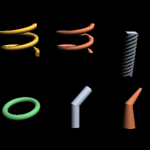

   Every swept node, from ``tests/extrusions_shapes.py``. Top: a ``Lathe`` and a
   ``Spiral`` of the same parameters -- the lathe's section stays upright as it
   climbs, the spiral's tilts with the climb -- and a ``Screw``. Bottom: a
   toroid, a ``PolyCylinder`` and a ``PolyCone``.

The nodes
---------

.. list-table::
   :widths: auto
   :header-rows: 1

   * - Node
     - What it sweeps
     - Reach for it for
   * - ``Lathe``
     - a contour around the z axis, its plane staying *radial*
     - screw threads, spiral ramps, washers, turned parts
   * - ``Spiral``
     - a contour along the helix itself, its plane square to the path
     - springs, coiled wire, handrails
   * - ``Screw``
     - a contour along z while turning
     - drill bits, twisted columns, augers
   * - ``PolyCylinder``
     - a circle along a path, constant radius
     - pipes, cables, rails, barriers
   * - ``PolyCone``
     - a circle along a path, a radius at every point
     - tapering pipes, tree branches, rockets
   * - ``Extrusion``
     - VRML97's cross-section along its spine
     - anything a ``.wrl`` file asks for

The rotational sweeps read their contour in the **r-z plane**: x is distance
out from the axis, added to the sweep radius, and y is height.

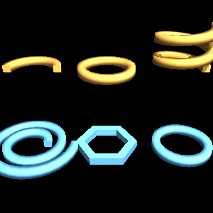

   What each of a ``Lathe``'s fields does, on one square section. Top:
   ``totalAngle`` of π and of 2π, then ``deltaZ 0.6`` over two turns -- a rising
   coil. Bottom: ``deltaRadius 0.4``, which spirals outward instead; ``sides 6``,
   a hexagonal ring; and ``sides 48``, a smooth one.

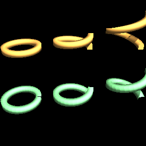

   The same parameters both ways, as the climb steepens. Top row ``Lathe``,
   bottom row ``Spiral``; left to right ``deltaZ`` of 0, 0.5 and 1.4 over one
   turn. Flat, the two are identical; the steeper the climb, the further apart
   they get.

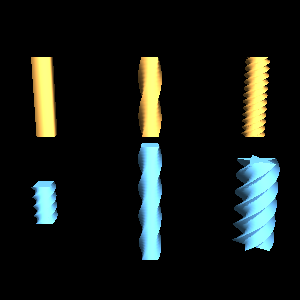

   Top: ``totalAngle`` of 0 (a plain bar), π and 6π, all of the same square
   section over the same length. Bottom: the same twist over a short
   ``startZ``..\ ``endZ`` and over a long one, and a five-pointed star section --
   which is what makes an auger.

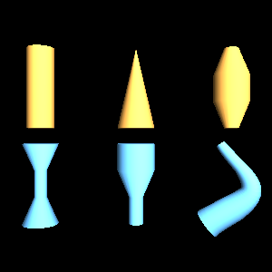

   What a per-point radius buys you. Top: a constant radius (which is
   ``PolyCylinder``), a taper to nothing, and a barrel. Bottom: a waist, a
   stepped profile, and a taper following a curved path.

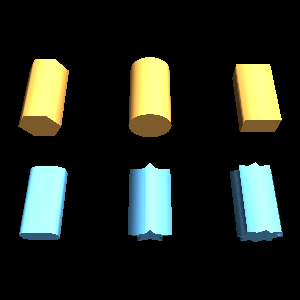

   The built-in outlines, each swept along the same straight path so only the
   contour differs: a 6- and a 24-sided circle, a rectangle, a rounded rectangle,
   and two stars.

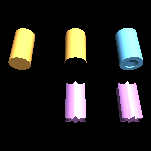

   Top: ``caps TRUE``, ``caps FALSE``, and a contour with a hole -- the cap has
   the hole in it, because caps are tessellated rather than fanned. Bottom: an
   open contour, which makes a sheet with no inside and no cap; then the same
   star-section cap refined two ways.

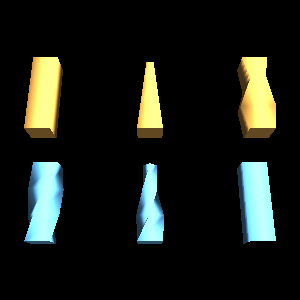

   All on the same straight path, so only the per-point parameters differ. Top:
   none; a scale tapering to 0.3; a scale whose x and y differ. Bottom: a twist
   to π/2; twist and taper together; a per-point colour.

.. code-block:: python

   from OpenGLContext.scenegraph.basenodes import Appearance, Material, Shape
   from OpenGLContext.scenegraph.extrusions import Lathe

   washer = Shape(
       geometry=Lathe(
           contour=[(0, -0.1), (0.3, -0.1), (0.3, 0.1), (0, 0.1)],
           startRadius=1.0, sides=48,
       ),
       appearance=Appearance(material=Material(diffuseColor=(0.8, 0.6, 0.2))),
   )

Shared fields
~~~~~~~~~~~~~

.. list-table::
   :widths: auto
   :header-rows: 1

   * - Field
     - Default
     - What it does
   * - ``normals``
     - ``'edge'``
     - ``'facet'`` for flat faces and hard edges, ``'edge'`` for smooth around the
       contour and creased across each ring, ``'path_edge'`` for smooth both ways --
       see below
   * - ``texture``
     - ``'normalized'``
     - 0..1 both ways, ``'arc_length'`` for model units, or ``''`` for no texture
       coordinates
   * - ``solid``
     - ``TRUE``
     - whether the back faces may be culled

The generated mesh is cached on the scenegraph cache and rebuilt when a field
it depends on changes, so a slider driving ``sides`` costs one regeneration
per move rather than one per frame.

What ``normals`` does
~~~~~~~~~~~~~~~~~~~~~

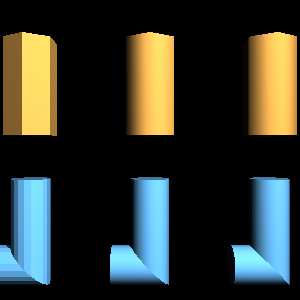

   From ``tests/extrusions_normals.py``. Left to right in each row: ``facet``,
   ``edge``, ``path_edge``. The geometry is identical; only the normals differ.

Top, a hexagonal tube: ``facet`` gives six flat faces and six hard edges,
``edge`` blends them so a six-sided tube shades like a cylinder while its
silhouette stays a hexagon, and on a straight run ``path_edge`` has nothing
further to smooth. Bottom, a round tube round a corner: ``facet`` reads as a
stack of rings, ``edge`` stays smooth around the tube and creased at the
corner -- which is what a mitred pipe joint should look like -- and
``path_edge`` rounds the corner off visually as well, for something meant to
bend smoothly.

``edge`` is the default and usually the right answer: curves in the outline
stay smooth, corners in the path stay sharp.

Corners
-------

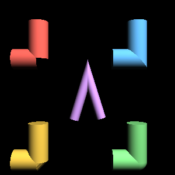

   From ``tests/extrusions_joins.py``. Clockwise from top left: ``raw`` (the runs
   come apart), ``angle`` (a mitre, with the seam where its two surfaces meet),
   ``round`` (an elbow) and ``cut`` (a bevel). The purple hairpin is a mitre at a
   corner sharp enough that ``miterLimit`` turns it into a bevel.

.. list-table::
   :widths: auto
   :header-rows: 1

   * - ``join``
     - At a corner
   * - ``'raw'``
     - each run swept on its own, ending square -- the tube comes apart. For a chain
       of separate objects; never for a pipe.
   * - ``'angle'``
     - a mitre, in the plane bisecting the corner, with the outside stretched to
       reach it. Continuous, and the default.
   * - ``'cut'``
     - a bevel: each run ends square and one flat band joins them. Does not reach as
       far past the corner as a mitre, and the band is shaded as the facet it is.
   * - ``'round'``
     - an elbow: the ring is turned through the bend over ``roundSegments`` steps, so
       the corner is the tube itself rotated and the contour keeps its size.

``miterLimit`` (default 4) bounds how far a mitre may stretch as a multiple of
the tube's own reach. Without one, the outside of a nearly-reversed corner
runs away to a spike.

Following a curve
-----------------

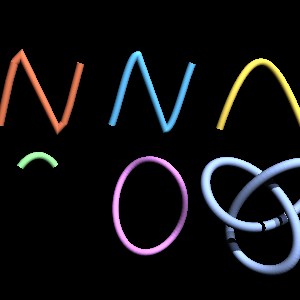

   From ``tests/extrusions_curves.py``. A Catmull-Rom sampled coarsely and
   finely, a Bézier, a B-spline, a loop through the vertical, and a trefoil knot
   swept as a closed path.

A path given as a list of points is a decision already made -- how many, and
where. ``opengl_extrusions.curves`` samples a curve to a *chord-error
tolerance* instead, so the samples land where the curvature is:

.. code-block:: python

   from opengl_extrusions import catmull_rom
   from OpenGLContext.scenegraph.basenodes import PolyCylinder

   path = catmull_rom([(0, 0, 0), (2, 1, 0), (4, 0, 1)], tolerance=1e-3)
   rail = PolyCylinder(path=path, radius=0.1, frames='rmf')

``frames``: ``'up'`` or ``'rmf'``
~~~~~~~~~~~~~~~~~~~~~~~~~~~~~~~~~

``'up'`` keeps the contour aligned to one fixed direction. Simple and
predictable, and what a road or a railing wants. Where the path runs
*parallel* to that direction there is nothing left to align to, and the node
reports it rather than producing a frame that spins.

``'rmf'`` carries each frame from the one before it by the smallest rotation
that turns the old direction onto the new one. No reference direction means no
direction that breaks it, so this is the one for a cable, a knot, a loop, or
any path that might point anywhere. It is the default for ``PolyCylinder`` and
``PolyCone``.

VRML97's Extrusion
------------------

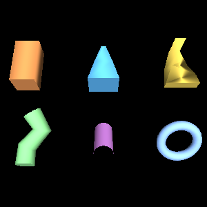

   From ``tests/extrusions_vrml97.py``. Scale along the spine, a taper, an
   orientation turning as it travels, a curved spine, a tube with no caps, and a
   closed spine.

The node's own fields, to ISO/IEC 14772-1:1997 clause 6.23: ``crossSection``,
``spine``, ``scale``, ``orientation``, ``beginCap``, ``endCap``, ``ccw``,
``convex`` and ``creaseAngle``.

The cross-section is read in the **x-z** plane, as the specification writes
it, and is oriented at each spine point by that specification's Spine-aligned
Cross-section Plane -- axes taken from the spine's own neighbours rather than
from any reference direction. A ``crossSection`` or ``spine`` whose last point
repeats its first is *closed*: the surface has no seam there, and a closed
spine has no ends to cap.

Texture coordinates
-------------------

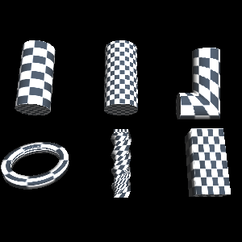

   The same checkerboard on six sweeps, from ``tests/extrusions_gallery.py
   texture_parameter``. Where the squares stretch is where the mapping stretches.

Two families. ``'normalized'`` and ``'arc_length'`` describe the sweep's own
parameterisation -- around the contour and along the path, in 0..1 or in model
units. Beside them are the twelve *generated* modes the GLE tubing library
offers, named ``vertex``/``normal``, optionally ``model``, then
``flat``/``cyl``/``sph``:

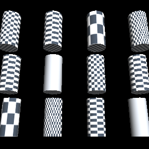

   All twelve on one tube. Two come out plain -- ``normal_sph`` and
   ``normal_model_sph`` give a constant v on a straight tube, whose normals all
   lie in the contour plane.

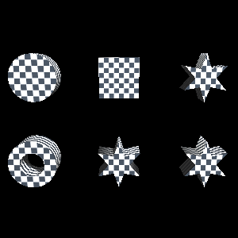

   End caps are mapped from the outline's own bounding box, so a texture lies
   flat across the face whatever its shape -- including one with a hole, and
   refined ones.

Generated geometry into the scenegraph
--------------------------------------

Any mesh with glTF-named vertex arrays becomes scenegraph nodes with no file
and no parsing in between, through ``OpenGLContext.scenegraph.frommesh``:

.. code-block:: python

   from opengl_extrusions import extrude, circle
   from OpenGLContext.scenegraph.frommesh import shape_from_mesh

   pipe = extrude(circle(0.1, 16), [(0, 0, 0), (0, 1, 0), (1, 2, 0)])
   scene.children.append(shape_from_mesh(pipe, appearance=steel))

**This is the form the glTF loader already produces.** A generated
primitive is the same arrangement of arrays ``PBRMesh`` holds, which is the
node ``loaders/gltf`` builds for every primitive of every ``.glb`` the engine
reads. Attribute names, component types, index type and
memory layout all line up, so generated geometry and loaded geometry arrive at
the render pass indistinguishable from one another -- and shadow, instance,
pick and sort by the same code.

**Nothing is copied at the boundary.** ``PBRMesh`` normalises attributes with
``asarray(..., float32)`` and ``ascontiguousarray``, and indices with
``asarray(..., uint32)``, every one of which is a no-op on an array that
already holds that dtype and layout -- which is what these generators commit
to producing. The array the generator filled is the array the VBO uploads.

The reading is structural, so this is not limited to one library: anything
exposing ``attributes`` and ``indices`` works, whether it came from a
procedural tool, an editor, or a script of your own.

Demonstrations
--------------

- ``tests/extrusions_shapes.py`` -- every swept node side by side

- ``tests/extrusions_joins.py`` -- the four join styles, and the miter limit

- ``tests/extrusions_curves.py`` -- splines, adaptive sampling, closed loops

- ``tests/extrusions_vrml97.py`` -- the VRML97 node's fields

- ``tests/extrusions_normals.py`` -- the three shading modes on two subjects

- ``tests/extrusions_gallery.py`` -- one figure per parameter, which is what the
  figures above are captured from. Run ``python tests/extrusions_gallery.py
  --list`` for the set, then name one to see it.
