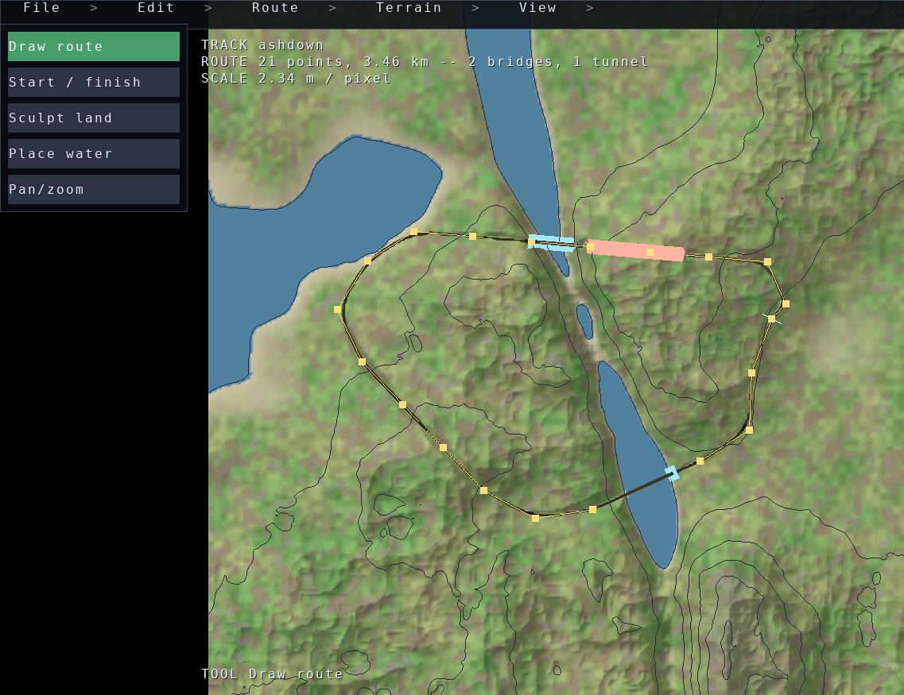

The GLinting Steel track editor
===============================

.. rst-class:: introduction

Draw a circuit on a landscape, watch the road settle onto the ground under it,
and bake a world :doc:`the game <glisteel>` streams and drives. It is the
worked example for :doc:`Building an editor <editing>` — the tool modes, the
plan view, the surface picking and the handles are engine features, and what
is here is a track editor built out of them.

   A circuit drawn on a landscape. The line is the designer's; the two bridges
   and the tunnel on it are what the road generator made of the ground underneath
   it.

Drawing one
-----------

.. code-block:: bash

   pip install glisteel-editor
   glisteel-editor                    # a fresh landscape to draw on
   glisteel-editor --terrain canyon   # a different landscape to start from
   glisteel-editor --dem N47E008.hgt --centre 47.5,8.5 --datum 0   # real ground

The window is a **map**: the landscape from straight above, orthographic, so a
metre is the same number of pixels wherever it is and the line drawn on it is
the line the world gets. Click the ground to put a point down, and again,
until the circuit closes. :kbd:`p` looks at what you have from an angle, and
again goes back. *File → Bake a world* writes it out; *File → Drive it* puts
you in the car.

A strip down the left says what the pointer is for — drawing the route, saying
where a lap begins, sculpting the land, putting a spring down, or panning.
Whatever the tool in force does not want still moves the map, so a right drag
pans and the wheel zooms. :kbd:`ctrl-z` takes back what the *tool in force*
last did: the tools edit different things, and one history over all of them
would take back whichever change happened to come last.

Where the road goes is worked out, not drawn
--------------------------------------------

A route is a **plan** — points in world metres, in the order they were drawn,
with no heights in them. Where the road actually runs is what the :doc:`road
generator <roads>` makes of the ground under that line: smoothed, held to a
maximum grade, its corners rounded off for the speed it is meant to be driven
at, and lifted onto a causeway where it would otherwise run below the
waterline. Raise ground under the line and the road climbs it on the next
settle.

Sculpting works the same way round. A stroke carries fractal detail as a share
of its lift, so a raised hill reads as land rather than as a bubble, and the
strokes are part of the landscape rather than of the road: they are saved with
the project, and they are what the road settles onto.

Rivers are not saved either. The project records where water *wells up*, and
the courses are worked out from those springs and the land — a bed written
down would be the river as the land used to be, and would stay there when the
land moved.

Reading the land
----------------

The plan view draws the ground two ways at once, because either alone leaves
the designer guessing. **Shaded relief** puts a fixed low sun on the ground's
own slope, so a ridge and a valley are different colours rather than the same
green; the land is steepened before it is lit, because country a road can be
built through is gentle and shading it honestly gives a flat sheet, and the
ground is still drawn at the height it really is. **Contours** say by how
much, at 10, 25, 50 or 100 metres — of the *landscape* rather than of the
baked ground, so a road's earthworks do not redraw the map being measured
against.

:kbd:`p` swaps to a three-quarter view of the same scene, instantly and with
nothing rebuilt, starting where the map was looking. The map is what a line is
*drawn* on; this is what the land is *judged* on.

What a project is
-----------------

Not the world. The world is baked, is large, and is thrown away and made again
whenever a decision changes. A project is the handful of decisions that
produced it — which landscape, and what line was drawn across it — as JSON a
designer can read: a **base** the ground comes from and an ordered stack of
**edits** on top of it, the springs, and the routes.

Baking one
----------

*File → Bake a world* writes a :doc:`3D Tiles <tiles3d>` world beside the
project file, through the :doc:`octree baker <baking>`. The circuit goes into
the tileset's ``extras`` along with it, which is how the game finds the track
in what it streams: the starting grid, the lap timing and the autopilot all
read it from there. ``glisteel-bake`` is the same thing from a shell, and with
no arguments it bakes the shipped circuit world.

.. code-block:: bash

   glisteel-bake --output /tmp/world
   glisteel /tmp/world/tileset.json

Where it lives
--------------

The editor is its own distribution and repository,
`github.com/mcfletch/glisteel-editor
<https://github.com/mcfletch/glisteel-editor>`__, and it is deliberately thin:
the landscape, the road generation and the baker belong to
:doc:`OpenGLContext-editor <baking>` and to the engine, and the editor's
``README.md`` is the reference for its own tools and file format.
