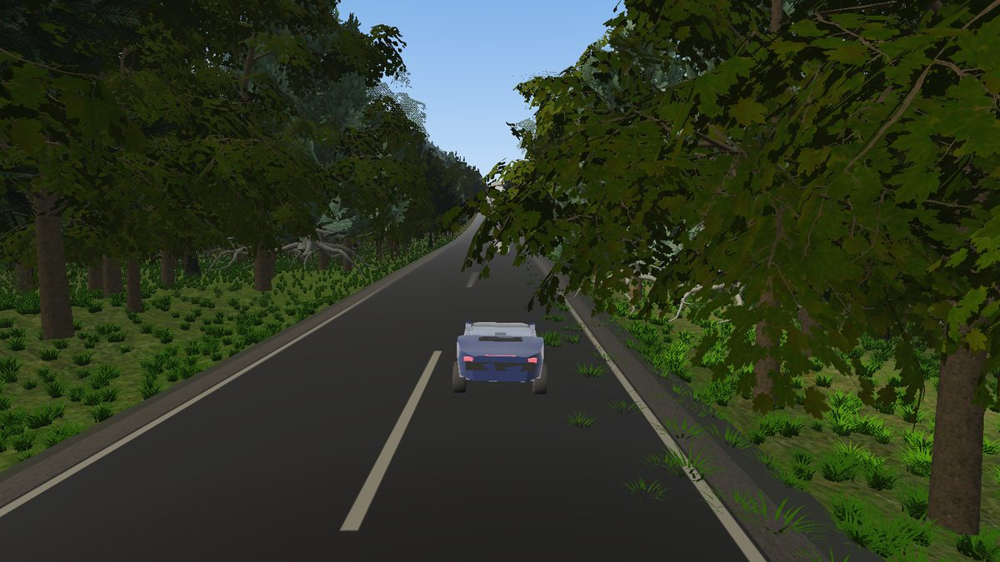
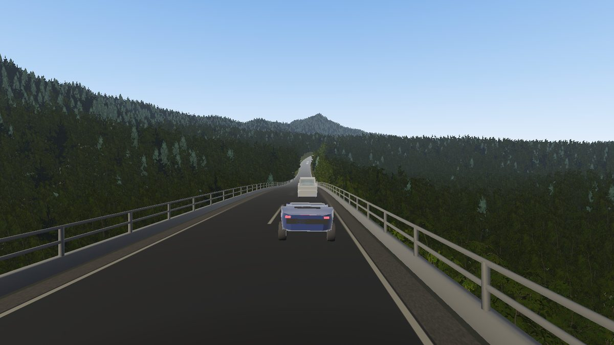

GLinting Steel
==============

.. rst-class:: introduction

A racing game built on this engine: a car, a forest road, and a world too big
to load, which streams in around the player as they drive it. It is here
because it is the engine's heaviest single exercise — a :doc:`3D Tiles
<tiles3d>` world paging under a moving camera, a :doc:`road <roads>` carried
over the ground it crosses, :doc:`rigid-body <physics>` collision against
tiles that arrived a second ago, and a frame budget a game actually has. What
it needs, the engine grows; the game stays thin.

   A lap of a baked 3D Tiles world, streamed in around the car as it drives.

Driving one
-----------

.. code-block:: bash

   pip install glisteel glisteel-editor
   glisteel-bake --output /tmp/world      # hill country, half a million trees, an 8 km circuit
   glisteel /tmp/world/tileset.json       # drive it

The circuit is routed through the land rather than laid on it: on the ground
where the ground allows, on a walled causeway over the low ground, on a
viaduct across the valleys, and through a bore where neither will do.
``glisteel --autopilot`` drives a lap by itself, which is the quickest way to
see one and the same code an opponent car runs.

The :doc:`track editor <glisteel-editor>` is how a circuit of your own is
drawn and baked.

What it asks of the engine
--------------------------

.. list-table::
   :widths: auto
   :header-rows: 1

   * - Part of the game
     - What the engine supplies
   * - The world it drives on
     - :doc:`Streamed 3D Tiles <tiles3d>` — tiles refined by screen-space error
       around the car, evicted behind it under a memory budget, and registered as
       static colliders as they arrive, so the car drives on exactly what it can see.
   * - The road itself
     - :doc:`Roads <roads>` — a centreline and a cross-section swept into a drivable
       surface, with the earthworks, structures, barriers, banking and signs. The
       baked road carries its centreline in the tileset's ``extras``, which is how
       the starting grid, the lap timing and the autopilot find the track inside what
       they stream.
   * - The car
     - :doc:`Physics & Collision <physics>` — a raycast vehicle on ``omi_physics``,
       stepped at a fixed rate, with contacts read on the step that made them.
   * - What the car looks like
     - :doc:`PBR <pbr>` and :doc:`the uber-shader <ubershader>` — painted metal, and
       a refractive canopy through ``KHR_materials_transmission``, so the cabin seen
       through the glass is the cabin that is there.
   * - What the car reflects
     - Image-based lighting. Painted metal is almost entirely its surroundings, so a
       car lit by a bare sky gradient reads as a toy; the road knows what it runs
       through, and hands the renderer a small panorama of that place — canopy
       overhead with sky broken through it, a lit portal fore and aft inside a bore,
       open sky over a treeline on a viaduct.
   * - Trees, and what grows under them
     - :doc:`Vegetation <vegetation>` — the forest as a table beside the world, drawn
       as instanced sets chosen against the view.
   * - What the driver is told
     - :doc:`The HUD <hud>` and :doc:`the overlay UI <overlayui>` — the in-world
       instruments, and the menus, settings and key-binding screens around the race.
   * - Rivers and lakes it crosses
     - :doc:`Water <water>`.
   * - Shipping it
     - :doc:`Packaging <packaging>` — a frozen bundle and a Debian package carrying
       their own interpreter, built from the engine's own hooks.

   The circuit is carried over the low ground rather than routed round it: a
   walled causeway, a viaduct across the valleys, a bore through the hills.

What the game itself is
-----------------------

What is left once the engine has the rest is the part that makes it a game:
the car's handling and where the camera watches from, the lap timing, the
rules about what ends a run, and the ways of driving.

**Steering is a design question, not a binding.** A keyboard says a key is
down or it is not, and a driver's hands say a great deal more, so the game
offers several readings of the same key — turn the wheels and hold the line
between inputs, turn them with nothing put in for you, move the car *across*
the road, take a lane over, or let it drive until you interrupt. Each is a
different game on the same physics.

**A crash is contact**, asked of the physics rather than inferred from how
near two cars are, and how hard is the speed they were closing at along the
contact when they met. The reading is taken inside the fixed step that made
it: resolving a contact is precisely cancelling the velocity that measures how
hard it was, so a step later a square-on impact measures as nothing and
whether a crash registered would come down to where the frames happened to
fall.

**No vehicle in it is hand-modelled.** The player's car, its wheels and the
five traffic vehicles are one run of a Blender script, and the ``.glb`` files
are build output.

The same picture twice
----------------------

The pictures of the game on this site are taken from a :doc:`recorded session
<telemetry>` rather than from a live drive. Replaying one drives the engine's
clock from the recorded frame times and puts the session's randomness back, so
the car reaches the same place on every machine; the capture is then asked for
by frame number rather than after a delay, because under a replay the frame is
the deterministic thing and the wall clock is not. Two runs write the same
bytes.

.. code-block:: bash

   OPENGLCONTEXT_TELEMETRY_REPLAY=sessions/doc-lap.jsonl \
     glisteel world/tileset.json --view chase --no-hud --autopilot \
     --capture-frame 1297 --capture viaduct.png

Where it lives
--------------

GLinting Steel is its own distribution and its own repository,
`github.com/mcfletch/glisteel <https://github.com/mcfletch/glisteel>`__, whose
``README.md`` is the reference for the game's own modules, its handling
constants and its scenarios. The world it drives is baked by
:doc:`glisteel-editor <glisteel-editor>` over the :doc:`octree baker
<baking>`.
