Loading glTF
============

.. rst-class:: introduction

OpenGLContext loads glTF 2.0 and binary GLB models and renders them with the
:doc:`PBR renderer <pbr>`. This page covers what the loader supports and how
to load models from your own code. To open a model and look at it, use
:doc:`oglc-view <viewer>`, the viewer for every format this project reads.

`pygltflib <https://gitlab.com/dodgyville/pygltflib>`__, a core dependency,
parses the file. OpenGLContext then maps the parsed glTF onto its own
scenegraph nodes and PBR materials.

Opening a model
---------------

Reading glTF needs no optional extra. ``pygltflib`` is a core dependency and
the base install registers the viewer command. Add the ``glfw`` extra, because
the viewer runs on the GLFW backend:

.. code-block:: bash

   pip install "OpenGLContext[glfw]"

Then open a model from a local file, a URL, or the ``GLTF`` environment
variable:

.. code-block:: bash

   oglc-view path/to/model.glb
   oglc-view https://example.com/model.glb
   GLTF=path/to/model.gltf oglc-view

The viewer selects the core profile, the PBR renderer, the GLFW backend and
shadows itself, so you do not need to set any environment variables.
:doc:`The viewer <viewer>` covers everything else about it: the other formats
it opens, its :ref:`controls <viewer-controls>`, its library of samples,
capturing a frame and embedding it. The rest of this page is specific to glTF.

Two viewer behaviours come from the glTF file itself:

- PageUp / PageDown (or ``p`` / ``n``) step through the cameras baked into the
  model, if it has any.

- If the file contains no lights, the viewer adds a default rig of a sun and a
  fill light, so the model is lit.

Files with external resources
~~~~~~~~~~~~~~~~~~~~~~~~~~~~~

A binary ``.glb`` is self-contained, so a URL to a ``.glb`` works directly.

A text ``.gltf`` usually references external ``.bin`` and texture files by a
URI *relative to the document*. To resolve those references, the loader needs
to know where the document came from. ``load_gltf_url()`` (see
:ref:`Loading from Python <gltf-python>`) keeps the document's URL and
resolves each reference against it, so a remote multi-file ``.gltf`` opens
with its geometry and textures. Fetching the document yourself and passing
its bytes to the loader loses that base URL, and the references cannot be
resolved.

External resources are fetched through the loader's resolver. It allows only
the document's own origin (scheme, host and port), checks every redirect
against it, caps each download's size, and caches downloads on disk. A
document cannot pull in a reference from another host, such as a cloud
metadata address. :doc:`Loading content you did not write <untrusted>`
describes these rules for every loader.

In a compatibility profile
~~~~~~~~~~~~~~~~~~~~~~~~~~

A model loaded into a compatibility-profile context is drawn by the
fixed-function pass. Each material is lit through ``glMaterial`` from its
factors: the base colour becomes the diffuse colour, metalness and roughness
set the highlight, and the emissive colour at its strength becomes the
emission. The base colour map is drawn over them. The other texture maps,
image-based lighting and GPU skinning need the PBR pass. A skinned model is
posed on the CPU in the fixed-function pass.

.. _gallery:

Sample gallery
--------------

These are Khronos glTF sample models rendered by the PBR pass. Each one shows
a different part of the material model.

.. figure:: images/gltf/DamagedHelmet.jpg
   :alt: DamagedHelmet

   DamagedHelmet -- base colour, metallic/roughness, normal and emissive maps.

.. figure:: images/gltf/MetalRoughSpheres.jpg
   :alt: MetalRoughSpheres

   MetalRoughSpheres -- a sweep of metalness and roughness.

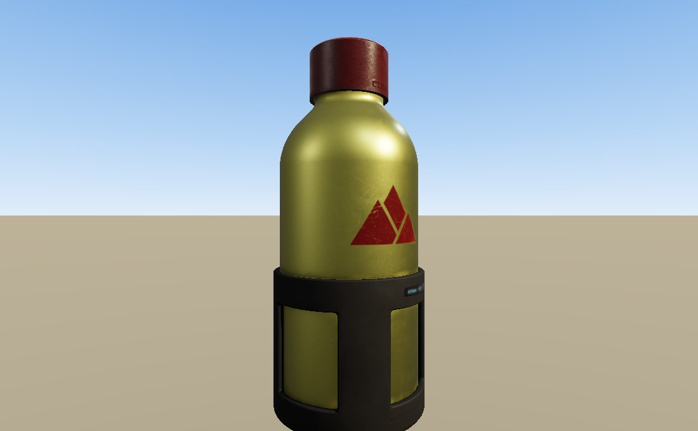

   WaterBottle -- brushed metal and printed labels.

   BoomBox -- fine metal and plastic detail at small scale.

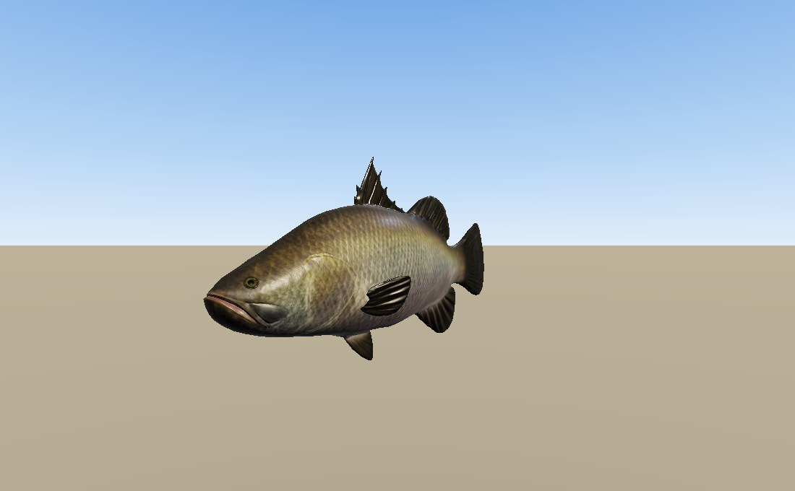

   BarramundiFish -- organic surface with a subtle clearcoat.

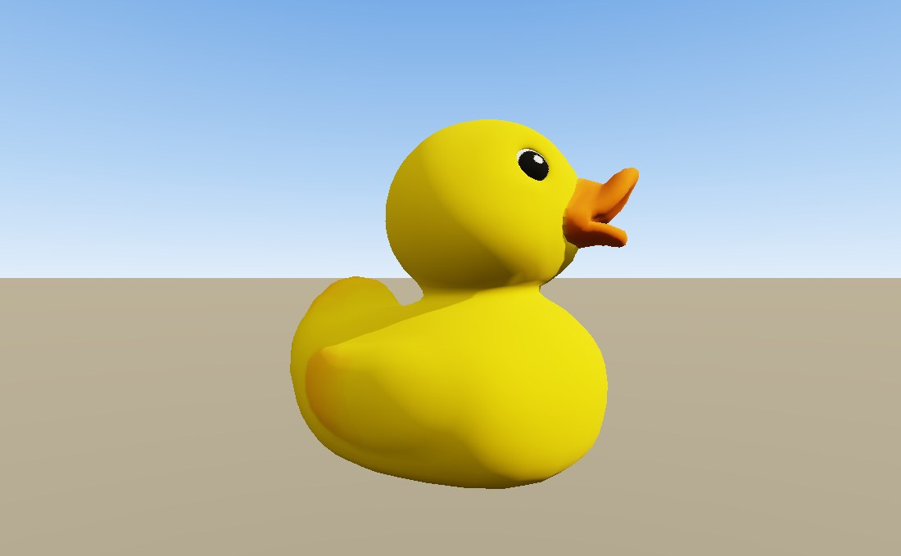

   Duck -- a classic simple textured model.

.. figure:: images/gltf/IridescentDishWithOlives.jpg
   :alt: IridescentDishWithOlives

   IridescentDishWithOlives -- glass transmission
   (``KHR_materials_transmission``).

.. rst-class:: technical

The loader carries a list of the Khronos sample models and fetches them on
demand. ``oglc-gltf-demo`` uses that list to browse the whole sample set with
the Khronos reference screenshots beside each render.

What the loader supports
------------------------

The loader imports meshes with their materials, textures, lights, cameras and
animation:

- PBR metallic-roughness materials - base colour, metallic and roughness
  factors and textures.

- Texture maps - base colour, metallic-roughness, normal (with scale),
  occlusion (with strength) and emissive.

- Alpha - opaque, mask (with cutoff) and blend modes.

- Cameras - each perspective camera in the file becomes a viewpoint. In the
  viewer, PageUp / PageDown cycle through them.

- Lights - ``KHR_lights_punctual`` directional, point and spot lights.

- Animation - keyframed node transforms, skinning and morph targets.
  ``KHR_animation_pointer`` animates material and texture-transform
  properties, and ``KHR_node_visibility`` shows and hides nodes.

- Instancing - ``EXT_mesh_gpu_instancing``. Repeated meshes are also batched
  into one instanced draw when the file does not use the extension. See
  :doc:`Instanced rendering <instancing>`.

- Levels of detail - ``MSFT_lod`` with ``MSFT_screencoverage``: a node's
  coarser alternatives and the share of the window at which each one is drawn.
  See :ref:`Levels of detail <lod>` below.

- Material extensions - ``KHR_materials_clearcoat``, ``KHR_materials_sheen``,
  ``KHR_materials_transmission``, ``KHR_materials_volume``,
  ``KHR_materials_ior``, ``KHR_materials_specular``,
  ``KHR_materials_emissive_strength``, ``KHR_materials_unlit``,
  ``KHR_materials_iridescence``, ``KHR_materials_anisotropy``,
  ``KHR_materials_diffuse_transmission``, ``KHR_materials_dispersion``,
  ``KHR_texture_transform``, ``EXT_texture_webp``, and the legacy
  ``KHR_materials_pbrSpecularGlossiness`` (converted to metallic-roughness).

- Zones - ``OGLC_zone``, this project's own extension: a node marking a region,
  with a shape from ``KHR_implicit_shapes`` (glTF 2.0) or the core ``shapes``
  array (glTF 2.1), and the extensions that apply inside it. See
  :doc:`zones` and the :doc:`specification <extensions/OGLC_zone>`.

- Baked light - ``OGLC_materials_baked_light``, this project's own extension.
  It marks a mesh's ``COLOR_0`` as light calculated when the world was built,
  not as a tint on the surface. See :ref:`Baked light <baked-light-ext>` below.

- Geometry compression - ``KHR_draco_mesh_compression``, when the optional
  ``DracoPy`` package is installed (``pip install DracoPy``, or
  ``OpenGLContext[draco]``). Without it, the loader skips a Draco-compressed
  primitive with a warning and loads the rest of the scene.

glTF nodes become ``Transform`` nodes, and meshes become ``Shape`` nodes with a
PBR mesh geometry and a PBR material. A loaded model is an ordinary
OpenGLContext scenegraph that you can inspect and modify.

.. _baked-light-ext:

Baked light
~~~~~~~~~~~

``OGLC_materials_baked_light`` is for a surface whose lighting is too costly
to calculate at runtime, such as the lining of a tunnel with a lamp every
twenty-five metres (see :doc:`Roads <roads>`). With the extension:

- the red, green and blue channels of ``COLOR_0`` are added as emission, and
  the material's own colour is left unchanged;

- the fourth channel is read as occlusion (how much of the environment reaches
  the surface), not as transparency;

- scene lights still shade the surface on top of the baked light, so a
  headlight still lights its own circle on the tunnel wall.

The :ref:`writer <writing>` writes the extension and the loader reads it. A
viewer that does not know the extension draws the surface tinted by its vertex
colours. See also :ref:`Baked light <bakedlight>` in the PBR documentation.

.. _lod:

Levels of detail
~~~~~~~~~~~~~~~~

A model can ship at several levels of detail, so a copy far from the camera
draws fewer triangles. ``MSFT_lod`` declares the levels in a glTF file:

- the node that carries the extension is the finest level;

- its ``ids`` list the nodes of the coarser levels, in decreasing detail;

- ``MSFT_screencoverage``, in the node's ``extras``, gives the share of the
  window's height at which each level takes over.

.. code-block:: python

   "nodes": [
       {"mesh": 0,
        "extensions": {"MSFT_lod": {"ids": [1, 2]}},
        "extras": {"MSFT_screencoverage": [0.5, 0.2, 0.01]}},
       {"mesh": 1},
       {"mesh": 2}
   ]

The loader builds one `ScreenCoverageLOD
<https://github.com/mcfletch/openglcontext/blob/main/OpenGLContext/scenegraph/lod.py>`__
node with a level for each alternative. The render pass chooses a level once a
frame. In the example, the finest level is drawn while the model covers half
the window's height or more. The next level is drawn from there down to a
fifth, and the coarsest from a fifth down to one per cent. Below one per cent,
nothing is drawn. To keep the coarsest level on screen however small it gets,
end the list with ``0``.

The size of the model comes from the finest level's ``POSITION`` accessor
bounds. glTF requires a file to declare those bounds, so the loader can size
and place a level without reading its geometry. Transforms above the node
count: a model scaled up switches to a coarser level later.
:ref:`How a level is chosen <lod-choosing>` explains screen coverage.

Other rules the loader follows:

- The alternatives replace only the node's own geometry. The node's children,
  its light and its audio emitters belong to the node and are drawn at every
  level.

- Copies of a model that draw the same level are batched into one instanced
  draw. See :ref:`Copies batch per level <instancing>`.

- ``MSFT_screencoverage`` is optional. Without it, the levels switch at a
  halving series (a half, a quarter, an eighth, and so on) that ends at zero,
  so a level never disappears because of a threshold the loader chose.

- ``MSFT_lod`` on a *material*, which the extension also allows, is not read.

To make a chain of levels, use the tools in `OpenGLContext-editor
<https://github.com/mcfletch/openglcontext-editor>`__; see :ref:`Authoring a
chain <lod-authoring>`. :doc:`Levels of detail <lod>` covers the whole
subject, including impostors and a demo world to walk through.

.. _hooks:

Engine hooks: what a material or an object *is*
~~~~~~~~~~~~~~~~~~~~~~~~~~~~~~~~~~~~~~~~~~~~~~~

A glTF carries geometry and PBR factors and nothing that says a surface is
*water*. The format has no ratified way to ask for a shader, and the one that
had it — ``KHR_techniques_webgl`` — is archived. ``OGLC_hook`` is this
project's own answer: a tag naming a **kind**, which the application looks up in
a registry and makes something of as the file loads.

Two different facts want tagging, and the tag goes on whichever carries the one
you mean. On a **material** it says *this surface is made of that substance*; on
a **node** it says *this object is a thing of that kind*. One payload, three
spellings:

.. code-block:: javascript

   // extensions -- what a tool writes
   {"OGLC_hook": {"kind": "water", "style": "choppy", "depth": 6.0}}

   // extras -- what a Blender custom property becomes
   {"OGLC_hook": {"kind": "water", "style": "choppy"}}

   // extras, shorthand: a bare string is the kind, with no parameters
   {"OGLC_hook": "water"}

The extension wins where both are present, because a file carrying one was
written by a tool that knew what it meant. A ``kind`` nothing is registered for
loads as an ordinary shape, so a file authored for another engine still loads
here.

Authoring one in Blender
^^^^^^^^^^^^^^^^^^^^^^^^

Two ways, and the loader reads both. **With no add-on:** give the material (or
the object) a custom property called ``OGLC_hook`` in the Properties editor,
holding the string ``water`` or a JSON object, and export with **Include ‣
Custom Properties** ticked. Blender writes material custom properties to
``material.extras`` and object custom properties to ``node.extras``, and the
loader reads both. Blender 4.x is enough.

**With the add-on** in ``tools/blender/oglc_hook``: an **Engine Hook** panel on
the material and object tabs, with fields for the ``water`` kind and a JSON
object for any other, writing the ``OGLC_hook`` *extension* as each material and
node is exported. It is a form rather than a typed-out string, it says under the
fields exactly what the file will carry, and no export option has to be ticked
for it. Zip the folder, install it with **Edit ‣ Preferences ‣ Add-ons ‣ Install
from Disk**, and tick it; ``tools/blender/README.md`` has the rest.

Registering a kind of your own
^^^^^^^^^^^^^^^^^^^^^^^^^^^^^^

.. code-block:: python

   from OpenGLContext.loaders.gltf import hooks

   @hooks.register( 'twigbb:teleporter', shareable=False )
   def teleporter( ctx ):
       if ctx.at == 'node':
           return (Portal( target=ctx.params['target'], children=ctx.children ), True)
       return None

The factory is called at both hook points — once per primitive of a tagged
material, once per tagged node — and ``ctx.at`` says which. At the material
point it is handed the finished ``PBRMesh``, ``PBRMaterial`` and ``Shape``, the
primitive's local ``bounds`` (writable, so a hook that changes the extent
changes the framing) and the world matrix this copy stands at; it returns
``None`` to keep the loader's ``Shape``, or a node to put in its place. At the
node point it is handed the ``Transform``, the children gathered under it and
the local and world matrices, and returns one of three things:

.. list-table::
   :widths: auto
   :header-rows: 1

   * - Return
     - What the loader does
   * - ``None``
     - Keeps its own ``Transform`` and children. The hook augmented and nothing
       else changed.
   * - ``(node, False)``
     - Puts the node inside the glTF node's ``Transform``, in place of the
       children the loader gathered. The node's TRS still places it, and the
       hook may return any node type — a ``Switch``, an ``LOD``, a node the game
       defined.
   * - ``(node, True)``
     - Puts the node in the glTF node's own slot in the parent. The
       ``Transform`` is gone and the hook owns the placement;
       ``ctx.local_matrix`` is the transform it has taken on.

The flag is on the return rather than on the registration, because whether a
hook replaces a node is a property of what it made of *this* node. Either way
the node's DEF moves to whatever ends up in the slot, so ``getDEF`` finds the
same name it would have found.

``shareable=False`` says the hook's result carries per-node state — a box round
where this copy stands, a trigger's fired flag — so two nodes referencing one
mesh each get their own, as each gets its own copy of a morphed or skinned mesh.
The default shares one result between every node that references the mesh.

What a hook records with ``ctx.collect()`` arrives on the scene as
``scene.hook_data[ kind ]``. A kind registered with an ``advance`` callable is
walked by ``scene.advance( seconds )``, which answers whether anything changed;
the viewer calls it from its idle, and a game driving its own loop calls it
itself.

What a file may ask for
^^^^^^^^^^^^^^^^^^^^^^^

**A file names a kind; it never names code.** The registry is populated by the
application, so a downloaded model can only select among what the running
program already registered — plus the kinds the engine itself ships, which are a
fixed table in ``OpenGLContext.loaders.gltf.hooks``. There is no entry-point
scan: an installed package cannot add a kind to somebody else's viewer by being
present. Setting ``OPENGLCONTEXT_GLTF_HOOKS=0`` leaves every tag in every file
unread.

The engine claims the bare lowercase names it documents and ships — ``water``,
``mirror`` (:ref:`mirror-hook`), ``fire``, ``smoke`` and ``sparks`` — so an application naming its own keeps
them out of that namespace: ``glisteel:rail``, ``twigbb:teleporter``. A
convention, read by nothing, so that a kind a game invents today does not
collide with one the engine ships later.

The :doc:`writer <baking>` writes both spellings back: a material's or a
``SceneNode``'s ``extras`` pass through uninterpreted, and its ``hook`` becomes
an ``OGLC_hook`` extension block, so a world can be loaded, edited and baked
again with its tags intact.

The engine's kinds ship registered, so a tagged file works in ``oglc-view`` with
no application code at all:

.. list-table::
   :widths: auto
   :header-rows: 1

   * - Kind
     - Tag it on
     - What it makes
   * - ``water``
     - a material
     - A surface that moves as water, and a volume that can be swum in —
       :ref:`Authoring water in a model <authoring>`.
   * - ``fire``, ``smoke``, ``sparks``
     - an object
     - A particle effect standing where the object stands —
       :ref:`Placing an effect in a model <authored-particles>`.

The loader passes over a kind on the holder it is not read from, and the
Blender add-on's panel draws that case as a warning.
``tools/blender/demos/lakeside.glb`` is a small world using all four.

.. _castsshadow:

A node that casts no shadow
~~~~~~~~~~~~~~~~~~~~~~~~~~~

Set ``OGLC_castsShadow`` to ``0`` in a node's ``extras`` to keep that node's
geometry out of the shadow maps. The node is still drawn and lit, and it still
receives shadows from everything else. It casts no shadow of its own. On a
node that carries a light, the same flag gives that light no shadow map.

.. code-block:: json

   "nodes": [
       {"mesh": 0, "name": "Ceiling", "extras": {"OGLC_castsShadow": 0}},
       {"mesh": 1, "name": "Plinth"}
   ]

Use it for a room lit from outside. A hall under a sun has a roof between the
sun and the floor. If the roof casts shadows, the whole interior is in shadow.
Mark the shell (floor, walls, ceiling) as casting no shadow, and the light
reaches the room while the objects inside still cast shadows. Use it also for
a light that stands in for indirect light, such as a weak upward fill that
represents light bounced off the floor. That light comes from everywhere, so
it should cast no shadows.

The flag applies to the one node. It does not pass to the node's children,
which matches how authoring tools treat shadow visibility. It does apply to
the node's ``MSFT_lod`` alternatives, because they are the same object at
another level of detail. Otherwise a shadow would appear when the level
switched.

The flag is in ``extras`` rather than an extension, so a viewer that does not
know it draws the node as usual. In Blender, set an object custom property of
the same name; the add-on in `OpenGLContext-editor
<https://github.com/mcfletch/openglcontext-editor>`__ writes it. In the
scenegraph, the flag becomes :ref:`Shape.castsShadow <optout>`.

.. _omi:

OMI extensions
~~~~~~~~~~~~~~

The `Open Metaverse Interoperability group
<https://github.com/omigroup/gltf-extensions>`__ publishes glTF extensions that
describe a *world* rather than a model: sound, physics, sky, and things a
player sits in or drives. Three projects support them: this loader,
:doc:`omi_audio <audio>` and :doc:`omi_physics <physics>`. Both of those
libraries use the extensions' own structure as their data model.

.. list-table::
   :widths: auto
   :header-rows: 1

   * - Extension
     - Status
     - Where
   * - ``KHR_audio_emitter``
     - Full: audio, sources and emitters; node and scene references; ``bufferView``,
       ``data:`` and ``uri`` audio; autoplay
     - ``omi_audio``, :doc:`docs <audio>`
   * - ``OMI_audio_ogg_vorbis``
     - Full: the Ogg entry is decoded and used in preference to the MP3 fallback
     - :ref:`Codec extensions <codecs>`
   * - ``OMI_audio_opus``
     - Read, kept and reported, but **not decoded**, so the MP3 fallback plays
     - :ref:`Codec extensions <codecs>`
   * - ``OMI_physics_shape``
     - Full, read and written
     - ``omi_physics``, :doc:`docs <physics>`
   * - ``OMI_physics_body``
     - Full, read and written
     - ``omi_physics``
   * - ``OMI_physics_gravity``
     - Full, read and written: global and per-node gravity volumes
     - ``omi_physics``
   * - ``OMI_physics_joint``
     - Full, read and written
     - ``omi_physics``
   * - ``OMI_environment_sky``
     - Gradient, panorama (equirectangular and cubemap) and plain skies are drawn.
       The **physical** (atmospheric-scattering) type is read and reported but not
       drawn.
     - :ref:`The scene's sky <sky>`
   * - ``OMI_seat``
     - Not read
     - —
   * - ``OMI_spawn_point``
     - Not read
     - —
   * - ``OMI_vehicle_body``, ``OMI_vehicle_wheel``, ``OMI_vehicle_thruster``,
       ``OMI_vehicle_hover_thruster``
     - Not read
     - —

.. _sky:

The scene's sky
~~~~~~~~~~~~~~~

``OMI_environment_sky`` describes a sky rather than shipping one as an image.
The loader reads the document's ``skies[]``, finds the sky that the active
scene names, and adds a matching background node to the scene. The ordinary
Background pass then draws it:

.. list-table::
   :widths: auto
   :header-rows: 1

   * - Sky type
     - Node it becomes
   * - ``gradient``
     - ``Background``, the VRML97 gradient sphere. The three colours and their
       curves are converted to colour stops.
   * - ``panorama``, equirectangular
     - ``HDRBackground``. The panorama is also registered as the :doc:`IBL <pbr>`
       environment, so metals reflect the sky drawn behind them.
   * - ``panorama``, cubemap
     - ``CubeBackground``, with six faces in the extension's ``+X, -X, +Y, -Y, +Z,
       -Z`` order.
   * - ``plain``
     - ``SimpleBackground``.
   * - ``physical``
     - None. This type needs a sky renderer rather than a conversion to an
       existing node.

The viewer adds its own backdrop only when a document has no sky, so a scene
with a sky keeps it. Use ``--background`` to override it. ``GLTFScene.sky`` is
the sky record the scene selected, whether or not it could be drawn, so a
caller can report why a sky is missing.

The loader reads and keeps these parts of the extension, but does not apply
them:

- The gradient sky's sun tint (``sunAngleMax``, ``sunCurve``). The tint is a
  disc around the scene's directional light, so it varies with compass
  direction. The gradient sphere's colour stops vary only with elevation.

- The ambient contribution (``ambientLightColor``,
  ``ambientSkyContribution``). It is not connected to the ambient lighting
  term.

- The physical sky. Drawing it needs an analytic Rayleigh/Mie scattering
  skydome driven by the scene's directional sun, in glTF's inverse-metre
  units.

.. rst-class:: technical

The extension places the middle of an equirectangular panorama at ``+Z``, with
``+X`` to its left. The skybox shader places the middle at ``+X``. The two
differ by a quarter of the image width, so the loader rolls the image's
columns once, at load. The drawn sky and its reflections then share one
direction-to-texture mapping and always agree.

Current limitations
~~~~~~~~~~~~~~~~~~~

- ``KHR_texture_basisu`` (KTX2 / Basis Universal) is not read. No transcoder
  is available under a licence this project can use. The loader skips a
  texture in that format.

- ``KHR_draco_mesh_compression`` needs the optional ``DracoPy`` package.
  Without it, the loader skips a Draco-compressed primitive with a warning and
  loads the rest of the scene.

- Two material effects are approximations of the reference result: volumetric
  subsurface scattering, and transmission through nested transparent shells.

.. _gltf-python:

Loading from Python
-------------------

``load_gltf()`` returns a scene object that holds the scenegraph group, its
bounds and any cameras:

.. code-block:: python

   from OpenGLContext.loaders import gltf

   scene = gltf.load_gltf( "model.glb" )   # or gltf.load_gltf_url( url )
   group   = scene.group      # a scenegraph Group you can add to your own scene
   centre  = scene.center     # bounding-sphere centre, for framing
   radius  = scene.radius     # bounding-sphere radius
   low     = scene.minimum    # the corners of the box that sphere surrounds
   high    = scene.maximum
   strays  = scene.strays     # parts the file stranded outside that sphere
   cameras = scene.cameras    # list of baked camera poses

Add ``scene.group`` to a context's scenegraph, and use ``scene.center`` and
``scene.radius`` to frame the model, as the viewer does. An orthographic view
fits the box (``scene.minimum`` / ``scene.maximum``) more closely than the
sphere; :doc:`multiview` frames all four views of an editor that way.

The bounding sphere is fitted to the main body of the model, not to
everything in the file. Exported files sometimes contain a stray part far
from the rest, such as a forgotten duplicate. Such a part is left out of the
sphere, so it does not push the camera far back. ``scene.strays`` is the
number of parts left out, and ``scene.stray_reach`` is how far the farthest
one lies, in radii of the fitted sphere. Both are 0 when the whole model is in
one place. Stray parts are still in ``scene.group`` and are still drawn: the
rule affects only where the camera stands. The rule and its three constants
are in ``OpenGLContext.loaders.gltf.transforms.framing_bounds()``, and the
viewer's :ref:`Framing a model <framing>` describes it in full.

.. _instances:

One model, many instances
~~~~~~~~~~~~~~~~~~~~~~~~~

To draw one asset many times, such as a crowd of one character or a forest of
one tree, parse it once and build a scene for each instance from that parse:

.. code-block:: python

   from OpenGLContext.loaders import gltf

   document = gltf.parse_gltf( "character.glb" )   # read + decode the file once
   figures  = [ gltf.load_gltf( document=document ) for _ in range( 20 ) ]

Each ``load_gltf(document=…)`` call returns an independent scenegraph, with
its own materials and its own deformable-mesh state. The instances animate and
change colour independently. They share only data that none of them changes:
the file is parsed once, and the vertex and animation-keyframe arrays are
decoded on the first build and referenced, not copied, by every later build.
A skinned mesh deforms its own copy, so one instance's pose never affects
another. A plain ``load_gltf( "model.glb" )`` decodes its own arrays and needs
no document.

.. _names:

Driving a model by name
~~~~~~~~~~~~~~~~~~~~~~~

An application that changes a model at runtime (repaints a car, turns a dial,
hides the shell for an interior view) should address its parts by the names
the artist gave them. The code then keeps working when the art is
re-exported. The scene has four lookups by name:

.. code-block:: python

   scene = gltf.load_gltf( "car.glb" )

   interior = scene.getDEF( "interior" )                     # a node, by its glTF name
   scene.materials[ "paint" ].baseColor = (0.1, 0.3, 0.6)    # a material, by its glTF name
   player = scene.player_named( "steer", loop=False )        # an animation clip, by its name
   scene.sounds[ "horn" ].play()                             # a sound, by its emitter's name

``scene.materials`` maps each material name in the document to the
``PBRMaterial`` built for it. It lists only the materials that the scene's
geometry uses. The ``Shape``, its mesh and this mapping all hold the same
material object, so changing the material this mapping returns changes the
model. glTF names need not be unique. A repeated name maps to the first
material in the document with that name. A material without a name is drawn
but not listed. The :ref:`writer <writing>` writes a material's ``DEF`` as its
glTF name, so a name survives a round trip.

``scene.sounds`` maps each ``KHR_audio_emitter`` emitter name to the
``AudioEmitter`` node built for it; see :ref:`audio-gltf-names`. Nodes,
materials and emitters share one DEF namespace, and a node keeps its name: an
emitter called ``horn`` on a node called ``horn`` is ``getDEF("horn_001")`` and
``scene.sounds["horn"]``.

``player_named()`` is ``player()`` with a clip name instead of an index. It
returns ``None`` when no clip has that name. ``loop=False`` clamps the clip at
its ends. Use it to *pose* a model rather than play an animation, for example
a steering wheel turned part of its travel or a lever part-way through its
throw:

.. code-block:: python

   player = scene.player_named( "steer", loop=False )
   player.evaluate( fraction * player.duration )   # 0.0 the first key, 1.0 the last

The keyframes then set how far the wheel can turn, and the code sets only how
far through that range it is. The artist controls the limits of the movement.

.. _assets:

The models a package ships
--------------------------

``OpenGLContext.loaders.assets.AssetLibrary`` loads models from one directory
by relative name. An application keeps a table of file names rather than
building a path at each call site:

.. code-block:: python

   from OpenGLContext.loaders.assets import AssetLibrary

   ART = AssetLibrary( os.path.join( os.path.dirname( __file__ ), 'assets' ) )

   scene = ART.shared( 'cars/saloon.glb' )      # one copy, shared by every caller
   if scene is not None:
       world.children.append( scene.group )

   mine = ART.load( 'cars/saloon.glb' )         # my own copy, to change
   mine.materials[ 'paint' ].baseColor = (0.6, 0.1, 0.1)

Use ``shared()`` for a model you only draw, and ``load()`` for a model you
will change:

- ``shared()`` reads the file once and returns the same subtree to every
  caller. This is what a scenegraph ``USE`` means: one model mounted in many
  places.

- ``load()`` reads the file again and returns a scene that no other caller
  holds, for a caller that will repaint or pose it.

For many copies in a few colours (traffic on a road, a team in strip), use
``variant()``. Repainting a ``shared()`` model repaints every copy, and
``load()`` costs a file read and a parse for every copy, on the frame the copy
appears. ``variant()`` prepares one copy per version and shares it between
every caller that asks for that version. Because copies are shared, the
renderer can draw them in one batch:

.. code-block:: python

   from OpenGLContext.loaders.assets import recolour

   scene = ART.variant( 'cars/saloon.glb', paint,
                        prepare=lambda one: recolour( one.group, paint ) )

The key (here ``paint``) names the version: a colour, a team, a season.
``prepare`` is called once, the first time that key is requested. The result
is shared, so a change a caller makes afterwards affects every other holder,
as with ``shared()``.

All three calls return ``None`` for a file that is missing or will not parse,
and log a warning with the traceback. ``shared()`` and ``variant()`` record
the failure, so a missing file is looked for once, not once a frame, and
``prepare`` is not called for it. A caller can then carry on
without the model, for example by drawing a scene with one car missing rather
than failing to start the level.

Helpers for loaded models
~~~~~~~~~~~~~~~~~~~~~~~~~

``recolour( node, colour )`` paints every material in a subtree one colour.
``brighten( node, glow )`` makes each material emit light in its own colour.
Use them for art that differs only in colour: a family of pickups can then be
one model painted several ways rather than one file each. Both change the
subtree they are given, so pass them a subtree from ``load()`` or
``variant()``'s ``prepare``. To repaint one part of a model with several
materials (paint, glass, trim), change that material through
``scene.materials`` instead. That changes only the named material.

``bounds( node )`` returns the box a subtree occupies, as ``(minimum,
maximum)`` in the coordinate space of the subtree's root. It applies every
``Transform`` below the root and needs no GL context. Use it to cut a collider
from a model, or to check that a model has the size you expect. Geometry
defined by parameters rather than a vertex array (a VRML ``Cone``, a
``Sphere``) is measured by the box it declares, so a subtree of primitives
measures the same way as one of meshes.

``seated( node, sink=0 )`` places a model on the ground. A model is placed by
its origin. That puts it on the ground only if the artist put the origin at
its base; a VRML primitive is centred on its origin, and an exported model's
origin can be anywhere. ``seated`` wraps the subtree in a new node so that the
bottom of the model is at the wrapper's origin. ``sink`` lowers the model by
that distance into the ground, for a root flare or a boulder that should sit
into the ground rather than on it. The original subtree is not changed, so one
model can be seated in any number of places. Scattered vegetation uses it; see
:ref:`Where a plant meets the ground <footing>`.

.. _gltf-embedding:

Embedding the viewer
--------------------

The viewer is the reusable ``OpenGLContext.viewer`` package. Subclass
``ViewerContext`` and set a ``ViewerOptions`` to get the viewer's behaviour
(background loading, the default lights, framing, the model's cameras and
animations, screenshots, walking) in your own program, with no command line:

.. code-block:: python

   from OpenGLContext.viewer import ViewerContext, ViewerOptions

   class MyViewer( ViewerContext ):
       options = ViewerOptions(
           source = 'model.glb',       # a path or an http(s) URL
           physics = True,             # walk it, rather than fly around it
           background = 'sky',
       )

   MyViewer.ContextMainLoop()

:ref:`Embedding the viewer <viewer-embedding>` lists the options, the methods
a subclass overrides, and the modules you can use on their own.

A worked example: the Parthenon
-------------------------------

The sibling `Parthenon project <https://github.com/mcfletch/openglcontext>`__
builds a metre-scale glTF model of the temple and bakes a set of cameras into
it: a walking tour from the eastern approach, up the steps, through the
pronaos door and into the naos. Load it in ``oglc-view`` and press PageDown to
step through the cameras. Each image below is one baked camera.

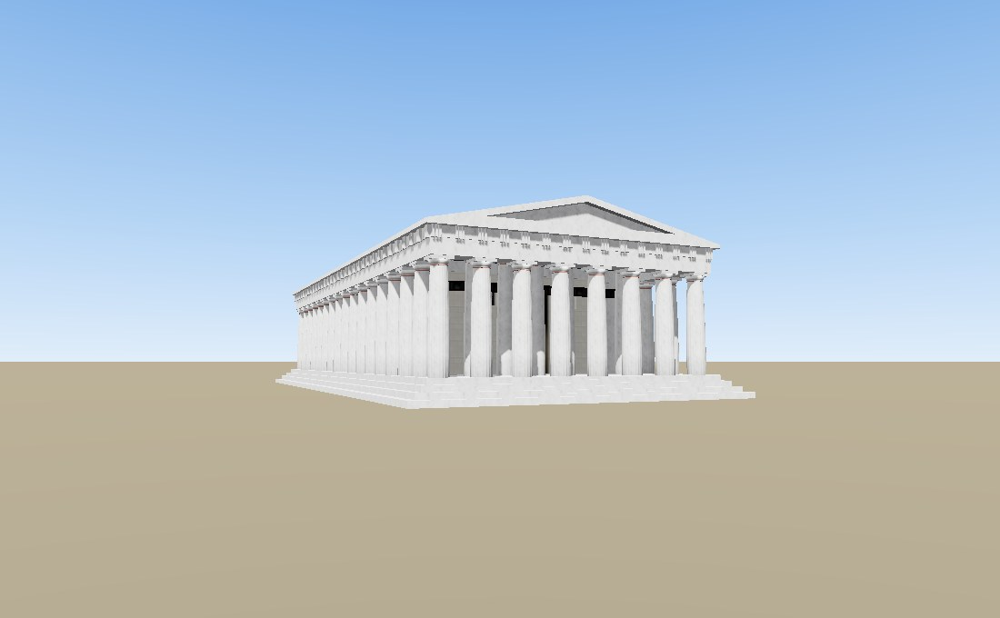

   1 — east approach

   2 — foot of the steps

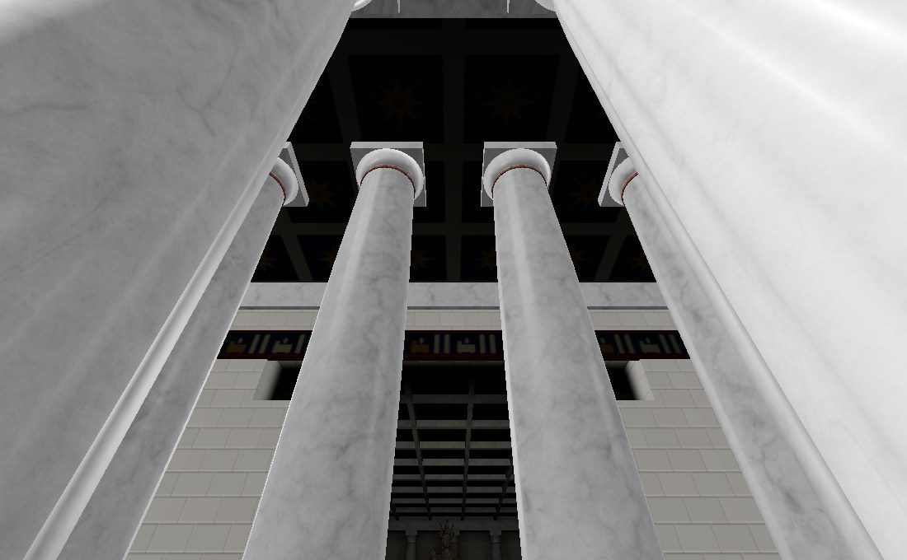

   3 — top of the steps

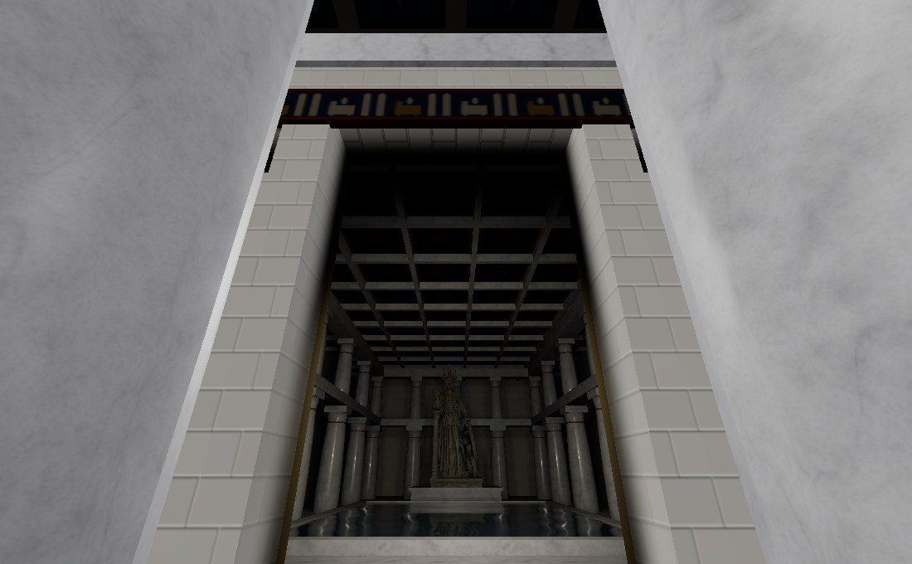

   4 — pronaos door

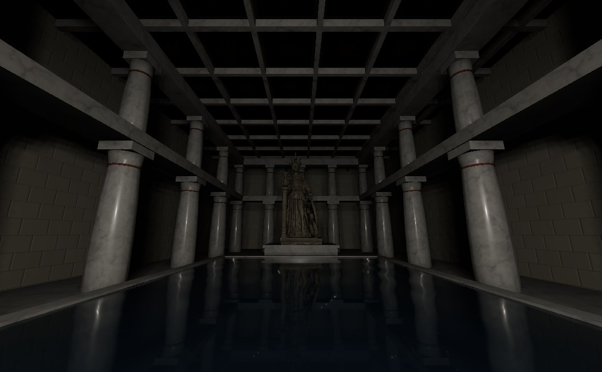

   5 — entering the naos

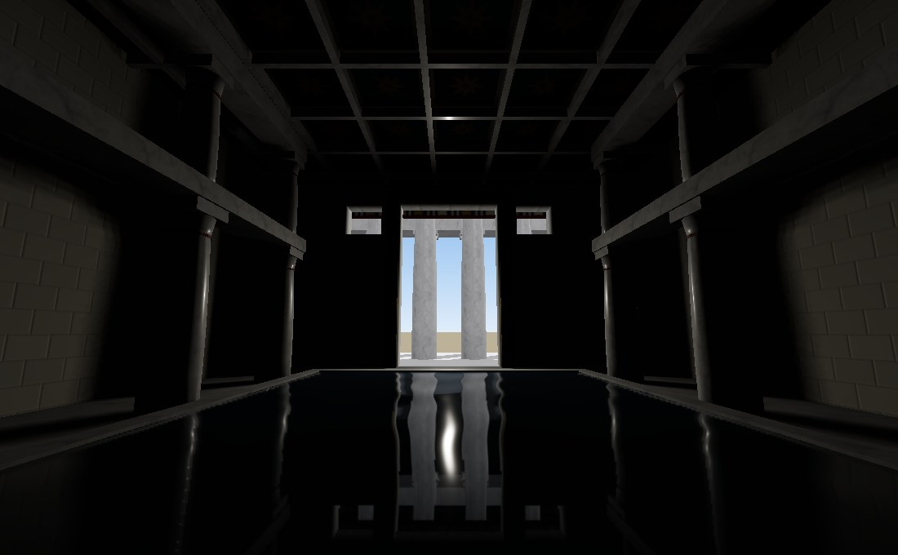

   6 — naos, looking out

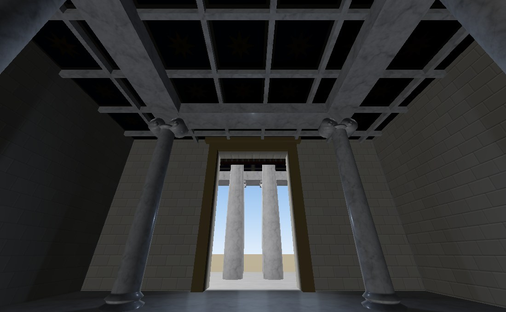

   7 — west chamber

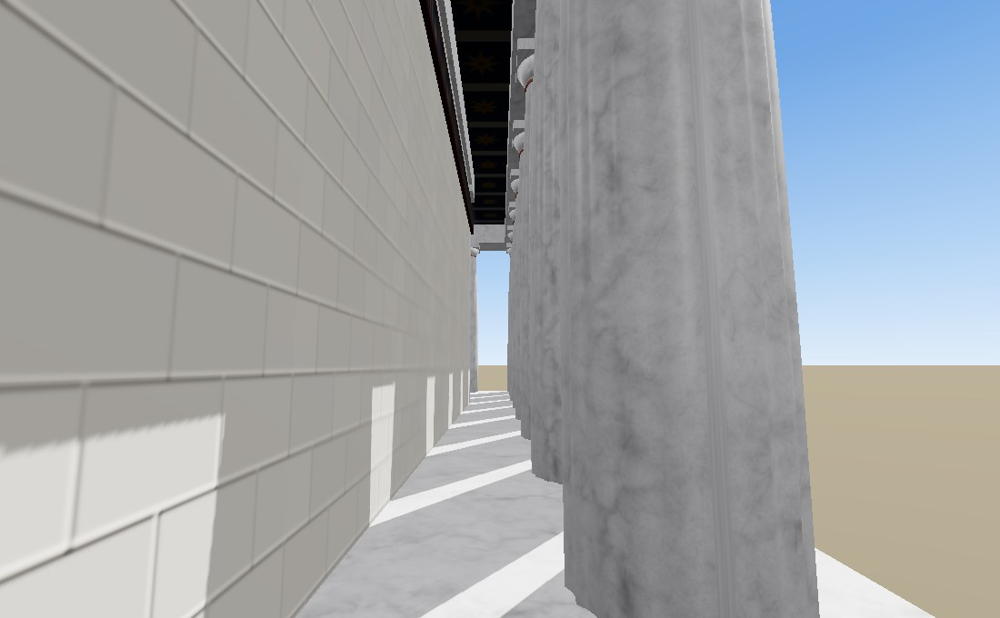

   8 — north flank

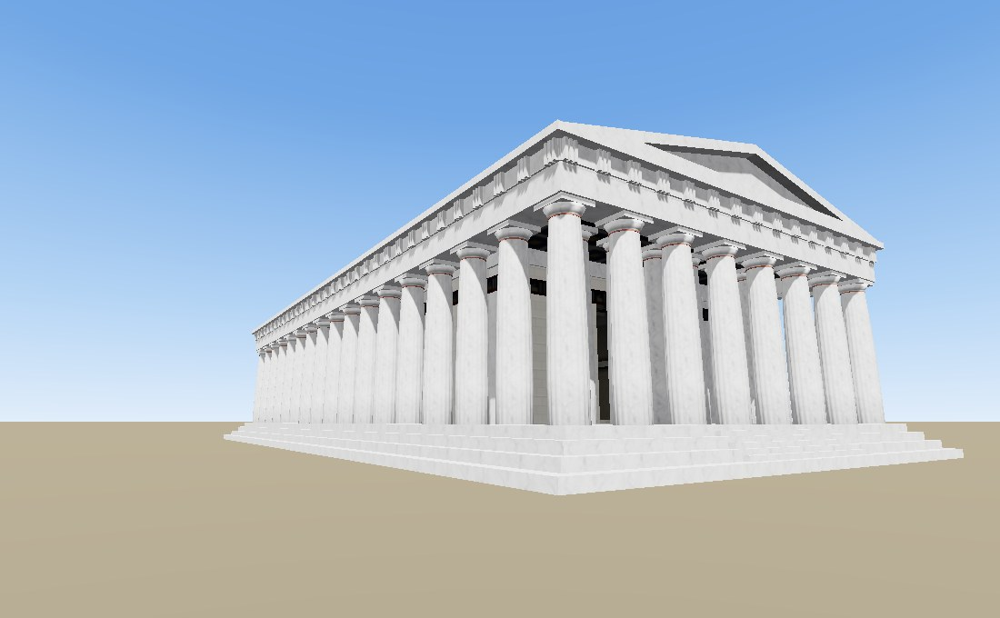

   9 — north-east corner

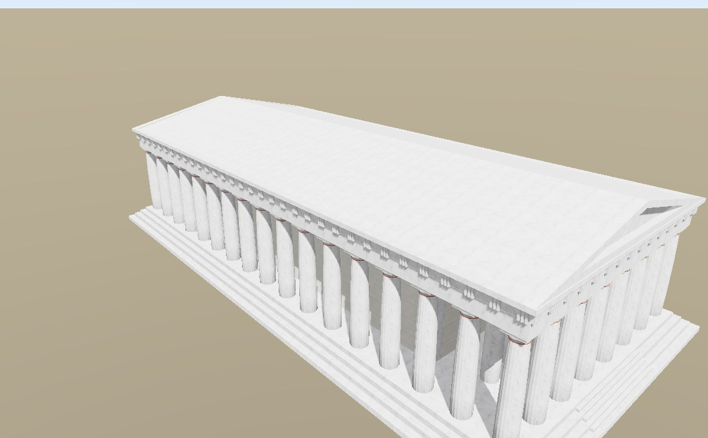

   10 — aerial

Regenerating these images
-------------------------

A script in the source tree produces the images on this page, so they can be
refreshed when the renderer changes:

.. code-block:: bash

   python scripts/generate_doc_images.py             # gallery + Parthenon
   python scripts/generate_doc_images.py --gltf-only

The script downloads the sample models on demand, renders one image of each
with the PBR pass, and writes the results into ``docs/images/``. It renders
each model in its own process, so it needs a display or an offscreen GL
platform (for example ``PYOPENGL_PLATFORM=egl``).
