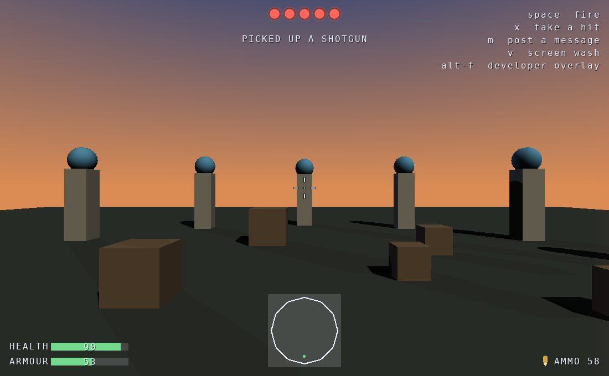

HUD & developer overlay
=======================

.. rst-class:: introduction

A **HUD layer** draws game information over the live world: a reticule, a
health bar, an ammunition count, a message that fades. It never takes input.
The **developer overlay** is a HUD layer that shows diagnostics, such as the
frame rate, from registered providers. HUD layers are drawn under any open
:doc:`overlay panel <overlayui>`, by the same batched renderer, in the same
few draw calls.

.. _difference:

HUD layers and overlay panels
-----------------------------

The :ref:`overlay stack <overlayui-input>` is modal: while a panel is open,
nothing under it receives input. That suits a settings screen, but not a
health bar, so HUD layers and panels are separate:

.. list-table::
   :widths: auto
   :header-rows: 1

   * -
     - HUD layer
     - Overlay panel
   * - Input
     - Never receives any
     - The top panel takes it; a modal panel keeps it from the world
   * - Focus
     - None; nothing in it is focusable
     - Tab order, accelerators, an Enter default
   * - Drawn
     - Every frame, under the panels
     - While open, over the HUD
   * - Laid out
     - Every frame, because its values change
     - When it opens or the window is resized
   * - Placed
     - By anchor: a corner, an edge or the middle
     - Centred in the window

Every context has HUD layers, because every context has a developer overlay.
A context gets panels by mixing in ``OpenGLContext.ui.overlay.OverlayMixin``.

.. _hud-quickstart:

Adding a HUD
------------

A layer is a tree of widgets, and each widget names the corner it belongs
in. Add the layer to the context, and it is drawn from the next frame:

.. code-block:: python

   from OpenGLContext.ui.hudwidgets import (
       BarMeter, Crosshair, HUDGroup, HUDLayer, LampRow, MessageQueue, MiniMap,
       Readout,
       TextBlock,
   )

   self.health = BarMeter(label='HEALTH', value=100, maximum=100)
   self.ammo = Readout(label='AMMO', value='50', anchor='bottom-right')
   self.messages = MessageQueue(anchor='top', duration=4.0)

   self.hud = HUDLayer(children=[
       Crosshair(shape='cross', gap=5, length=7),        # anchored 'center'
       HUDGroup(anchor='bottom-left', spacing=4, children=[self.health]),
       self.ammo,
       self.messages,
   ])
   self.addHUDLayer(self.hud)

After that, update the widgets' fields. Setting ``self.health.value = 40``
turns the meter amber. ``self.messages.post('PICKED UP A SHOTGUN')`` shows a
line that fades. The layer is measured and drawn again every frame, so
nothing has to be redrawn by hand.

The smallest useful HUD is two widgets:

.. code-block:: python

   from OpenGLContext.ui.hudwidgets import BarMeter, Crosshair, HUDLayer

   # in OnInit, after the base class's
   self.health = BarMeter(label='HEALTH', value=64, anchor='bottom-left')
   self.addHUDLayer(HUDLayer(children=[
       Crosshair(shape='cross-dot', gap=5, length=8),
       self.health,
   ]))

   # and from then on, wherever the number changes
   self.health.value = 22          # red, from the meter's own thresholds

.. _hud-demo:

The HUD demo
------------

   ``python tests/hud_demo.py``: one ``HUDLayer`` over a lit world, with each
   element placed by the corner it names.

The demo shows every widget:

- a ``Crosshair`` in the middle, whose ``spread`` opens and closes on a
  timer, as a weapon's accuracy does;
- two ``BarMeter`` widgets bottom left, one green and one amber, according
  to where each value sits against its thresholds. The values sweep their
  whole range, so each threshold colour appears in turn;
- a ``LampRow`` of five lives across the top, with a ``MessageQueue`` under
  it;
- a ``MiniMap`` of the ring of pillars with the player marked on it;
- a ``Readout`` bottom right, with a nine-slice icon beside its number;
- the key legend top right, in a ``TextBlock``;
- a ``DamageIndicator`` on the right-hand edge, the direction of the last
  hit.

Nothing on the screen is interactive, and the world receives every event as
if the HUD were not there. The keys trigger the transient effects: :kbd:`x`
takes a hit, :kbd:`v` puts a ``ScreenWash`` over the viewport, :kbd:`space`
puts a hit mark on the reticule, :kbd:`m` posts a message, and
:kbd:`alt`\ +\ :kbd:`f` shows the developer overlay, where the demo registers
a section of its own at the top. :doc:`tutorials/hud_demo` walks through the
code.

.. _anchors:

Placement by anchor
-------------------

HUD widgets are placed by naming a corner or edge rather than by rows and
columns. Every HUD widget has two placement fields:

.. list-table::
   :widths: auto
   :header-rows: 1

   * - Field
     - Meaning
   * - ``anchor``
     - One of ``top-left``, ``top``, ``top-right``, ``left``, ``center``, ``right``,
       ``bottom-left``, ``bottom``, ``bottom-right``. Any other value is treated
       as ``center``, so a misspelt anchor still puts the widget on screen.
   * - ``offset``
     - Pixels away from the anchor, **+x right and +y up**. The offset is applied
       away from whichever corner the widget is anchored to.

``HUDLayer.margin`` (16 pixels) keeps everything clear of the window edge,
and ``HUDLayer.reserved`` is room already taken at each edge (top, right,
bottom, left), such as by a menu bar. A child with no ``anchor``, such as an
ordinary ``Row`` or ``Column``, is given the whole layer and lays itself out
normally, so the ordinary layout containers work inside a HUD.

Every pixel measurement here, including margins, offsets, a reticule's gap
and a meter's height, is in pixels at the reference font size. It is
multiplied by the interface scale, as the skin's measurements are, so a HUD
designed on a 1080p display appears the same size at 4K. See
:ref:`Everything scales with the window <scale>`.

.. _widgets:

The widgets
-----------

All the widgets are in ``OpenGLContext.ui.hudwidgets``.

.. _crosshair:

Crosshair: the reticule
~~~~~~~~~~~~~~~~~~~~~~~

Every property of the reticule is a field. A game with several weapons can
give each weapon its own ``Crosshair`` and switch the node when the weapon
changes.

.. list-table::
   :widths: auto
   :header-rows: 1

   * - Field
     - Units
     - Default
     - Meaning
   * - ``shape``
     -
     - ``cross``
     - ``cross``, ``dot``, ``cross-dot``, ``circle`` or ``none``. Use ``none`` for a
       weapon that aims down its own sights.
   * - ``gap``
     - px
     - 5
     - Clear space in the middle, so the target stays visible.
   * - ``length``
     - px
     - 7
     - Length of one arm.
   * - ``thickness``
     - px
     - 2
     - Width of an arm.
   * - ``dotSize``
     - px
     - 2
     - Size of the centre dot, for the shapes that have one.
   * - ``spread``
     - px
     - 0
     - Extra gap for the weapon's current accuracy. It widens the reticule rather
       than moving it, so the reticule shows the area a shot may land in.
   * - ``hitDuration``
     - s
     - 0.35
     - How long the hit mark stays up after ``crosshair.hit()``.
   * - ``hitSize``
     - px
     - 4
     - Size of the hit mark.

The shape is drawn from axis-aligned rectangles: four arms, or four arcs for
a circle. At the few pixels a reticule covers, this looks the same as a true
curve, and the whole HUD stays in one draw call.

.. _barmeter:

BarMeter: health, armour, a charge
~~~~~~~~~~~~~~~~~~~~~~~~~~~~~~~~~~

A ``BarMeter`` shows a ``value`` against a ``maximum`` (100). Its colour
depends on where the value sits against two thresholds: ``warnFraction``
(0.5) and ``criticalFraction`` (0.25) select the skin's ``hudGood``,
``hudWarn`` or ``hudCritical``. The meter uses three colours rather than a
gradient, so a player can read its state (fine, low, critical) at a glance.
Setting ``color`` overrides the thresholds.

``barWidth`` (140) and ``barHeight`` (14) are its natural size. The track
stretches to fill the room the meter is given, so a meter in a stretched
group stretches with it. A ``label`` is drawn to its left and takes room from
the track. ``showValue`` (on by default) draws the number over it.

``meter.flash(now)`` lights the whole track and fades it over
``flashDuration`` (0.35 s) from ``flashStrength`` (0.75). A flash makes a
change visible to a player who is not looking at the meter. The game decides
which changes deserve a flash. For example, flash when health drops but not
when a pickup raises it:

.. code-block:: python

   if value < float(meter.value):    # a drop, not a pickup
       meter.flash(now)
   meter.value = value

The flash lights the whole track, not only the filled part, so a meter that
has just reached zero still flashes.

.. _lamprow:

LampRow: a count shown as lamps
~~~~~~~~~~~~~~~~~~~~~~~~~~~~~~~

A ``LampRow`` is a row of ``count`` lamps (5), of which the first ``lit``
(0), from the left, are lit. A player sees the count without reading a
number. A racing start sequence is the typical use: five lamps light one per
second and then go out, and the driver watches them without looking away
from the road. Round counters, lives and lap tallies work the same way.

.. code-block:: python

   self.lights = LampRow(anchor='top', offset=(0, -40))
   ...
   self.lights.count, self.lights.lit = 5, burning
   self.lights.visible = starting

``lit`` is clamped to the range 0 to ``count``, so a game can assign any
number. Every lamp is drawn in a housing whether it is lit or not, so a row
with nothing lit is still visible. A lit lamp gets a halo, kept inside the
spacing so two lit lamps stay distinct.

``lampSize`` (26) and ``gap`` (12) set its natural size, and its ``anchor``
defaults to ``top``. ``color`` recolours the lit lamps and leaves the unlit
ones to the skin. Without ``color``, a lit lamp uses the skin's
``hudCritical``, which is red in the default skin.

.. _damageindicator:

DamageIndicator: the direction of a hit
~~~~~~~~~~~~~~~~~~~~~~~~~~~~~~~~~~~~~~~

The health meter shows how much damage was taken. A ``DamageIndicator``
shows where it came from, by washing colour onto the screen edge the player
would turn towards to face the attacker.

.. code-block:: python

   indicator.hurt(bearing=-math.pi / 2, intensity=0.6, now=now)   # from the left

``bearing`` is in radians from straight ahead, positive to the right. So
``+pi/2`` is directly to the right, and ``pi`` is directly behind, which is
drawn at the bottom of the screen. Each of the four edges takes the share of
a hit that faces it. As an attacker circles, the wash slides from one edge to
the next rather than jumping between them.

.. list-table::
   :widths: auto
   :header-rows: 1

   * - Field
     - Units
     - Default
     - Meaning
   * - ``duration``
     - s
     - 1.1
     - How long one hit takes to fade to nothing.
   * - ``thickness``
     - px
     - 48
     - How far in from the edge the wash reaches at full strength.
   * - ``strength``
     - 0–1
     - 0.34
     - How opaque the wash is at its strongest. The player can still see the
       scene through it.
   * - ``steps``
     -
     - 4
     - How many strips the wash is drawn from, so that it fades as a gradient
       rather than ending in a hard edge.
   * - ``capacity``
     -
     - 8
     - The most hits shown at once.

``intensity`` runs from 0 to 1. An intensity of 0 draws nothing, so a hit
that armour absorbed entirely shows no wash. Several hits can be shown at
once, and each fades on its own timer. ``clear()`` removes them all, for
example on respawn.

.. _screenwash:

ScreenWash: a colour over the whole viewport
~~~~~~~~~~~~~~~~~~~~~~~~~~~~~~~~~~~~~~~~~~~~

A ``ScreenWash`` tints the whole view. Use ``DamageIndicator`` for an event
with a direction, and ``ScreenWash`` for a change to the view as a whole:
being dead, being under water, or a fade.

.. code-block:: python

   wash = ScreenWash(colour=(0.65, 0.04, 0.04))
   wash.strength = 0.42        # driven per frame; 0 draws nothing at all

.. list-table::
   :widths: auto
   :header-rows: 1

   * - Field
     - Units
     - Default
     - Meaning
   * - ``colour``
     - rgb
     - (1, 0, 0)
     - The colour of the tint.
   * - ``strength``
     - 0–1
     - 0.0
     - How opaque the tint is. Keep it low enough to see the scene through,
       unless there is nothing left for the player to see.

A strength of 0 draws nothing at all, not a transparent rectangle, so a wash
that is switched off costs a comparison rather than a draw. Change
``strength`` every frame rather than switching it on at the event, so that
it rises and falls with whatever it accompanies.

.. _readout:

Readout: an icon and a number
~~~~~~~~~~~~~~~~~~~~~~~~~~~~~

A ``Readout`` has a ``label``, a ``value`` and an optional ``icon`` (a
``NineSlice``, drawn at ``iconSize``, 20). Set ``critical`` when the value
needs attention, such as the last few rounds or the last seconds. It is a
flag rather than a colour, so the skin decides how it looks.

.. _textblock:

TextBlock: several lines in a corner
~~~~~~~~~~~~~~~~~~~~~~~~~~~~~~~~~~~~

A ``TextBlock`` shows several lines of text the application writes, such as
what is loaded and what the keys do. A ``Readout`` is a single line of label
and value. ``lines`` is a list rather than one string with newlines, so a
caller can change one line. ``critical`` marks the whole block as reporting
a problem.

.. code-block:: python

   caption = TextBlock(anchor='bottom-right', align='right',
                       lines=['model.glb', '[1/3] aerial'])

The caption in :doc:`oglc-view <viewer>` is a ``TextBlock``; see
``OpenGLContext.viewer.caption``. Avoid the left edge for status text: the
developer overlay is anchored top left and grows down the left edge as
sections are registered, and would cover it.

.. _minimap:

MiniMap: a route and the positions on it
~~~~~~~~~~~~~~~~~~~~~~~~~~~~~~~~~~~~~~~~

A ``MiniMap`` draws a route and marks on it, such as a race circuit with the
cars, so a player can see the next bend and how much of the lap is left. It
takes a polyline in world XZ and a list of marks, and works the same for any
kind of route.

.. code-block:: python

   self.map = MiniMap(anchor='bottom-left', size=150)
   self.map.route = course.centreline            # (N,2) or (N,3): XZ is read
   self.map.marks = [(car.x, car.z, 'crosshair')]   # each names a skin colour

The route is scaled to fit the box along whichever axis needs it more, and
centred along the other, so it keeps its shape. A mark outside the route's
extent is clamped to the edge of the map rather than dropped.

A long route is reduced to ``detail`` segments (150). ``size`` (150) is the
width and height of the map in pixels.

``MiniMap`` is the one widget that draws lines that are not axis-aligned. It
uses ``Renderer.segment(start, end, width, colour)``, which draws a thick
line as one rotated quad in the same batch as everything else. A compass, a
trajectory or a radar sweep can use the same call.

.. _messagequeue:

MessageQueue: pickups, frags, warnings
~~~~~~~~~~~~~~~~~~~~~~~~~~~~~~~~~~~~~~

A ``MessageQueue`` shows messages newest first. Each line has its own timer,
so a warning posted with a long duration is not cut short by a message posted
after it:

.. code-block:: python

   queue.post('YOU HAVE THE FLAG', duration=6.0)
   queue.post('PICKED UP A SHOTGUN')          # the queue's own duration

- ``duration`` (4 s) is how long a line is shown.
- ``fade`` (1 s) is how much of the end of that time is spent fading out. The
  fade is applied to the colour's alpha.
- ``capacity`` (5) is how many lines are shown at once. When a new line
  arrives and the queue is full, the oldest is dropped.

.. _hud-clock:

The clock
---------

Anything that fades, expires or flashes is driven by ``HUDLayer.tick(now)``.
The context calls it once a frame, before drawing, with
``time.monotonic()``. Because the time is passed in rather than read inside
each widget, the widgets can be tested, and a game can drive its HUD from its
own simulation clock.

Use the same clock as the layer. If a game marks a hit with ``time.time()``
while the layer ticks with ``time.monotonic()``, every fade is computed from
the difference between two clocks, which is about fifty years. The hit mark
and the damage wash then never go away. Take every time the HUD uses from one
function:

.. code-block:: python

   def now():
       """The clock every reading on this HUD is taken against."""
       return time.monotonic()

In a test, pass the times explicitly:

.. code-block:: python

   queue.post('PICKED UP A SHOTGUN', now=100.0)
   layer.tick(101.0);  assert queue.entries(101.0)      # still up
   layer.tick(105.0);  assert not queue.entries(105.0)  # gone

.. _hud-skinning:

Colours
-------

A HUD has to be readable over a world of any colour, so its skin fields are
brighter and more opaque than the panel fields. They are on the same
:ref:`Skin <overlayui-skinning>` node:

.. list-table::
   :widths: auto
   :header-rows: 1

   * - Field
     - What it colours
   * - ``hudText``, ``hudFill``
     - HUD text and the plate behind it.
   * - ``hudGood``, ``hudWarn``, ``hudCritical``
     - A meter reading normal, low and critical.
   * - ``hudTrack``
     - The unfilled part of a meter, so an empty meter is still visible.
   * - ``crosshair``, ``crosshairHit``
     - The reticule, and the mark that shows a shot hit.
   * - ``debugFill``, ``debugTitle``, ``debugLabel``, ``debugValue``
     - The developer overlay. These differ from the HUD colours so the two are
       not confused.
   * - ``hudPadding``, ``hudSpacing``
     - Pixels inside a HUD element, and between one element and the next.

.. _viewpinned:

Objects pinned to the view
--------------------------

A first-person weapon is not part of the HUD. It is geometry: it is lit by
the scene and hidden behind nearer objects. Like the HUD, though, it must
stay still on screen. Put it under a transform, and set that transform from
the camera in ``placeViewAttachments``:

.. code-block:: python

   class Game(OverlayMixin, Context):
       def placeViewAttachments(self, pass_):
           "Called once the camera is settled, before any geometry is gathered."
           aim_at_camera(self.hand, self.getViewPlatform())

The render pass calls this method each frame after the view platform is
settled and before the scene is gathered. A transform set anywhere else, such
as in an idle callback or an event handler, uses the previous frame's camera:
the weapon lags behind as the player moves and then catches up.

Set here, the object is fixed exactly in view space. The renderer draws a
node with ``modelview = view × model``. A node placed at the camera's pose
has ``model = cameraPose × local``, and the view matrix is that pose
inverted, so the two cancel and leave ``local``, whatever the camera does.

The hook is optional. A context that does not define it is not called.

.. _hud-debug:

The developer overlay
---------------------

The developer overlay is one panel of diagnostics for developers, so that a
game's own HUD holds only game information. It is a HUD layer, so it can stay
up during play: it takes no input and blocks nothing.

Showing and hiding it
~~~~~~~~~~~~~~~~~~~~~

:kbd:`alt`\ +\ :kbd:`f` toggles it in every context.
``context.toggleDebugOverlay()`` does the same in code, and can be bound to
any key.

The overlay is on screen when a context opens, unless the context class sets
``debugOverlayStartsVisible = False``, as :doc:`the viewer <viewer>` does.

When ``OPENGLCONTEXT_DISABLE_FPS_DISPLAY`` is set, the overlay starts hidden
whatever the class says, so screenshots have no numbers over them. The key still shows it, because a
capture run is not the only thing that sets the variable.

.. rst-class:: technical

``FrameCounter`` measures the frame rate and does not draw it: the overlay's
provider reads its number and the HUD puts it on screen. Drawing it from
``FrameCounter`` would need ``glOrtho`` and ``glPushAttrib``, which do not
exist in a core profile.

Adding a section
~~~~~~~~~~~~~~~~

The overlay is filled by registered providers. A provider is a callable that
returns name/value pairs and does no drawing. A subsystem adds its section by
registering a provider, without changes to the overlay:

.. code-block:: python

   context.debugOverlay.register('Map', lambda: [
       ('name', loaded.name),
       ('family', loaded.family),
       ('position', tuple(camera.position[:3])),
   ], order=40)

The overlay formats the values, so a provider can return what it has:

- a float becomes ``0.33``, or ``60`` rather than ``60.00``;
- a bool becomes ``yes`` or ``no``;
- a vector becomes its components;
- ``None`` becomes ``-``.

``order`` sorts the sections, lowest first. Sections with equal ``order``
keep the order they were registered in. Registering a title a second time
replaces the section, so a subsystem that is reloaded does not add a second
copy.

A provider that raises an exception shows an ``error`` row instead of
breaking the frame. A provider that returns nothing is left out, rather than
drawn as an empty heading.

The shipped sections
~~~~~~~~~~~~~~~~~~~~

.. list-table::
   :widths: auto
   :header-rows: 1

   * - Section
     - Rows
   * - Frame
     - Frame rate (the median over a recent window, not the lifetime average),
       frame time in milliseconds, frames drawn, the viewport.
   * - Loop
     - Wall-clock cost of the whole main loop, and where it went; see
       :ref:`hud-loop`. Absent on backends that run their own loop.
   * - Render
     - The profile, and whether shadows, IBL, bloom, transmission, instancing and
       vsync are on. Then what the last frame cost: shapes gathered, draw calls
       issued, and how many shapes were collapsed into how many instanced
       groups. A shape two views see counts twice. On a frame that drew
       mirror views (:doc:`reflections`), ``mirror views`` gives how many,
       the draws they took (counted in the draw calls as well) and the atlas
       texels they filled, and ``mirror ms`` their GPU time, measured a frame
       or two late through a query and absent until one has come back.
   * - View
     - Camera position, and a character controller's grounded state, velocity and
       mode when there is one.

Two more providers are available but not registered by default, because not
every context has what they report on:

- ``physics_provider(lambda: world)`` reports body and contact counts.
- ``simulation_provider(lambda: manager)`` reports on a background physics
  thread (``OpenGLContext.physics.threaded.ThreadedPhysicsManager``): the
  rate it achieves against its target rate, its total ticks, and any
  ticks it dropped. A physics thread that falls behind makes the world move
  in slow motion, which looks like wrong gravity or a wrong timestep until
  the two rates are compared.

Both take a callable rather than the object, because a world is replaced when
the next level loads, and a provider holding the old one would keep reporting
on it.

The overlay does not show triangle counts. Only each geometry node has its
count, not the render pass, and counting them in every ``render()`` would
cost more than the number is worth. See
``OpenGLContext/passes/renderstats.py``.

.. _hud-loop:

The main loop timing
~~~~~~~~~~~~~~~~~~~~

The frame rate can look healthy while the application stutters.
``FrameCounter`` times only the inside of ``OnDraw``, counts only frames that
produced a visible change, and reports the median over a window. The median
keeps a one-off shader compile or a synchronous model load from dragging the
number down. All three choices suit the question "how fast is the renderer",
and all three hide a stutter.

A backend's loop also processes window-system events, runs ``OnIdle``, where
an application usually runs its simulation, and waits for a redraw request.
None of that is timed by the frame counter. An application can run at a few
updates a second while the overlay reports sixty frames a second.

``OpenGLContext.looptrace.LoopTrace`` measures wall-clock time per loop
iteration, divided among named phases. Every context has one as
``context.loopTrace``. The GLFW backend drives it from ``MainLoop``, and
``OnDraw`` divides its own share further. The Loop section shows:

.. list-table::
   :widths: auto
   :header-rows: 1

   * - Row
     - Meaning
   * - ``loop fps``
     - Loop iterations per second of wall-clock time: the rate the player feels.
       If this is much lower than ``fps``, the renderer is keeping up and
       something outside it is not.
   * - ``loop ms``, ``worst ms``
     - The median and the worst iteration in the window. A worst iteration ten
       times the median means the loop stutters.
   * - ``stalls``
     - How many iterations took longer than the stall threshold, counted since
       the loop started.
   * - ``last stall``
     - The phase that took the most time in the latest stall, for example
       ``idle 812ms``.
   * - ``poll``, ``repeats``, ``idle``, ``wait``, ``draw``, ``cascade``, ``render``
     - Mean milliseconds per iteration in each phase, largest first.

Phases do not overlap. Time inside a nested phase is charged to the nested
phase only, so the phases of an iteration add up to its wall-clock time, and
the largest phase is where the time went. ``wait`` is limited by
``drawPollTimeout``, so a large ``wait`` means the loop is idle, not stalled.

The engine's phases can only report that time went into ``idle``, because
``OnIdle`` is where an application does its work. Divide ``idle`` with
``context.tracePhase(name)``. It opens a phase from anywhere, nests inside
whatever phase is open, and returns a context manager that does nothing when
no trace is running, so the caller needs no ``if``:

.. code-block:: python

   def OnIdle(self):
       with self.tracePhase('character'):
           self.player.update(dt)
       with self.tracePhase('match'):
           self.arena.step(dt)

These phases divide ``idle`` rather than adding to it, so the ``idle`` row
shows only the time left over. A phase costs one clock read.

Counting is always on and costs a few clock reads per iteration. Logging is
switched on with an environment variable:

.. list-table::
   :widths: auto
   :header-rows: 1

   * - Variable
     - Effect
   * - ``OPENGLCONTEXT_STALL_MS``
     - The stall threshold, in milliseconds. The default is ``50`` (twenty frames a
       second). Setting it also switches logging on. A value that is not a number
       logs a warning and uses the default.
   * - ``OPENGLCONTEXT_TRACE_STALLS``
     - Logs every stall's phase breakdown at ``WARNING``, with the default
       threshold.

.. code-block:: bash

   OPENGLCONTEXT_STALL_MS=40 python -m twig_bb
   WARNING OpenGLContext.looptrace: main loop stalled 912ms: idle 901ms, render 9ms, poll 1ms

Neither variable changes what a frame looks like, so a subprocess capture
inherits both, rather than clearing them with the rendering variables.

.. _stalltrace:

Recording slow periods
~~~~~~~~~~~~~~~~~~~~~~

The phase breakdown names a subsystem, but not the code inside it: by the
time an iteration ends, the stack that was running has unwound. The overlay
shows only the present. To see what happened during a stutter, record it.

``OPENGLCONTEXT_STALL_TRACE=<path>`` switches on the recorder
(``OpenGLContext.stalltrace``). A watcher thread samples the main thread's
Python stack, but only while an iteration is already running long, so frames
that are on time are not profiled. It writes a JSON-lines file. Read it with
the module:

.. code-block:: bash

   OPENGLCONTEXT_STALL_TRACE=/tmp/stalls.jsonl python -m twig_bb
   python -m OpenGLContext.stalltrace /tmp/stalls.jsonl

Each record is an *episode*, not a frame. Consecutive slow iterations are
gathered into one record, and a run of slow frames with an occasional fast
one stays one episode.

.. list-table::
   :widths: auto
   :header-rows: 1

   * - Field
     - Meaning
   * - ``at``, ``seconds``, ``iterations``, ``stalled``
     - When the slow period began, how long it lasted, how many iterations it
       covered, and how many of them were slow.
   * - ``worst_ms``, ``mean_ms``, ``baseline_ms``
     - The worst and mean iteration, and the loop's usual iteration time before
       the episode, for comparison.
   * - ``phases_ms``
     - The phase breakdown, averaged over the episode.
   * - ``functions``
     - Per function, the share of samples in which it was running (``self``)
       and the share in which it was anywhere on the stack (``cumulative``).
       Start here.
   * - ``hot``
     - The whole stacks that held the most samples, showing how the expensive
       functions were reached.
   * - ``context``
     - Every section of the developer overlay when the episode began: the map,
       the player, the renderer's counts and whatever the game registered.
   * - ``samples``
     - How many samples were taken, and ``incomplete`` when the start of the
       episode fell out of the sampler's buffer.

The report groups samples by function as well as by whole stack. One
expensive function is usually reached by many routes; grouped only by stack,
a function holding sixty per cent of a stall would appear as a dozen entries
of five per cent each. ``functions`` sums them, and ``hot`` keeps the
routes:

.. code-block:: text

   where 28 samples were, by function:
         self    cum  function
        53.6%  53.6%  collide.py _closest_point_on_triangle
        10.7%  75.0%  collide.py capsule_triangle
        10.7%  10.7%  collide.py _closest_segment_segment

Each episode is written and flushed as it closes, so a run ended with
``kill -9`` keeps every episode before the last. A long slow period is also
written in parts every few seconds while it continues, each later part marked
``continues``, so the final episode of a session that ends while stalled is
kept.

If the path cannot be written, a warning is logged and recording is switched
off. The game still starts.

For a record of a whole session, including input, frame times, exceptions
and these overlay sections, see :doc:`telemetry`.

.. _hud-modules:

Where things are
----------------

.. list-table::
   :widths: auto
   :header-rows: 1

   * - Module
     - Contents
   * - ``ui.hudwidgets``
     - ``HUDLayer``, ``HUDGroup``, ``Crosshair``, ``BarMeter``, ``LampRow``,
       ``DamageIndicator``, ``ScreenWash``, ``Readout``, ``TextBlock``,
       ``MessageQueue``, ``MiniMap``, and ``place()``.
   * - ``ui.debugoverlay``
     - The developer overlay, the provider registry, value formatting and the
       shipped providers.
   * - ``ui.screen``
     - The context mix-in: ``hudLayers``, ``debugOverlay``, and the drawing hook
       both kinds of layer go through.
   * - ``ui.widgets``
     - ``RootWidget``, the base of both HUD layers and panels: the children, the
       skin and its scaled copy.
   * - ``telemetry``
     - A recording of a whole session: input, frame times, exceptions and this
       overlay's sections, in a file that can be :doc:`read back or replayed
       <telemetry>`.
   * - ``stalltrace``
     - The slow-period recorder: a stack sampler that runs only during a stall,
       the episode file it writes, and the report that reads the file.
   * - ``looptrace``
     - ``LoopTrace``: wall-clock cost of each loop iteration, divided among named
       phases, with the worst iteration and the stall count.
   * - ``framecounter``
     - ``FrameCounter``: how long the frames inside ``OnDraw`` took. It measures
       and does not draw.
   * - ``passes.renderstats``
     - What one frame cost, counted in the render pass.
   * - ``passes._flat``
     - Calls ``placeViewAttachments``, the point in a frame where an object can
       be pinned to the camera.

The design and its reasoning are in ``plans/HUD-DEBUG-OVERLAY.md``.
