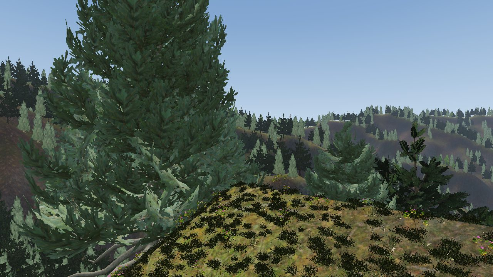
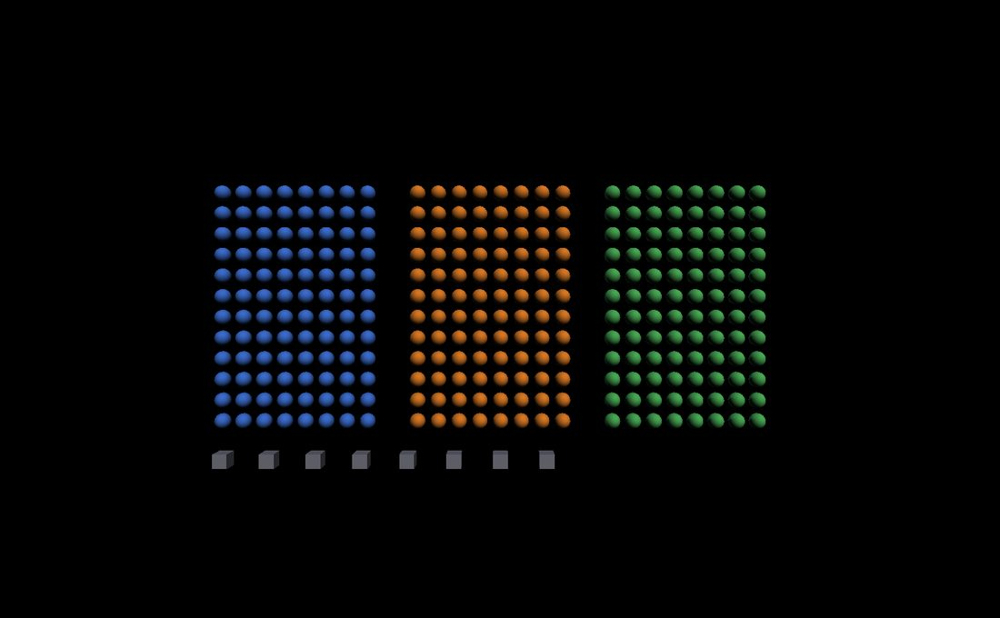

Instanced Geometry
==================

.. rst-class:: introduction

Many scenes draw the same shape many times: columns in a temple, atoms in a
molecule, bolts, trees or crates. Drawn one at a time, each copy costs a
separate draw call, and with enough copies the CPU spends longer issuing draw
calls than the GPU spends drawing. **Instancing** is the OpenGL feature that
draws many copies of one mesh with a single call, each copy with its own small
set of data. OpenGLContext applies instancing automatically. This page
describes how shapes are grouped into instanced draws, what can and cannot be
batched, and the switches that control it. The technical notes point to the
code for each part.

.. _problem:

Why one draw call per object is expensive
-----------------------------------------

To draw an object, a program sends the GPU a series of commands: bind this
geometry, set this transform, set this colour, draw. These commands have a
fixed CPU cost per object, whether the object fills the screen or covers a
single pixel. For ten objects the cost is negligible. For ten thousand, the
GPU waits while the CPU sets up each object in turn. This is the *draw-call
bottleneck*, and it is usually the first limit a large scene reaches.

.. rst-class:: technical

In OpenGLContext the per-object cost is in ``Shape.Render`` and the loop
around it (matrix upload, material upload, id assignment, the draw), on the
order of tens of microseconds per object. A scene with tens of thousands of
objects can spend a whole frame on setup before any triangle is shaded.
Instancing replaces that loop with one call.

.. _idea:

How instancing works
--------------------

A normal draw call, ``glDrawElements``, draws a mesh once. The instanced
version, ``glDrawElementsInstanced``, draws it *N* times. The GPU runs the
vertex shader for every vertex of every copy, but the CPU issues one call.

Each copy needs its own position, and possibly its own colour. Alongside the
shared mesh, the program gives the GPU a second, small array with one entry
per instance, holding the data that differs. OpenGL calls this a
*per-instance vertex attribute*, set with ``glVertexAttribDivisor(location,
1)``. The divisor controls how the attribute advances:

- divisor 0 (the default) - the attribute advances once per *vertex*. This is
  ordinary per-vertex data such as position or normal.

- divisor 1 - the attribute advances once per *instance*. Every vertex of
  copy 0 reads entry 0, every vertex of copy 1 reads entry 1, and so on.

All copies share the shape's vertices, and the per-instance array supplies
each copy's transform, id and material.

.. rst-class:: technical

OpenGLContext packs three values per instance, at the attribute locations
reserved in ``scenegraph/vertexsemantics.py`` (see :ref:`Fixed Attribute
Locations <fixed-attribute-locations>`) and read by ``pbr.vert``,
``vrml97_lighting.vert`` and ``shadow_depth.vert``: at *locations 5–8* a
``mat4`` model-view matrix (a matrix takes four consecutive vec4 locations),
at *location 9* a ``uint`` object id for picking, and at *location 10* a
``uint`` material index. The shaders multiply by the per-instance matrix
instead of a uniform. An ``instancingEnabled`` uniform switches this on, so
the non-instanced path is unaffected. See ``passes/instancing.py``
(``pack_instance_buffer``, ``draw_instanced_mesh``).

.. _grouping:

How shapes are grouped into one draw
------------------------------------

Only shapes that share geometry can share an instanced draw. Every frame,
OpenGLContext computes an *instance key* for each shape and puts shapes with
equal keys in the same bucket. A bucket with enough members becomes one
instanced draw. Every other shape is drawn individually, as usual.

Two shapes share a key, and therefore a draw, when they have the same:

- Geometry - the same mesh. This can be the *same node* (a VRML ``USE``/``DEF``
  reference, or a glTF mesh used by many nodes), or two *different* nodes with
  *identical* vertex data (for example a Sphere of the same radius authored a
  hundred times). The second case is called *content collapse*; see below.

- Texture set - instances can differ in material *numbers* (colour, metalness,
  roughness) but not in *textures*. Plain OpenGL cannot switch textures per
  instance, so a different texture image starts a new group.

- Pass properties - properties that decide how or in which pass a shape is
  drawn (transparency, alpha mode, transmission, an octahedral impostor's
  views) must match, because they are shared state for the whole draw.

A mirror is never batched: each one reads a reflection of its own (see
:doc:`Reflections <reflections>`).

The PBR pass remembers each shape's key between frames. It works the key out
again when the shape's geometry, appearance, material or texture is replaced,
when a material field or texture channel is set, and when any shape becomes a
mirror or stops being one, so an edit takes effect on the next frame.

Explicit and opportunistic instances
~~~~~~~~~~~~~~~~~~~~~~~~~~~~~~~~~~~~

The batcher receives instances from two sources:

- Explicit - the scene declares the repetition: a VRML file shares one
  geometry node across many ``Transform``\ s, or a glTF file uses the
  ``EXT_mesh_gpu_instancing`` extension (per-instance translation, rotation
  and scale on a node).

- Opportunistic - the renderer finds separately authored shapes that carry the
  same geometry and batches them, with no hint from the file. A scene of 500
  separate but identical crate nodes becomes one draw.

Seeing it work
~~~~~~~~~~~~~~

   ``python tests/instancing_batched.py`` — 296 shapes drawn in 4 calls. Each
   field is built a different way, so the grouping rules can be told apart:
   the blue field shares one ``Sphere`` node across all 96 shapes, the orange
   field gives each shape its own equal ``Sphere``, and the green field shares
   a node again but with a second material. The boxes are a fourth group
   because their geometry differs. Press ``i`` to turn batching off; the draw
   count rises to 296.

The demo prints the counts whenever they change:

.. code-block:: bash

   $ python tests/instancing_batched.py
   instancing ON   296 of 296 shapes -> 4 draws (296 instances in 4 groups)
   instancing OFF  296 of 296 shapes -> 296 draws (0 instances in 0 groups)

The first number is the count of shapes left after frustum culling, which runs
*before* batching. With ``OPENGLCONTEXT_INSTANCE_COLLAPSE=off`` the same scene
takes 106 calls: the two shared-node fields still batch into 2, and the 96
separate spheres and 8 separate boxes each take a draw of their own.

The demo does not request instancing. It builds ordinary ``Shape`` nodes and
reads the counts from the context afterwards. An application does the same:

.. code-block:: python

   from OpenGLContext.scenegraph.basenodes import (
       Appearance, Material, Shape, Sphere, Transform,
   )

   ball = Sphere(radius=0.32)              # one node, referenced many times
   blue = Material(diffuseColor=(0.25, 0.45, 0.85))

   scene = Transform(children=[
       Transform(translation=(x, y, 0.0),
                 children=[Shape(geometry=ball,
                                 appearance=Appearance(material=blue))])
       for x in range(12) for y in range(8)
   ])

   # After a frame has been drawn, on the context:
   stats = context.renderStats
   print(stats.shapes, stats.draws, stats.instances, stats.instanceGroups)

``renderStats`` is a ``passes.renderstats.RenderStats`` with the counts for
the last frame drawn. The developer overlay (:doc:`HUD & developer overlay
<hud>`) shows the same numbers live. Instancing is also the ``instancing``
field of the ``ContextDefinition``, so a settings screen can offer it. The
demo's ``i`` key sets ``context.contextDefinition.instancing = False``.

.. _instancedshape:

Declaring a set: InstancedShape
~~~~~~~~~~~~~~~~~~~~~~~~~~~~~~~

The draw is one call whether a thousand copies are modelled as a thousand
nodes or as one. The work before the draw is not the same. A thousand nodes
means a thousand world matrices, bounding volumes, frustum tests, batch keys
and shadow-caster records every frame. In a streamed world, this per-object
work limits the frame rate more than the draw does.

``InstancedShape`` keeps a declared set as one object. It is a ``Shape`` plus
``placements``, an ``(N,4,4)`` array of local matrices. The pass does its
per-object work once for the set and expands the placements only at the draw.
A glTF ``EXT_mesh_gpu_instancing`` node loads as an ``InstancedShape``, and
you can build one yourself:

.. code-block:: python

   from OpenGLContext.scenegraph.instancedshape import (
       InstancedShape, placement_matrices,
   )

   forest = InstancedShape(
       geometry=tree_mesh,
       appearance=bark,
       placements=placement_matrices(translations=positions,
                                     rotations=yaws, scales=sizes),
   )

A placement is the matrix a ``Transform`` around the shape would contribute,
in the row-vector convention the rest of the scenegraph uses. Sets with the
same geometry batch together, so a hundred tiles of one forest are still one
draw. The set is picked and depth-sorted as a whole, and its limits are listed
under :ref:`instancing-limits`.

.. rst-class:: technical

The node is in ``scenegraph/instancedshape.py``. Code that walks a scenegraph
for geometry must expand the placements to find every copy.
``physics/gltf_world.py``'s collision extraction does this, so a car cannot
drive through a tree it can see.

.. _instancedmodel:

Placing a whole model: InstancedModel
~~~~~~~~~~~~~~~~~~~~~~~~~~~~~~~~~~~~~

A loaded model is usually several shapes. A rocket might be a body, four fins,
a nozzle and a warhead, each under its own transform. Placed by hand two
hundred times, it gives the pass two hundred copies of every part to gather
and cull each frame.

``InstancedModel`` holds a model as one ``InstancedShape`` per part. It
flattens the transforms above each shape once. ``place()`` takes an
``(N,4,4)`` array of copy matrices and combines each part's own matrix with
them:

.. code-block:: python

   from OpenGLContext.scenegraph.instancedshape import (
       InstancedModel, placement_matrices,
   )

   rockets = InstancedModel(model=art.load('weapons/rocket.glb'))
   rockets.place(placement_matrices(translations=positions,
                                    rotations=headings, scales=sizes))

The pass then gathers one object per *part*, however many copies there are:
an eleven-part model placed two hundred times is eleven objects, not 2,200.
With nothing placed, the model draws nothing, so a pool sized for the worst
case costs nothing while it is empty. ``model_parts()`` does the flattening
alone, for a caller that wants the ``(shape, matrix)`` pairs without the node.

.. rst-class:: technical

A copy is one matrix, not a subtree, so moving the set is an array write
rather than a field write on a transform per part per copy. The scenegraph's
change notifications therefore stay out of the per-frame path.

Content collapse: matching separate identical meshes
~~~~~~~~~~~~~~~~~~~~~~~~~~~~~~~~~~~~~~~~~~~~~~~~~~~~

Node identity ("is this the same object in memory?") finds the explicit cases
cheaply. For the opportunistic cases, a geometry can supply a *content key*, a
short signature of its shape, so two separate nodes with the same signature
land in one bucket. A Sphere's signature is ``('Sphere', radius,
tessellation)``; a general mesh hashes its vertex arrays.

.. rst-class:: technical

The keys are in ``passes/instancing.py``. ``geometry_content_key`` is used by
the PBR pass: it keys on content, texture set and pass signature, and lets
material factors vary. ``geometry_content_instance_key`` is used by the VRML97
lit pass, which binds one material per group and so also splits on material
identity. A geometry opts in by implementing ``instanceContentKey()``; without
one, a mesh's vertex arrays are hashed once and cached on the node
(``_geometry_content_id``). Grouping is done by ``build_instance_groups``. The
minimum bucket size is ``OPENGLCONTEXT_INSTANCE_MIN``; below it, drawing each
shape is cheaper than the fixed setup of an instanced draw.
``OPENGLCONTEXT_INSTANCE_COLLAPSE=0`` turns off opportunistic collapse, which
leaves grouping by node identity only.

Per-instance materials in one draw
~~~~~~~~~~~~~~~~~~~~~~~~~~~~~~~~~~

A field of identical spheres in different colours is still one draw. The
group's distinct materials are packed into a small array on the GPU, and each
instance carries an *index* into it (the location-10 attribute). The shader
reads ``materials[index]``. Colour, metalness, roughness and the other numeric
factors can therefore vary per instance at no extra draw cost.

.. rst-class:: technical

The array is the std140 uniform block ``MaterialBlock`` in ``pbr.frag``. It
holds 73 materials (224 bytes each), which fits the 16 KB uniform-block size
every driver guarantees. A group with more distinct materials is split into
several instanced draws. Only the PBR pass has the material array. The VRML97
lit pass binds one material per group, so it puts colour variants in separate
groups.

.. _picking:

Picking per instance
--------------------

OpenGLContext picks objects by drawing each object's id into a hidden buffer
and reading back the id under the cursor. Instancing keeps this working: you
can click one atom out of a thousand drawn in one instanced draw. The id is
another per-instance value (location 9), so every copy writes its own stable
id, and the hidden buffer holds a thousand distinct ids, as if the atoms had
been drawn separately.

The exception is a :ref:`declared placement set <instancedshape>`, which is one
node. All its placements share its id, so a click selects the set, not the
copy. If each copy must be pickable on its own, place the copies as separate
shapes and let the opportunistic path batch them.

.. rst-class:: technical

Ids come from ``_objectIdFor(path)`` and stay the same for a scene path across
frames. A shape marked ``pickable=False`` is drawn with the id attachment
*masked* (``glColorMaski``), so it writes no id and picks pass through it, as
for a water surface or a gizmo. Masking is per-draw state, so a mix of
pickable and non-pickable instances is split into two draws, the non-pickable
one drawn with the id attachment masked.

.. _coverage:

Skinned figures
~~~~~~~~~~~~~~~

Figures of one build have the same rest-pose vertices; the pose is in the
joint palette, not in the vertex buffers. A crowd of them batches on content
like any other repeated mesh. Each instance stores where its own joints start
in the palette, so one draw covers a hundred bodies in a hundred different
poses. See :doc:`rigged characters <characters>`.

The :doc:`shadow depth pass <shadows>` batches the same way and reads the same
palette, so each body casts the shadow of its current pose.

A figure whose skinning runs on the CPU does *not* batch. Its buffers hold its
posed vertices, so no two figures have the same geometry.

What is instanced and what is not
---------------------------------

A geometry is instanceable when it provides its mesh in the shared attribute
layout, through an ``instanceGPU(mode)`` method. The passes then batch it
automatically. These are instanceable:

- Box, Sphere, Cone, Cylinder - the primitive and molecular cases (a lattice
  of atoms, a field of crates).

- PBRMesh and IndexedFaceSet - the general triangle meshes, the most common
  shapes in ``.wrl`` and glTF content. An instanced IndexedFaceSet uses the
  same triangle data it tessellates for normal drawing, so it looks identical
  to a per-shape one.

- glTF ``EXT_mesh_gpu_instancing`` and shared glTF meshes - recognised by the
  loader and batched automatically.

- Teapot - it instances at a single tessellation: the one its ``steps`` field
  sets, or the finest when ``steps`` is 0. It gives up distance level of
  detail in exchange for fewer draw calls.

These are drawn per shape:

- NURBS surfaces and the swept geometry (Lathe, Spiral, Screw and the tubes).
  They use *distance level of detail*: far or small copies are tessellated
  more coarsely. An instanced draw shares one tessellation across every copy,
  so a field of surfaces would draw full close-up detail at every distance.
  The swept nodes hold reusable vertex arrays, so they could be instanced;
  they are drawn per shape to keep their level of detail. See :doc:`swept
  geometry <extrusions>`.

- Transparent objects. Correct transparency needs the copies sorted back to
  front every frame, which prevents batching. Instancing is for opaque shapes
  only. For thousands of transparent objects, use the point and
  :doc:`particle <particles>` path.

.. _optimizations:

Optimisations
-------------

Reusing GPU objects
~~~~~~~~~~~~~~~~~~~

The first time a group is drawn, OpenGLContext builds the GPU objects it
needs, the VAO that connects the mesh and per-instance arrays and the
per-instance buffer, and caches them on the mesh. Each later frame uploads
only the instance data into the existing buffer. The material array's buffer
is reused the same way. No GPU objects are created or destroyed per frame.

.. rst-class:: technical

See ``_build_instance_vao`` and ``draw_instanced_mesh`` (the VAO and instance
``vbo.VBO`` are kept on the mesh's ``_MeshGPU`` and released with it), and
``_bind_material_array`` (one persistent UBO on the pass, orphaned and
uploaded again for each group). The instance matrices are in eye space (they
include the camera), so the buffer is uploaded every frame even for a static
scene. Keeping it static would need model-space matrices and the view
transform in the shader. ``tests/unit/test_instanced_caching_gl.py`` counts
GPU-object creations per frame and requires zero in steady state.

Culling off-screen copies
~~~~~~~~~~~~~~~~~~~~~~~~~

An object outside the camera's view (the *frustum*) is not drawn.
OpenGLContext tests every object against the frustum *before* it forms
instanced groups, so off-screen copies never reach the instanced draw and cost
no vertex-shader work. If half a field is off screen, the instanced draw
contains only the visible half.

What remains is the cost of the test: checking a very large field one object
at a time, every frame, on the CPU. **Cluster culling** reduces it. It sorts
the instances by position (a *Morton*, or Z-order, code), groups them into
small contiguous *clusters* with a combined bounding box each, and tests the
boxes. A cluster wholly outside the view is rejected with one test instead of
one test per member. Clusters that cross the edge of the view fall back to the
per-object test, so the result is identical.

.. rst-class:: technical

The functions are in ``passes/instancing.py`` (``morton_order``,
``build_clusters``, ``cluster_cull``) and are called from
``frustumVisibilityFilter``. Each cluster box is padded by the largest
member's world radius, so it never rejects a cluster with a visible member,
and the result matches the per-object filter exactly
(``tests/unit/test_instance_cluster_cull_gl.py`` checks the drawn set). Cluster
culling only saves CPU time, so it is opt-in:
``OPENGLCONTEXT_INSTANCE_CLUSTER_CULL=1``. It applies only to frames with at
least 256 objects.

.. _instancing-controls:

Switches that control instancing
--------------------------------

Instancing is on by default and needs no code changes: load a scene with
repeated geometry and it batches. These environment variables tune or disable
it, mainly for debugging and benchmarking. See :doc:`environment` for how the
values are read.

.. list-table::
   :widths: auto
   :header-rows: 1

   * - Variable
     - Default
     - Effect
   * - ``OPENGLCONTEXT_INSTANCING``
     - ``1`` (on)
     - Master switch. Set ``0`` to draw every shape individually, to compare
       output or measure the speed-up. Also the ``instancing`` field of the
       ``ContextDefinition``.
   * - ``OPENGLCONTEXT_INSTANCE_COLLAPSE``
     - ``1`` (on)
     - Opportunistic collapse of separate identical meshes. Set ``0`` to batch
       only shared geometry nodes.
   * - ``OPENGLCONTEXT_INSTANCE_MIN``
     - ``4``
     - Minimum copies for an instanced draw; smaller buckets are drawn per
       shape, because an instanced draw has a fixed setup cost.
   * - ``OPENGLCONTEXT_INSTANCE_CLUSTER_CULL``
     - off
     - Cluster culling, to lower the CPU cost of frustum-testing very large
       static fields. The result is unchanged.

.. _instancing-limits:

Limitations
-----------

- One texture set per group. Instances can vary in material numbers but not in
  texture image; a different texture set starts a new group. Plain OpenGL has
  no per-instance texture without bindless-texture hardware.

- Batched draws are opaque only. Transparent objects need depth sorting every
  frame, so they are drawn record by record. A declared set still draws all of
  its placements in the transparent pass, one draw per copy; it is not batched
  into a single call.

- One tessellation per group. Procedural surfaces with level of detail (NURBS,
  extrusions) are not instanced, so they keep it. The Teapot is instanced at
  one tessellation (its ``steps``, or the finest). Teapots with different
  ``steps`` are different meshes and so separate draws.

- Per-vertex colour is dropped. A mesh with per-vertex colours still batches,
  but it renders with its material colour instead of the vertex colours.

- At most 73 distinct materials per instanced draw. Larger groups are split
  into several draws.

- A declared set is one object for picking and sorting. An
  :ref:`InstancedShape <instancedshape>` picks as a whole (one id for the set)
  and depth-sorts by its own origin. Its bounding box covers every placement.
  For culling, the pass asks the set which of its copies are inside the
  current frustum (``visiblePlacements``) and uploads only those, so a set
  spread through a level costs only the copies in view. The result belongs to
  the pass that asked, not to the shape, because a depth pass culls against a
  light and must keep casters that are behind the camera. Where each copy
  needs its own pick or sort, place the copies as separate shapes and let the
  opportunistic path batch them.

- Moving a set's placements has a cost. Writing ``placements`` invalidates the
  set's bounding volume, which is then recomputed and registered against its
  dependencies again. For copies that move every frame, this costs less than
  the draws it saves. For copies that mostly stand still, measure both ways: a
  set of a few dozen scattered objects can be slower instanced than as
  separate shapes.

.. _instancing-where:

Where the code lives
--------------------

.. rst-class:: technical

The engine is ``OpenGLContext/passes/instancing.py``: grouping keys,
``build_instance_groups``, capability detection, cluster culling and the
``draw_instanced_mesh`` draw path. Each pass connects to it through
``instancing_enabled``, ``_instanceable``, ``_instanceKey`` and
``_drawInstanceGroup``: the PBR pass in ``passes/pbrpass.py`` (with the
per-instance material array), the VRML97 lit pass in ``passes/flatcore.py``,
and the shadow depth pass in ``passes/shadowmixin.py``, so an instanced scene
also casts its shadows with one draw per light. Geometry nodes opt in with
``instanceGPU(mode)`` and ``instanceContentKey()``; see
``scenegraph/box.py``, ``quadrics.py``, ``pbrmesh.py`` and
``indexedfaceset.py``. The design notes, including hardware-accelerated paths
not yet implemented (SSBO material arrays, multi-draw-indirect, bindless
textures), are in ``plans/INSTANCED-GEOMETRY.md``.
