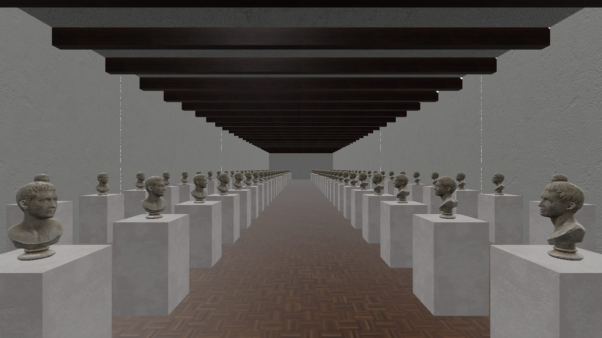

Levels of detail
================

.. rst-class:: introduction

A level-of-detail (LOD) node holds several versions of one model, from fine to
coarse, and draws the version that suits how large the model appears. A model
far from the camera then costs fewer triangles. The coarsest level can be an
*impostor*: a flat card that shows a picture of the model. OpenGLContext has
two LOD nodes. ``LOD`` chooses by distance, as VRML97 specifies.
``ScreenCoverageLOD`` chooses by the share of the window the model covers, as
glTF's ``MSFT_lod`` extension specifies.

.. _lod-demo:

Walk through it
---------------

.. code-block:: bash

   oglc-view --pack openglcontext/gallery

   The gallery from the near end of the hall. The busts near the camera are
   drawn at 17,456 triangles each, and the busts at the far end at 544. The
   rest of this page describes how the six levels between those switch.

The gallery is a hall of 120 marble busts on plinths. Each bust is a
six-level chain, from 17,456 triangles down to 544, declared with
``MSFT_lod``. The hall has a polished parquet floor, white plaster walls and
dark beams overhead. The world is CC0 art published as a :doc:`content pack
<contentpacks>` the engine publishes. ``--pack`` fetches it the first time
(12 MB, checked against the digest in the engine's registry) into the
engine's own content store and opens it from there on every later run. The
archive also opens by its URL, which unpacks it into the viewer's archive
directory instead:

.. code-block:: bash

   oglc-view https://github.com/mcfletch/openglcontext/releases/download/content-v1/gallery-world.tar.gz

Two suns shine into the hall at an angle from above the roof, and a weak
upward light stands in for light reflected from the floor. The shell of the
room (floor, walls, ceiling) is marked as :ref:`casting no shadow
<castsshadow>`, so the light reaches the room while the plinths and busts
still cast shadows. The lights are set at the illuminance the engine treats as
neutral exposure, so the world needs no exposure flag and looks the same with
or without a sky outside its walls.

Walk down the hall with the arrow keys. The busts near you are at their finest
level and the busts at the far end at their coarsest. The level depends on how
much of the window each bust covers, so the switches happen in the middle
distance, where you can walk back and forth and watch them.
``PageUp``/``PageDown`` switch between the world's two cameras: one looking
down the hall and one close to a single bust.

From the far end, with 108 busts on screen at four levels, the frame takes
**eleven draw calls**: one for each level in use, one for the plinths, one for
the beams, and a few for the room surfaces. The busts do not take a draw call
each.

.. list-table::
   :widths: auto
   :header-rows: 1

   * - On screen
     - Levels in use
     - Draws for the busts
     - Draws in the frame
   * - 108 busts
     - 4
     - 4
     - 11

The world is an ordinary glTF file. The chains use ``MSFT_lod``, the polished
floor uses ``KHR_materials_clearcoat`` and the lamps use
``KHR_lights_punctual``. Any glTF viewer opens it. A viewer that does not
support ``MSFT_lod`` draws every bust at its finest level.

To record the walk, use the world's two cameras as the start and end of a
fly-through:

.. code-block:: bash

   oglc-view --pack openglcontext/gallery \
       --capture-video walk.mp4 --fly-through --video-seconds 16

See :ref:`Recording a video <video>`.

.. _lod-choosing:

How a level is chosen
---------------------

``ScreenCoverageLOD`` chooses by **screen coverage**: the share of the
window's *height* that the object's bounding sphere spans. Coverage is
``radius / (distance × tan(fov/2))``, clamped to one. A model twice the size
keeps its detail twice as far away. A narrower field of view has the same
effect, because both make the model cover more pixels.

Each level has the coverage at which it takes over, and the values decrease
from level to level. Level *i* is drawn from its own threshold up to the
threshold of the level before it. Below the last value, nothing is drawn. To
keep a model on screen however small it gets, end its list with ``0``.

The ``MSFT_lod`` README does not define screen coverage. Babylon.js, where the
extension is implemented, compares the projected sphere's *area* with the
screen's area; this engine compares heights, as above. A threshold written for
one reads differently in the other: in a square window, an area of 0.5 is a
height of about 0.8.

Both nodes hold a level near a threshold. A node moves to a coarser level only
once the viewer is ``hysteresis`` past the threshold, as a fraction of it, and
returns to the finer level at the threshold itself. The default is 0.1: a
``range`` of 10 m hands over going out at 11 m and back coming in at 10 m, and
a coverage threshold of 0.5 hands over going out at 0.45. A viewer standing on
a threshold, or bobbing across one, then keeps one level instead of changing
level every frame. ``hysteresis`` is an attribute of the node rather than a
field, so it is not written to a file; set it to 0 to switch at the thresholds
exactly. The first choice a node makes is the plain answer.

The pass chooses the levels once a frame, for every view at once
(``FlatPass.chooseLevels``, from ``prepareViews``), before it walks the scene. A level change replaces a subtree, and the pass has to update
its flattened copy of the scenegraph before it walks it. Only the camera is
used. The shadow pass draws the same levels from a light's point of view; if
it chose levels by distance from the light, levels would change as the sun
moved.

.. _choosing-cost:

What choosing costs
~~~~~~~~~~~~~~~~~~~

The pass chooses levels for all LOD nodes in the scene at once. It stacks the
nodes' world matrices and multiplies them by the camera matrix in one
operation, then computes all distances and scales with two array expressions.
Each node's own calculation is a few 4×4 operations, and at that size one
numpy call per node costs more than the arithmetic. After that, each node
does only its own part: ``selectAt(distance, scale, tangent)`` finds which of
its thresholds the coverage falls in and signals a change only when the level
changes. ``selectFor(modelview, tangent)`` makes the same decision for a
single node.

If neither the camera nor any LOD node has moved since the last frame, and no
node's ``level``, ``range``, ``center``, ``screenCoverage`` or ``radius`` has
been set, the pass keeps last frame's choice and skips the calculation. The
scenegraph's transform cache returns the same matrix object while a node does
not move, so the check is one identity comparison per node; a field set on any
LOD node moves ``lod.level_generation()``, and the next frame chooses again. In the gallery above, with 120
LOD nodes, choosing costs 0.40 ms a frame with a still camera and 1.20 ms
without the shortcut. With the camera moving every frame, so the shortcut
never applies, it costs 0.93 ms.

.. _nodes:

The nodes
~~~~~~~~~

.. list-table::
   :widths: auto
   :header-rows: 1

   * - Node
     - Chooses by
     - Fields
   * - ``LOD``
     - Distance, as VRML97 specifies
     - ``level``, ``range``, ``center``
   * - ``ScreenCoverageLOD``
     - Screen coverage, for ``MSFT_lod``
     - ``level``, ``screenCoverage``, ``center``, ``radius``

Both nodes are in ``OpenGLContext.scenegraph.lod``, and both signal a level
change the same way a ``Switch`` does. ``center`` is the point, in the node's
own coordinates, that distance is measured to, so the distance is measured to
the model rather than to the world origin. ``radius`` is the radius used for
coverage. A ``ScreenCoverageLOD`` with ``radius`` 0 measures the finest
level's bounding sphere, and with ``center`` also at the origin it measures
distance to that sphere's centre. A node's bounding volume is the level being
drawn, and a level change updates it and the volumes of the groups above. The glTF loader takes it from the finest level's ``POSITION``
accessor bounds. glTF requires a file to declare those bounds, so a level can
be sized and placed without reading its geometry.

A malformed ``MSFT_lod`` block costs the chain, not the file. An extension
that is not an object, or ``ids`` that is not a list, leaves the node drawn at
its finest level; an id that is no node index is logged and that level left
out. ``MSFT_screencoverage`` that is not a list of finite numbers is logged
and the levels are scheduled by halving, as for a file that gives none.
Accessor bounds that are not three finite numbers are not read, and the level
is measured from its points.

.. _placement:

Where a level is drawn
~~~~~~~~~~~~~~~~~~~~~~

Every level of a chain is drawn where the node carrying the extension is. An
alternative named in ``ids`` replaces that node, so its own transform (if it
has one) is in the same parent space, not below the node. Applying both
transforms would draw a bust that is two metres down the hall at four metres,
and with a rotation involved it could be anywhere. If an alternative has a
transform of its own, the loader ignores it, draws the level at the node's
place, and logs a warning. The extension offers another version of a node, not
another place for it.

.. _instancing:

Copies batch per level
----------------------

The levels of a chain are decoded once and shared by every node that names
them. The pass groups each frame's draws by the geometry and appearance they
share. As a result, many copies of one model cost one instanced draw *per
level in use*: the copies at the finest level are one draw, and the copies at
the coarsest level are another. You do not have to declare anything for this.
See :doc:`Instanced rendering <instancing>`.

.. rst-class:: technical

A group smaller than ``OPENGLCONTEXT_INSTANCE_MIN`` copies (4 by default in
the core-profile and PBR passes) is drawn one shape at a time. Instancing has
a fixed cost per batch, and for a few shapes separate draws are cheaper.

.. _impostors:

Impostors
---------

A chain's coarsest mesh still costs triangles. A bust twenty pixels tall
spends 500 triangles on an outline that a picture would draw as well. An
**octahedral impostor** is that picture. It stores one view of the model for
each of a set of directions, packed into a single square texture (an atlas).
It is drawn on a card that faces the viewer and shows the stored view closest
to the viewer's direction.

The views are laid out by an octahedral mapping. Take an octahedron, inflate
it to a sphere of directions, cut it along its equator and unfold it flat.
Every direction then has a place on a unit square, and nearby directions land
near each other. ``OpenGLContext.scenegraph.octahedral`` holds this mapping
in Python, with no GL. ``pbr.vert`` has the same mapping in GLSL. A test holds
the two in agreement: it paints each tile of an atlas with its own address and
reads back which tile the shader chose.

A material declares an impostor. Because a field of impostors shares one
material, they are drawn in one batch:

.. code-block:: python

   "materials": [
     {"pbrMetallicRoughness": {"baseColorTexture": {"index": 4}},
      "alphaMode": "MASK",
      "extras": {"octahedralViews": 8, "octahedralHemi": true}}
   ]

``octahedralViews`` is the number of views along each side of the atlas.
The settings are in ``extras`` rather than an extension. glTF uses
``extras`` for application-specific data that other readers skip. A reader
reaches an impostor only through ``MSFT_lod``, because it is a chain's
coarsest level, and a reader without ``MSFT_lod`` draws the finest level.

``"octahedralHemi": true`` (the default) stores only the upper hemisphere of
directions and uses the whole atlas for it. Use it for an object that stands
on the ground and is never seen from below. ``"octahedralHemi": false`` stores
the whole sphere, for an object that can be seen from any side. The flag may
be written as a boolean, a number, or a word (``"false"``, ``"no"``, ``"0"``,
as a Blender custom property often holds it); anything else is logged and is
the hemisphere.

.. _impostor-size:

How big the atlas has to be
~~~~~~~~~~~~~~~~~~~~~~~~~~~

The atlas size depends on how many pixels tall the model is when the impostor
takes over. At a threshold of three per cent of a 720-line window, the model
is about twenty pixels tall. A **256-pixel atlas with eight views a side**
gives thirty-two pixels per view, which is enough. Doubling the views per side
makes the texture four times larger, for angles too fine to see at that
distance.

.. _impostor-cost:

When an impostor makes a frame faster
~~~~~~~~~~~~~~~~~~~~~~~~~~~~~~~~~~~~~

With an impostor, a chain can stop at fewer mesh levels: four mesh levels and
an impostor carry a model further than six mesh levels. In the gallery, seen
from the far end with 108 busts on screen, this removes 62% of the triangles
and one draw call:

.. list-table::
   :widths: auto
   :header-rows: 1

   * - Chain
     - Triangles in the busts
     - Draws
     - ms a frame, 1280×720
   * - 6 mesh levels
     - 103,536
     - 11
     - 4.96
   * - 6 mesh levels + an impostor
     - 90,620
     - 12
     - —
   * - 4 mesh levels + an impostor
     - 39,460
     - 10
     - 4.93

On a discrete GPU this does not make the scene faster. Both chains render at
about 200 frames a second, because geometry is not what limits the frame. The
engine's per-object processing is. The same world renders in the same 5 ms at
640×360 and at 1920×1080. A four-object scene renders in 0.59 ms and this
300-object scene in 5.06 ms: about fifteen microseconds of CPU time per object
per frame, whatever the object contains.

An impostor helps where geometry does limit the frame. The table below shows
the same two worlds on a software rasteriser, which behaves like a weak
integrated GPU:

.. list-table::
   :widths: auto
   :header-rows: 1

   * - Chain
     - ms a frame (llvmpipe, 640×360)
   * - 6 mesh levels
     - 46.8
   * - 4 mesh levels + an impostor
     - **19.1**

Here the impostor chain is two and a half times faster. Use an impostor when a
frame spends its time on vertices and fragments. Measure where the frame's
time goes before you bake one.

.. rst-class:: technical

In the gallery, the largest single cost is shadows, at **1.8 ms of the 4.96**,
most of it spent gathering the shadow casters. ``--no-shadows`` raises the
same scene from 202 to 316 frames a second.

.. _lod-authoring:

Authoring a chain
-----------------

There are two ways to make a chain: in Blender, or as a bake from Python. Both
write the same kind of file.

.. _blender:

In Blender
~~~~~~~~~~

The add-on in `openglcontext-editor
<https://github.com/mcfletch/openglcontext-editor>`__
(``OpenGLContext_editor/blender/openglcontext_lod``) adds two things to
Blender:

- an operator that cuts a chain from the selected mesh with Blender's Decimate
  modifier;

- a glTF export extension that writes the chain as ``MSFT_lod``.

With the add-on enabled, the ordinary *File > Export > glTF 2.0* writes a file
in which this engine switches levels.

The gallery world is built this way. ``oglce-gallery``, from
openglcontext-editor, fetches the CC0 art, builds the hall in Blender and
exports it with the add-on. ``--impostor 8`` also renders the finest level
from each of the atlas's directions and makes the resulting impostor the
chain's last level.

.. _baking:

As a bake
~~~~~~~~~

``OpenGLContext_editor.meshlod`` decimates a mesh into levels, measures what
each level costs to look at, and writes the chain. The coarsest level goes
inside the ``.glb`` and each finer level goes in a sidecar file, which is read
only when that level is needed. Measured thresholds give better switching
points than the halving series the loader falls back on.

.. _format:

In the file
-----------

A chain is ``MSFT_lod`` on a glTF node, with the switching thresholds in
``MSFT_screencoverage``. :ref:`Levels of detail <lod>` on the glTF page gives
an example and the rules the loader follows, including what happens to the
node's children and lights and what happens when a file leaves out the
thresholds.

.. _lod-limits:

Limits
------

- ``load_gltf`` decodes every level at load, so a chain in one ``.glb`` holds
  all of its levels in memory, whichever are on screen. ``LODAsset``
  (:ref:`Writing a chain <writing-lod>`) reads one level at a time from the
  sidecar layout the baking tools write; the render pass does not yet switch
  between levels read that way.

- The switch between levels is instant. Levels are not blended (no
  geomorphing), so a level change can be visible if you look for it. The
  decimator records the vertex correspondence that a morph between levels
  would need.

- An impostor shows the single nearest stored view, not a blend of the nearest
  few. Turning past the angle between two stored views swaps one picture for
  the next. At the size an impostor is drawn, this is hard to see. Blending the
  three nearest views would remove it.

- An impostor keeps the lighting it was baked with (an even white
  surround) and does not respond to the lights around it. A model that walks
  from daylight into a cellar keeps its daylight at the distances where the
  impostor is drawn.

- An impostor casts no shadow. Its card turns to face the camera only in the
  lit pass, so drawn from a light it would cast the flat rectangle of the quad
  it is authored as; it is left out of the shadow maps instead. The mesh levels
  before it in the chain cast as usual.

- The tile a view is read from is inset by half a texel of the atlas's own
  size, so at full resolution the filter never reads the next view. Coarser
  mipmap levels, which an impostor uses as it shrinks on screen, average
  texels on both sides of a tile edge. Leave the background round each view
  transparent (the baking tools do), so what bleeds in at the edge is nothing.

- ``MSFT_lod`` on a *material*, which the extension also allows, is not read.
