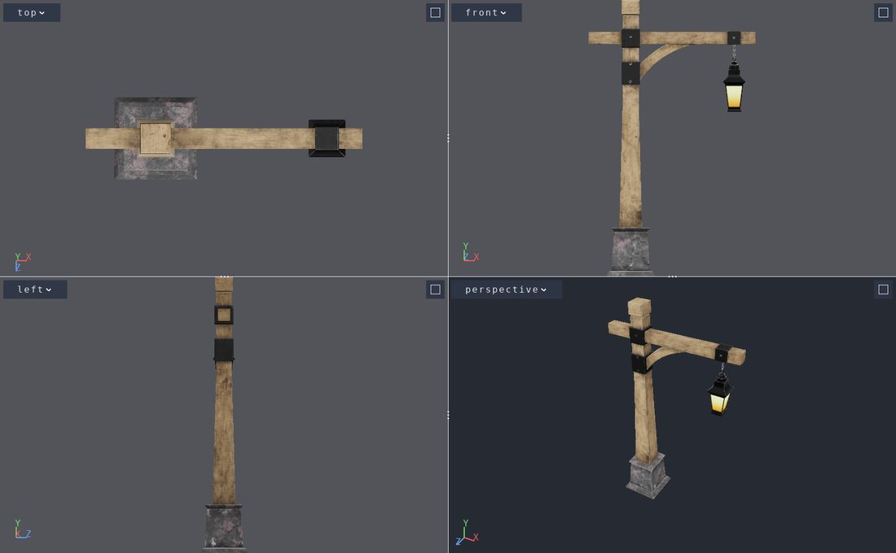

Several views on one window
===========================

.. rst-class:: introduction

A context can split its window into several views of one scene. Each view has
its own camera and projection, and a click in a view picks through that
view's camera. An editor uses this for the classic four views: top, front and
side orthographic views around a perspective one.

   ``python tests/multiview_quad.py``: top, front and left orthographic views
   and a perspective view of the same model.

There are three ways to use it, from the most packaged to the most direct:

- :ref:`MultiViewMixin <multiview-mixin>` adds one view or four to an
  existing window, with the view controls and pointer gestures included.
- :ref:`QuadView <quad-view>` and :ref:`ViewSet <view-set>` build the
  views, frame a model in them and move their cameras with the pointer, for
  an application that manages its own window.
- :ref:`ViewLayout <view-layout>` places views in the window, and nothing
  more. The application moves the cameras itself.

.. _multiview-mixin:

Four views in an existing window
--------------------------------

``OpenGLContext.multiview.mixin.MultiViewMixin`` gives a window that shows a
scene a choice of one view or four, without the window handling layouts
itself. It creates the views, the view controls and the pointer gestures.

.. code-block:: python

   from OpenGLContext.multiview.mixin import MultiViewMixin

   class Viewer(OverlayMixin, MultiViewMixin, BaseContext):
       multiViewArrangement = 'quad'        # the default is 'single'

       def OnInit(self):
           self.startViews(bounds=lambda: (scene.minimum, scene.maximum))

The perspective view has no camera of its own. It draws through the window's
camera, whatever ``getViewPlatform()`` returns, so the navigation, a bound
``Viewpoint``, a model's own cameras and a turntable all drive it as they
would drive a single view. The three orthographic views belong to the mixin.
They are framed on the bounds given to ``startViews``, and a drag in one
moves that view only.

- ``bounds`` is ``(minimum, maximum)``, or a callable that returns it. With
  no ``bounds``, the views are framed on the context's ``sceneBounds()``.
- ``elevations`` chooses which three directions the orthographic views look
  along. The default is ``('top', 'front', 'left')``.
- ``chrome=False`` leaves out the view controls, for a window that draws its
  own.
- ``toggleViews()`` switches between one view and four, and
  ``maximiseView()`` gives the active view the whole window or gives it
  back. The application binds them to keys; ``oglc-view`` binds
  ``toggleViews`` to :kbd:`v`.

Put the mixin after ``OverlayMixin`` in the bases. Each event then reaches
the view controls first, and the views get the events the controls do not
take. The view controls need ``OverlayMixin``'s overlay stack; without it the
views work but have no controls.

Each view's menu lists the scene's cameras (``window.sceneCameras()``).
Choosing one in the perspective view binds its ``Viewpoint``. Choosing one in
an orthographic view gives that view a perspective camera at that position.

``oglc-view --views quad`` opens the scene viewer this way. The Tk and wx
:doc:`embedding demos <embedding>` open in the quad, because a window with
the scene's tree beside it is used more like an editor than a viewer.

.. _view-layout:

Laying out views
----------------

These classes are in ``OpenGLContext.multiview.views``:

- A :class:`~OpenGLContext.multiview.views.View` is one camera drawn into
  one rectangle of the window. It has a camera, a name, and a
  :class:`~OpenGLContext.multiview.views.ViewStyle`.
- A ``ViewStyle`` sets how the view draws the scene: over the scene's own
  ``Background`` or over a flat colour, and shaded or as wireframe.
- A :class:`~OpenGLContext.multiview.views.ViewLayout` is an ordered list of
  views and an arrangement that places them in the window.

Assign a layout to the context's ``viewLayout``, and every frame draws it:

.. code-block:: python

   from OpenGLContext.edit.mapview import MapView, MapViewPlatform
   from OpenGLContext.multiview.views import View, ViewLayout, ViewStyle

   class Editor(BaseContext):
       def OnInit(self):
           plan = MapView(centre=(0.0, 0.0), span=400.0)
           self.viewLayout = ViewLayout.split(
               View(MapViewPlatform(plan), name='plan',
                    style=ViewStyle(background=(0.3, 0.3, 0.3))),
               View(name='angled'),
           )

A view's camera can be any object with the view platform's matrix interface:

- :class:`~OpenGLContext.move.viewplatform.ViewPlatform`
- :class:`~OpenGLContext.edit.mapview.MapViewPlatform`
- :class:`~OpenGLContext.multiview.cameras.OrthoViewPlatform`
- :class:`~OpenGLContext.edit.orbitview.OrbitViewPlatform`

A view with no camera draws through the context's own view platform, which
is whatever ``getViewPlatform()`` returns that frame. The navigation, the
bound ``Viewpoint`` and any ``self.platform = ...`` replacement then drive
that view. A context that never assigns a layout draws one such view filling
the window.

The named arrangements are:

.. list-table::
   :widths: auto
   :header-rows: 1

   * - Built with
     - Arrangement
     - Places
   * - ``ViewLayout.single(camera=None)``
     - ``'single'``
     - one view filling the window
   * - ``ViewLayout.split(first, second, fraction=0.5)``
     - ``'split'``
     - two views side by side; ``fraction`` is the first view's share of the width
   * - ``ViewLayout.split(first, second, fraction, vertical=True)``
     - ``'stack'``
     - two views, the first above the second
   * - ``ViewLayout.quad(top_left, top_right, bottom_left, bottom_right)``
     - ``'quad'``
     - four views around a centre

``layout.split_at`` holds where the named arrangements divide the window. It
is a pair of fractions, of the width and of the height measured from the top,
each clamped to 0 to 1. For a split or a stack it is the dividing line; for a
quad it is the centre. Dragging a splitter changes it.

``layout.maximise(view)`` gives one view the whole window, and calling it
again for the same view restores the layout. With no argument it acts on the
active view. A layout of one view has nothing to hide, so
``layout.can_maximise`` is False and the call leaves the layout unchanged.

For any other arrangement, pass a function that takes the window's width and
height and returns one rectangle per view, in the order of the views:

.. code-block:: python

   def picture_in_picture(width, height):
       return [(0, 0, width, height), (width - 200, height - 150, 200, 150)]

   context.viewLayout = ViewLayout([main, inset], arrangement=picture_in_picture)

Rectangles are ``(x, y, width, height)`` in window pixels, from the bottom
left, as ``glViewport`` takes them. Views are drawn in order, so a later view
is drawn over an earlier one it overlaps.

A layout holds at most ``OpenGLContext.multiview.views.MAX_VIEWS`` views,
which is 16.

How a view draws
~~~~~~~~~~~~~~~~

- ``ViewStyle(background=True)``, the default, draws the scene's bound
  ``Background`` behind the view.
- ``ViewStyle(background=(r, g, b))``, or an RGBA colour, clears the view to
  that colour instead. An orthographic editor view usually uses a flat colour
  rather than a sky.
- ``ViewStyle(wireframe=True)`` draws the view's geometry as lines.
- ``ViewStyle(grid=True)`` rules the view with the scene's grid; see
  :ref:`multiview-grid`.

When a view's rectangle changes size, its camera is given the new size. A
perspective camera then uses the rectangle's aspect ratio rather than the
window's. A :class:`~OpenGLContext.edit.mapview.MapViewPlatform` is given the
size too, and its scale is metres per pixel of its own view. A view with no
camera of its own is drawn through the context's camera with its rectangle's
aspect ratio as well; the context's camera keeps the window's size between
frames.

A node that draws differently in each view reads ``mode.view`` during its
render. It holds the :class:`~OpenGLContext.multiview.views.View` being
drawn.

.. _multiview-grid:

A grid to measure against
~~~~~~~~~~~~~~~~~~~~~~~~~

``OpenGLContext.multiview.grid.Grid`` is a node that rules each view whose
style says ``grid=True``: a line every so many units and a heavier one every
tenth, in the plane the view looks at. An elevation is ruled in its own
upright plane; a plan view and a camera that turns are ruled across the
ground (y = 0 in world coordinates).

.. code-block:: python

   from OpenGLContext.multiview.grid import Grid

   scene.children.append(Grid())
   front = View(OrthoViewPlatform(OrthoView('front')), name='front',
                style=ViewStyle(background=(0.32, 0.33, 0.35), grid=True))

Add one ``Grid`` at the top of the scene. The lines are in world coordinates
and are worked out for each view as it is drawn, so a ``Transform`` above the
node does not move them. With ``spacing`` 0, the default, each view is ruled
to its own scale: the step is 1, 2 or 5 times a power of ten, chosen to put
the lines about 24 pixels apart, so zooming changes the step rather than
crowding the lines. A ``spacing`` in world units pins the step in every view.
``colour`` and ``heavyColour`` are RGB. The grid takes no picks, casts no
shadow and adds nothing to the scene's bounds, so framing ignores it.
``MultiViewMixin`` and ``QuadView`` rule their three orthographic views, and
``oglc-view`` puts a grid in its scene, so ``oglc-view model.glb --views
quad`` shows one; a single view is not ruled.

``lines_for(view)`` in the same module answers the lines a view would be
ruled with, as world-space segments, with no GL.

Events in a view
~~~~~~~~~~~~~~~~

The context assigns each event to a view and records that view as
``event.view``:

- A pointer event belongs to the view under the pointer.
- A button press makes its view the *active* view. Every pointer event after
  it belongs to that view until the last held button is released, so a drag
  that leaves its view still goes to it. A release that never arrives does
  not keep the pointer: the capture ends when the window loses focus, when
  another arrangement is shown, and when a button that is already held is
  pressed again. ``layout.release_all()`` ends it from code.
- A wheel notch belongs to the view under the pointer, and does not change
  the active view.
- A key belongs to the active view: ``event.view`` names it, for an
  application's own key handling. The window's keyboard navigation (its
  movement modes and the arrow keys) moves the window's own camera, which is
  what a view with no camera of its own draws through, whichever view is
  active; a view with a camera of its own is moved by the pointer.
- An examine drag or a wheel notch through the window's own camera, in a view
  that is one tile of several, is measured against that tile rather than the
  whole window.

A pick is resolved through the camera of the event's view.
``event.unproject()`` returns the world point under the pointer in that view,
and ``event.modelViewMatrix``, ``event.projectionMatrix`` and
``event.viewport`` are that view's. An asynchronous pick that resolves a
frame later uses the camera as it was in the frame the click was drawn in.
``view.local(x, y)`` converts a window pixel to the view's own pixels, which
are the coordinates
:meth:`~OpenGLContext.edit.mapview.MapView.world_from_screen` takes.

``layout.active`` is the active view, and ``layout.activate(view)`` changes
it. ``layout.view_at(x, y)`` returns the view at a window pixel, and
``layout.route(event)`` performs the assignment described above.
``layout.view_of(event)`` routes an event once and records the answer as
``event.view``; an event an application builds itself needs no ``view``
attribute for this, and one that cannot be given the attribute is routed each
time it is asked about.

.. _quad-view:

Top, front and side
-------------------

Orthographic views
~~~~~~~~~~~~~~~~~~

``OrthoView`` is a plan view that can look along any axis: ``'top'``,
``'bottom'``, ``'front'``, ``'back'``, ``'left'`` or ``'right'``. The name
gives the side the camera stands on. ``'front'`` stands at +z looking down
-z, which is the view a VRML or glTF scene opens on. ``'top'`` puts -z up the
screen, as a map puts north. The projection is orthographic, and ``centre``
is a point in the world, not on the ground:

.. code-block:: python

   from OpenGLContext.multiview.cameras import OrthoView, OrthoViewPlatform

   front = OrthoView('front', centre=(0.0, 1.0, 0.0), span=4.0)
   view = View(OrthoViewPlatform(front), name='front')
   ...
   front.pan(dx, dy, view.size)                     # a drag, in view pixels
   front.zoom(0.8, at=view.local(x, y), viewport=view.size)
   point = front.world_from_screen(*view.local(x, y), view.size)

- ``span`` is how many world units fit down the view.
- ``depth`` is how far the view reaches along its axis, half in front of the
  centre and half behind.
- The pointer conversions work in the view's plane through the centre. A
  point dragged in the front view moves in x and y and keeps its z.
- ``frame(minimum, maximum, viewport)`` fits a box in the view.

``MapView`` is the ``'top'`` view with its centre given as a map's
``(x, z)``.

The quad
~~~~~~~~

``OpenGLContext.multiview.quad.QuadView`` builds an editor's four views:
three orthographic views around an ``OrbitView`` in perspective. By default
the orthographic views are the top, the front and the left. ``QuadView``:

- builds the :class:`~OpenGLContext.multiview.views.ViewLayout`,
- frames a box in all four views,
- and moves the cameras with the pointer. A right or middle drag pans an
  orthographic view. In the perspective view a right drag orbits and a
  middle drag pans. The wheel zooms the view under the pointer.

The left button is left for the application; see :ref:`view-navigation`.

.. code-block:: python

   from OpenGLContext.multiview.quad import QuadView

   class Editor(BaseContext):
       def OnInit(self):
           self.quad = QuadView()
           self.viewLayout = self.quad.layout
           self.quad.layout.arrange(*self.getViewPort())
           self.quad.frame(minimum, maximum)

       def ProcessEvent(self, event):
           if self.quad.handle(event):
               self.triggerRedraw(1)
               return None
           return super(Editor, self).ProcessEvent(event)

- ``QuadView(directions=('front', 'right', 'bottom'))`` chooses other
  orthographic views.
- ``background`` is the flat colour the orthographic views clear to. The
  perspective view draws the scene's own ``Background``.
- ``press``, ``drag``, ``release`` and ``wheel`` perform the same gestures,
  for an application that reads the pointer another way.
- ``OrbitView`` takes ``nearest`` and ``furthest``, the closest and furthest
  it can be dollied, and ``frame_box`` fits a whole object rather than an
  area of ground. ``QuadView.frame`` sets all three from the box.
- ``lowest`` and ``highest`` are the pitches the orbit is limited to, in
  degrees above the horizontal. ``QuadView``'s perspective view can go below
  the model as well as above it.

``python tests/multiview_quad.py model.glb`` shows any glTF model in the four
views; :doc:`tutorials/multiview_quad` walks through it.

The perspective view's opening camera
~~~~~~~~~~~~~~~~~~~~~~~~~~~~~~~~~~~~~

The perspective view opens thirty degrees round from the front
(``quad.OPENING_HEADING``) and above the model, so it shows a side the three
orthographic views do not. A scene that has cameras opens through one of
them instead. Pass the scene's cameras (see :ref:`scene-cameras`) to
``cameras_found(cameras)``. The first time the list is not empty, the quad
points the perspective view through the camera that ``choose_camera``
selects:

.. code-block:: python

   from OpenGLContext.multiview.viewpoints import scene_cameras

   def by_name(cameras):
       return next((camera for camera in cameras if camera.name == 'Overview'), None)

   class Editor(BaseContext):
       def OnInit(self):
           self.quad = QuadView(choose_camera=by_name)
           ...

       def OnViewpointsChanged(self, paths):
           self.quad.cameras_found(scene_cameras(self.getSceneGraph()))

``choose_camera`` receives the cameras in the order the scene declares them,
and returns one, or None to keep the thirty-degree view. The default returns
the first, as VRML97 binds its first ``Viewpoint``. Later calls to
``cameras_found`` only store the list, for the views' menus, so a view the
user has moved stays where it is.

``quad.look_through(camera)`` points the perspective view through a camera at
any time. The view takes the camera's position and field of view, and orbits
the point ahead of the camera that is nearest the middle of the framed box.
The orbit keeps the world's up direction up the screen, so a camera's roll is
dropped.

.. _view-set:

Arrangements of one set of views
--------------------------------

A window that offers several arrangements keeps one set of cameras and
changes which of them are on screen. ``ViewSet`` holds the views, a layout
per arrangement, the gestures and the framing:

.. code-block:: python

   from OpenGLContext.multiview import ViewSet

   views = ViewSet([plan, front, left, angled],
                   arrangements={'map': ('plan',),
                                 'angled': ('angled',),
                                 'split': ('plan', 'angled'),
                                 'quad': ('plan', 'front', 'left', 'angled')},
                   driven=('front', 'left', 'angled'))
   context.viewLayout = views.show('quad')

An arrangement lists the views it shows, in order. The number of views
decides the placement: one fills the window, two go side by side, and four go
around a centre. With no ``arrangements`` given, each view is offered alone
under its own name, the first two as ``'split'``, and the first four as
``'quad'``.

- ``show(name)`` switches arrangement and returns its layout. Assign that
  layout to ``viewLayout``, because the context draws the layout it is
  given.
- The cameras are shared between arrangements, so after a switch each view
  still shows what it showed before.
- ``arrange(width, height)`` places the views and gives each camera the size
  of its own rectangle.
- ``size(view)`` returns that size, or the window's size for a view the
  current arrangement hides, so a view can be framed before it is shown.
- ``frame(minimum, maximum)`` fits a box in every view. An orthographic or
  perspective camera fits the box; a plan camera fits the ground under it.
- ``maximise(view)`` gives one view the whole window, and the same call
  restores the arrangement.
- ``driven`` names the views whose cameras the pointer moves. A window that
  moves a view's camera itself, such as an editor whose drawing tools work in
  its plan view, leaves that view out, and ``handle(event)`` ignores events
  in it.
- ``view_for(event)`` returns the view an event belongs to, for deciding
  what else should receive it.

glisteel-editor builds its four arrangements this way.

.. _view-navigation:

What the pointer does in a view
-------------------------------

Each view has its own navigation: the gestures that move its camera, and the
bindings that map buttons to them. ``view.navigation`` is a
:class:`~OpenGLContext.multiview.navigation.ViewNavigation`, created for the
camera the first time it is read.

.. list-table::
   :widths: auto
   :header-rows: 1

   * - Command
     - Does
     - Bound by default to
   * - ``pan``
     - moves the world with the pointer. A camera that turns moves the point it
       is looking at
     - the right and middle buttons in a view with a scale; the middle button
       in a view whose camera turns
   * - ``rotate``
     - swings a camera that turns around the point it is looking at
     - the right button, where the camera turns
   * - ``zoomin`` / ``zoomout``
     - moves one notch towards the scene or away from it, about the pointer in
       a view with a scale
     - the wheel
   * - ``zoomdrag``
     - the same zoom, driven by a drag; dragging up moves closer
     - nothing by default

The primary (left) button is unbound in every view. An editor's tools and
its selection use it. A window with no tools can bind it with one call.

The bindings are :class:`~OpenGLContext.move.modes.KeyBinding` nodes, the
same kind the :doc:`movement modes <navigation>` use, and a mouse button is
named as the event system names it. They are rebound like any other command
and saved in the same bindings file:

.. code-block:: python

   from OpenGLContext.multiview.navigation import PAN, ROTATE, ZOOM_DRAG

   navigation = view.navigation
   navigation.rebind(ROTATE, ['<mouse-0>'])        # left-drag turns this view
   navigation.rebind(PAN, ['<mouse-2>'])           # ...and the right one pans it
   navigation.rebind(ZOOM_DRAG, ['<mouse-1>'])     # middle-drag zooms
   navigation.rebind(PAN, [])                      # this view does not pan

- ``commands()`` returns the commands this view's camera supports, so a
  control can list those. ``rebind`` returns False for a command the
  camera does not support.
- ``binding_table()`` returns the bindings for a settings screen.
- When two bindings claim one button, the first declared wins. A rebinding
  screen asks the user whether to take the button from the other command.

A complete set of bindings is a *mode*
(:class:`~OpenGLContext.multiview.navigation.ViewNavigationMode`). A view
with a scale starts with ``plan_mode()``, and a view whose camera turns
starts with ``examine_mode()``. ``ViewNavigation(view, mode=...)`` gives a
view a different mode.

Gestures without a view set
~~~~~~~~~~~~~~~~~~~~~~~~~~~

An application with its own layout can use the gestures alone.
``ViewGestures`` moves the camera of the view an event lands in, and
``views`` lists the views it drives. Views the application moves itself are
left out:

.. code-block:: python

   from OpenGLContext.multiview.gestures import ViewGestures

   gestures = ViewGestures(layout, views=[elevation, angled])
   ...
   def ProcessEvent(self, event):
       if gestures.handle(event):          # never takes an event in `plan`
           self.triggerRedraw(1)
           return None
       return super(Editor, self).ProcessEvent(event)

Each event goes to the navigation of the view it lands in, so each view's
own bindings apply. ``layout`` and ``views`` can both be reassigned, so a
window that rearranges its views passes the new layout in.

View controls
-------------

A window of several views needs to show which view is which, which way each
one looks, and how to operate it.
``OpenGLContext.ui.viewchrome.ViewChrome`` draws these controls inside each
view and handles clicks on them:

.. code-block:: python

   from OpenGLContext.ui.viewchrome import ViewChrome

   def placeViews():
       views.arrange(*self.getViewPort())
       self.overlays.invalidate()
       self.triggerRedraw(1)

   self.chrome = ViewChrome(layout=views.layout, stack=self.overlays,
                            on_arrange=placeViews)
   self.overlays.push(self.chrome)

In each view it draws:

- the view's name on a button with a caret, which opens the view's menu;
- an axis triad that turns with the camera, in a view that has a camera of
  its own. ``MultiViewMixin``'s perspective view draws through the window's
  own camera and has no triad;
- a button that shows the view on its own or restores the arrangement. It
  shows an outline when it will show the view alone and four tiles when it
  will restore. An arrangement of one view has no such button.

Between the views it draws a splitter on each dividing line, and in a quad a
handle where the two lines cross, which moves both. The icons are drawn in
code, so an application needs no artwork for them. ``on_arrange`` is called
when a control changes what is on screen, so the window can place its views
again and redraw. ``MultiViewMixin`` passes its own ``viewsArranged``, which
does that.

The view's menu has these entries:

- View - the direction the view looks (front, back, right, left, top,
  bottom), and ``perspective`` or ``ortho``. ``ortho`` draws a camera that
  turns without perspective, so two objects of one size measure the same
  wherever they stand. Absent for a view drawn through the window's own
  camera.
- Cameras - the scene's own cameras, where ``cameras`` supplies them:
  a list of ``SceneCamera``, or a callable that returns one and is called
  each time the menu opens. Choosing one points the view through it.
- Rendering - shaded or wireframe.
- Zoom to fit - present when the window passed ``bounds``.
- Single tile, or Four tiles when the view already fills the window.
  Neither appears in an arrangement of one view.

The first three open submenus beside their rows. The menu hangs below the
name, or sits over it in a view with no room below. Each row has a letter
that runs it (see :ref:`Menus <menus>`).

Pointing a view in a new direction may replace its camera
(``multiview.cameras.point_view``). A window that relies on a particular
camera object, such as an editor whose tools read its plan view, should keep
that view out of the menu with ``only``.

``ViewChrome`` is a non-modal panel at the bottom of the overlay stack, like
the tool palette. A press that misses its controls reaches the scene. It
draws no background of its own, so nothing is washed over.

Every part is optional. ``labels``, ``axes``, ``expand`` and ``splitters``
turn one kind of control off for the whole window. ``only`` gives one view
its own set. Here the ``map`` view gets the maximise button and nothing
else:

.. code-block:: python

   ViewChrome(layout=layout, axes=False,
              only={'map': ('expand',)},
              bounds=lambda: (scene.minimum, scene.maximum))

``reserved`` is the room other furniture takes at each edge of the window:
top, right, bottom and left, in reference pixels, as for a
:class:`~OpenGLContext.ui.hudwidgets.HUDLayer`. The controls are placed
inside it, so a view's name is not drawn under a menu bar or behind a tool
palette.

``axis_directions(view)`` returns the screen direction of each world axis in
a view, as unit vectors in the view's own pixels, or None for a view with no
camera. The axis triad is drawn from it.

.. _scene-cameras:

The scene's cameras
-------------------

A VRML97 world declares its cameras as ``Viewpoint`` nodes. The glTF loader
builds a ``Viewpoint`` for each camera a file defines (``scene.viewpoints``,
mounted beside ``scene.group``), so views treat both formats the same way.

The render pass keeps a path to every ``Viewpoint`` in the scene as nodes are
added and removed. Each frame it stores those paths on the scenegraph as
``SceneGraph.viewpointPaths``. On the frame the set changes, such as when a
world loads or a camera is added, it calls the context's
``OnViewpointsChanged(paths)``. The default implementation does nothing.

``OpenGLContext.multiview.viewpoints.scene_cameras(scenegraph)`` returns
those paths as ``SceneCamera`` records, in the order the pass found them.
Each record has:

- ``name`` - the ``description``, else the ``DEF`` name, else ``Camera 1``,
  ``Camera 2`` and so on;
- ``position``, ``forward`` and ``up``, in world coordinates;
- ``fov``, the vertical field of view in radians;
- ``viewpoint``, the node, and ``path``, its path.

A ``Viewpoint`` inside a ``Transform`` is reported where that transform puts
it. The list is empty until the first frame has been drawn, because the
render pass finds the cameras.

``look_through(view, camera)`` points a view through a camera. A view with a
camera of its own is given a perspective ``OrbitView`` at the camera's
position. A view drawn through the window's camera binds the ``Viewpoint``
instead, and the render pass moves the window's camera to it.
``first_camera(cameras)`` returns the first camera, which a VRML97 browser
binds when it loads a world.

Sharing between views
---------------------

The scene is walked once per frame. Each view then culls the walk's results
against its own frustum, sorts what is left, and draws it through its own
camera. Work that depends only on the scene is done once for all views:

- Level of detail - one level is chosen per frame, because choosing a level
  replaces part of the scene. Each LOD node draws the finest level any view
  needs. An orthographic view measures coverage by the height of the world
  it shows rather than by distance. Zooming a map out coarsens its detail;
  moving its camera does not.
- Shadow maps - rendered once and read by every view. Spot and point light
  maps depend only on their light. A directional light's cascades are fitted
  to the active view, or, where the active view shows nothing that casts a
  shadow, to the first view that does. Other views read the same cascades,
  using the finest cascade that contains each fragment. Ground that another
  view shows outside every cascade is drawn unshadowed.
- Shadowed lights - a spot or point light keeps its shadow while any view
  can see its range, and every one keeps it while the scene has a mirror, since
  a mirror may show a light no view looks at.
- Bloom - blurs and composites each view inside its own rectangle, so a
  bright object at the edge of one view does not glow into the next. What no
  view covers is cleared to black, as it is without bloom.
- Transparency - transparent shapes are sorted back to front for each view's
  own camera.

Content kept loaded around the viewer, such as streamed 3D Tiles or a
vegetation field, has to cover every view.
``layout.cameras(default=context.getViewPlatform())`` lists each camera
once, for the application to pass to that content.

Drawing strategies
------------------

There are three ways to draw several views. The one a context uses depends on
its driver. ``OpenGLContext.multiview.strategy.MultiviewCapabilities`` reads
the GL version, the extension list and ``GL_MAX_VIEWPORTS`` once per GL
context and chooses:

.. list-table::
   :widths: auto
   :header-rows: 1

   * - Strategy
     - Needs
     - How a draw reaches its views
   * - ``vertex``
     - GL 4.1, and ``GL_ARB_shader_viewport_layer_array`` or
       ``GL_AMD_vertex_shader_viewport_index``
     - one instanced draw, the vertex shader writing ``gl_ViewportIndex``
   * - ``geometry``
     - viewport arrays (GL 4.1, or ``GL_ARB_viewport_array``) and
       instanced geometry shaders (GL 4.0, or ``GL_ARB_gpu_shader5``)
     - one draw, a geometry shader emitting each primitive to its views
   * - ``sequential``
     - GL 3.3
     - the scene drawn once per view, with the viewport and scissor set between

``sequential`` runs on every driver the engine supports, in both profiles,
and submits the scene once per view. The other two submit the opaque scene
once, whatever the number of views. A GL 4.1 driver without the vertex-shader
extension, such as Apple silicon's, uses ``geometry``. The strategy chosen is
logged at start-up.

``ContextDefinition.multiview`` (env: ``OPENGLCONTEXT_MULTIVIEW``) selects a
strategy by name: ``auto``, ``vertex``, ``geometry`` or ``sequential``. This
lets each be run and compared on one machine. ``auto`` uses the fastest that
can run. If the requested strategy cannot run, a warning is logged and the
best strategy that can run is used. The field can be changed while the window
is open, and the settings screen offers it: the next frame draws with the
strategy it names. The environment variable is read once, the first time the
strategy is chosen.

A driver can offer a strategy and then fail to compile its programs. The
failure is logged, and the frame in which it happens draws each view in turn.
From the next frame the context uses the next strategy in the table, and it
does not try the failed one again. ``sequential`` compiles no programs of its
own, so it is always available as the last fallback. A layout with more
views than the driver's ``GL_MAX_VIEWPORTS`` is drawn with ``sequential``
while it has that many views. GL 4.1 and ``GL_ARB_viewport_array`` both
guarantee at least 16.

Measuring the cost
~~~~~~~~~~~~~~~~~~

``scripts/multiview_bench.py`` draws a scene through one view and through
the four-view quad, under each strategy the driver supports. It reports the
median frame time and the draw calls for each:

.. code-block:: console

   $ scripts/multiview_bench.py --model lantern.glb
   $ scripts/multiview_bench.py --boxes 400 --frames 60

At 1280x960 on a Radeon 8060S (Mesa radeonsi), relative to a single view:

.. list-table::
   :widths: auto
   :header-rows: 1

   * - Four views of
     - ``vertex``
     - ``geometry``
     - ``sequential``
   * - one glTF model
     - 1.40x
     - 1.43x
     - 1.58x
   * - 400 separately drawn shapes (400 draws per view)
     - 1.21x
     - 1.24x
     - 2.41x
   * - the same 400 shapes as one instanced draw
     - 1.34x
     - 1.40x
     - 2.08x

A shared strategy issues one draw for four views where ``sequential`` issues
four. The extra cost over a single view is rasterising three more views, not
submitting the scene three more times.

One submission for every view
-----------------------------

The shared submission is made as the active view would make it alone: the
same modelview matrices, lights and shadow matrices, in the active camera's
eye space. A table of views, one record per view, carries each triangle on to
the other views. Each record holds the matrix from the active camera's eye
space to the view's clip space, the position of the view's camera, and how
the view reads the shadow cascades. With ``geometry``, a geometry stage
generated from the lit vertex shader emits each triangle once per view in the
draw's mask. With ``vertex``, the draw is instanced once per view and the
vertex stage routes each copy. The lit programs are compiled a second time
for this, the first time a layout of several views is drawn; the single-view
programs are unchanged. They are compiled for the next power of two of views,
at least two, and serve any draw of up to that many, since the mask names only
the views drawn: a layout whose count of views changes compiles again only when
the count passes the next power of two. The mirror views of
:doc:`reflections` ask for programs compiled for as many views as their budget
allows, so the count of mirrors in view never triggers a compile after the
first frame with mirrors.

A shape takes part when its geometry draws with the pass's lit programs
alone, or with a program of its own compiled for shared draws. ``Box``,
``Sphere``, ``Cone``, ``Cylinder``, ``IndexedFaceSet``, a glTF mesh of
triangles, terrain ground and the instanced vegetation (cards, clumps and near
meshes) do. In a shared draw every vegetation card faces the active view's
camera; its fades and fog are measured from each view's own. Everything else is
drawn once per view, as ``sequential`` draws it:

- transparent and glass shapes, which are sorted and refracted per view;
- everything in a wireframe view, because polygon mode applies to every
  viewport at once;
- an appearance with its own GLSL program;
- an octahedral impostor;
- point and line sets;
- instanced sets that cull their own placements;
- nodes that draw with programs of their own not compiled for it, such as
  particles and text;
- mirrors, which read a different reflection in each view.

The same submission draws a frame's :doc:`reflections <reflections>`: each
mirror seen from each view is a view of its own, drawn into a tile of the
reflection atlas, and one shared submission reaches every mirror view that
sees a shape, whatever the number of mirrors.

A node with a program of its own joins by declaring ``multiviewShared = True``
and drawing with the form of its program that
``OpenGLContext.scenegraph.instancedgl.ViewPrograms`` answers for the draw in
progress: its vertex shader includes ``_multiview_inc.glsl`` and ends with
``routeToView`` under ``MULTIVIEW_VERTEX``, ``ViewPrograms.apply_views`` says
which views the draw reaches, and an instanced draw multiplies its count by what
``instancedgl.view_copies`` answers.

A geometry node joins the shared submission by declaring
``multiviewShared = True`` and issuing its draw through
``OpenGLContext.multiview.strategy.draw_arrays`` or ``draw_elements``. These
instance the draw once per view while a ``vertex`` submission is being made.
``OpenGLContext.scenegraph.geometryarrays.render_geometry`` does both for a
node drawn from ``GeometryArrays``. A node that sets its detail by distance
from the camera reads ``mode.viewerEyes`` during a shared draw: the positions
of the cameras the draw serves, in the eye space it is drawn in. See
``OpenGLContext.scenegraph.tessellationlod.lod_level``.
