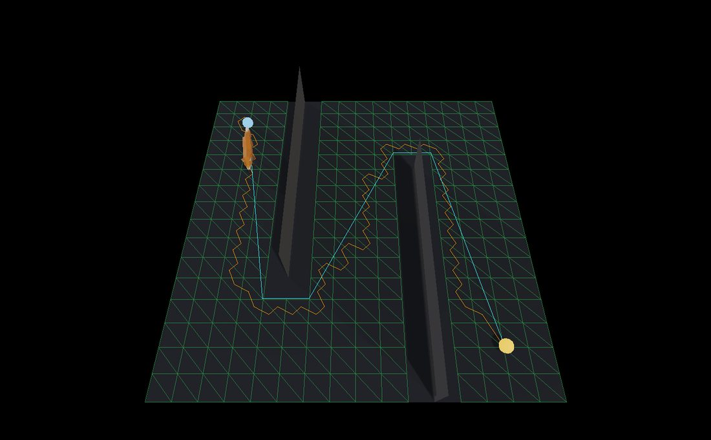

Navigation Meshes
=================

.. rst-class:: introduction

A **navigation mesh** is the floor, minus everything nobody can walk on, cut
into cells that know their neighbours. Give it two points and it answers with
a route. ``OpenGLContext.nav.navmesh`` builds one out of a level's *collision
mesh* — the triangles a character's capsule is already tested against — and
searches it.

.. code-block:: python

   from OpenGLContext.nav import navmesh

   navmesh.build(points, triangles)   # walkable cells out of a triangle soup
   navmesh.from_world(world)          # the same, from a physics world
   mesh.cell_at(point)                # which cell a point stands on
   mesh.path(start, goal)             # the route, pulled taut
   mesh.corridor(start, goal)         # the cells it crosses
   mesh.visible(here, there)          # can a body walk straight between them
   mesh.random_point()                # somewhere to go

Generated at load time, not baked beside the level
--------------------------------------------------

The mesh is derived from geometry that is already in memory when the level is,
rather than read from navigation data shipped alongside it. Three things
follow from that, and they are the reason it is built this way:

- **Levels nobody baked still navigate.** Any map that loads into a collision
  world has a navmesh, whatever tools it was made with.

- **It follows the geometry.** Change the floor, move a wall, load a different
  map, and the next build describes what is there now — there is no second file
  to keep in step.

- **It depends on no content we may not read.** The input is the collision mesh,
  which the engine owns.

The cost is paid at load: build time is proportional to the triangles handed
in, and the result is held in memory as arrays.

.. _building:

Building it
-----------

``build(points, triangles, max_slope, clearance)``
~~~~~~~~~~~~~~~~~~~~~~~~~~~~~~~~~~~~~~~~~~~~~~~~~~

``points`` is ``(N, 3)`` world positions in metres and ``triangles`` is ``(M,
3)`` indices into them — a triangle soup, which is what a level's collision
geometry is. The answer is a ``NavMesh``, and ``len(mesh)`` is how many
walkable cells it found.

A triangle becomes a cell when it faces upward and is no steeper than
``max_slope``. Facing upward is separate from being flat: a downward-facing
triangle is a ceiling however level it is, and is dropped.

Cells are joined into neighbours **by shared edge, matched on position**
rather than on vertex index. A collision mesh is a soup in which the same
corner arrives once per triangle that touches it, each time with a different
index, so matching indices would leave every cell an island. Positions are
welded on a 0.1 mm grid — below anything a level distinguishes, above the
drift of transforming a mesh into world space. The shared edge between two
neighbours is kept as a **portal**, which is what the string pull later runs
the line through.

``from_world(world, max_slope, clearance)``
~~~~~~~~~~~~~~~~~~~~~~~~~~~~~~~~~~~~~~~~~~~

The seam a game uses. It walks the bodies of an ``omi_physics`` world, takes
every static trimesh collider, offsets each by its body's position, and builds
one mesh from all of them. The character walks on the collision mesh, so the
navmesh comes from the collision mesh: a second description of the same
geometry is a second description that can disagree.

A world with no static trimesh in it gives an empty ``NavMesh`` rather than an
error — ``len(mesh) == 0``, and every query against it answers "nowhere".

.. _numbers:

The numbers, and where a game's own answers live
~~~~~~~~~~~~~~~~~~~~~~~~~~~~~~~~~~~~~~~~~~~~~~~~

.. list-table::
   :widths: auto
   :header-rows: 1

   * - Name
     - Default
     - Unit
     - What it decides
   * - ``DEFAULT_MAX_SLOPE``
     - 50.0
     - degrees from horizontal
     - The steepest triangle that becomes a cell.
   * - ``DEFAULT_CLEARANCE``
     - 0.0
     - metres of headroom
     - How much room over a cell a body needs; 0 asks no question.
   * - ``STAND_REACH``
     - 2.5
     - metres
     - How far below a point ``cell_at`` looks for its floor.
   * - ``STAND_TOLERANCE``
     - 0.5
     - metres
     - How far *above* a point its floor may be and still count.

**A navmesh is built for a particular body.** The slope one character can
climb is not the slope another can, so ``max_slope`` is an argument rather
than a constant, and a game passes its avatar's own
``CharacterCapabilities.maxSlope`` — which is likewise 50 degrees until a game
says otherwise, and is the same number the walking code asks of a surface
before it will stand on it. See :doc:`Physics <physics>` for the rest of that
body's description.

``clearance`` is what makes a wall an obstacle. A wall contributes no walkable
triangles of its own, so the floor either side of it is floor, and without a
headroom test the two halves are joined straight through it. The test overlaps
a cell's bounding box against the unwalkable triangles' boxes, because a wall
in a level is a plane of zero thickness that a point test passes through. It
removes the floor immediately against a wall as well, which is right: a body
has a radius and cannot stand there.

It is **off by default**, at ``clearance=0.0``, because comparing bounding
boxes is blunt on the large triangles a real level's walls are made of: on the
``oa_dm1`` map it removes 1092 of 1220 floor cells, most of them nowhere near
a wall. On small, axis-aligned geometry it is exact, and a caller who knows
their geometry passes the height their body needs. Everyone else gets the
whole walkable floor.

.. _asking:

Asking it things
----------------

``cell_at(point, reach, below)``
~~~~~~~~~~~~~~~~~~~~~~~~~~~~~~~~

The cell a point is standing on, as an index into ``mesh.cells``, or ``None``.
The cell *under* the point: height is what tells two floors stacked over one
another apart, so a gallery and the hall beneath it give different answers for
the same ``(x, z)``. A point more than ``reach`` above any floor belongs to no
cell, which is how a point in mid-air over a pit avoids binding to the bottom
of it. A little below counts too, by ``below``, since a capsule's centre sits
above the floor and a sloped plane runs either side of a sample taken from the
triangle next door.

``path(start, goal)``
~~~~~~~~~~~~~~~~~~~~~

A list of ``(x, y, z)`` points to walk, starting at ``start`` and ending at
``goal``. A\* over the cells finds the :ref:`corridor <corridor>`, the
corridor is :ref:`pulled taut <pull>` through its portals, and the taut line
then drops every corner the mesh lets it see past.

An **empty list** is the answer when either end is off the mesh or nothing
connects them. That is a normal reply rather than an error: a bot on a ledge
with no way down has nowhere to walk and should do something else.

.. _corridor:

``corridor(start, goal)``
~~~~~~~~~~~~~~~~~~~~~~~~~

The cells a route crosses, in order, as indices into ``mesh.cells``; empty on
the same terms as ``path()``. Each cell shares an edge with the next, so
``mesh.portals[(here, there)]`` gives the gate between any two of them and a
caller can walk the corridor itself — to draw the search, to ask which rooms a
route passes through, or to hold a bot's corridor and re-pull it as the bot
moves. A caller who just wants somewhere to walk wants ``path()``.

.. _visible:

``visible(start, goal, reach, below)``
~~~~~~~~~~~~~~~~~~~~~~~~~~~~~~~~~~~~~~

Whether a body could walk *straight* from one point to the other: ``True``
when an unbroken run of cells covers the line between them, so a wall, a pit
and the edge of the floor all stop it and a ramp does not. The run is walked
over the mesh rather than measured in the plane, which is what keeps one
storey's answer off another's — a line drawn over a floor below is not a line
along it.

It is what a bot asks before it pays for a whole path, and it is what
``path()`` asks in order to drop a corner nothing is standing behind.

``random_point(seed)``
~~~~~~~~~~~~~~~~~~~~~~

A cell centre, drawn at random — what a bot with no orders walks toward. With
a ``seed`` it is one fixed answer, so a match replays from its inputs. Without
one it draws from the session's navigation entropy stream, which advances: a
bot asking twice wants somewhere else to go.

.. _pull:

The string pull
~~~~~~~~~~~~~~~

A\* answers with cells, and the obvious route through cells is their centres.
That route zigzags: triangle centres are not on the line anybody would walk,
so a bot crossing an empty room walks a staircase and rounds corners that are
not there.

The pull runs a funnel through the portals instead. Two edges of a cone are
narrowed by each portal in turn and a corner is planted where they cross,
which leaves a line that touches the geometry only where the geometry actually
turns it — and on open floor collapses to two points, start and goal.

It is a **horizontal** operation. Height comes from the portals the line
passes through, so a route up a ramp climbs with it; what is pulled straight
is the plan.

**A funnel is taut inside its corridor and no further**, so which cells the
search picked is part of the answer rather than a detail beneath it. Between
any two cells there are many equally short runs of cells — over a grid of
triangles a staircase costs the same by its two sides as by its diagonal — and
a corridor settled by whichever of them the queue reached first is a route
that crosses a room to a wall and then follows the wall along. Two things keep
the line straight:

- **The search costs a step** by how much further a walker has to go to reach
  the portal it leaves by, measured to the *nearest point* on that portal.
  Measured to the middle of the portal instead, or between cell centres, a
  diagonal costs the same as the two sides of it and the tie decides the route.

- **The pulled line then drops every corner it can see past**, by
  :ref:`visible() <visible>`. A corner stands either against the geometry or
  against the corridor, and only the first kind is a corner a walker has to
  make. Each corner kept is the furthest one still in sight of the last, which
  can only shorten the route.

.. _navmesh-demo:

Seeing it work
--------------

   ``python tests/navmesh_demo.py`` — a 16 m room whose two walls make the way
   through a zigzag. The green wireframe is the navmesh: 416 walkable cells out
   of the 516 triangles of floor and wall handed to ``build()``, with the dark
   bands beside each wall the cells ``clearance=1.8`` removed. Amber is the
   corridor drawn cell centre by cell centre, cyan the same corridor
   string-pulled. Press ``g`` for the next goal, ``r`` for a random one.

Each re-path prints how many cells the corridor runs through and what the pull
saved:

.. code-block:: bash

   $ python tests/navmesh_demo.py
   navmesh 416 walkable cells from 516 triangles (max slope 50.0 degrees, clearance 1.8 m)
   goal (14.0, 14.0) | corridor 77 cells
     centres 79 points 48.82 m -> pulled 6 points 33.34 m (-31.7%)

Seventy-nine points of zigzag become six, and the walk is 15.5 m shorter. The
six are the two ends of the room and the four corners the two walls actually
turn the route through: out of the left room round the end of the first wall,
across the channel between them on the diagonal, and out round the end of the
second.

.. _using:

Using it
--------

From triangles in hand:

.. code-block:: python

   import numpy as np
   from OpenGLContext.nav import navmesh

   # A four-metre floor, as two triangles wound to face up.
   points = np.array([(0, 0, 0), (4, 0, 0), (4, 0, 4), (0, 0, 4)], dtype='d')
   triangles = np.array([(0, 2, 1), (0, 3, 2)], dtype='i')

   mesh = navmesh.build(points, triangles)
   len(mesh)                             # 2
   mesh.cell_at((1.0, 0.0, 1.0))         # 0
   mesh.cell_at((9.0, 0.0, 9.0))         # None -- off the mesh
   mesh.path((0.5, 0.0, 0.5), (0.5, 0.0, 3.5))
   # [(0.5, 0.0, 0.5), (0.5, 0.0, 3.5)]

From a loaded level, which is the usual way:

.. code-block:: python

   from omi_physics import model
   from omi_physics.world import PhysicsWorld
   from OpenGLContext.nav import navmesh

   world = PhysicsWorld(gravity=model.Gravity(gravity=9.81, direction=(0, -1, 0)))
   shape = world.add_shape(model.Shape.trimesh(points, triangles))
   world.add_body(model.Motion(type=model.STATIC),
                  collider=model.Collider(shape=shape), position=(0, 0, 0))

   mesh = navmesh.from_world(world, max_slope=50.0)
   len(mesh)                             # 2 -- the same floor, found in the world
   mesh.random_point(seed=3)             # (2.6666666666666665, 0.0, 1.3333333333333333)

A bot then asks ``mesh.path(bot.position, mesh.random_point())`` whenever it
wants somewhere new to be. Build once per level, hold the ``NavMesh``, and
call ``path()`` per decision rather than per frame: a bot follows the points
it was given until it wants somewhere else.

Limits
------

- **A cell is one triangle.** Neighbouring walkable triangles are not merged
  into larger convex regions, so the search runs over as many cells as the floor
  has triangles. Merging is an optimisation for a level whose cell count costs
  something, and it changes nothing above the interface.

- **The mesh is static.** It describes the geometry it was built from. A door
  that opens, a bridge that falls or a crate that is pushed is not in it until
  the mesh is built again.

- **A body's radius is not carried.** What keeps a route off the walls is the
  ``clearance`` test removing the cells against them, which is a property of the
  build rather than of the character asking for the path.

- **Headroom is measured between bounding boxes**, which is exact on small
  axis-aligned geometry and coarse on the large triangles a level's walls are
  cut from. What a real level wants is a blocker's distance from the cell; until
  that is written, ``clearance`` is left at 0 and the whole walkable floor is
  returned.

- **Cost is distance.** A step is weighed by how far a walker travels to reach
  the portal it leaves by, so the route is the shortest one. Danger, cover and
  terrain a character would rather avoid are not in the weights.

- **The route is short rather than shortest.** The corridor is chosen by a cost
  measured to the nearest point on each portal, and the taut line through it is
  then freed of the corners it can see past. On a floor cut into triangles that
  lands on the line a person would take; it is not a proof of the shortest walk
  across the room.

- ``cell_at`` scans the cells. The lookup narrows by footprint box across the
  whole mesh before testing the few that survive, so it is linear in the cell
  count; a level large enough for that to matter wants an index over the cells.
