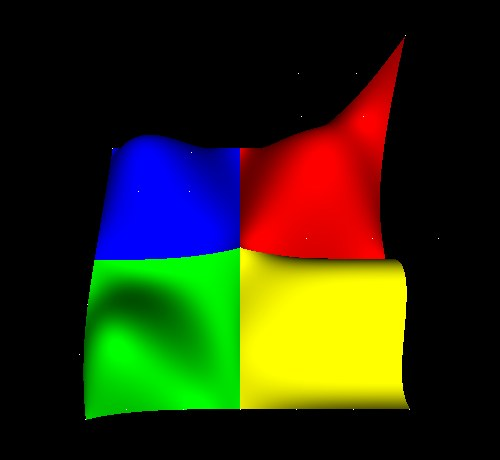
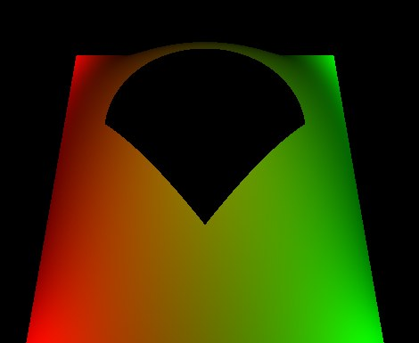

NURBS Surfaces and Curves
=========================

A NURBS surface is a grid of control points with a knot vector along each
parametric direction: a smooth shape described by a handful of numbers rather
than by thousands of triangles. ``NurbsSurface`` holds one, ``TrimmedSurface``
cuts pieces out of one, and ``NurbsCurve`` is the one-dimensional case.

Each is evaluated into an indexed triangle mesh by `opengl_extrusions
<https://github.com/mcfletch/opengl_extrusions>`__, a NumPy geometry generator
with no OpenGL in it, and the mesh is what gets drawn: **core profile and
compatibility profile alike**, lit, shadowed, textured and pickable.
Evaluation touches no GL at all, so a surface can be built before there is a
context to draw it in — on a worker thread while a scene loads, or in a test
with no window.

   Four ``NurbsSurface`` patches meeting in a mound, from ``tests/molehill.py``.
   Each is a 4 by 4 control net; the shading is from the surfaces' own
   derivatives, so the seams between them are smooth.

The nodes
---------

.. list-table::
   :widths: auto
   :header-rows: 1

   * - Node
     - What it is
   * - ``NurbsSurface``
     - a control net, a knot vector each way, and optionally a weight and a colour
       per control point
   * - ``TrimmedSurface``
     - a ``surface`` plus the ``trimmingContour`` loops that bound the part of it to
       keep
   * - ``NurbsCurve``
     - a curve in space, drawn as a line strip
   * - ``Contour2D``
     - one closed trimming loop, built from joined children
   * - ``Polyline2D``
     - a straight-sided piece of a loop
   * - ``NurbsCurve2D``
     - a curved piece of a loop, in the surface's parameter square
   * - ``NurbsToleranceSample``, ``NurbsDomainDistanceSample``
     - how finely a surface is sampled — see below

The :py:mod:`Teapot <OpenGLContext.scenegraph.teapot>` is built the same way:
its 32 Bezier patches are NURBS surfaces of order 4.

.. code-block:: python

   from OpenGLContext.scenegraph.basenodes import *

   KNOT = [0, 0, 0, 0, 1, 1, 1, 1]                 # clamped cubic, 4 points
   surface = NurbsSurface(
       uDimension=4, vDimension=4,
       uKnot=KNOT, vKnot=KNOT,
       controlPoint=[[x, y, 1.0 if 0 < x < 3 and 0 < y < 3 else 0.0]
                     for y in range(4) for x in range(4)],
   )
   scene = sceneGraph(children=[Shape(geometry=surface,
                                      appearance=Appearance(material=Material()))])

A knot vector holds ``dimension + degree + 1`` non-decreasing values, which is
where the degree comes from: a 4-point direction with 8 knots is cubic.
``controlPoint`` is *v-major* — u varies fastest, as the VRML97 NURBS proposal
specifies.

Weights: the rational in NURBS
------------------------------

The ``weight`` field takes one positive number per control point. Weights are
what let a NURBS circle be a circle rather than an approximation of one: a
quarter circle is exact as a rational quadratic with the middle weight at
√2/2, and inexact as any polynomial. Equal weights give the same surface as
none, so a scene that sets no weights is unaffected.

.. code-block:: python

   root = 2 ** 0.5 / 2
   cylinder = NurbsSurface(
       uDimension=9, vDimension=2,
       uKnot=[0, 0, 0, .25, .25, .5, .5, .75, .75, 1, 1, 1],
       vKnot=[0, 0, 1, 1],                          # degree 1: straight up
       controlPoint=ring_points,                    # 9 around, twice
       weight=[1, root, 1, root, 1, root, 1, root, 1] * 2,
   )

A direction may be degree 1, as the cylinder's length is here: a surface that
runs straight between two rows of control points is evaluated and shaded like
any other.

Sampling: how many triangles
----------------------------

A sampling node states a **rate**: sample intervals per unit of the surface's
knot range. A rate rather than a count, so two surfaces sampled at the same
rate get triangles of the same size whatever their knots run over — a surface
whose knots go 0 to 4 is sampled four times as often as one whose knots go 0
to 1.

.. list-table::
   :widths: auto
   :header-rows: 1

   * - Node
     - Field
     - Meaning
   * - ``NurbsDomainDistanceSample``
     - ``uStep``, ``vStep`` (default 100)
     - the rate itself, one for each direction
   * - ``NurbsToleranceSample``
     - ``tolerance`` (default 50)
     - a rate of 150/tolerance, held between 20 and 100

A surface that names no ``sampling`` node gets a tolerance of 5, which is a
rate of 30: a surface over the usual 0..1 knots comes out as a 30 by 30
lattice, 1800 triangles. Its ``method`` and ``parametric`` fields are carried
for scenes that set them; a tolerance is a distance on a surface nobody has
drawn yet, so it asks for a finer mesh without promising a deviation. Where a
scene wants a mesh of a stated size, ``NurbsDomainDistanceSample`` states it.

One direction is capped at 512 intervals, which is where an unusual knot range
stops asking for more mesh than any rate intended.

Distance level of detail
~~~~~~~~~~~~~~~~~~~~~~~~

A surface far from the camera is tessellated at a coarser rate and cached
separately, so walking towards one rebuilds it once per level rather than
every frame — the same :py:mod:`distance metric
<OpenGLContext.scenegraph.tessellationlod>` the teapot and the quadrics use.
Level 0 keeps the node's own sampling, so a close-up surface looks exactly as
it was authored; the coarser levels use rates of 16, 8 and 4. Set
``OPENGLCONTEXT_LOD=off`` for deterministic output.

Trimming
--------

A trimming contour is a closed loop drawn in the surface's parameter square.
**What lies to a loop's left is kept**, so a counter-clockwise loop is a
boundary, a clockwise loop inside it is a hole, and a clockwise loop on its
own encloses nothing at all.

.. code-block:: python

   outer = Contour2D(children=[Polyline2D(point=[[0, 0], [1, 0], [1, 1], [0, 1]])])
   hole = Contour2D(children=[
       NurbsCurve2D(knot=KNOT,
                    controlPoint=[[.25, .5], [.25, .75], [.75, .75], [.75, .5]]),
       Polyline2D(point=[[.75, .5], [.5, .25], [.25, .5]]),
   ])
   trimmed = TrimmedSurface(surface=surface, trimmingContour=[outer, hole])

   A ``TrimmedSurface``, from ``tests/nurbsobject.py``: a counter-clockwise
   square boundary and a clockwise loop inside it, whose top is a
   ``NurbsCurve2D`` and whose point is a ``Polyline2D``. The colours are per
   control point.

A ``Contour2D``'s children join end to end into one loop: where one ends on
the point the next begins with, the point is kept once, and the loop closes
from its last point back to its first. A ``NurbsCurve2D`` is evaluated at 32
points unless its ``tessellation`` field says otherwise.

The kept region is triangulated by the same constrained Delaunay tessellator
the swept geometry's caps use, refined to the triangle size the sampling rate
asks for — so a trimmed surface is sampled as finely across its middle as an
untrimmed one, not only where its outline has vertices. The surface is then
evaluated at the vertices that come out, which is why a trim follows the
surface's curvature rather than cutting a flat hole in it.

Trim coordinates are in the surface's own knot ranges, in the order ``(v,
u)``.

Which way a surface faces
-------------------------

A surface's normal is ``∂p/∂v × ∂p/∂u``, and its triangles wind to match. A
surface that comes out facing away from the camera has its two parametric
directions the other way round: swap ``uDimension`` with ``vDimension`` and
the knot vectors with them, or set ``solid=0`` to stop the back faces being
culled. ``ccw=0`` reverses the winding the fixed-function pipeline treats as
front-facing.

``geometryType`` takes ``polygon`` (the default), or ``edge`` / ``patch``,
which draw the tessellation as its edges.

Colour
------

The ``color`` field takes one colour per control point. It is evaluated
through the same basis as the surface, so a colour follows its control point
across the tessellation however finely it is sampled, and the surface draws
through the vertex-colour program with the material supplying everything but
the diffuse term.

Where the code is
-----------------

.. list-table::
   :widths: auto
   :header-rows: 1

   * - Module
     - What is in it
   * - ``scenegraph/nurbs.py``
     - the geometry nodes and both draw paths
   * - ``scenegraph/nurbstess.py``
     - a surface node to triangles; no GL
   * - ``scenegraph/nurbstrim.py``
     - the trimming primitives
   * - ``scenegraph/nurbssampling.py``
     - the sampling nodes
   * - ``scenegraph/teapot_nurbs.py``
     - the Utah Teapot's 32 patches

Demonstrations: ``tests/molehill.py`` (four surfaces meeting),
``tests/molehill_edit.py`` (dragging their control points),
``tests/nurbsobject.py`` (a trimmed surface, animated) and
``tests/teapot_nurbs.py``.
