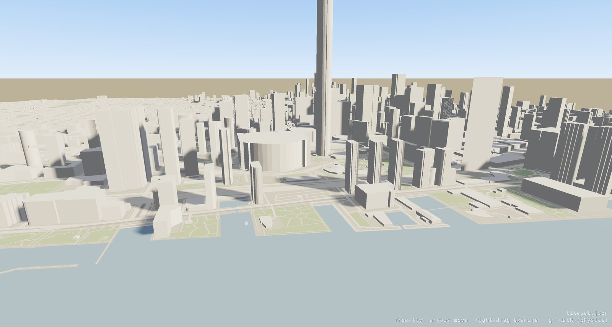

A city from OpenStreetMap
=========================

.. rst-class:: introduction

This page shows how to build a city-sized **3D Tiles** dataset from
OpenStreetMap building footprints, to fly, walk and page through with
``oglc-view``. The footprints are extruded to 3D Tiles by `osm-data-3d-tiles
<https://github.com/TANK2003/osm-data-3d-tiles>`__ (Node, ISC licence), and the
result opens like :doc:`any other tileset <tiles3d>`. The generator reads
buildings from a vector-tile server, not from OSM directly, so an export takes
five steps:

1. Choose the area, and serve its buildings to the generator as MVT tiles.
2. Run the generator.
3. Arrange the output so its URIs resolve.
4. Add ground for the buildings to stand on.
5. View the result.

   Toronto Harbour, the CN Tower and the SkyDome, built from OpenStreetMap data
   and streamed as 3D Tiles.

1. The area and its source tiles
--------------------------------

Choose a bounding box in web mercator (EPSG:3857) metres; the generator's
``EXTENT`` setting takes this form. Serve the buildings for that box at
``<TILE_URL>/16/<x>/<y>.pbf``: one Mapbox Vector Tile per zoom-16 tile of the
standard XYZ grid, each with a layer named ``buildings`` whose features are
the footprints.

Each feature needs ``osm_id`` and ``osm_type``. Its shape comes from the OSM
tags it carries, such as ``height``, ``levels``, ``roof_type`` and
``material``. A footprint with none of them is extruded to the generator's
default of one storey. A missing attribute means "unknown", so write only the
attributes a building has. The full attribute list is in the worked example's
``specs/mvt-buildings-layer.md``.

Any server that delivers those tiles works: the generator's companion
``osm-data-vector-tiles`` (PostGIS and osm2pgsql), a Tegola or Martin server
over your own OSM import, or a directory of ``.pbf`` files behind a static web
server. The worked example uses a static directory.

2. Run the generator
--------------------

.. code-block:: bash

   git clone https://github.com/TANK2003/osm-data-3d-tiles
   cd osm-data-3d-tiles && npm install && npm install --no-save dotenv

   cat > .env <<'ENV'
   TILE_URL=http://localhost:8899          # serves /16/<x>/<y>.pbf
   EXTENT=-8847116.5,5403748.5,-8830418.6,5417593.6   # minX,minY,maxX,maxY, EPSG:3857
   ENV

   mkdir -p exported/subtiles exported/b3dm
   npm run generate-tileset -- --projection ecef     # tileset.json + subtiles/
   npm run seed-b3dm -- --tile_json tileset.json     # bake every b3dm up front

``--projection ecef`` writes an Earth-centred tileset. Use it for a portable
result: the viewer levels it, and Cesium, QGIS and Giro3D place it on the
globe. ``--projection mercator`` writes the same content in a local mercator
box instead.

``seed-b3dm`` writes every tile to disk. Without this step the project's own
Express server generates tiles on request, and there are no files to hand to
anyone else.

3. Lay it out so the URIs resolve
---------------------------------

The generator writes tile content into ``exported/b3dm/``, while the
sub-tilesets that refer to it are in ``exported/subtiles/``. Those URIs work
only through the generator's Express server, which looks tiles up by file
name. A tileset read from disk or from a static host resolves each URI
relative to the file that contains it. Copy the ``.b3dm`` files into the
directory of the sub-tilesets that name them:

.. code-block:: text

   tileset.json          # root, one child per sub-tileset
   subtiles/12_*.json    # a sub-tileset per zoom 12 tile
   subtiles/16_*.b3dm    # content, a sibling of the sub-tileset naming it

The viewer requires this layout. A tileset loaded from disk may read only
files under its own directory (see :ref:`tiles3d-reach`), so a ``../b3dm/…`` reference out of ``subtiles/`` is refused.

The generator also lists a full 16×16 grid of zoom-16 children under every
zoom-12 sub-tileset, including tiles over open water or outside the area.
Remove the children whose content was not written.

4. Ground it
------------

The generator exports buildings only. On their own they float over empty
space: there is nothing to stand on, and from the air a street cannot be told
from a rooftop. Add a second content to each tile, beside the buildings: a
quad covering the tile, textured with a map of that tile drawn from OSM
roads, water and parks. List both under 3D Tiles 1.1 ``contents``, so they
stream and page together. The worked example draws its own map tiles instead
of fetching rendered ones, so the whole export can be redistributed under the
data's licence.

5. View it
----------

.. code-block:: bash

   oglc-view path/to/tileset.json           # auto-framed, free-fly
   oglc-view path/to/tileset.json --sse 8 --memory 64   # sharper, small budget: pages hard
   oglc-view path/to/tileset.json --physics # walk it with gravity and collision

Press :kbd:`g` to drop into the dataset from where the camera is. The avatar
takes the camera's position and falls to the roof or street below. Press
:kbd:`g` again to return to free flight where you left off. In a dataset
whose units are metres, as in any geospatial tileset, the avatar is the size
of a person: 1.8 m tall, walking at 3 m/s, running at 6 m/s with
:kbd:`shift`. :kbd:`f` flies.

A dataset opens with the camera *over its content*, close enough to see
individual buildings, not outside its bounding sphere. Flying speed is set
from the dataset's size when it is framed, so crossing a city takes about
twenty seconds and the paging shows as you move. Hold :kbd:`shift` to fly
faster. The settings screen adjusts both speeds (see :doc:`Movement Modes
<navigation>`). :doc:`viewer` describes ``oglc-view`` and its options.

Worked example
--------------

``toronto-3dtiles/``, beside this checkout, carries out all five steps for
Toronto from High Park to the Don Valley and the Islands: 83,064 buildings in
436 tiles, 41 MB. One ``build.sh`` runs scripts for the Overpass download, the
MVT encoding and the layout, and a verifier checks each tile's placement
against the tile it claims to be. Streamed with ``--memory 8``, it loads 152
tiles and evicts 92 over a single pass across the city.

.. rst-class:: technical

OpenStreetMap data is licensed under ODbL 1.0. An export made this way, and
anything derived from it, must carry "© OpenStreetMap contributors" and the
same licence terms.
