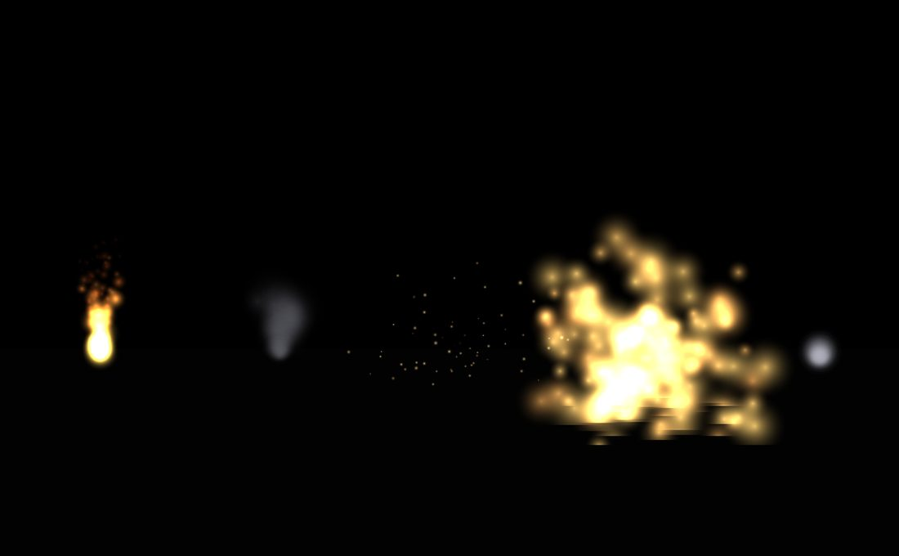
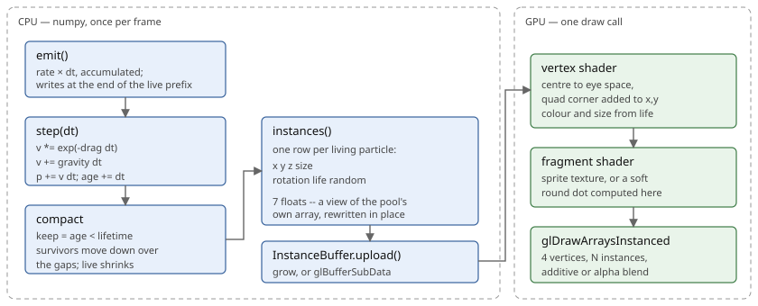

Particle systems
================

.. rst-class:: introduction

A particle system draws a crowd of small camera-facing quads from a single
node: fire, smoke, sparks, explosions, impacts and trails. One system is one
instanced draw call whatever the particle count. The simulation is numpy
arrays stepped as whole arrays and contains no OpenGL, so it can be driven and
tested without a window; the renderer is about a hundred lines of
core-profile GL.

   The five presets side by side, from ``tests/particles_effects.py``: fire,
   smoke, sparks, an explosion and a trail. None of them loads a texture —
   without one a particle is a soft round dot computed in the fragment shader.

.. _particles-quickstart:

Example: Fire
-------------

.. code-block:: python

   from OpenGLContext.scenegraph import particles
   from OpenGLContext.scenegraph.basenodes import Transform

   torch = Transform(translation=(0, 1, -3), children=[
       particles.preset('fire'),
   ])

That is a complete effect. ``ParticleEmitter`` is a rendering node in its own
right rather than a geometry inside a ``Shape``: an effect has no material and
no surface, so an ``Appearance`` would have nothing to say about it.

Six presets ship — ``fire``, ``smoke``, ``sparks``, ``explosion``, ``trail``
and ``impact``. Each is a set of field values and nothing more, so anything a
preset does can be written out by hand, and the values in one are a starting
point for an effect of your own.

Example: An explosion on demand
-------------------------------

.. code-block:: python

   burst = particles.preset('explosion', maxParticles=512, color=(0.6, 0.8, 1.0))
   burst.fire()          # again, later

``fire()`` releases a burst where the emitter is. ``burstOnStart=False`` stops
the emitter releasing its first burst as soon as it is drawn, which is what an
emitter that exists to be fired later wants; left on, every such emitter goes
off at its own position the first time the scene is drawn.

Example: Sparks at each impact
------------------------------

Where the same effect happens in many places — a shotgun's eight impacts, a
firefight's worth of sparks — one emitter can put a burst wherever it is
needed rather than a node being added per effect:

.. code-block:: python

   sparks = particles.preset('sparks', burstOnStart=False, worldSpace=True)
   for hit in shot.impacts:
       sparks.burst_at(hit.point, direction=hit.normal)     # count=... to override

The fields stay on the one node and the position arrives per burst.
``position`` is in the frame the particles live in — world space for a
``worldSpace`` emitter, the emitter's own space otherwise — and ``direction``
is the axis the particles are thrown along, which for an impact is the surface
normal. A disabled emitter bursts nothing, so a settings switch that turns an
effect off turns it off however it is asked for.

A node per effect would mean editing the scenegraph at the rate things happen,
and the render pass discards what it has gathered when the scenegraph changes.

.. _fields:

Fields
------

.. list-table::
   :widths: auto
   :header-rows: 1

   * - Group
     - Fields
     - Notes
   * - How many, how often
     - ``rate``, ``burst``, ``maxParticles``, ``lifetime``, ``lifetimeVariation``,
       ``enabled``, ``burstOnStart``
     - A burst with ``rate=0`` is a one-shot; call ``fire()`` for another, or
       ``burst_at()`` to put one somewhere else. ``burstOnStart=False`` stops the
       first burst going off the moment the emitter is drawn.
   * - Which way, how fast
     - ``direction``, ``speed``, ``speedVariation``, ``spread``, ``gravity``,
       ``drag``
     - ``spread`` is a cone half-angle in radians: 0 is a laser, π is a sphere.
       Positive ``gravity`` Y is what makes smoke rise.
   * - What it looks like
     - ``size``, ``endSize``, ``sizeVariation``, ``spin``, ``color``, ``endColor``,
       ``alpha``, ``endAlpha``, ``texture``, ``blending``
     - Without a ``texture`` a particle is a soft round dot computed in the fragment
       shader, which is enough for sparks, embers and explosions and needs no asset.
   * - Frame of reference
     - ``worldSpace``
     - True leaves particles behind when the emitter moves — a rocket trail. False
       carries them with it — a torch flame.
   * - Reproducibility
     - ``seed``
     - A fixed value pins the sequence, for a reference image. −1 draws from the
       :ref:`session's particle stream <randomness>`, so an emitter looks different
       every time the game is played and the same every time one recorded session is
       replayed.

Each of them is a declared VRML field with a ``UI_HINTS`` entry, so an emitter
can be written into a scene file, carried in an ``MFNode``, watched for
change, and presented by the generated settings machinery with no UI code.

.. _particles-dataflow:

Each frame
----------

   Emit, step, compact, upload, draw. Each step is a numpy pass over
   contiguous arrays; nothing loops in Python over particles and nothing
   allocates per particle.

.. _pool:

The pool
--------

Particles die out of order, because lifetimes vary, so a pool that left the
dead in place would be live particles with holes between them and every
consumer of it would need a mask.

Instead the survivors are compacted down over the gaps as particles die. The
living set is therefore always ``arrays[0:live]``: the GPU upload is one
contiguous slice, the draw is one call, and each step is a whole-array
operation with no masking.

.. code-block:: python

   keep = age[:live] < lifetime[:live]
   index = np.flatnonzero(keep)
   for array in (position, velocity, age, ...):
       array[:survivors] = array[index]
   live = survivors

Emission writes at the end of that prefix. A full pool emits nothing more and
reports nothing: ``maxParticles`` is a budget, and reaching it is the system
working as asked. Size it from ``rate × lifetime``, which is how many
particles can be alive at once.

.. rst-class:: technical

``OpenGLContext/scenegraph/particles.py``, ``ParticlePool._bury``. The class
needs no GL, and ``tests/unit/test_particles.py`` exercises it without one.

.. _split:

Per-particle and per-system values
----------------------------------

A particle carries only what varies between particles:

.. list-table::
   :widths: auto
   :header-rows: 1

   * - Per particle (in the pool)
     - Per system (a uniform)
   * - position, velocity
     - gravity, drag
   * - age, lifetime
     - —
   * - size *factor* (mean 1.0)
     - size at birth and at death
   * - rotation, spin
     - —
   * - one random number
     - colour and alpha at birth and at death

Per-instance data is therefore seven floats rather than twenty, and colour and
size over life are two uniforms rather than a gradient texture and a texture
unit. Absolute size being a uniform also means that editing ``size`` on a live
emitter resizes the particles already in the air.

The per-particle random number lets a shader vary particles without the
simulation storing what it varied.

The step
--------

Five things the step does that are easy to get wrong elsewhere:

- **Drag is exponential, not linear.** ``v -= v * drag * dt`` overshoots into a
  reversal on a long frame, so particles fly backwards when the frame rate
  drops. ``v *= exp(-drag * dt)`` cannot, at any step size.

- **The step comes from the engine's clock**
  (``OpenGLContext.events.systemtime``) rather than the wall clock, so a system
  follows whatever drives the rest of the scene: a recording advancing a frame's
  worth at a time, a replay reading the instants the recording read, or a capture
  pinned so that the same frame count produces the same picture.

- **The frame time is clamped** to ``MAX_STEP`` (0.1 s). A window drag or a
  stalled texture upload produces a frame of several seconds, and integrating
  that throws every particle out of sight. It is the same clamp a fixed-timestep
  physics loop applies.

- **Emission accumulates fractions.** At 10 particles a second and a 60 Hz
  frame, ``int(rate * dt)`` is zero every frame; the remainder is carried.

- **Starting angles are random**, and the emission cone samples the spherical
  cap uniformly rather than the angle. Sampling the angle crowds particles
  towards the axis, which gives a jet a bright core and a thin skirt.

.. _rendering:

Rendering
---------

Billboarding happens in eye space. The particle's centre goes through the
model-view and the quad's corner is added to its ``x`` and ``y``. Offsetting
after the view transform makes the quad face the camera at any camera
orientation, with no per-particle matrix and no work on the CPU.

.. code-block:: python

   vec4 centre = uModelView * vec4(aParticle.xyz, 1.0);
   centre.xy += rotate(aCorner, aParams.x) * size;
   gl_Position = uProjection * centre;

The node chooses which matrix to send. A world-space system's particles are
already in world coordinates, so it is sent the view matrix; a local-space
system's are in the emitter's frame, so it is sent the full model-view.
Choosing on the CPU keeps a branch out of the vertex shader.

Particles are depth tested and do not write depth, so they are hidden by walls
and blend with each other rather than occluding each other. They draw in the
transparent pass, after opaque geometry, and never enter a shadow map.

Blending is additive by default, which suits effects that emit light: fire,
sparks, explosions, muzzle flashes. ``blending='alpha'`` suits the effects that
block light instead: smoke, dust, steam.

.. rst-class:: technical

Shaders are ``OpenGLContext/shaders/particle.vert`` and ``particle.frag``; the
GL helpers (``InstanceBuffer``, ``ensure_gl``) are shared with the terrain and
vegetation nodes in ``scenegraph/instancedgl.py``. A shader compile or driver
failure disables the node with one logged warning rather than ending the
frame: the effect is missing and the scene is not.

Bounding volume
---------------

A particle system's extent changes every frame and would have to be recomputed
from the pool to be tight. The node reports a box sized from how far its
fastest particle could travel in its lifetime, which costs nothing and is
never too small — the error a tight box would risk is culling an effect that
is on screen.

.. _stepping:

When the simulation steps
-------------------------

Particles are stepped from the draw, because the draw is the only per-frame
hook a scenegraph node has. Two consequences:

- A scene rendered twice in one frame — a shadow pass, a selection pass — steps
  by nearly zero the second time rather than twice, because the step is measured
  from a clock rather than counted.

- A still frame is a stopped simulation. An application showing effects has to
  keep asking for frames; the demo does it in ``OnIdle``.

To drive the simulation directly — from a fixed-tick game loop, or a test —
call ``emitter.simulate(dt, origin=...)``. It is the method the draw uses.

.. _particles-testing:

Testing
-------

The pool is pure numpy, so a test asserts about it directly:

.. code-block:: python

   pool = particles.ParticlePool(capacity=16)
   pool.emit(1, velocity=(1, 0, 0), spread=0.0, speed_variation=0.0)
   pool.step(0.5)
   assert np.allclose(pool.position[0], (0.5, 0, 0))

The suite covers birth, motion under gravity and drag, ageing, death,
compaction keeping the survivors' state intact, the budget, the fractional
emission accumulator, the long-frame clamp, reproducibility from a seed, and
that a full pool stepped thirty times allocates essentially nothing. Rendering
is covered by the demo's reference image.

.. _particles-demos:

Demo
----

``tests/particles_effects.py`` puts the five continuous and burst presets side
by side over a floor, so what each effect is made of can be read against what
it looks like. Space re-fires the bursts; ``p`` pauses emission without
freezing what is already in the air.

.. code-block:: bash

   python tests/particles_effects.py
