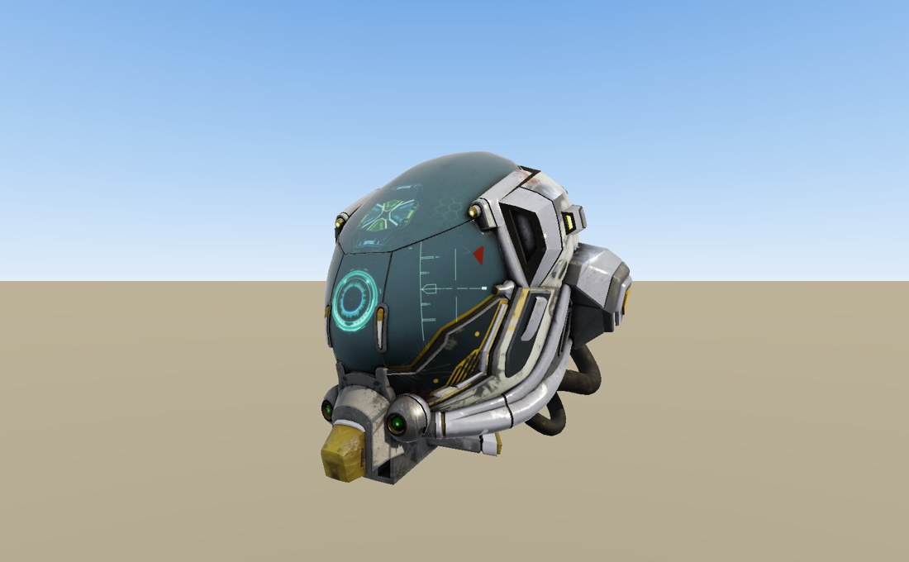
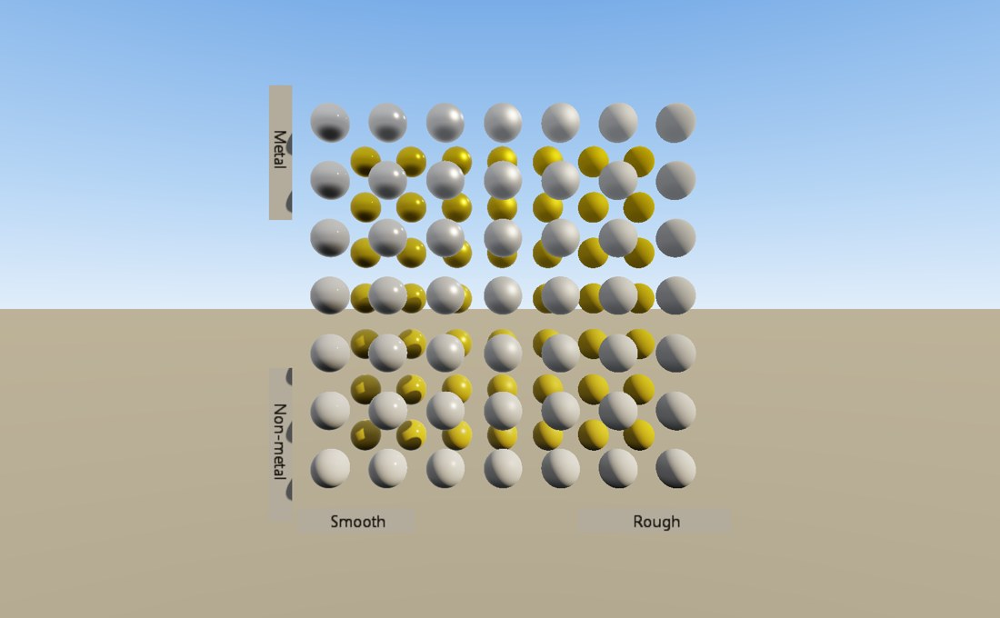
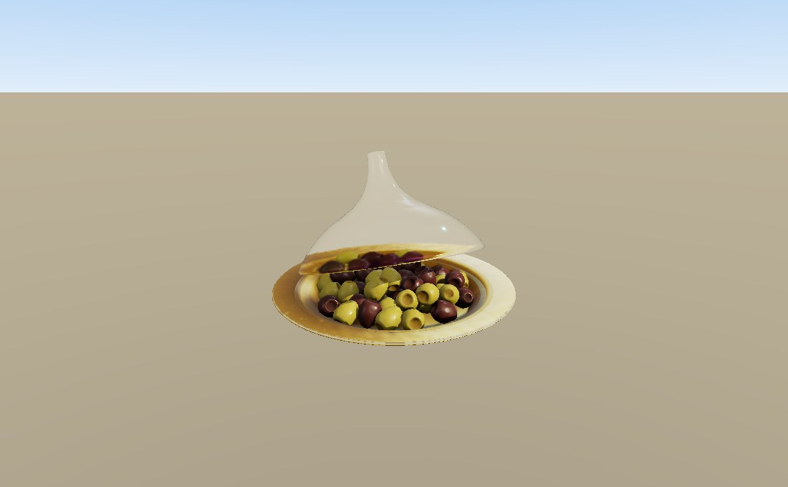
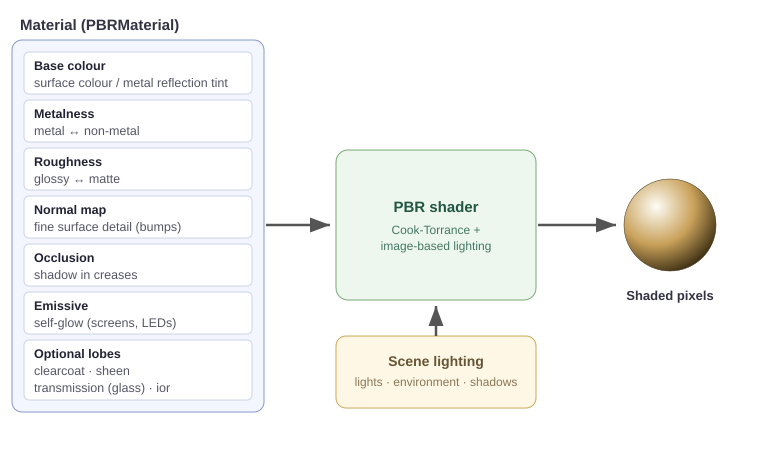

Physically Based Rendering
==========================

.. rst-class:: introduction

Physically based rendering (PBR) describes a material by its physical
properties: its colour, how metallic it is, and how rough or polished it is.
You do not tune lighting numbers per material, so one material works under any
lighting. OpenGLContext's PBR renderer uses the glTF 2.0 metallic/roughness
material model, so models authored in tools such as Blender render with the
materials their authors set. This page describes how to turn the renderer on,
how the material model works, and how to light a scene for it.

.. rst-class:: technical

The helmet above uses every part of the model in one material: a colour map,
metal and roughness, surface-detail (normal) mapping, a glowing (emissive)
display, environment reflections and a cast shadow.

Turning It On
-------------

The :doc:`oglc-view <viewer>` viewer turns the PBR renderer and its lighting
on for you:

.. code-block:: bash

   oglc-view path/to/model.glb

To use PBR for your own scene, set the renderer:

.. code-block:: bash

   OPENGLCONTEXT_RENDERER=pbr python your_script.py

PBR needs the core profile, which is the default. If the PBR renderer cannot
start, the plain :doc:`core renderer <renderpasses>` is used instead.

The Material Model: Colour, Metalness, Roughness
------------------------------------------------

Most of a PBR material is a colour and two numbers. The image below is the
``MetalRoughSpheres`` sample: metalness changes along one axis and roughness
along the other.

- Base colour - the surface's own colour. On a non-metal surface this is the
  colour you see. On a metal it tints the reflection (gold, silver, copper).

- Metalness (0 to 1) - whether the surface is metal. Use **0** for everyday
  materials such as plastic, wood, stone, skin and cloth. Use **1** for bare
  metal such as steel, gold and aluminium. A metal reflects its surroundings
  and shows its colour only through the reflection. A non-metal shows its base
  colour and a white highlight. Values in between are rare; they appear mainly
  where metal meets a coating such as rust or paint.

- Roughness (0 to 1) - how polished or matte the surface is. **0** is a mirror
  or a clear gloss, with sharp reflections and a tight highlight. **1** is
  fully matte: light scatters softly and there is no visible reflection. Most
  real surfaces are in between.

For example, a polished chrome ball is metalness 1, roughness 0. A rubber ball
is metalness 0, roughness 0.9. A glossy plastic toy is metalness 0, roughness
0.2.

Material Recipes
----------------

These are starting points for common looks. Adjust them to suit, and add a
:ref:`normal map <maps>` for fine surface detail.

.. list-table::
   :widths: auto
   :header-rows: 1

   * - Look
     - Metalness
     - Roughness
     - Extras
   * - Polished metal / chrome
     - 1.0
     - 0.05 - 0.15
     - base colour tints it (gold, copper)
   * - Brushed / satin metal
     - 1.0
     - 0.3 - 0.5
     - normal map for the brush lines
   * - Glossy plastic
     - 0.0
     - 0.1 - 0.3
     - bright base colour
   * - Matte plastic / rubber
     - 0.0
     - 0.7 - 1.0
     - —
   * - Polished stone / marble
     - 0.0
     - 0.2 - 0.4
     - normal map; optional clearcoat
   * - Rough stone / concrete
     - 0.0
     - 0.8 - 1.0
     - normal + occlusion maps
   * - Leather
     - 0.0
     - 0.5 - 0.7
     - normal map for the grain
   * - Wood (varnished)
     - 0.0
     - 0.3 - 0.5
     - colour map; optional clearcoat
   * - Car paint
     - 0.0
     - 0.4
     - clearcoat 1.0 (see below)
   * - Velvet / fabric
     - 0.0
     - 0.8
     - sheen (see below)
   * - Glass / water
     - 0.0
     - 0.0 - 0.2
     - transmission (see below)

.. _maps:

Texture Maps
------------

A colour and two numbers give the whole object one look. To vary the look
across the surface (rust here, clean metal there, a label on a bottle), paint
the properties into *texture maps*. A mesh carries texture coordinates (UVs)
that place each point of the surface on a flat image, and the renderer reads
each map at those coordinates. Each map controls one property:

- Base colour map - the colour and pattern of the surface (the label, the
  paint, the wood grain). Stored as an ordinary sRGB image.

- Metallic-roughness map - which parts are metal and how rough each part is,
  in one image: roughness in the green channel, metalness in the blue. With it,
  one object can be shiny metal in one place and matte paint in another.

- Normal map - fine surface bumps (pores, scratches, brush lines, fabric
  weave) without extra geometry. A flat triangle catches light as if it had
  that relief.

- Occlusion map - baked soft shadow in creases and cavities, so recessed areas
  are darker.

- Emissive map - the parts that glow (a screen, an LED, hot metal). Emissive
  areas do not depend on scene lights.

You do not have to supply every map. A material can be a base colour and two
numbers, a full set of maps, or anything in between. A property that has a map
also keeps its plain factor, and the two are multiplied: a white base-colour
map with a red base-colour factor gives a red surface.

.. rst-class:: technical

Each map can use its own UV set. glTF gives every texture reference a
``texCoord`` of 0 or 1. The loader records the channels that use the second
set in the material's ``texCoordMask``, and the shader samples each channel
from the set it names. A wall can then tile its brick pattern many times while
its baked lighting is stretched once across the whole surface. The mesh must
supply the second set (``TEXCOORD_1``) for the channels that use it. Where it
does not, those channels sample the origin of their map and the surface is one
flat colour.

.. rst-class:: technical

``KHR_texture_transform`` (offset, scale and rotation of the coordinates) is
supported, including its own ``texCoord`` override. A material stores one
transform and applies it to the channels that carry the extension; see
:ref:`Surfaces that move <animated-surfaces>` for how to choose them. If a
material gives two of its textures *different* transforms, both use the last
one.

.. _procedural-surfaces:

Procedural surfaces
~~~~~~~~~~~~~~~~~~~

``OpenGLContext.scenegraph.surfaces`` makes marble, tiles, brick, plaster,
stone and brushed metals as maps generated with NumPy, and the geometry to
wear them at their real size; :doc:`surfaces` describes them.

Glass, Clearcoat and Fabric
---------------------------

Three optional effects extend the basic model. They are always available; a
material turns one on by setting its properties.

- Transmission (glass, water) - a thin surface lets light through, so you see
  the scene behind it, refracted. Set ``transmission`` toward 1, keep
  ``metallic`` at 0, and use a low ``roughness`` for clear glass or a higher
  one for frosted glass. ``ior`` (index of refraction: about 1.5 for glass,
  1.33 for water) sets how much the view bends. The glass cover on the olive
  dish below uses this effect.

- Clearcoat - a thin glossy layer over the base material, like the lacquer on
  car paint or varnish on wood. Set ``clearcoat`` toward 1 and
  ``clearcoatRoughness`` low for a sharp second highlight on top of the
  material underneath.

- Sheen - the soft glow at the edges of cloth such as velvet, satin and
  brushed fabric. Set ``sheenColor`` and ``sheenRoughness``.

Emissive glow is part of the basic model. Set ``emissiveColor`` for a surface
that gives off its own light, and raise ``emissiveStrength`` above 1 to make it
brighter than white. With bloom on (``OPENGLCONTEXT_BLOOM=1``, off by
default), those areas spread a glow.

.. rst-class:: technical

On software rasterizers, or with ``OPENGLCONTEXT_TRANSMISSION=blend``, glass
uses alpha blending instead of refraction. The variable takes ``auto`` (the
default), ``full``, ``blend`` or ``off``.

Where Materials Come From
-------------------------

Most PBR materials come inside a :doc:`glTF model <gltf>` authored in a tool
such as Blender: load the file and its materials come with it. You can also
build a material in Python with a ``PBRMaterial`` node and attach it to a
``Shape`` through an ``Appearance``:

.. code-block:: python

   from OpenGLContext.scenegraph.pbrmaterial import PBRMaterial
   from OpenGLContext.scenegraph.basenodes import Shape, Appearance

   # brushed gold
   gold = PBRMaterial(
       baseColor = (1.0, 0.78, 0.34),
       metallic  = 1.0,
       roughness = 0.35,
   )

   # glowing green sign
   sign = PBRMaterial(
       baseColor     = (0.1, 0.1, 0.1),
       metallic      = 0.0,
       roughness     = 0.6,
       emissiveColor = (0.1, 1.0, 0.2),
   )

   # clear glass
   glass = PBRMaterial(
       baseColor    = (1.0, 1.0, 1.0),
       metallic     = 0.0,
       roughness    = 0.05,
       transmission = 1.0,
       ior          = 1.5,
   )

   shape = Shape(appearance=Appearance(material=gold), geometry=my_geometry)

The most used fields are ``baseColor``, ``metallic``, ``roughness``,
``emissiveColor``, ``emissiveStrength``, ``clearcoat`` /
``clearcoatRoughness``, ``sheenColor`` / ``sheenRoughness``, ``transmission``,
``ior``, and the transparency controls ``alphaMode`` (``OPAQUE``, ``MASK`` or
``BLEND``) and ``alphaCutoff``. VRML97 ``Material`` nodes are converted to
metallic/roughness automatically, so a scene can mix the two without changes.

.. rst-class:: technical

Textures go in a ``textures`` dictionary keyed by channel (``baseColor``,
``metallicRoughness``, ``normal``, ``occlusion``, ``emissive``, ``lightmap``).
Each value is a ``PBRTexture`` wrapping a PIL image. Base colour and emissive
images are sRGB; the others are linear. The glTF loader builds these when it
imports a model.

Material Properties
-------------------

A ``PBRMaterial`` supplies the surface properties and the scene supplies the
lighting. The shader combines them into the colour of each pixel:

The tables below list the ``PBRMaterial`` fields and their defaults.

Surface basics:

.. list-table::
   :widths: auto
   :header-rows: 1

   * - Property
     - Default
     - What it controls
   * - ``baseColor``
     - (1, 1, 1)
     - the surface's own colour; tints a metal's reflection
   * - ``metallic``
     - 1.0
     - metal (1) or everyday material (0)
   * - ``roughness``
     - 1.0
     - polished (0) or matte (1)
   * - ``emissiveColor``
     - (0, 0, 0)
     - colour the surface gives off on its own
   * - ``emissiveStrength``
     - 1.0
     - multiplier that makes emissive brighter than white
   * - ``normalScale``
     - 1.0
     - strength of the normal (bump) map
   * - ``occlusionStrength``
     - 1.0
     - strength of the baked occlusion map
   * - ``ior``
     - 1.5
     - index of refraction; sets the base reflectivity and how much glass bends
       the view
   * - ``specular`` / ``specularColor``
     - 1.0 / (1,1,1)
     - strength and tint of the non-metal highlight

Optional lobes, each off at 0:

.. list-table::
   :widths: auto
   :header-rows: 1

   * - Property
     - Default
     - What it controls
   * - ``clearcoat``
     - 0.0
     - strength of a clear glossy layer on top (car paint, varnish)
   * - ``clearcoatRoughness``
     - 0.0
     - how sharp the clearcoat's highlight is
   * - ``sheenColor``
     - (0, 0, 0)
     - colour of the soft glow at the edges of fabric (velvet, satin)
   * - ``sheenRoughness``
     - 0.0
     - how widely the sheen spreads
   * - ``transmission``
     - 0.0
     - how see-through the surface is (glass, water)
   * - ``thickness``
     - 0.0
     - volume thickness, for tinting transmitted light
   * - ``attenuationColor`` / ``attenuationDistance``
     - (1,1,1) / 0
     - colour that light picks up passing through the volume, and over what
       distance; 0 means no absorption

Transparency and rendering:

.. list-table::
   :widths: auto
   :header-rows: 1

   * - Property
     - Default
     - What it controls
   * - ``alphaMode``
     - ``OPAQUE``
     - ``OPAQUE``, ``MASK`` (hard cutout) or ``BLEND`` (see-through)
   * - ``alphaCutoff``
     - 0.5
     - threshold used in ``MASK`` mode
   * - ``transparency``
     - 0.0
     - VRML97-style opacity control (1 = fully transparent)
   * - ``doubleSided``
     - false
     - draw back faces as well as front faces
   * - ``unlit``
     - false
     - show the base colour flat, without lighting

Further glTF material extensions, each off at its default:

.. list-table::
   :widths: auto
   :header-rows: 1

   * - Property
     - Default
     - What it controls
   * - ``diffuseTransmission`` / ``diffuseTransmissionColor``
     - 0.0 / (1,1,1)
     - thin translucency such as leaves, wax or skin
       (``KHR_materials_diffuse_transmission``)
   * - ``anisotropyStrength`` / ``anisotropyRotation``
     - 0.0 / 0.0
     - directional stretch of the highlight (``KHR_materials_anisotropy``)
   * - ``dispersion``
     - 0.0
     - wavelength-dependent refraction, a coloured fringe
       (``KHR_materials_dispersion``)
   * - ``iridescence``, ``iridescenceIor``, ``iridescenceThicknessMin`` /
       ``iridescenceThicknessMax``
     - 0.0, 1.3, 100 / 400
     - thin-film colour shift, as on a soap bubble; thickness in nanometres
       (``KHR_materials_iridescence``)

Texture maps go in the ``textures`` dictionary, keyed by channel:
``baseColor``, ``metallicRoughness``, ``normal``, ``occlusion``, ``emissive``
and ``lightmap``. Each map varies its property across the surface (see
:ref:`Texture Maps <maps>` above). Where a map and a factor both exist, they
are multiplied. ``texCoordMask`` and ``lightmapStrength`` are described under
:ref:`bakedlight` and :ref:`animated-surfaces`.

.. rst-class:: technical

The defaults follow the glTF 2.0 specification, so ``metallic`` and
``roughness`` both default to 1.0: a bare material with no maps is a rough,
non-reflective metal until you set them. Authoring tools almost always set
both.

PBR texture sets are widely available under CC0 and similar licences, and
Blender and other editors can apply them to a model before you export it to
glTF.

Lighting the Scene
------------------

The PBR renderer lights surfaces in two ways at once: with direct lights (sun,
lamps, spotlights) and with the surrounding environment.

.. _environment-lighting:

Environment Lighting (Reflections and Ambient)
~~~~~~~~~~~~~~~~~~~~~~~~~~~~~~~~~~~~~~~~~~~~~~

Real surfaces reflect their surroundings and pick up soft light from the whole
scene, not only from direct lights. The renderer supplies this "image-based
lighting" from a built-in studio environment. Metals get something to reflect,
and matte surfaces are softly lit even in shadow. It is on by default. Two
environment variables adjust it:

- ``OPENGLCONTEXT_IBL_INTENSITY`` - scales the environment and ambient
  strength (default 1.0). The viewer sets it to 0.4 so cast shadows stay
  visible.

- ``OPENGLCONTEXT_IBL`` - ``auto`` (the default), ``full``, ``analytic`` (a
  cheaper approximation) or ``off`` (flat ambient, no reflections).

Both are also ``ContextDefinition`` fields (``iblIntensity`` and ``ibl``),
which a settings screen can change while the program runs; see
:doc:`environment` and :ref:`overlayui-settings`.

A scene can supply its own environment. ``HDRBackground`` takes a Radiance
``.hdr`` equirectangular panorama, the usual HDRI format. It draws the
panorama as the sky and registers it as the lighting environment, so metals
reflect the sky that is behind them. The panorama keeps values above 1.0 where
the sun and sky are brighter than white, which an 8-bit image cannot store.
The visible sky is exposure-scaled and
tone-mapped in the same way as lit geometry, so the sky and the lit surfaces
match. A ``CubeBackground`` of six LDR JPEG faces is cheaper, but it does not
light the scene.

A zone changes the environment lighting inside a region: a room can be lit
at a fraction of the sky's strength, or by a probe captured inside it, so a
roofed room is dark and lit through its door while the street outside keeps
the sky. The change is worked out per fragment, and lightmaps and light grids
are not scaled by it. See :doc:`zones`.

In ``auto`` mode, environment lighting adapts to the frame rate. When the
frame rate stays below 45 frames a second for 30 frames it steps down to
``analytic``, never further; after 45 frames above 75, and at least 60 frames
after stepping down, it steps back up. A few slow frames, such as those in
which programs compile, change nothing: each step changes every glossy surface
at once. Choosing a
mode explicitly turns adaptation off. A run started with ``--capture`` also
keeps the mode it started with, so the captured image does not depend on how
far the mode had recovered when the frame was taken. Shadow cascades are fixed
for a capture for the same reason.

.. _bakedlight:

Baked Lighting: Lightmaps and the Light Grid
~~~~~~~~~~~~~~~~~~~~~~~~~~~~~~~~~~~~~~~~~~~~

Some worlds have their lighting computed when they are built, and store the
result instead of computing it every frame. The renderer reads two forms of
that stored lighting, and a scene can use either or both.

A **lightmap** stores the light painted onto the surfaces, addressed by a
second UV set. Give the material a ``lightmap`` texture, set bit 32 of
``texCoordMask`` so it samples ``TEXCOORD_1``, and set its exposure with
``lightmapStrength`` (default 1.0). The lightmap is read as linear light, not
as an sRGB colour, because baked lighting is written directly to eight bits.
Decoding it as sRGB would make the level look unlit.

A lightmap covers only the surfaces that existed when the world was built.
Objects added later, such as a character, a pickup, a door or a projectile,
have no lightmap coordinates. In a level that uses baked lighting and has no
lamps, nothing would light them. A **light grid** stores the same lighting for
these objects: a regular grid of samples over the world, each holding the
light at that point as an ambient term and a directional term. The pass looks
up each object's position in the grid, so an object is lit by the light where
it stands.

.. code-block:: python

   from OpenGLContext.scenegraph.lightgrid import LightGrid

   scene.children.append(LightGrid(
       origin=(-40.0, -2.0, -40.0),      # world position of sample (0, 0, 0)
       spacing=(1.6, 3.2, 1.6),          # metres between samples on each axis
       counts=[51, 9, 51],               # samples along x, y and z
       ambient=ambient,                  # one linear colour per sample
       directional=directional,          # one linear colour per sample
       direction=direction,              # a unit vector towards the light
       intensity=2.0,                    # the exposure the lightmaps use
   ))

The sample arrays are flat, with x varying fastest: ``index = ix + counts[0] *
(iy + counts[1] * iz)``. Sampling is trilinear and clamps at the edges, so an
object past the last sample keeps the light of the nearest one instead of
going dark. A scene uses one grid: the first one found that has samples.

The grid costs one interpolation and three uniforms per object per frame, and
only in scenes that have a grid. Its limits:

- A surface with its own lightmap does not read the grid. Both come from the
  same lighting solution, and using both would light that geometry twice.

- Each object takes one sample, at the centre of its bounding volume, so the
  light does not vary across one object. At the spacing of a typical baked
  grid, this suits figures and props.

- Instanced draws do not read the grid. A group of shapes drawn in one call
  could share only one sample, which would be wrong for all but one of them.

- The :doc:`VRML97 core shader <renderpasses>` reads neither the grid nor
  lightmaps. Baked lighting is PBR only.

twig-bb builds a grid from a Quake 3 map's lightvol lump, in
``twig_bb/lighting.py``, which shows the sample layout in use.

.. _shadows:

Shadows
-------

The PBR renderer casts dynamic shadows, and they are on by default.
Directional lights (a sun) shadow the whole scene, spot lights cast a cone of
shadow, and point lights cast shadows in every direction. Turn shadows off
with ``OPENGLCONTEXT_SHADOWS=0``, or soften spot-light shadows with
``OPENGLCONTEXT_SHADOWS_SOFT=1``.

The :doc:`VRML97 core lighting shader <renderpasses>` uses the same shadow
system. See :doc:`Shadows <shadows>` for how it works and all its controls.

.. _fog:

Fog
---

Put a ``Fog`` node in the scene, and the view fades into its colour with
distance. The pass finds the bound ``Fog`` node while it gathers the frame, in
the same way it finds the background. No other setup is needed:

.. code-block:: python

   from OpenGLContext.scenegraph.basenodes import Fog

   Fog(color=(0.06, 0.20, 0.32),     # linear RGB
       visibilityRange=18.0,          # metres to total obscurity; 0 is off
       fogType='EXPONENTIAL')         # or 'LINEAR', the default

``Fog`` is the VRML97 node, with the fields that specification defines
(`ISO/IEC 14772-1 6.19
<https://www.web3d.org/documents/specifications/14772/V2.0/part1/nodesRef.html#Fog>`__).
Because fog is a node, it belongs to a place in the scene: it binds and stacks
like a viewpoint. Under water, a smoke-filled room and clear air outside can
be three ``Fog`` nodes in one scene, with one in force at a time.

Fog is applied by the PBR shader. The VRML97 core shader does not apply it.

Choosing a fog curve
~~~~~~~~~~~~~~~~~~~~

Both curves reach total obscurity at ``visibilityRange``. They differ in how
the fade progresses on the way:

.. list-table::
   :widths: auto
   :header-rows: 1

   * - ``fogType``
     - Fades
     - Suits
   * - ``LINEAR``
     - in proportion to distance, from the first metre
     - haze, aerial perspective, hiding the far edge of a terrain patch
   * - ``EXPONENTIAL``
     - slowly at first, then quickly
     - a medium such as water or smoke, where nearby objects are clear and the
       far wall is not

A linear fade tints a weapon in the player's hands as much as the wall behind
it, so the view looks like a coloured pane of glass over the screen. Use
``EXPONENTIAL`` for the look of being inside a medium. For an underwater view,
use a fog rather than a full-screen overlay, because an overlay has no depth.

How fog is applied
~~~~~~~~~~~~~~~~~~

The shader blends in the fog colour in linear HDR, before tone mapping, which
keeps fogged highlights from posterising. One uniform carries the scale for
every mode: the reciprocal of the visible range, which the shader multiplies by
the fragment's distance. A scene with no ``Fog`` renders unchanged, because
the fog mode uniform stays at zero.

A transform above a ``Fog`` node scales its ``visibilityRange``, because the
specification puts the range in the node's local coordinates. A model authored
with its own fog keeps the right fog when placed at a different size.

.. rst-class:: technical

``OpenGLContext/scenegraph/fog.py`` holds the node and the mode codes. The
pass reads the node in ``flateffects._FlatEffectsMixin.applyFog`` and passes
it to the shader through ``PBRShaderProgram.set_fog(density, color, mode)``.

.. _animated-surfaces:

Surfaces that move
------------------

Three things can move a PBR surface at run time, at very different costs. Use
the cheapest one that does the job.

1. The UV transform: one uniform
~~~~~~~~~~~~~~~~~~~~~~~~~~~~~~~~

``PBRMaterial.uv_transform`` is a 3×3 ``KHR_texture_transform`` matrix.
Assigning it bumps the material's upload version, so the pass uploads its
uniform block again and does nothing else. A scrolling conveyor belt, a
rotating fan or a stretching liquid costs only this, however large the surface
is.

.. code-block:: python

   material.uv_transform = [[1, 0, u_offset],
                            [0, 1, v_offset],
                            [0, 0, 1]]        # translation in the last COLUMN

The high half of ``texCoordMask`` selects the channels the transform applies
to: the channel's low bit, shifted left by 8. Set it for the base colour and
leave it clear for the lightmap. Otherwise a scrolling texture moves the baked
lighting with it, and the shadows slide off the walls.

.. code-block:: python

   material.texCoordMask |= (1 << 8)     # baseColor transformed, lightmap not

2. Colour, opacity and texture: one uniform or one bind
~~~~~~~~~~~~~~~~~~~~~~~~~~~~~~~~~~~~~~~~~~~~~~~~~~~~~~~

``baseColor``, ``emissiveColor`` and ``transparency`` are ordinary material
fields. Assigning any of them uploads the block again. To swap a map, set its
channel, ``material.textures['baseColor'] = texture``, or assign a new dict to
``material.textures``. The textures are held in a ``TextureChannels`` dict that
counts its own edits, so a shape wearing the material is grouped for
:doc:`instancing <instancing>` by the maps it has now.

3. The vertices: a CPU pass and a buffer upload each frame
~~~~~~~~~~~~~~~~~~~~~~~~~~~~~~~~~~~~~~~~~~~~~~~~~~~~~~~~~~

When a matrix cannot express the movement, such as a wave that moves the
geometry or a churn whose offset depends on each vertex's position, give the
mesh a **surface deformer**:

.. code-block:: python

   def churn(positions, normals, texcoords):
       return positions + wave(positions, clock.now), normals, texcoords

   mesh.set_surface_deformer(churn)     # applies at once
   ...
   mesh.refresh_surface()               # each frame; calls the deformer again

The deformer is the third stage of the pipeline that morph targets and
skinning use. The mesh keeps its rest arrays and applies morph, then skin,
then surface. A version counter is bumped, and each per-context GPU object
uploads the dynamic vertex buffers again. Three rules apply:

- The deformer always receives the rest pose (after morph and skin), never its
  own previous output. Deforming the previous frame would compound, and a
  one-unit wave would move the surface away within a few seconds.

- The deformer receives copies, so writing to them in place cannot corrupt the
  rest arrays.

- UVs are uploaded as a dynamic buffer only if the mesh says they move
  (``deforms_texcoords``, true once a deformer is set and the mesh has texture
  coordinates). Morphing and skinning never move UVs, so a skinned character
  does not upload them each frame. The dynamic buffers are chosen when the
  mesh is first drawn, so set the deformer before that.

A deformer that returns nothing usable leaves the mesh unchanged, so malformed
content loses its effect but keeps its surface.

.. rst-class:: technical

See ``scenegraph/pbrmesh.py``: ``set_surface_deformer``, ``refresh_surface``,
``deforms_texcoords``, and stage 3 of ``_apply_deform``. twig-bb uses all three
kinds of movement for Quake 3 ``.shader`` scripts; ``twig_bb/animator.py`` is
a worked example.

The Shading Math
----------------

.. rst-class:: technical

This section is a short overview. You do not need it to use the renderer. For
a walkthrough of the fragment shader, with every texture, uniform and buffer
it reads and how each lobe is computed and combined, see :doc:`the PBR
uber-shader <ubershader>`.

.. rst-class:: technical

Direct light uses the Cook-Torrance microfacet model: a specular term plus a
Lambertian diffuse term. The specular term is the product of three functions,
``D * V * F``:

- D - the GGX / Trowbridge-Reitz normal distribution: how microfacets are
  oriented for a given roughness.

- V - the height-correlated Smith visibility term. It combines the geometric
  shadowing/masking *and* the ``1 / (4·NdotL·NdotV)`` denominator, so the
  shader multiplies ``D * V * F`` with no separate denominator.

- F - the Fresnel-Schlick term: reflectance rising at grazing angles.

.. rst-class:: technical

The diffuse term is ``albedo / π``, scaled by ``(1 - F)`` to conserve energy
and by ``(1 - metalness)`` because metals have no diffuse reflection. The BRDF
works with ``alpha = roughness²``. The roughness you set is squared exactly
once. The direct and environment lighting paths share the same convention
through one include, ``shaders/_brdf_inc.glsl``, so both use the same lobe.

.. rst-class:: technical

Environment lighting uses the split-sum approximation: a prefiltered
environment cube (one blur level per roughness), an irradiance cube for
diffuse ambient, and a BRDF lookup table. All three are computed once from the
environment, and computed again if the environment changes.

.. rst-class:: technical

Colour - lighting is computed in linear colour. Base-colour and emissive
texels are decoded from sRGB when read. The final colour is tone-mapped with
an ACES filmic curve and encoded to sRGB. Because the shader encodes sRGB
itself, ``GL_FRAMEBUFFER_SRGB`` stays disabled (see :ref:`srgb-output`).

.. rst-class:: technical

One shader for the scene - clearcoat, sheen and transmission are branches in a
single "uber-shader", controlled by uniforms that are constant for each draw
call. The whole scene binds one program instead of switching shaders per
material, and every fragment in a draw takes the same branch. The three
optional lobes are also controlled by compile-time defines, all on by default.
A constrained platform can compile a smaller shader without some of them; the
choice is made once per platform, not per material. Material factors are
packed into a std140 uniform buffer, built once per material and reused
across frames.
