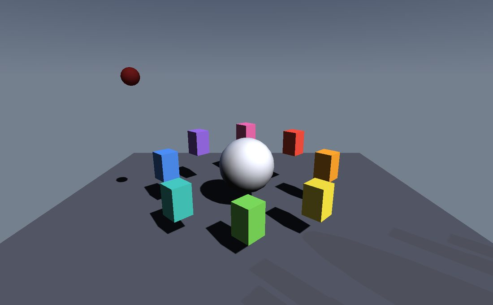

Recording video
===============

.. rst-class:: introduction

A **recorder** writes the frames a context draws to an H.264 video file. The
frame goes from the framebuffer into a texture the GPU's video encoder reads
in place, so nothing but the compressed result crosses the bus, and the world
is advanced by exactly one frame of time per frame written — a recording is
smooth however long each frame took to draw, and the same run records the same
way twice.

.. _installing:

What it needs
-------------

Recording needs the ``video`` extra, which brings in `pyopengl-video
<https://github.com/mcfletch/pyopengl-video>`__, the bindings that reach the
encoder in the graphics driver:

.. code-block:: bash

   pip install OpenGLContext[video]

The encoder itself ships with the driver, so there is nothing else to install.
Today that means an NVIDIA card on Linux or an Intel GPU on Windows; a machine
without either runs exactly as before, and asking it to record reports what is
missing rather than failing part-way through. Without the extra, nothing
changes at all: the recorder is only imported when a recording is asked for.

On a machine with more than one GPU the encoder has to be on the same one the
renderer is using, or it would be reading memory the renderer never wrote. The
recorder picks an encoder that matches the context's own adapter, which on a
laptop running OpenGL on its integrated graphics means the integrated encoder
— the one on the same die as the frame.

.. _recording:

Recording from the viewer
-------------------------

Nothing to write: :doc:`oglc-view <viewer>` records any scene it can open.

.. code-block:: bash

   oglc-view world.glb --capture-video walk.mp4 --fly-through
   oglc-view model.glb --capture-video spin.mp4 --turntable --video-seconds 8
   oglc-view model.glb --capture-image shot.png

A recording needs something to move, and a viewer opening somebody else's file
has no path of its own to offer. ``--fly-through`` takes the one the author
already left — the scene's own viewpoints, walked in the order the file
declares them and eased in and out of each leg — so a world with two cameras
in it is a shot without anybody framing one. The path is stepped by recorded
frames rather than by wall time, so it is the same length as the video however
fast the machine drew it.

A recorded frame carries no caption and no developer overlay, for the same
reason a screenshot does not. See :ref:`Recording a video <video>`.

Recording from a context
------------------------

``RecordingMixin`` gives a context the mode. Set the recording up, tick it
from :ref:`presentFrame <present>`, and it closes the file when it has run its
length:

.. code-block:: python

   from OpenGLContext.video.recorder import RecordingMixin

   class MyContext(RecordingMixin, BaseContext):
       def OnInit(self):
           self.setupRecording('run.mp4', fps=60, seconds=20)

       def presentFrame(self):
           self.tickRecording()          # before the swap
           return super().presentFrame()

**Tick it before the swap.** The back buffer holds the frame just drawn only
until it is swapped away, which is the same rule the :ref:`still capture
<stills>` follows.

The recorder can also be driven directly, for a context that would rather own
it:

.. code-block:: python

   from OpenGLContext.video.recorder import VideoRecorder

   recorder = VideoRecorder('run.mp4', fps=60, seconds=20)
   ...
   recorder.capture()          # in presentFrame, before the swap
   ...
   recorder.close()

``capture()`` answers whether it kept the frame, and ``recorder.recording``
whether it still wants more. Those are different questions: a recorder waiting
for the scene to arrive keeps no frame and is not finished.

.. _recording-demo:

Seeing it work
--------------

   ``python tests/recording_demo.py`` — eight blocks turning and bobbing around a
   sphere, a scene in which every frame differs from the last, so an unevenly
   clocked recording of it reads as a stutter. Press ``r`` to start recording and
   again to stop and close the file; the lamp burns red while a recording is
   running. Press ``c`` to run the next recording on the wall clock rather than a
   fixed step.

``--record`` takes the keyboard out of it, which is what a scripted run wants:
the demo records that many frames, says what it wrote and exits.

.. code-block:: bash

   $ python tests/recording_demo.py --record 90
   recording to recording_demo.mp4 at 30 fps, 90 frames
   recorded 90 frames to recording_demo.mp4
     picture     300x300
     frame rate  30/1 fps (3.000 seconds of video)
     clock       fixed step
     file size   81983 bytes

The ``clock`` line says which time source the recording ran on, and the frame
rate is the spacing the frames were stamped at. ``--output PATH`` chooses the
file, and the environment variables ``OPENGLCONTEXT_RECORD_FRAMES`` and
``OPENGLCONTEXT_RECORD_PATH`` say the same two things.

An application records itself with the same wiring, plus the answer for a
machine that has no encoder:

.. code-block:: python

   from OpenGLContext import testingcontext
   from OpenGLContext.video.recorder import RecordingMixin, RecordingUnavailable

   BaseContext = testingcontext.getInteractive('glfw')

   class RecordedContext(RecordingMixin, BaseContext):
       def OnInit(self):
           # 90 frames at 30 fps: three seconds of video, and the run ends there
           self.setupRecording('run.mp4', fps=30, frames=90)

       def presentFrame(self):
           try:
               self.tickRecording()            # before the swap
           except RecordingUnavailable as error:
               self.recorder = None            # nothing here can encode
               print('not recording: %s' % (error,))
           return super().presentFrame()

       def OnIdle(self, event=None):
           self.triggerRedraw(1)               # a recording wants every frame

   if __name__ == "__main__":
       RecordedContext.ContextMainLoop()

``RecordingUnavailable`` arrives at the first frame the recording would have
kept, because that is where the encoder is opened. Clearing ``self.recorder``
is what stops the next frame asking again; the context goes on drawing, and
everything but the recording works as it does anywhere else.

``OnIdle`` is there because a context draws when something changes. A
recording wants a frame every time round the loop, and an application whose
scene may sit still asks for one.

.. _recording-settings:

What a recording takes
----------------------

.. list-table::
   :widths: auto
   :header-rows: 1

   * - Argument
     - Default
     - Meaning
   * - ``fps``
     - 60
     - Frames a second, as a number or an exact ``(numerator, denominator)`` pair.
       The pair is what keeps a long recording at 29.97 from drifting.
   * - ``size``
     - the viewport
     - The recording keeps the size it starts at; a window resized later is scaled
       into it.
   * - ``seconds`` / ``frames``
     - until closed
     - How long to record.
   * - ``start_after``
     - 0
     - Seconds of real time to let pass first. A world that streams its content in
       arrives over the first few seconds, and a recording that starts immediately is
       a recording of it arriving.
   * - ``fixed_step``
     - True
     - Advance the engine's clock a frame at a time. See below.
   * - anything else
     - 
     - Passed to the encoder: ``bitrate``, ``preset``, ``tuning``, ``gop``,
       ``bframes``.

.. _recording-clock:

The clock a recording runs on
-----------------------------

Rendering a frame takes as long as it takes. A scene advanced against the wall
clock while it is being recorded plays back unevenly — a frame that took 40 ms
to draw is 40 ms of movement shown for 16 ms — and a scene that streams its
content in stutters exactly where the streaming happened.

So a recorder installs a ``FixedStepClock`` and advances it one frame per
frame recorded. Everything time-driven follows, because everything reads one
clock: ``OpenGLContext.events.systemtime.systemTime()`` is what a ``Timer``
polls, and so what every ``TimeSensor`` and every animation they drive is
advanced against.

.. code-block:: python

   from OpenGLContext.video.clock import FixedStepClock

   with FixedStepClock(fps=60) as clock:
       while recording:
           render()
           clock.advance()

Code that reads ``time.time()`` directly does not follow. An application with
its own clock reads ``systemTime()`` instead, and its motion is then recorded
as evenly as the scenegraph's.

What a fixed step costs is real time: the run is no longer live, because a
heavy frame takes as long as it takes and the world waits for it. That is the
right trade for a recording and the wrong one for a game someone is playing,
which is why ``fixed_step=False`` is there — a recording of an interactive
session, stalls and all, wants the wall clock.

A screen capture wants the same clock for a different reason: a frame read
back after a fixed number of draws should show the same moment of a scene
whatever machine drew it. ``capture_clock()`` is that arrangement, installed
by the context itself when ``OPENGLCONTEXT_AUTO_EXIT_FRAMES`` asks for a
bounded run — see :ref:`Testing <pixels>`.

.. _orientation:

The frame is turned over on the way
-----------------------------------

OpenGL's framebuffer starts at the bottom left, and a video encoder reads a
texture from its first row and calls that the top of the picture. The copy
into the capture texture therefore reverses its destination Y coordinates,
which turns the frame over inside the blit at no cost. That is
``copy_frame()``, and it is public: an application encoding through some other
path wants exactly the same copy.

.. code-block:: python

   from OpenGLContext.video.recorder import CaptureTarget, copy_frame

   target = CaptureTarget(width, height)
   copy_frame(target.framebuffer, (width, height))   # target.texture now holds the frame

``CaptureTarget`` is for code doing its own capture. A recording asks the
*encoder* for its textures instead, because on Windows the encoder reads a
Direct3D surface and only the backend can create one; the copy into it happens
inside a ``for_drawing()`` scope, which is where such a surface passes between
the two graphics APIs and does nothing where it need not.

.. _stills:

Stills
------

A single frame is a different job with a different answer:
``OpenGLContext.capture`` reads the back buffer and writes a PNG, and
``SettleCapture`` waits for a scene to converge before it takes one. Recording
is for motion; those are for pictures.

.. _recording-limits:

Limits
------

- **H.264**, up to 4096×4096, in an MP4 file.

- **NVIDIA on Linux, Intel on Windows.** AMD, Intel on Linux and NVIDIA on
  Windows are planned.

- **One GPU per recording.** The encoder reads the frame where the renderer left
  it, so the two are on the same adapter or there is no recording to be had.

- **No audio.** The file has a video track.

- The recording belongs to the OpenGL context that started it, and every frame
  must come from that context's thread.
