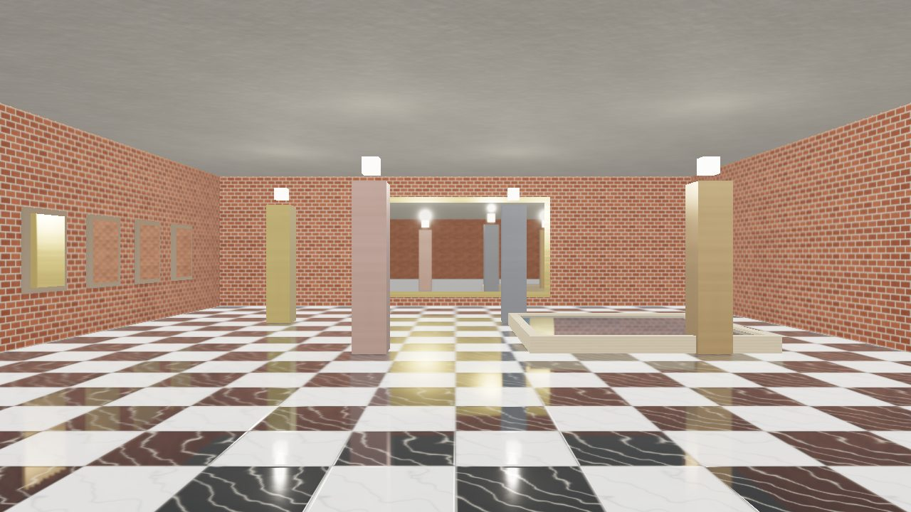

Reflections
===========

.. rst-class:: introduction

A surface marked as a mirror reflects the scene in front of it: a bathroom
mirror, a polished floor, a shop window, a still pool. Every other smooth
surface reflects the :ref:`environment probe <environment-lighting>`, which is
the sky. Marking a surface is how an application opts into the cost, and each
mirror says how much it is worth, so a level can hold a dozen of them.

ndow onto a blue sky on the right, and a stone-rimmed pool

   ``oglc-mirrors``: a polished floor, a mirror over the dais, a corridor of
   mirrors sharing one reflector, and a rippling pool, each reflecting the
   room. See :ref:`reflections-demo`.

.. code-block:: python

   from OpenGLContext.scenegraph.reflector import PlanarReflector

   material.reflector = PlanarReflector(interval=2)

Making a surface a mirror
-------------------------

A ``PlanarReflector`` on a ``PBRMaterial``'s ``reflector`` field makes every
surface drawn with that material a mirror, each in the plane of its own mesh.
The node's fields are read every frame, so a change takes effect on the next.

.. list-table::
   :widths: auto
   :header-rows: 1

   * - Field
     - Default
     - Meaning
   * - ``scale``
     - 0.5
     - The reflection's resolution as a share of the mirror's rectangle on
       screen, each way. 0.5 is a quarter of the pixels.
   * - ``interval``
     - 3
     - The most frames a visible reflection goes without being drawn again. A
       moving object's reflection lags by up to this many frames.
   * - ``priority``
     - 1.0
     - Weight against the other mirrors in view when a frame cannot draw them
       all.
   * - ``distortion``
     - 0.0
     - How far a unit of the surface normal's tilt from the plane pushes the
       lookup, in view widths: the normal map breaking the reflection up.
   * - ``reflectance``
     - 0.97
     - The share of the light the mirror reflects. A silvered mirror loses a
       few percent, which is what tells it from an opening onto the same room.
       Water carries 1, since its Fresnel term already decides how much it
       reflects.
   * - ``enabled``
     - True
     - False leaves the node in place and the surface reflecting the probe.
   * - ``replace``
     - False
     - True shows the reflection in place of the surface's shading.

Each number is drawn within a range: ``scale`` from 0.05 to 1, ``interval``
at least 1, ``priority`` at least 0, ``distortion`` from 0 to 1 and
``reflectance`` from 0 to 1 (``reflector.LIMITS``). A value outside its range
is drawn as the nearer end of it, and a value that is no finite number, such
as a NaN, as the field's default.

One reflector held by the materials of a set of mirrors tunes them together.
Those of them that lie in one plane -- a wall of mirrors, a floor laid in two
materials -- are also one reflection: one mirror view in each view that sees
them, cropped to all of them, which each reads. Ten mirrors down a corridor
cost one view, not ten. Planes within a millimetre, and normals within a
thousandth, count as one. ``varied()`` gives one mirror its own:

.. code-block:: python

   corridor = PlanarReflector(interval=3, scale=0.35)
   for material in corridor_materials:
       material.reflector = corridor
   hero.reflector = corridor.varied(interval=1, priority=4.0)

The material shades what is reflected. Its base colour tints the reflection,
and its metalness and roughness weight it through the same split-sum term the
sky's reflection goes through. A silvered mirror is metallic 1, roughness 0.
A polished floor is a dielectric with a low roughness, which reflects faintly
looking straight down and strongly at a glance. Up to a roughness of 0.6 a
rough mirror reads a blurred copy of its reflection; above it the surface
reflects the probe, which is as blurred as that reflection would be. The
roughness weighed is the material's factor times the mean of its roughness
map, so a textured material with a factor of 1 is judged by its map.

With ``replace`` set, the surface shows the reflection as drawn and nothing of
its material: no tint, no Fresnel. Where there is nothing to reflect it shows
the sky. That is an object that is only a mirror, such as a magic window.

A mirror must be flat. Its plane is fitted to the mesh: the mean of its points
and the direction they vary least in, turned to the side its triangles face. A
mesh with a point more than 1% of its size off that plane is reported once in
the log and reflects the probe.

Water is a mirror
~~~~~~~~~~~~~~~~~

Geometry with a ``waveStyle`` is water, and water is a mirror whatever its
material. ``water_material()`` and the ``water`` hook give the material
``reflector.WATER``, which is redrawn every frame and broken up by the ripple;
water whose material names no reflector reflects the same way. See
:doc:`water` for the surface itself.

.. _mirror-hook:

Authoring mirrors in a model
----------------------------

A glTF marks a mirror with the ``OGLC_hook`` tag (:ref:`hooks`) naming the
``mirror`` kind. The tag goes in one of two places, and they mean different
things:

- On a **material**, every surface drawn with that material is a mirror, and
  the material shades the reflection: its colour tints it, its metalness and
  roughness weight it, its normal map breaks it up.
- On an **object** (a glTF node), every surface of that object shows only its
  reflection, with the sky where it reflects nothing. The object's own
  materials are set aside.

The parameters are the ``PlanarReflector`` fields above, all optional:
``scale``, ``interval``, ``priority``, ``distortion``, ``reflectance``, and
``replace`` where
the place's own default -- off on a material, on on an object -- is not the
one wanted. A value that is no number of the right kind is logged and left at
its default, and one outside the field's range is logged and taken as the
nearer end of it, so a malformed tag loads as a mirror.

In Blender
~~~~~~~~~~

The ``oglc_hook`` add-on in ``tools/blender`` puts an **Engine Hook** panel on
the material and object tabs (``tools/blender/README.md`` says how to install
it).

1. Model the mirror as a flat mesh: a plane, or any mesh whose faces all lie in
   one plane. It reflects towards the side its faces' normals point, which is
   the blue side in the viewport's *Face Orientation* overlay; flip the normals
   of a mirror that shows red towards the room.
2. Give it a material and shade it as the mirror should look. For a silvered
   mirror, *Metallic* 1 and *Roughness* 0 to 0.05. For a polished floor, a
   dark *Base Color*, *Metallic* 0 and *Roughness* below 0.15. For a mirror a
   normal map breaks up, plug the map into *Normal* as usual and set the
   panel's *Distortion*.
3. On the **material** tab, open **Engine Hook**, tick it, and type ``mirror``
   as the **Kind**. The panel offers *Resolution* (``scale``), *Redraw Every*
   (``interval``), *Priority*, *Distortion* and *Reflectance*
   (``reflectance``), and the line under them shows
   the block the file will carry, for example
   ``OGLC_hook: {"interval": 2, "kind": "mirror"}``. A field left at its default
   is not written.
4. For an object that is only a mirror, tag the **object** tab instead, with the
   same kind and fields.
5. Export with **File ‣ Export ‣ glTF 2.0**. The add-on writes the tag as each
   material and node goes out; no export option has to be ticked.

Without the add-on, add a custom property called ``OGLC_hook`` to the material
or the object, of type *String*, holding the block as JSON --
``{"kind": "mirror", "interval": 2}``, or just ``mirror`` -- and tick
**Include ‣ Custom Properties** when exporting.

``tools/blender/demos/mirrors.py`` builds a whole hall this way (see
:ref:`reflections-demo`), and ``mirrors.blend`` beside it is that hall to open
and look at.

In the glTF itself
~~~~~~~~~~~~~~~~~~

A tool writing glTF directly puts the block in the material's or the node's
``extensions`` and names ``OGLC_hook`` in ``extensionsUsed``. It is never
required: a viewer that does not know it draws the surface as an ordinary one.

.. code-block:: json

   {
     "extensionsUsed": ["OGLC_hook"],
     "materials": [{
       "name": "Silver",
       "pbrMetallicRoughness": {"baseColorFactor": [0.97, 0.96, 0.91, 1.0],
                                "metallicFactor": 1.0, "roughnessFactor": 0.02},
       "extensions": {"OGLC_hook": {"kind": "mirror", "interval": 2, "priority": 2.0}}
     }],
     "nodes": [{
       "name": "Window", "mesh": 3,
       "extensions": {"OGLC_hook": {"kind": "mirror", "interval": 1}}
     }]
   }

The same block may be written in ``extras`` instead, which is what a Blender
custom property becomes; the extension wins where a holder carries both. A
bare string, ``"OGLC_hook": "mirror"``, is the kind with every default.

The engine's glTF writer (:doc:`baking`) writes a material's reflector back out
as this block, so a world loaded, edited and saved again keeps its mirrors.

How reflections are drawn
-------------------------

A reflection is the scene seen through another camera: the view mirrored in
the mirror's plane, with a projection cropped to the mirror's rectangle on
screen and a near plane lying on the mirror, which clips what stands behind
it. That is an ordinary view to the :doc:`multi-view <multiview>` machinery,
so the frame's reflections are drawn together, before the views that show
them:

1. For each view and each mirror in it, the mirror's rectangle on screen is
   found and grown by a tenth each side, a guard band for a turn of the head
   between redraws.
2. A schedule chooses which reflections to draw this frame (below).
3. Each is a tile of one texture, the reflection atlas, in linear HDR.
4. Every shape that can serve several views -- meshes, terrain and
   vegetation among them -- is drawn once for all the mirror views that see
   it, through the ``vertex`` or ``geometry`` strategy. What a shared draw
   refuses, such as particles and text, is drawn per mirror view.
5. A mirror seen in a mirror view shows the reflection drawn for that view
   the frame before, read from a copy of the atlas taken before the frame's
   mirror views are drawn.
6. Each mirror, drawn in each view, projects its own world position through
   the matrix its tile was drawn with to find its texel.

Step 6 is what lets a reflection be reused. A tile a frame or two old is read
where the old mirrored camera saw each point, so a static object stays put in
the mirror; only parallax between the old eye and the new is off, and a
camera that has moved far enough for that to exceed a texel redraws the tile.

A reflection does not contain transparent shapes or the sky: where the mirror
view drew nothing, the surface reflects the probe.

Mirrors seen in mirrors
~~~~~~~~~~~~~~~~~~~~~~~

Every mirror in view has a view of its own, the camera mirrored in it, and a
mirror inside that view is planned from that camera: its own crop, its own
tile, its own place in the schedule, drawn whether or not any other view sees
that mirror. Each chain of mirrors -- camera, first mirror, second mirror --
has its own camera and frustum. The chains are followed ``reflectionBounces``
reflections deep, 2 by default: the mirrors in view, and the mirrors seen in
them. Past that, a mirror reflects the probe. Finding the mirrors inside a
mirror's view tests the scene's mirrors, and nothing else, against that view's
frustum, so a chain costs a few frustum tests per mirror before any of it is
drawn. A camera reflected twice has its winding the right way round again,
which the pass takes into account.

A mirror whose reflection for a view is being drawn this frame, and was not
before, is left out of that view, and the view is drawn again on the next
frame. One whose reflection is not yet scheduled shows its reflection from the
view it is seen from meanwhile -- the viewer's, for a mirror seen in a mirror
in view -- and the probe only where there is none; the view showing it is
drawn again once its own reflection is. A reflection inside
a reflection weighs by its size in its parent's tile, so under a short budget
it waits behind the mirrors in view.

Settling and still scenes
~~~~~~~~~~~~~~~~~~~~~~~~~

The first frames a pass draws are not a picture to keep: its programs compile,
textures upload and the environment probe builds in them, and the colours they
come out with can be far off. A reflection drawn in those frames is drawn again
before it is kept, and never shown inside another mirror.

A context that draws only when something changes would leave a still scene
showing whatever its reflections were when it stopped. So while any mirror in
view has a reflection drawn while the pass settled, has none at all, is off by
more than a texel, or left out a mirror that now has one, the pass asks the
context for another frame. Reaching a mirror's ``interval`` does not ask: a
still scene redrawn is the same picture.

The budget
----------

The budget is for a whole frame, across every view.

.. list-table::
   :widths: auto
   :header-rows: 1

   * - Setting
     - Environment variable
     - Default
     - Meaning
   * - ``planarReflections``
     - ``OPENGLCONTEXT_PLANAR_REFLECTIONS``
     - on
     - Mirrors and water reflect the scene. Off, every reflector reflects the
       probe. Read every frame, so a settings screen can switch it.
   * - ``reflectionViews``
     - ``OPENGLCONTEXT_REFLECTION_VIEWS``
     - 0
     - The most mirror views drawn in a frame. 0 takes the strategy's own:
       16 under ``vertex`` or ``geometry``, 2 under ``sequential``, where each
       costs a draw of the scene.
   * - ``reflectionBounces``
     - ``OPENGLCONTEXT_REFLECTION_BOUNCES``
     - 2
     - How many reflections deep a chain of mirrors is followed. 1 is the
       mirrors in view only, and a mirror seen in one reflects the probe; each
       step past it multiplies the mirror views a frame may ask for by the
       mirrors each can see.
   * - ``reflectionSeparateViews``
     - ``OPENGLCONTEXT_REFLECTION_SEPARATE_VIEWS``
     - 4
     - Of those, the most that also draw the shapes a shared draw refuses
       (particles, text), each of which costs a draw per mirror view.
   * - ``reflectionAtlas``
     - ``OPENGLCONTEXT_REFLECTION_ATLAS``
     - 0.5
     - The atlas's size as a share of the window's pixels. A frame's drawn
       tiles are budgeted to half the atlas, which is what its shelves pack.
   * - ``reflectionMilliseconds``
     - ``OPENGLCONTEXT_REFLECTION_MS``
     - 0 (none)
     - A GPU time the reflections aim to stay under. The texels drawn are
       scaled by the measured time, between a quarter and all of the budget.

The first five are counts and sizes, so a capture or a visual baseline draws
the same reflections every run. The time target adapts to the machine, which
is why it is off unless set.

Each frame, the schedule weighs every mirror in view:

1. A mirror with no tile it can use -- none yet, or one drawn for another view,
   plane or size -- must be drawn.
2. A mirror whose tile has reached its ``interval`` must be drawn.
3. A mirror whose camera has moved far enough that its reused tile would be
   off by more than a texel must be drawn.
4. Every other mirror is optional, and drawn while the budget has room, the
   one with the largest screen area times priority times frames since its last
   draw first.

Where the mirrors that must be drawn do not fit, those with no reflection they
can use go first, then the rest, each by score. A mirror too large for what is
left is drawn at half scale in its turn, and only then is one left out. A mirror left out
keeps its old tile, or reflects the probe if it has none. The frames since a
mirror's last draw raise its score every frame it is passed over, so none is
left out for long.

The atlas packs tiles on shelves. A tile goes on a shelf of its own height
class, on a new shelf where there is height left, or beside taller tiles on a
taller shelf. Where the tiles being drawn and the tiles being kept still do not
all fit, they are placed in order of screen area times priority, largest
first: a drawn tile without room is tried at half scale, and a tile still
without room, drawn or kept, is left out and reflects the probe. Placing by
what each mirror shows, and not by how long it has gone without a reflection,
settles a scene with more mirrors than room on the same mirrors every frame, so
none of them alternates between reflecting and matte. A mirror left out for lack
of room does not ask for another frame.

With room to spare every mirror is redrawn every frame. ``interval`` is what a
mirror is allowed when the budget is short, and what lets a corridor of small
mirrors take turns.

Measuring it
~~~~~~~~~~~~

The developer overlay's Render section shows each frame's mirror views, the
draws they took, the texels they filled and their GPU time, measured two
frames late so nothing waits on the GPU. Session :doc:`telemetry` records the
wall-clock time of the mirror views as the ``reflections`` phase of the frame,
and samples the overlay's rows.

.. _reflections-demo:

Demos
-----

``oglc-mirrors`` builds a hall in code with every kind of mirror on this page:
a silvered mirror over a dais at the far end, a corridor of ten mirrors
sharing one reflector down the left wall, a floor of polished marble tiles in
a black marble border sharing another, a pool whose water ripples, and a round
window that shows only what it reflects. The room itself -- brick walls
broken by half columns and moldings, real windows onto a sky, the dais, the
metal columns -- is ``OpenGLContext/bin/mirrorhall.py``, made from
:doc:`surfaces` and holding no mirrors of its own. It is lit by a low sun
through its windows and by lamps on the columns, and a :doc:`zone <zones>`
round it takes its environment light from a capture inside it, so the
mirrors reflect a room lit by the room rather than by the sky. So
``OpenGLContext/bin/mirrors_demo.py`` is only the mirrors: what each
reflector is set to, the materials carrying them, and where they go.

.. list-table::
   :widths: auto
   :header-rows: 1

   * - Key
     - What it shows
   * - ``r``
     - Reflections on and off: ``planarReflections``.
   * - ``b``
     - The mirror views a frame may draw: the strategy's own, then 1, 2 and 4.
       With 1, the mirrors take turns and the stale ones are read by
       projection.
   * - ``m``
     - How deep mirrors seen in mirrors are followed: ``reflectionBounces``
       of 2, 3 and 1. At 1 the far mirror, seen in the floor, reflects the
       probe.
   * - ``i``
     - The corridor's shared ``interval``: 3, 1 and 6 frames.
   * - ``o``
     - The round window on the right wall between ``replace`` and a shaded
       glass mirror.

``tools/blender/demos/mirrors.glb`` is the same kind of hall authored in
Blender, every mirror tagged with the add-on's panel: the floor, the far mirror
and the corridor as materials, the pool as ``water``, the window as an object.
Open it with ``oglc-view tools/blender/demos/mirrors.glb``;
``tools/blender/demos/mirrors.py`` builds it again.

Limits
------

- Flat surfaces only. A curved mirror, a chrome sphere or a car body reflects
  the probe.
- A mirror seen in a mirror shows its reflection a frame late. Chains of
  mirrors are followed ``reflectionBounces`` deep; past that a mirror
  reflects the probe.
- A view two reflections deep is clipped by the near plane of the last mirror
  only: what stands behind the first mirror, and inside the second mirror's
  view, is drawn in it.
- A moving object's reflection lags by its tile's age, up to its ``interval``
  frames. ``interval=1`` on a reflector where that shows.
- Transparent shapes are not drawn into any reflection.
- Where a mirror reflects nothing, it shows the environment probe. The probe is
  the scene's HDR or cubemap sky where it has one, and a procedural one
  otherwise, which a VRML97 ``Background``'s colours do not change.
- Sixteen mirror views per submission; more cost another submission.
- A driver whose fragment stage has fewer than 32 texture units compiles
  reflections out, and every mirror reflects the probe.
- An exception while drawing reflections -- a driver refusing the atlas's
  framebuffer format, for one -- is logged once with its traceback and
  switches planar reflections off for the rest of the session. Every mirror
  reflects the probe from then on, and every frame is drawn
  (``passes.layerguard.LayerGuard``).
