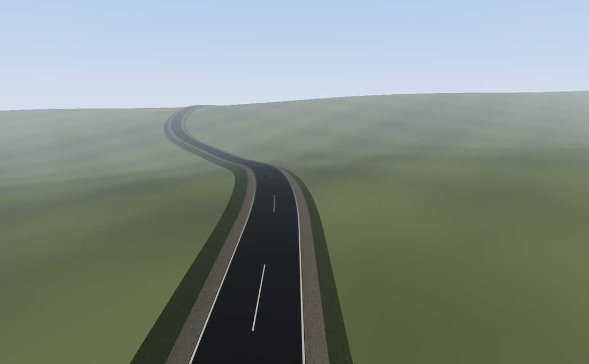

Roads
=====

.. rst-class:: introduction

A road is a 3D centreline and a *profile*: the shape of a cross-section, from
the crown of the carriageway out through the shoulder to the verge that meets
the ground. Sweeping the profile along the centreline gives a surface a car
can drive on.

``OpenGLContext.scenegraph.road`` builds the geometry and material of a road
from a centreline you give it. It does not choose where a road goes, whether a
valley gets a bridge or a causeway, or how the ground is reshaped to meet the
road. Those are authoring decisions, made by `OpenGLContext-editor
<https://github.com/mcfletch/openglcontext-editor>`__ and described
:ref:`below <road-layout>`. A game that generates a road at run time, or an
editor that draws one under the cursor, needs only this module.

   ``python tests/roads_demo.py``: 452 m of two-lane road. See
   :ref:`roads-demo`.

One road
--------

.. code-block:: python

   from OpenGLContext.scenegraph.road import road_mesh, RoadProfile

   mesh = road_mesh(
       [(0, 12, 0), (60, 14, 20), (140, 13, 10), (220, 9, -40)],
       RoadProfile(lanes=2),
       spacing=5.0,
   )

``road_mesh`` returns a :doc:`PBRMesh <pbr>` with positions, normals, tangents
and texture coordinates, and a road material. Put it in a ``Shape`` to draw
it, or give it to the baker to write it into tiles.

``spacing`` is in metres, and it sets the road's level of detail. The
centreline is resampled to that interval before the sweep, with one ring of
vertices per point. The same route at ``spacing=40`` is the road a distant
tile carries. Without ``spacing``, the points you give are swept as they are.

.. _roads-demo:

Demo
~~~~

``python tests/roads_demo.py`` sweeps 452 m of two-lane road from an alignment
of straights and curves laid over a height function. From the centre line
out, the section has a carriageway with centre dashes and edge lines, a gravel
shoulder on each side, and a grass verge falling to the ground. Press
:kbd:`d` to resample the centreline at 30 m instead of 4 m and print the
counts again. Press :kbd:`w` to wet the tarmac.

An application builds the road and puts it in a node:

.. code-block:: python

   from OpenGLContext.scenegraph.basenodes import Appearance, Shape
   from OpenGLContext.scenegraph.road import RoadProfile, road_mesh

   centreline = [(0, 1.3, 55), (0, 1.3, 10), (-9, 1.5, -55), (-41, 6.1, -150),
                 (-56, 12.7, -250), (-33, 9.4, -345), (-8, 5.2, -405)]
   mesh = road_mesh(centreline, RoadProfile(), spacing=4.0)
   road = Shape(geometry=mesh, appearance=Appearance(material=mesh.material))
   print(len(mesh.positions), 'vertices,', len(mesh.indices) // 3, 'triangles')
   # 840 vertices, 1428 triangles

The demo prints the size of the road it built. Only the resampling interval
differs between these two lines:

.. code-block:: text

   452.3 m of road at 4 m spacing: 115 points, 805 vertices, 1368 triangles
   451.9 m of road at 30 m spacing: 17 points, 119 vertices, 192 triangles

The profile
~~~~~~~~~~~

``RoadProfile`` is measured out from the crown, in metres:

.. list-table::
   :widths: auto
   :header-rows: 1

   * - Field
     - Default
     - Meaning
   * - ``lane_width``
     - 3.7
     - width of one lane
   * - ``lanes``
     - 2
     - number of lanes
   * - ``shoulder_width``
     - 1.5
     - the sealed strip outside the carriageway
   * - ``shoulder_drop``
     - 0.10
     - how far the shoulder sits below the carriageway edge
   * - ``verge_width``
     - 3.0
     - the grassed slope out to the ground
   * - ``verge_drop``
     - 1.2
     - how far the verge falls over its width
   * - ``crossfall``
     - 0.02
     - the camber that drains the carriageway, as a fraction
   * - ``texture_length``
     - 25.0
     - metres of road covered by one repeat of the texture

``carriageway_width`` and ``total_width`` return the sums of those widths.
The centre-line dashes are part of the texture, so ``texture_length`` sets
their length.

``section_offset(across)`` returns how far below the crown the road surface
is at a distance ``across`` from the centre line. It takes one value or an
array, and past the road's edge it returns the verge's value. Use it to place
something by its distance along and across the road, such as a vehicle, a
marker or the foot of a sign, at the road's actual height, without a physics
query that could hit something else standing there.

``section_offset(across, bank)`` also takes the corner's lean (see
:ref:`banking`). A banked section has less camber, and past a certain lean it
has none.

How a road is swept
~~~~~~~~~~~~~~~~~~~

Each centreline point gets a **frame**: the tangent along the line, the right
vector across it, and the up vector from their cross product. The profile is
placed in that frame, so the carriageway tilts on a climb and keeps its width
through a bend. The up vector is world up unless the road is given a lean,
which rolls the frame. That lean is how a corner is banked.

.. _banking:

Banked corners
~~~~~~~~~~~~~~

A corner can be **superelevated**: the whole carriageway is rolled about the
centreline so that it leans into the turn. Part of the car's weight then helps
hold it on the line, so the car can take the corner faster, or take a tighter
corner at the same speed. A banked road can keep its design speed through
country where a flat road would need long, wide curves.

.. code-block:: python

   from OpenGLContext.scenegraph.road import bank_profile, banked_sections, road_mesh
   bank = bank_profile(line, speed=200 / 3.6, profile=profile, closed=True)
   mesh = road_mesh(line, profile, bank=bank,
                    sections=banked_sections(sections, bank, profile))

``bank_profile(line, speed, profile, maximum, gradient, baseline, closed)``
returns the lean at each centreline point as a fraction: the rise across the
road divided by the distance across. **Positive is a right-hand bend**, whose
right-hand side is the low one. Each corner gets the lean that *balances* a
car at ``speed``. At that speed the lean alone holds the car on the line and
the tyres need no grip, so ``speed`` is a minimum: the corner can be taken
faster.

.. list-table::
   :widths: auto
   :header-rows: 1

   * - Argument
     - Default
     - Meaning
   * - ``speed``
     - none
     - the speed corners are banked for, in m/s
   * - ``maximum``
     - 0.10 (``MAXIMUM_BANK``)
     - the largest lean allowed, whatever the corner needs
   * - ``gradient``
     - 0.005 (``BANK_GRADIENT``)
     - how much faster the carriageway edge may climb than the centreline in a
       transition
   * - ``baseline``
     - 30.0 m (``CURVE_BASELINE``)
     - the length of road over which curvature is measured
   * - ``closed``
     - ``False``
     - whether the line is a circuit

The default maximum is ten per cent. Highway practice ranges from about four
per cent where ice is expected, because a vehicle stopped on a steeper bank
slides down it, to about twelve per cent where it is not. At ten per cent, a
corner can be taken about ten per cent faster than the same corner flat, or
about a fifth tighter at the same speed. You can pass a larger ``maximum``.

The lean builds up before the corner. A road cannot roll from camber to full
bank at one point, so ``gradient`` limits how fast the lean changes per metre.
For a full bank on a two-lane road that gives about seventy metres of
transition. The transition straddles the corner's entry, so a car arrives
already leaning. A corner too close to the next one for a full transition is
banked as far as the road between them allows. A road that is not a circuit
starts and ends flat.

As the lean grows, it uses up the camber. A crowned carriageway drains both
ways and a banked one drains one way, so the outer half rotates up about the
crown until the whole carriageway is one plane. ``banked_sections(sections,
bank, profile)`` applies that to sections already computed.
``RoadProfile.banked(bank)`` does the same for a profile.

``plan_curvature(line, baseline, closed)`` computes the curvature beneath all
of this: how tightly the line turns at each point, in 1/metres, signed the
same way. It measures over ``baseline`` metres of road rather than between
neighbouring samples. A line sampled every few metres represents an arc as
chords, and three neighbouring points would read as a corner much tighter
than the arc.

A bridge deck, a tunnel bore, a causeway's fill and the road collider all
accept a ``bank``, so everything swept along a banked corner leans with it.

.. _widening:

Passing places
~~~~~~~~~~~~~~

``widened_sections(sections, widening, profile)`` adds ``widening`` metres of
carriageway to a stretch of road, split evenly about the crown. The shoulder
and verge move out with it. ``RoadProfile.widened(extra)`` does the same for a
profile.

.. code-block:: python

   from OpenGLContext.scenegraph.road import banked_sections, widened_sections
   cut = widened_sections(sections, widening, profile)   # first the extra tarmac
   cut = banked_sections(cut, bank, profile)             # then the camber it leaves

A section's shape is linear in its carriageway width, so widening combines
with other changes. Widening a section already blended for a structure gives
the section that structure would have if the road were that wide throughout,
so a bridge deck with a passing place needs no special case. Apply widening
*before* :ref:`banking <banking>`: banking reads the carriageway edge from
the section it is given, and so carries the camber out to the widened edge.

Pass the same widening to the collider, ``RoadColliders(..., widening=...)``.
A collider swept at the normal width puts a wall along each edge of the extra
tarmac. A baked world writes the widening beside the centreline.

Widening does not add a lane. The carriageway gets wider and its markings
move out with it. Extra lane lines, and a climbing lane added on the uphill
side only, are not generated.

.. _circuits:

Circuits, and roads built a stretch at a time
~~~~~~~~~~~~~~~~~~~~~~~~~~~~~~~~~~~~~~~~~~~~~

The frame at each point is built from the segments on either side of it. The
two *ends* of a line have only one segment each, so they use a one-sided
tangent. That suits a road that stops, but not a circuit, where the point
before the first is the last. Pass ``closed=True`` to ``sweep_frames`` or
``road_surface`` to treat the line as a ring, so the section at the seam
matches the road on either side. A circuit can be written either with a new
last point or with its first point repeated at the end.

Do not sweep a stretch of a longer road on its own. The frames at its ends
would come from the one segment inside the stretch, not from the road it
joins, and the section there would be rolled away from its neighbour's: by a
hand's breadth on a gentle bend, and by a quarter of a metre where a steep
bank meets a tight corner. Instead, sweep the frames of the whole line once
and give each stretch its own slice:

.. code-block:: python

   right, up = sweep_frames(line, bank, closed=True)
   part = road_surface(line[first:last], profile,
                       frames=(right[first:last], up[first:last]))

The bank is already in the frames, so it is not applied again. :ref:`The road
collider <roadcolliders>` builds its chunks this way, so neighbouring chunks
meet exactly.

A point written twice, for example by resampling that put two samples
together, or by closing a loop on a line that already ends where it began,
leaves a segment with no length and no direction. That segment takes the
nearest direction available, so the road keeps its width.

Working with the arrays
~~~~~~~~~~~~~~~~~~~~~~~

``road_surface(points, profile)`` returns ``(positions, normals, texcoords,
indices)`` without wrapping them in a node. Use it to write your own
geometry, build a collider, or feed a tile writer.
``resample_polyline(points, spacing)`` is the resampler on its own.

The surface
-----------

``tarmac_material(wetness, seed)`` builds the PBR material, and
``road_texture(size, seed)`` builds the image it uses: asphalt, the gravel
shoulder, the grass verge and the lane markings, laid out across the same
section the profile sweeps.

Wetness runs from 0 to 1. It darkens the albedo, to 45% when fully wet,
and lowers the roughness from 0.72 to 0.12. A wet road is nearly a mirror, and
its reflections come from the :ref:`environment lighting
<environment-lighting>`; there is no separate reflection pass. A game can
change the wetness with the weather.

.. code-block:: python

   from OpenGLContext.scenegraph.road import road_mesh, tarmac_material
   mesh = road_mesh(route, spacing=5.0,
                    material=tarmac_material(wetness=0.8, seed=3))

``seed`` varies the surface noise, so two roads in one scene do not repeat the
same pattern. Pass ``image`` to use your own texture in place of the
generated one.

.. _roadshade:

Shade on the road
~~~~~~~~~~~~~~~~~

A forest road drawn in full sun while everything beside it is in deep shade
looks like a lit strip pasted onto a picture of a wood. ``shade`` is the
fraction of sunlight that reaches each point of the centreline, from 0 to 1.
It is written into the surface's vertex colours:

.. code-block:: python

   mesh = road_mesh(route, profile, spacing=5.0,
                    shade=lambda points: terrain.shade(points[:, 0], points[:, 2]))

``shade`` is either an array with one value per swept point, or a callable
that takes the points. Use a callable with ``spacing``, because the number of
points is not known until the road is resampled. The whole section at one
point gets one value. The shade is baked in, not lit each frame, because the
trees and the sun do not move; see :ref:`shade under the trees
<canopyshade>`.

.. _road-layout:

Laying out a road
-----------------

Choosing where a road goes is authoring work, done in `OpenGLContext-editor
<https://github.com/mcfletch/openglcontext-editor>`__. The editor produces the
finished centreline and the structures along it; the runtime on this page
draws them. This section describes what the editor does, so you can predict
the roads it makes.

.. _route:

The plan
~~~~~~~~

A line drawn across a landscape without regard to the ground climbs and drops
wherever the ground does. If it is then held to a drivable grade, it
separates from the ground by the difference, and over real relief most of its
length ends up on a viaduct or in a tunnel. On the shipped landscape, an
ellipse drawn this way ends up **72% carried** on structures, and no grade
limit changes that: no drivable grade follows five hundred metres of relief
over four kilometres.

``ease_route`` moves the line instead. It slides each point along its own
contour, towards the height of its neighbours, so the route goes round the
shoulder of a hill instead of over it. It keeps the designer's shape: no
point moves further than ``reach`` from where it was placed, and an open
route keeps its ends exactly.

.. code-block:: python

   from OpenGLContext_editor.world.route import cornering_radius, ease_route
   plan = ease_route(drawn, natural_ground, closed=True, spacing=6.0,
                     minimum_radius=cornering_radius(42.0))

Moving the line onto easier ground adds corners, and a corner tighter than the
tyres can hold at the road's design speed makes cars leave the road.
``minimum_radius`` limits corner radius. It is applied between iterations, not
only at the end, because one iteration can tighten a corner the previous one
opened. ``spacing`` also matters. A plan with points tens of metres apart is a
polygon, and the road turns through each whole corner at a single vertex.

A route that crosses a summit exactly has no downhill side there, because the
ground across the route is level. ``ease_route`` leaves such a route where it
is, since sliding cannot choose a side without picking one at random.

The alignment
~~~~~~~~~~~~~

Two limits turn a line drawn over a landscape into a road:

- A grade limit - how steeply the road may climb. One in thirteen (0.075) suits
  a fast road; one in eight is a mountain pass.

- A design speed - how fast the road is meant to be driven. This limits how
  sharply the grade may *change*. A road that climbs at its limit and descends
  at its limit a few metres later obeys the grade limit and still throws a fast
  car into the air. A crest taken at speed ``v`` over a vertical curve of
  radius ``R`` lifts ``v²/(gR)`` of the car's weight off its wheels, so the
  design speed sets the shortest vertical curve the alignment may use.

``follow_terrain`` in ``OpenGLContext_editor`` applies both; see the `editor's
README <https://github.com/mcfletch/openglcontext-editor>`__. The runtime
takes the finished centreline.

The earthworks
~~~~~~~~~~~~~~

Where the road is off the ground, it sits on an *earthwork*. Fill slopes down
from the shoulder to meet the land; a cutting slopes up to it. How far out the
slope reaches depends only on the height difference: a road already on the
land disturbs almost nothing, and a road forty metres above a valley needs a
wide embankment. A slope of about one in one and two-thirds is close to the
steepest that unsupported earth holds.

The ground under the carriageway is set a hand's breadth *below* the road,
because a road is built on a formation and surfaced on top of it. This also
avoids depth fighting: two surfaces at exactly the same height flicker through
each other.

.. _bores:

Bridges, causeways and tunnels
------------------------------

Choosing structures
~~~~~~~~~~~~~~~~~~~

Beyond a certain height difference the ground cannot take the road. An
embankment fourteen metres tall needs fill that grows with the square of its
height, and a cutting eighteen metres deep has to dispose of its spoil and
support its faces. Beyond those limits the road is **carried**: on a deck
over low ground, or through a bore in high ground. Under a deck the land is
left untouched, because filling the valley would bury the bridge in its own
hill. Over a bore the land is also left untouched, because digging the hill
down to road level would turn the tunnel into a cutting.

``OpenGLContext_editor.world.structures.choose_structures`` chooses the
structures from the finished alignment and the undisturbed land. It returns
the road split into runs of ``Op.DIRT``, ``Op.CAUSEWAY``, ``Op.BRIDGE`` and
``Op.TUNNEL``. Every point is in exactly one run, so the runs describe how the
whole road is built:

.. code-block:: python

   from OpenGLContext_editor.world.structures import choose_structures
   for run in choose_structures(alignment, natural_ground, closed=True):
       print(run.kind, run.length(alignment))

A tunnel must be at least sixty metres long and a bridge forty; a shorter
departure from the ground is dug out or filled instead. Each structure then
extends along its approaches, by up to 120 metres, until the road is within
an abutment's height of the ground, or the cover over a tunnel falls to
``PORTAL_COVER``. A deck therefore lands on something and a bore opens at a
portal, instead of either ending in the air. A designer can override any run
with an ``overrides`` triple.

A **causeway** is for a road a few metres above low ground, such as a lake
margin or a shallow gully, where a deck is more structure than needed and an
embankment at the natural slope of earth would spread across a field. It is
fill *retained* at the width of the road, with a low wall along each edge, and
the ground to either side is left as it was. The alignment is held above the
waterline with some freeboard, and its approaches climb to meet it.

A **portal is placed where the bore fits inside the hill**, measured to the
*crown* of the arch, not to the carriageway. A bore's arch is seven or eight
metres above the road, so a portal placed where the road has two metres of
soil over it would have its mouth buried. Between the portal and the point
where the road reaches the surface is an ordinary cutting.

.. _bore-openings:

Tunnel mouths in the ground
~~~~~~~~~~~~~~~~~~~~~~~~~~~

A height field cannot represent a hollow hill, so at a portal it puts the
hillside across the carriageway. The mouth is therefore cut out of the
ground. ``OpenGLContext.scenegraph.roadworks.bore_opening`` returns a
``holes`` mask that is true where the ground lies inside the bore: over the
carriageway, within the width of the portal face and below its top. The
:ref:`ground mesh and the collider <holes>` are both cut with that mask. The
mask covers only the mouth. Where the hill has closed over the crown there is
no ground between the road and the arch, so nothing needs to be cut, and the
bore's lining is what is seen through the opening.

.. code-block:: python

   from OpenGLContext.scenegraph.roadworks import bore_opening
   mouth = bore_opening(centreline[run], field.sample, profile=profile)

Two constants in ``roadworks`` shape the opening:

- ``BORE_INSET`` (0.3 m) draws the opening slightly *inside* the portal face,
  so the face covers the edge of the cut instead of standing level with a
  jagged edge.
- ``BORE_APPROACH_CELLS`` (6) clears the road's width in front of each face,
  measured in cells of the grid the ground is sampled on. Without it, the step
  from the cutting up to the hillside is drawn between one sample under the
  road and the next one over the hill.

A world whose ground is meshed into its :ref:`tiles <tiledground>` cuts the
openings when it is baked, against the portal's own outline rather than a
run-time grid. ``OpenGLContext_editor.world.road.RoadPath.bore_openings``
returns every mouth in one mask, and ``HeightfieldLayer(holes=...)`` cuts the
tiles with it. The run-time mask then only has to cut the collider's field.

The tiles and the collider are cut with the same mouths only if both are built
from the same figures, so a baked road records them: its entry in the
tileset's ``extras.roads`` carries ``bores``, a ``BoreCut`` -- the tunnel's
``clearance``, ``margin`` and ``portalBorder``, the ``inset`` and the
``approach`` in metres. ``BoreCut.openings(runs, ground, profile)`` builds the
one mask for every bore of a road, and a game builds its collider's with the
cut the world recorded:

.. code-block:: python

   from OpenGLContext.scenegraph.roadworks import BoreCut
   cut = BoreCut.from_json(road_record.get('bores'))
   holes = cut.openings(tunnel_runs, field.sample, profile=road_profile)

Each side cuts the surface it has: the bake its height function, the game its
field, which is the same ground sampled on a grid.

The portal must also be *dug*, which is authoring work:
``OpenGLContext_editor.world.road.conform_terrain`` lowers the ground around
each portal to the top of its face, and lets it rise from there at the slope
the rest of the cutting uses. Without it, the ground steps from the
carriageway to the hillside between one sample and the next, and the ground
over the arch is only one sample thick.

Building structures
~~~~~~~~~~~~~~~~~~~

``OpenGLContext.scenegraph.roadworks`` sweeps the structures along the same
centreline, with the same frames, as the carriageway, so they stay aligned
with it through bends and climbs:

.. code-block:: python

   from OpenGLContext.scenegraph.roadworks import (
       bridge_meshes, causeway_meshes, tunnel_meshes)
   deck = bridge_meshes(run, profile, ground)      # deck, parapet, piers
   fill = causeway_meshes(run, profile, ground)    # body, wall
   bore = tunnel_meshes(run, profile)              # bore, portals

Each returns its parts as a ``{name: mesh}`` dictionary rather than one merged
mesh, so a caller can light, cull or write each part separately.

``BridgeProfile`` sets the deck's structural depth (``deck_depth``, 1.8 m),
the barrier on its edges (``parapet``, a :ref:`BarrierProfile <barriers>`),
and the distance between piers (``pier_spacing``, 45 m). Each pier reaches
down to the ground beneath it. The two ends are wider abutments, where the
deck rests on the land. **No pier is built where the ground rises above the
underside of the deck**, because there the hill carries the deck, and a pier
would be a block of concrete across the carriageway.

``CausewayProfile`` sets the wall on each edge (``wall_height``, 0.8 m) and how
far the fill leans out per metre of depth (``batter``, 0.09). The wall is kept
below a seated driver's eye, so the driver can see what the causeway crosses.
The batter is near-vertical, because a causeway is a retained structure, not a
heap of earth. The body reaches down to the ground under each point, with a
lip where it meets the road so the wall always has something beneath it.

``TunnelProfile`` sets the crown's height above the carriageway
(``clearance``, 7.5 m), how far below that the arch's feet sit, and how far
the portal's face extends around the arch (``portal_border``). The portal face
is a **wall with the arch in it**: a flat top and two uprights. The ground is
dug back to the face and meets its top edge
(``OpenGLContext_editor.world.road.conform_terrain``), and a ground grid
metres wide can meet a straight edge but not a curve. The bore is a **closed
tube**. The ground it runs through is cut away, so the lining is the only
surface under the road; a tube open underneath would leave a trench beside
the carriageway for a wheel to drop into.

.. _barriers:

Barriers
~~~~~~~~

A bridge deck and a causeway have a **barrier** along each edge.
``BarrierProfile`` sets its shape. A barrier must be tall enough to stop a car
and low enough to see over. It does both by having two parts. A solid
``kerb`` (default 0.5 m) is what a wheel hits. An open railing above it, of
``rails`` bars (default 2) on posts every ``post_spacing`` metres (default
2.5), brings the barrier to its full ``height`` (default 1.1 m) while being
mostly open.

A driver sees down past the kerb, through the railing. ``sightline(eye,
offset)`` returns how steeply, in degrees, a driver whose eye is ``eye``
metres above the carriageway can look down past a barrier ``offset`` metres to
the side:

.. code-block:: python

   BarrierProfile().sightline(1.31, 3.6)                        # 12.7 degrees
   BarrierProfile(height=0.95, kerb=0.95).sightline(1.31, 3.6)  #  5.7 degrees

From a deck forty metres up, the nearest visible ground is then 178 m away with
the default barrier, and 400 m away with a solid wall, so the valley floor
below the bridge is hidden. A ``kerb`` at or above ``height`` is a solid wall,
and no railing is built. That suits a causeway a metre above a marsh, where
there is nothing below to see.

Barriers must be collided with as well as drawn, or a car drives through the
railing and off the deck. ``barrier_wall(points, profile, barrier, bank)``
returns the collision shape: the barrier's footprint extended to its full
height, solid, because the gaps in a railing are for seeing through, not
driving through. :ref:`RoadColliders <roadcolliders>` puts one along every
stretch marked as carried.

Tunnel lighting
~~~~~~~~~~~~~~~

A bore darkens with distance from its portals. The lining carries **its own
shade** in its vertex colours: full daylight at each portal, falling to
``gloom`` (0.14) of it ``daylight`` metres in (55 m). A driver goes into the
dark and out again with no light source involved. A bore shorter than twice
``daylight`` never becomes fully dark.

A bore is also lit by lamps, in two ways:

- ``lamp_spacing`` (default 25 m) hangs light fittings along the crown, and the
  pool of light each one throws is *baked into the lining* (``bore_shade``).
  The whole length of the tunnel is then lit at any distance and at no
  per-frame cost. ``lamp_glow`` sets how much the pool brightens the lining and
  ``lamp_reach`` how far it spreads. A ``lamp_spacing`` of zero gives an unlit
  bore.
- A baked pool cannot light objects *in* the tunnel, such as a car under a
  lamp. ``tunnel_lamps(points, tunnel)`` returns where the fittings are, so a
  game can place a few real lights at the ones nearest the driver.

The lamp light baked into the lining is light, not a tint. The lining's
material sets ``bakedLight`` (``OGLC_materials_baked_light`` in a glTF file;
see :ref:`bakedlight`). This tells the renderer that the mesh's ``COLOR_0``
is light computed when the world was built. The three colour channels are
*added* as emission instead of multiplying the surface colour, so the lamps
show on the walls whatever the scene lighting, and a headlight still draws
its own circle over them. If the colours were read as a tint, the concrete
would come out dark, the few fittings turned into real lights would count
twice, and the whole bore would brighten and dim as those lights moved from
fitting to fitting.

The fourth channel of the same vertex colour is **how much of the outside sky
reaches that point** (``bore_sky``): 1 at each portal, 0 ``daylight`` metres
in. In this mode the renderer reads it as occlusion of the environment
lighting, not as transparency. The lining stays solid, and the sky does not
light the middle of a tunnel as brightly as the hillside above it.

Materials and facing
~~~~~~~~~~~~~~~~~~~~

Structures use ``concrete_material()``. A causeway's wall uses the same
material as the fill beneath it. A bridge deck's railing uses
``barrier_material()``, which is darker: the railing is the closest object to
the camera along a whole span, and in structural concrete under strong sun it
renders white. The darker material is not used on a solid wall, whose outer
face is lit only by the sky.

Every surface faces outward, towards where it is seen from. Sections are
wound so that this holds whichever order a section is written in, and when a
section is mirrored for the other side of the road. A face wound the other way
gets a normal pointing into the solid and renders unlit; on a causeway that
shows as a black band along the flank of the crossing. The one surface that
faces inward is a bore's lining, which is only seen from inside.

The road over a structure
~~~~~~~~~~~~~~~~~~~~~~~~~

On a structure the carriageway uses the road's **on-structure section**: the
verge is replaced by an *edge beam*. There is no ground beside a deck for a
verge to fall to, and grass does not belong inside a tunnel. The edge beam is
the kerb a parapet stands on, or the walkway beside the carriageway in a
tunnel. The road narrows onto the structure over a taper, and the structures
are built to the narrowed section.

The sweep takes one section per point for this.
``morphed_sections(profile, other, blend)`` builds them, and
``road_surface(points, profile, sections=...)`` accepts them. The same
mechanism :ref:`widens a road <widening>` for a passing place.

.. _signs:

Road signs
----------

A generated road already has what is needed to place warning signs: the
alignment has its curvature and grade, and the structures are recorded. Signs
can therefore be derived instead of placed by hand.
``OpenGLContext_editor.world.signs.warn_of`` reads a road and returns the
warnings it needs; ``OpenGLContext.scenegraph.roadsigns`` builds the sign
objects.

.. code-block:: python

   from OpenGLContext.scenegraph.roadsigns import SignFace, sign_meshes, sign_texture
   parts = sign_meshes(SignFace('bend-left', 60))  # post and plates, facing -Z
   plate = sign_texture('dip')                     # a face, painted not shipped

A sign is one prototype placed many times, so ``sign_meshes`` builds it at
the origin facing -Z, and each placement turns it to face the traffic. A
``SignFace`` is one sign: its kind, and the speed in km/h shown with it.
``sign_mesh`` builds the same sign as a single mesh reading from one texture
atlas.

The signs follow Ontario's designs. A warning is a black symbol on a
yellow diamond, with the advised speed on a rectangular tab below it. A speed
limit is a white rectangle reading MAXIMUM, the number, and km/h. Drivers
recognise the shape before they read the sign, so each plate's geometry is cut
to its outline instead of being a square with transparent corners. The
picture is drawn at the plate's own aspect ratio within its atlas cell, so
nothing is stretched. The faces are painted by code, so a world needs no sign
artwork.

Speeds for bends come from the bend itself. All three functions are in
``OpenGLContext.scenegraph.road``:

- ``corner_speed(radius)`` - the speed the tyres can hold,
  ``sqrt(grip * g * r)``.
- ``advisory_speed(radius)`` - the speed on the tab: 60% of ``corner_speed``,
  rounded down to 10 km/h. A tab showing the limit would be wrong for a wet
  road, a loaded car or a cold tyre.
- ``cornering_radius(speed)`` - the same rule in reverse, used when laying out
  a road to a design speed, so the road is signed by the rule it was built to.

All three take a ``bank`` (see :ref:`banking`), because a banked bend can be
taken faster, and a plate warning about a corner the lean already makes safe
teaches drivers to ignore plates.

``sight_distances(line, clear, reach=600, closed=True)`` returns, for each
centreline point, how far along the road a driver can see. A line of sight is
the *chord* between the driver and the point ahead, and anything standing
inside the bend between them blocks it. ``clear`` is how far from the road's
side the view is unobstructed. A bend of radius *r* can be seen about
``sqrt(8 * r * clear)`` round it, and a straight is seen as far as ``reach``
(``SIGHT_REACH``, 600 m). All values are in metres.

``clear`` is one value for the whole road or **one per point**, because the
surroundings change along a road. A viaduct has a see-through railing and
nothing beyond it, so it can be seen along however it curves. In a bore the
wall is at the road's edge, and nothing outside the tube can be seen. Only
the plan is considered: a crest that hides the road beyond it is not taken
into account.

Use sight distance for any decision about room ahead on a stretch not yet
seen, such as whether there is room to overtake on a two-lane road. A clear
look-ahead on a blind bend means the end of the road cannot be seen, not that
the road is empty. Passing an 80 km/h car at racing speed takes a couple of
hundred metres; a road through a wood with trees at the verge offers about
half that.

The posted limit is set, not derived, because it is a decision rather
than a measurement. ``ProceduralWorld.posted`` (80 km/h by default; 0 for an
unposted road) is repeated along the circuit every 1500 m, skipping places
where a warning already stands, because two plates close together read as one
sign.

A warning stands a **stopping distance** before its hazard: far enough ahead
to act on, and near enough to refer to that hazard rather than the next.
Hazards are measured against the design speed, because at some speed any
corner is too tight. Two hazards close together share one sign: a left bend
and a right bend become a double-bend sign; any other pair keeps the more
important one. The sign shows the lower of the two speeds.

A sign stands inside the corridor cleared for the road. ``SignProfile.offset``
(default 1.4 m) is how far outside the road's edge the post stands. In a world
with trees up to the verge, set it to less than the clearance.

.. _roads-gantry:

The start/finish line
---------------------

A circuit marks where each lap starts and ends: a chequered banner on a beam
across the carriageway, with a chequered line on the road beneath it. The
banner is a board with a face on each side, so it reads the same from both
directions.

.. code-block:: python

   from OpenGLContext.scenegraph.gantry import GantryProfile, gantry_mesh, start_line_mesh

   frame = gantry_mesh(span=12.0, drops=(0.2, 2.6))   # at the origin, road along Z
   paint = start_line_mesh(width=7.4, crossfall=0.02) # under it, on the road's camber

``span`` is the distance between the centres of the legs. ``drops`` is how far
below the road surface the ground under each leg lies, left leg first. The two
sides of a road are rarely level with it, and a leg that stopped at road
height would hang in the air on the low side. ``GantryProfile`` holds the other
dimensions, in metres:

- ``clearance`` (5.4) - from the road surface to the underside of the beam;
- ``beam_depth`` (0.45) and ``beam_width`` (0.34);
- ``banner_height`` (1.0) and ``banner_depth`` (0.07);
- ``leg_radius`` (0.14);
- ``margin`` (0.9) - how far outside the running surface the legs stand;
- ``line_width`` (0.8) - how far the painted line reaches along the road;
- ``line_lift`` (0.04) - how far above the road surface the line is drawn. Paint
  at the surface depth-fights with it, and paint much higher looks like a plank.

The painted line follows the road's **camber**. A flat strip across a
cambered road would stand above the surface at the crown and sink into it at
both edges. Its squares are sized from the row depth so they come out square,
and there is an even number of them, so the crown falls on a joint and the two
halves of the line mirror each other.

The line's chequer is geometry; the banner's is a texture. From the
driver's seat the line is seen nearly edge-on. A texture nine times wider than
it is deep loses its pattern to the mipmap level that angle selects, and shows
as a plain white bar. Each square on the road is therefore its own flat-colour
quad, which stays a chequer at any angle and distance. The banner is seen face
on, so a texture works there and costs less.

The whole marker is one draw. The steel, the banner and the two road
paints are four corners of one image (``gantry_atlas``), so the frame and the
line share one material and a tile writes them as one mesh.
``OpenGLContext.scenegraph.atlasmesh`` provides this, and the warning signs
use it too.

The legs are solid. ``gantry_legs`` returns where each leg stands and how much
room it takes, so a physics world can add a body without the geometry. The
baker writes them into the world's :ref:`props <roads-props>`, so a car hits a
gantry leg whatever the streamer has loaded.
``OpenGLContext_editor.world.gantry.start_finish`` places the gantry from the
road: the crown at the line, the span from the carriageway and its shoulders,
and each leg's drop from the ground under it. See :ref:`baking-gantry`.

.. _roads-props:

Props
-----

A boulder on the verge, a broken-down car and a fence have one thing in
common: each is *placed*, a mesh and a collision body at one spot, and neither
moves. ``OpenGLContext.scenegraph.props.Prop`` describes one: its kind, its
position, which way it faces, and how much room it takes. A viewer draws it
and a physics world collides with it, each from the same description.

.. code-block:: python

   from OpenGLContext.scenegraph.props import Prop, rock_mesh
   from OpenGLContext.physics.props import PropColliders

   boulder = Prop.of(rock_mesh(radius=1.4, seed=3), kind='rock', position=here)
   obstacles = PropColliders(physics_world, world.props)
   obstacles.update(car_position)                   # once a frame

The collision body does not come from the tiles. Tile geometry is
level-of-detail geometry that loads and unloads as the camera moves, and a
collider built from it would let a car drive through a rock when the tile
behind it is swapped. Props are stored in the tileset's ``extras``, like the
road, and the game creates bodies for the ones within reach. A world can hold
hundreds of boulders, and the physics broadphase pays for every body it holds.

A prop names the shape its measurements describe. A ``box`` stops a car.
A ``dome`` is driven over: a stone lying in the grass is part of the ground,
and a box the same size would be a kerb across the hillside. See
:ref:`Physics <physics-props>`.

The toolkit ships no prop art, with one exception. ``rock_mesh`` makes a
boulder from a subdivided icosahedron, pushed in and out by a smooth function
of direction and settled into the ground, so a world can be strewn with stone
without an asset pipeline. The rock is weathered: its vertex colours mottle
the stone from facet to facet and add moss on the upward faces. These colours
multiply the material's base colour, so a caller that gives ``rock_mesh`` its
own stone material gets that stone weathered, not replaced.

.. code-block:: python

   from OpenGLContext.scenegraph.props import RockProfile, rock_mesh

   bare = rock_mesh(radius=1.4, seed=3, profile=RockProfile(moss=0.0))
   deep = rock_mesh(radius=1.4, seed=3, profile=RockProfile(moss=1.0, mottle=0.5))

``RockProfile`` holds the shape and the weathering:

- ``roughness`` (0.32) - how far a vertex may move from the starting sphere, as
  a fraction of the radius;
- ``facets`` (2) - how many times the icosahedron is subdivided;
- ``settled`` (0.34) - how much of the bottom is pressed into the ground;
- ``mottle`` (0.34) - how much the stone's colour varies over one boulder, as a
  fraction of it;
- ``moss`` (0.7) - how thick the moss is where it grows, from 0 (bare stone) to
  1 (full cover). Where moss grows comes from the rock's shape, so a low value
  thins the same patches rather than moving them.

The stone is dark. A boulder with the reflectance of a paving slab is the
brightest object in a landscape and looks artificial.

Baked roads
-----------

A road baked into a tileset (see :doc:`Baking a world <baking>`) arrives as
ordinary glTF content, and the game streams it like any other tile. A game
usually also needs the centreline, to place a car on the grid, time a lap or
drive an opponent, and the geometry does not carry it.

The editor's road layer therefore writes each road into the tileset's
``extras``, under a ``roads`` key. Each entry has:

- ``name``;
- ``centreline`` - the points of the centreline;
- ``closed`` - whether the road is a circuit;
- ``start`` - where a lap begins, in metres along the centreline;
- ``length``, ``carriagewayWidth`` and ``totalWidth``, in metres;
- ``posted`` - the speed limit in km/h, 0 for none;
- ``profile`` - the cross-section;
- ``bank`` - one lean per centreline point, empty for a road with flat corners;
- ``widening`` - the extra carriageway width at each point, empty for a road of
  one width;
- ``structures`` - each with a ``kind`` and the distances ``from`` and ``to``
  along the centreline, so a game can tell the car is on a bridge without
  querying the geometry.

.. code-block:: python

   import json
   tileset = json.load(open('/tmp/world/tileset.json'))
   for road in tileset['extras']['roads']:
       print(road['name'], road['length'], len(road['centreline']))

The centreline is written at a coarse spacing; a game resamples it for its
own purposes.

A fast vehicle should not drive on the tiles. Tile geometry is
level-of-detail geometry: two resolutions of one curve can be most of a metre
apart, and the surface steps under the wheels every time the streamer refines
a tile. Build the carriageway's collider from the centreline and the
cross-section in the ``extras`` instead, which gives one surface at one
resolution everywhere. See :ref:`colliding with a world that streams
<roadcolliders>`. A walker is slow and tolerant enough to use the tiles.

.. _roadcourse:

Where something is on a road
----------------------------

``OpenGLContext.scenegraph.roadcourse.RoadCourse`` answers what a game asks
of a road while it runs, from the centreline alone:

.. code-block:: python

   from OpenGLContext.scenegraph.roadcourse import RoadCourse

   road = RoadCourse(entry['centreline'], closed=entry['closed'],
                     bank=entry['bank'] or None)
   car = road.tracker()                   # one per car
   index, off = car.nearest(position)     # nearest point, metres off the line
   station = car.station_of(position)     # metres along the road
   right = road.across(index)             # unit vector to the road's right

- ``nearest(position, hint=None)`` returns the index of the nearest
  centreline point and the distance from the line, in the centreline's units,
  measured across the ground (x and z).
- ``station_of(position, hint=None)`` returns the distance along the road,
  between the samples, from 0 to ``length``. On a closed road ``length``
  includes the segment back to the first point.
- ``across(index)`` returns the unit vector across the road towards its right,
  rolled by ``bank`` where the road leans.
- ``stations``, ``segments``, ``point(index)`` and ``bank_at(index)`` are the
  line itself.

Without a hint each question scans the whole line. With one -- the index a
position was near last time -- it searches ``window`` points either side
(``WINDOW``, 32, by default) and scans the whole line only when the answer
lies on the window's edge or further than ``near_enough`` (default 25) off the
line. A ``Tracker`` keeps the hint for one caller, so a car asking every
physics step costs a window of the line rather than all of it;
``tracker.forget()`` makes the next question a full scan, for a car that has
been moved somewhere unrelated. Outside the corner of a sampled line two
segments can be equally near, and either answer is returned.

Limits
------

- Junctions are not modelled. Two roads that cross produce two overlapping
  surfaces, not an intersection.

- Every bridge is a deck on blade piers, whatever the span. Arch, truss and
  cable-stayed bridges are not generated.

- A tunnel is a single bore. Twin bores and cross-passages are not generated.

- A road uses its ordinary section or its on-structure section, with a taper
  between them. Widening adds carriageway evenly about the crown; a climbing
  lane on one side only, or an extra marked lane, needs a section array you
  build yourself and pass to ``road_surface``.
