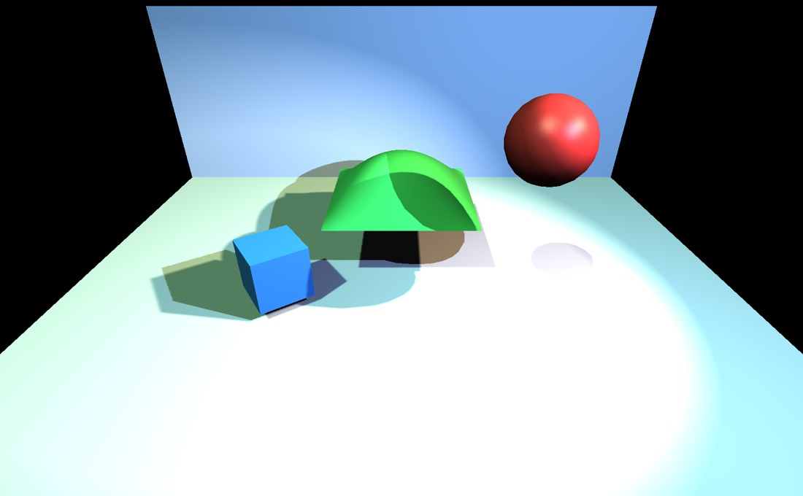
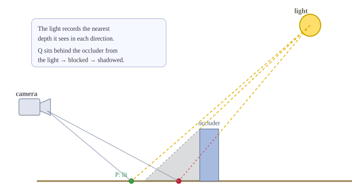
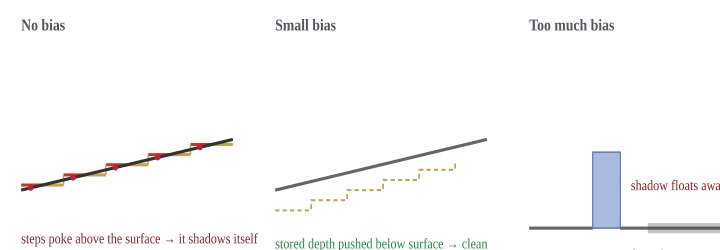
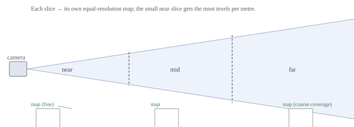
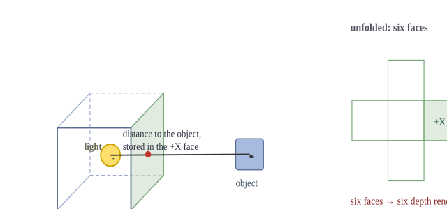

Shadows
=======

.. rst-class:: introduction

OpenGLContext renders dynamic, real-time shadows in the core profile. The same
shadow system lights both the :doc:`VRML97 core lighting shader
<renderpasses>` and the :doc:`PBR renderer <pbr>`, so shadows behave
identically whichever you use. This document explains, from the ground up, how
the shadows are made, why they sometimes look wrong, what each fix actually
does, and how the different light types are handled.

   The core-profile shadow system in ``tests/shadow_demo.py``: three coloured
   lights cast live shadows from moving objects onto the floor and wall. Where an
   object blocks one light, its shadow is tinted by the others.

The Core Idea: Photograph the Scene From the Light
--------------------------------------------------

A surface is in shadow when something blocks the light from reaching it. The
trick real-time renderers use to work that out is *shadow mapping*: before
drawing the scene from the camera, draw it once more from the light's point of
view, and keep only the distance to the nearest surface the light can see.
That depth image is the **shadow map** -- think of it as a photograph the
light takes, recording "the closest thing in each direction".

   Both the camera and the light "see" the scene. When drawing point Q, the
   renderer asks the light's map how close the nearest surface was in Q's
   direction; the occluder was nearer, so Q is in shadow. P has nothing between
   it and the light, so it is lit.

When the visible scene is finally drawn from the camera, every lit point is
tested: transform the point into the light's view, look up the stored nearest
depth for that direction, and compare. If something was closer to the light
than this point is, the light is blocked here and the point is in shadow. The
depth-only pass uses a stripped-down position-only shader and writes no
colour, but it does mean the scene geometry is drawn once per shadow-casting
light in addition to the camera view -- so shadow cost grows with the number
of shadow-casting lights and the amount of geometry.

Turning Shadows On and Off
--------------------------

Shadows are on by default in the core profile. Control them with environment
variables:

.. list-table::
   :widths: auto
   :header-rows: 1

   * - Variable
     - Effect
   * - ``OPENGLCONTEXT_SHADOWS``
     - shadows on/off (default on; ``0``/``false``/``off`` disables)
   * - ``OPENGLCONTEXT_SHADOWS_SOFT=1``
     - contact-hardening (PCSS) soft shadows for spot lights
   * - ``OPENGLCONTEXT_SHADOW_CASCADES=n``
     - pin the directional detail level instead of adapting to the frame rate

A light casts a shadow when its ``castShadows`` field is set, which is the
default for all three light types; clear it on a light that should light
without occluding. Loaded glTF ``KHR_lights_punctual`` lights carry the
extension's own ``castShadows`` where it is given, and default to casting for
a sun.

Why Shadow Edges Look Blocky
----------------------------

The shadow map is an ordinary image with a fixed number of pixels (texels).
One map has to cover everything the light illuminates. When the camera looks
closely at a shadow edge, a single map texel can cover many screen pixels, so
the edge steps along texel boundaries -- the classic blocky, stair-stepped
shadow. It is exactly like zooming into a small photo.

There are two independent ways to attack this. Give the map **more texels**
where they are needed, and **blur the edge** when reading it. Cascaded shadow
maps (below) do the first for sun light; PCF and PCSS filtering (below) do the
second. Neither is free: more resolution costs memory and fill time, and
blurring costs extra samples per pixel.

.. _acne:

Shadow Acne, Bias, and Peter-Panning
------------------------------------

The depth comparison has a precision problem. The stored depths are quantized
to the map's texels, so a lit surface's own depth rarely matches the map
exactly. Where the stored value lands just in front of the surface, the
surface reports itself as blocking the light -- it shadows itself, producing a
shimmer of dark speckles and stripes called **shadow acne**.

   Left: the quantized stored depth crosses the true surface, so it shadows
   itself. Middle: nudging the comparison clears the surface. Right: nudging too
   far detaches the shadow from where the object meets the ground
   ("peter-panning"). The fix is a balance between the two.

OpenGLContext combats acne with three cooperating nudges rather than one heavy
one, which keeps the bias small enough to avoid peter-panning:

- **Polygon offset** (the primary control) -- while the depth map is being
  drawn, the hardware pushes each polygon's stored depth slightly away from the
  light, so surfaces clear their own texels.

- **A depth bias** in the receiver shader, **measured in shadow-map texels** --
  the scale of what it has to clear, since the map holds one depth per texel and
  a surface departs from the stored value by about a texel's width across one.
  The default is 3 texels, and a light sets its own with ``shadowBias``.

- **A normal offset** -- the point being tested is nudged a short distance along
  its surface normal before the lookup, which cancels most of the remaining acne
  on surfaces facing the light at an angle, without the ground-gap that a larger
  depth bias would cause.

The texel is what makes one number work everywhere. A shadow map's depth is
1/z in a spot or cube map and linear in a cascade, and a texel covers a fixed
width in the cascade and a growing one in the others, so the same bias
expressed in a map's own depth units is a different slack in every map -- and,
in a perspective one, at every depth inside it. Measured in texels it is the
same slack throughout, does not change with the scale of the scene, and halves
when a map is given twice the resolution. It also cannot peter-pan: the offset
scales with the very texel the shadow's edge is already quantised to, so a
generous bias loses no grip on the contact point.

.. rst-class:: technical

The polygon offset and the normal offset live in ``passes/shadowmixin.py``
(``SHADOW_POLYGON_OFFSET_FACTOR/UNITS``, ``SHADOW_NORMAL_OFFSET``); the depth
bias is ``shadowmath.SHADOW_DEPTH_BIAS``, which is also the default of the
``shadowBias`` field every light carries. Each light's own value is converted
against that light's own projection by ``shadowmath.depth_bias_terms``, once
per map (per cascade, for a sun), and reaches the shader as the three
coefficients of ``shadowDepthBias[]`` -- so a light asking for more slack gets
it without loosening any other light's shadow, and a cube map needs no
separate allowance. There is deliberately no slope-scaled bias: the
normal-offset covers the common cases, and slope-scaling can be added per
target if a low-precision GPU needs it. The two failure modes are held apart
by ``tests/unit/test_shadow_bias_gl.py``, which renders a lit wall and a pole
standing on a floor and measures the speckle on one and the contact gap on the
other.

A note on rendering back faces
~~~~~~~~~~~~~~~~~~~~~~~~~~~~~~

A well-known alternative acne fix is to draw only the *back* faces of objects
into the shadow map (front-face culling), so the self-shadowing error lands on
surfaces the camera cannot see. OpenGLContext tried this and **removed** it:
it silently dropped shadows from open or single-sided casters -- a ground
quad, a leaf card, a wall with one-sided geometry -- and, stacked on top of
the offsets above, over-biased into peter-panning. Instead the depth pass
draws *all* faces (culling is disabled for it) and each geometry node still
honours its own ``solid`` flag, so closed solids cull normally and open shapes
still cast. Where the driver supports it, depth clamping is also enabled so a
caster poking through the edge of the light's view still writes depth instead
of being clipped away.

One Technique per Light Type
----------------------------

The three light types cover space differently, so each uses a shadow technique
suited to its shape. This is automatic; you do not choose it.

Directional light (a sun): cascaded shadow maps
~~~~~~~~~~~~~~~~~~~~~~~~~~~~~~~~~~~~~~~~~~~~~~~

A sun lights the whole visible scene with parallel rays. Covering that entire
area with one shadow map would spread its texels thin, and everything near the
camera -- where you notice detail most -- would be blocky. Cascaded shadow
maps (CSM) split the camera's view into a few depth slices and give *each
slice its own shadow map*. The near slice covers a small area with a
full-resolution map, so close shadows are crisp; distant slices cover more
ground more coarsely, where it matters less.

   Cascaded shadow maps dedicate a full map to each depth slice of the view,
   concentrating resolution where the camera is looking.

The number of slices adapts to the frame rate so shadows stay smooth; pin it
with ``OPENGLCONTEXT_SHADOW_CASCADES`` when you need identical output every
run (see below).

.. rst-class:: technical

Directional cascades use a fixed-width soft edge rather than the
contact-hardening PCSS below: a sun is infinitely far away and has no finite
size, so there is no distance-based penumbra to compute.

Spot light: a single map
~~~~~~~~~~~~~~~~~~~~~~~~

A spotlight illuminates a cone, which fits neatly inside one shadow map viewed
along the spotlight's direction -- no cascades needed. Spot shadows can also
soften with distance (see PCSS below).

Point light: a cube map (and why big ones hurt)
~~~~~~~~~~~~~~~~~~~~~~~~~~~~~~~~~~~~~~~~~~~~~~~

A point light (a bare bulb) throws light in *every* direction, which no single
flat map can capture. The renderer surrounds the light with a **cube map**:
six shadow maps, one per face of a box, together covering all directions.

   A point light needs six shadow-map faces to see in every direction, so raising
   its resolution multiplies memory and drawing cost by six.

This is why point-light shadows are the expensive kind. A cube map costs six
depth renders per frame and six times the memory of a single map, per light,
and that memory grows with the *square* of the resolution -- so a "big" cube
map gets costly fast. OpenGLContext keeps this in check by packing all the
point lights' cubes into one cube-map array where the driver supports it, and
by limiting how many lights cast shadows at once (below).

Softening the Edge: PCF and PCSS
--------------------------------

The plain depth test gives one hard yes/no per pixel, which is where the
blocky edge comes from. **Percentage-closer filtering** (PCF) instead tests a
few neighbouring texels and averages the results, turning the jagged boundary
into a soft band a few pixels wide -- the cheap, always-on smoothing.

Real shadows are not uniformly soft, though: a shadow is sharp where an object
touches the ground and blurs as it gets farther from what cast it.
``OPENGLCONTEXT_SHADOWS_SOFT=1`` turns on **percentage-closer soft shadows**
(PCSS) for spot lights, which first estimates how far the blocker is from the
surface, then widens the blur with that distance, so contact points stay crisp
while distant shadow spreads out.

.. _budget:

Working Within Hardware Limits
------------------------------

Every shadow map a light needs is a texture the fragment shader must sample,
and those samplers compete for a fixed, small number of texture units -- as
few as 16 on integrated graphics -- shared with the material and environment
textures. The renderer cannot just assume "enough" exist.

So at start-up it asks the driver how many texture units it has
(``GL_MAX_TEXTURE_IMAGE_UNITS``) and works out how many lights can cast
shadows at once within that budget. That number is compiled into the shader as
a constant, so the shader always links and runs -- on a 16-unit laptop as well
as a 32-unit workstation -- just with a different shadow-light ceiling. Spot
and directional maps are packed into one array texture, and point-light cubes
into a cube-map array where available, to spend as few units as possible.

.. rst-class:: technical

The ceiling is ``MAX_SHADOW_LIGHTS``, computed by
``ShadowCapabilities.max_shadow_lights()`` (``passes/shadowcaps.py``), capped
at 4, and injected into the shader as a ``#define`` alongside a
``SHADOW_CUBE_ARRAY`` flag (see :doc:`shader assembly <renderpasses>`). The
GLSL lives in ``shaders/_shadow_inc.glsl``, shared by ``vrml97_lighting.frag``
and ``pbr.frag``; its ``resolveShadows()`` loop is unrolled to the compiled
ceiling. If more shadow-casting lights are present than the budget allows,
only the first are shadowed.

What a Rigged Figure Casts
--------------------------

A skinned body is deformed in the vertex shader off a shared joint palette, so
its vertex buffers hold the pose it was modelled in and nothing else. The
depth shader carries the same skinning, and the depth pass hands it the same
palette, so a walking figure casts the shadow of the stride it is in.

That holds whether the casters are drawn one at a time or collapsed into a
single instanced draw. A batch of figures is one draw and many poses, so each
instance names where its own joints start in the palette — exactly as the
colour pass does. See :doc:`rigged characters <characters>` and
:doc:`instanced drawing <instancing>`.

Implementation Notes
--------------------

.. rst-class:: technical

Shadow storage is pooled in immutable depth textures allocated once with
``glTexStorage*``: a 2D array holding all spot maps and directional cascades
(``ShadowMapArray``), and a cube-map array (or a single-cube fallback) for
point lights (``passes/shadowmap.py``). The depth textures are hardware
comparison samplers (``GL_COMPARE_REF_TO_TEXTURE`` / ``GL_LEQUAL``), so the
2×2 PCF tap is free in the sampler and the software kernel only adds the extra
taps. Cascade fitting (splitting the view frustum and fitting a light-space
box to each slice) is GL-free math in ``passes/shadowmath.py``; the per-frame
orchestration and the adaptive cascade controller are in
``passes/shadowmixin.py``. Both the VRML97 core pass and the PBR pass inherit
this through ``ShadowMapMixin``, which is why shadows are identical between
them. For the design discussion and what was deferred (for example variance
shadow maps), see the `shadow-mapping plan
<https://github.com/mcfletch/openglcontext/blob/main/plans/SHADOW-MAPPING.md>`__.

What a caster costs per frame
~~~~~~~~~~~~~~~~~~~~~~~~~~~~~

.. rst-class:: technical

Fitting the cascades and the spot/point near-far planes needs every caster's
world-space bounding points, which is its bounding volume's corners through
its world transform. Two things keep that off the frame's critical path.

.. rst-class:: technical

A caster's world geometry depends on its bounding volume and its world
transform and on nothing else, so it is derived once and kept per caster
rather than per caster *set*: one car moving through several hundred still
trees costs one car's work. The scenegraph's transform cache is what makes
that readable at a glance -- it hands back the same matrix object while a node
is unmoved and a fresh one once it moves, so identity alone says whether a
caster has to be re-derived. Two frames' worth is kept, so a caster still
present is carried forward and one that has gone is dropped a frame later, and
a world paging tiles in and out does not accumulate every tile it has ever
held.

.. rst-class:: technical

What does have to be derived is derived for the whole set at once. A caster's
arithmetic is a matrix product, a minimum and a maximum over eight rows --
small enough that numpy's per-call cost is the whole of it -- so the volumes
are gathered by point count and each group placed and boxed in a single pass
(``shadowmath.world_bounds``). A scene of boxes is one group.

Reproducible Shadows for Testing
--------------------------------

Because the directional cascade count adapts to the frame rate, shadowed
frames are not deterministic by default -- the same scene can render with a
different number of cascades from run to run. For reference-image tests, pin
the count:

.. code-block:: bash

   OPENGLCONTEXT_SHADOW_CASCADES=3 python your_test.py

This bypasses the frame-rate probe so the shadow output is identical every
run.

Learning More: Tutorials and the Demo
-------------------------------------

Two step-by-step tutorials build a depth-mapped shadow renderer from scratch
-- the best way to understand the technique this document describes. They use
the older fixed-function / ARB path, the direct ancestor of the core-profile
system:

- :doc:`Depth-map Shadows: ARB Shadow on the Back Buffer <tutorials/shadow_1>`
  -- render the scene's depth from the light into a depth texture and project it
  back to shade the scene, dealing first-hand with the depth comparison and the
  bias/acne trade-offs.

- :doc:`Depth-map Shadows: Shadows in a Frame Buffer Object
  <tutorials/shadow_2>` -- the same technique, rendering the depth map
  off-screen into an FBO so the shadow map can be larger than the window.

- :doc:`Shadows from the Scenegraph <tutorials/shadow_3>` -- the same scene
  again, built as scenegraph nodes and lit by the shadow pass described on this
  page. It imports no OpenGL module and writes no rendering code, which is what
  the two tutorials above are worth reading for.

To see the shadow system built into OpenGLContext *in use* -- rather than
implemented by hand -- run the demo pictured at the top of this page: animated
occluders and moving coloured lights casting live shadows onto a floor and
wall.

.. code-block:: bash

   python tests/shadow_demo.py

Add ``OPENGLCONTEXT_SHADOWS_SOFT=1`` for soft shadows, or
``OPENGLCONTEXT_SHADOWS=0`` to compare with shadows off. The `source
<https://github.com/mcfletch/openglcontext/blob/main/tests/shadow_demo.py>`__
shows how little it takes: build a scenegraph with lights and geometry on a
core-profile context, and the shadows are handled for you.
