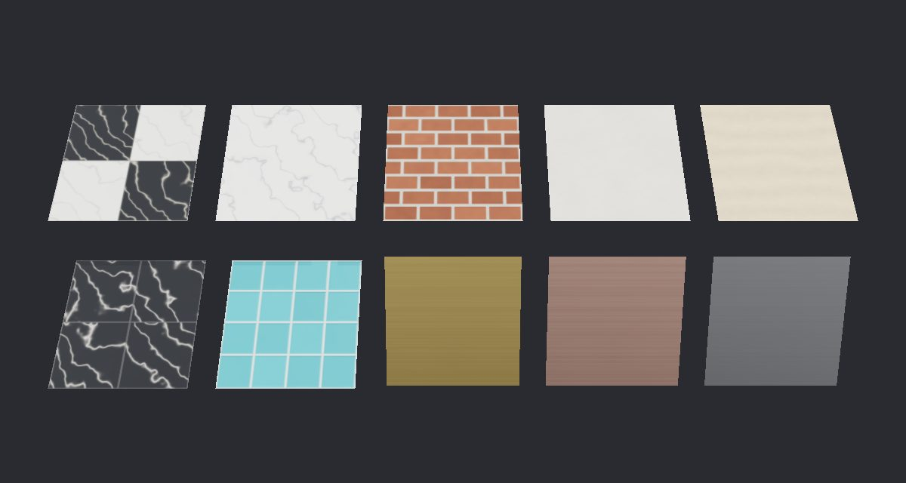

Procedural Surfaces
===================

.. rst-class:: introduction

``OpenGLContext.scenegraph.surfaces`` makes the materials a room is built
from -- marble, tiles, brick, plaster, stone and brushed metals -- as texture
maps generated with NumPy, and the geometry to wear them at their real size.
No image files are needed, every surface repeats seamlessly both ways, and the
same seed gives the same surface.

   Each surface on a one-metre panel. Top: ``checkered_marble``, ``marble``,
   ``brick``, ``plaster``, ``sandstone``. Bottom: ``marble_tiles``,
   ``tiles``, and ``brushed_metal`` in gold, copper and steel.

.. code-block:: python

   from OpenGLContext.scenegraph import surfaces

   # 30 cm tiles: the checker has two tiles each way, so it repeats every 60 cm.
   floor = surfaces.pbr_material(surfaces.checkered_marble(512, tiles=2))
   scene.append(surfaces.shape(surfaces.panel(8.0, 6.0, repeat=0.6), floor,
                               rotation=(1, 0, 0, -1.5708)))

A surface is two steps: a function makes its maps, and
:func:`~OpenGLContext.scenegraph.surfaces.pbr_material` turns them into a
``PBRMaterial``. Geometry made here then wears the material by the metre.

The surfaces
------------

Every function takes ``size``, the texture's side in texels, and ``seed``,
which chooses the pattern; the rest have defaults. Colours are linear RGB,
from 0 to 1.

.. list-table::
   :widths: auto
   :header-rows: 1

   * - Function
     - Parameters and defaults
     - One repeat holds
   * - ``checkered_marble``
     - ``size=512, tiles=2, dark=(0.025, 0.028, 0.032), light=(0.80, 0.79,
       0.75), grout=(0.22, 0.21, 0.19), polish=0.05``
     - ``tiles`` by ``tiles`` polished marble tiles, dark and light
       alternating, in matte grout set below the stone. ``tiles`` is even.
   * - ``marble_tiles``
     - ``size=512, tiles=2, colour=(0.025, 0.028, 0.032), vein=(0.62, 0.60,
       0.56), grout=(0.12, 0.12, 0.12), polish=0.05``
     - ``tiles`` by ``tiles`` tiles of one marble -- black veined white, by
       default -- each cut from its own part of the stone.
   * - ``marble``
     - ``size=256, base=(0.86, 0.85, 0.82), vein=(0.32, 0.33, 0.36),
       veins=3, polish=0.06``
     - One slab: ``veins`` diagonal veins, bent by turbulence and slightly
       rougher than the stone.
   * - ``tiles``
     - ``size=256, count=8, colour=(0.12, 0.42, 0.48), grout=(0.78, 0.78,
       0.74), glaze=0.12, spread=0.08``
     - ``count`` by ``count`` glazed tiles, each its own shade within
       ``spread`` of ``colour``, in pale matte grout.
   * - ``brick``
     - ``size=256, courses=8, bricks=4, colour=(0.30, 0.10, 0.055),
       mortar=(0.50, 0.47, 0.42)``
     - ``courses`` rows of ``bricks`` in running bond, each brick its own
       shade, with recessed mortar. ``courses`` is even.
   * - ``plaster``
     - ``size=256, colour=(0.74, 0.70, 0.62)``
     - Hand-finished plaster: a faint mottle and a gentle bumpiness.
   * - ``sandstone``
     - ``size=256, colour=(0.72, 0.58, 0.40)``
     - Dressed stone with fine grain and faint bedding lines across it.
   * - ``brushed_metal``
     - ``size=256, colour=STEEL, roughness=0.28``
     - A metal brushed along one direction. ``GOLD``, ``COPPER``, ``STEEL``,
       ``BRONZE`` and ``SILVER`` are metals' reflectance colours.

``polish``, ``glaze`` and ``roughness`` are the surface's roughness: 0 is a
mirror finish, 1 fully matte.

Each returns ``Maps``: ``base`` (``size`` by ``size`` by 3, linear colour),
and ``roughness``, ``metallic`` and ``height`` (``size`` by ``size``), all from
0 to 1, row 0 at the top of the texture.

``pbr_material(maps, relief=2.0, **factors)`` makes the ``PBRMaterial``: a
base-colour texture, a metallic-roughness texture, and a normal map derived
from the height, ``relief`` scaling how steep it reads. ``factors`` are the
material's own fields. A factor multiplies its map, so ``roughness=0.5``
halves the map's roughness; any other field, such as ``reflector`` or
``emissiveColor``, is set as given.

Sizing a surface
~~~~~~~~~~~~~~~~

A texture repeats wherever the geometry's texture coordinates pass a whole
number, so the size a surface is seen at is set by the geometry. Every piece
of geometry below takes ``repeat``: the metres one copy of the texture covers.
It is the size of whatever the surface holds, times how many of them one
repeat holds:

.. list-table::
   :widths: auto
   :header-rows: 1

   * - Wanted
     - Surface
     - ``repeat``
   * - 30 cm floor tiles
     - ``checkered_marble(tiles=2)``
     - 0.6
   * - Bricks 10 cm long with their joint
     - ``brick(bricks=4)``
     - 0.4
   * - 10 cm glazed tiles
     - ``tiles(count=8)``
     - 0.8
   * - A slab of veined marble 2 m across
     - ``marble()``
     - 2.0

``size`` is only how much detail one repeat carries. 256 texels over a repeat
of 0.4 m is about 1.5 mm a texel, which is fine for a wall seen across a room;
a surface seen from close to may want 512.

Geometry to wear them
---------------------

Each function returns a ``Geometry``: the ``positions``, ``normals``,
``texcoords``, ``tangents`` and ``indices`` a ``PBRMesh`` takes. The texture
coordinates are in repeats, measured in metres from the piece's own corner,
and the tangents run the way the texture's u runs, which a normal map is read
along. Triangles wind counter-clockwise seen from the side the normals face.

.. list-table::
   :widths: auto
   :header-rows: 1

   * - Function
     - Makes
   * - ``panel(width, height, repeat=1.0, start=(0, 0))``
     - A rectangle centred in its own xy plane, facing +z. ``start`` is where
       its bottom-left corner falls on the surface, in metres, so pieces cut
       from one wall carry its pattern on in line.
   * - ``polygon(radius, sides=8, repeat=1.0)``
     - A regular polygon round its origin in the xy plane, facing +z, standing
       on a flat side.
   * - ``block(size, repeat=1.0, chamfer=0.0)``
     - A box of ``size`` (x, y, z) centred on its origin, each face textured
       from its own corner. ``chamfer`` cuts the four upright edges back by
       that many metres, as a machined column's are.
   * - ``prism(outline, height, repeat=1.0)``
     - A convex outline of (x, z) points stood upright, centred and capped;
       the surface wraps its sides without a break.
   * - ``cylinder(radius, height, sides=16, arc=2*pi, repeat=1.0)``
     - The curved face of an upright cylinder, open at the ends. ``arc`` of
       ``math.pi`` is a half column with its flat back on the plane z = 0.
   * - ``moved(geometry, offset)``
     - ``geometry`` shifted by ``offset`` metres.
   * - ``placed(geometry, translation, rotation)``
     - ``geometry`` turned and moved into its parent's space, as a
       ``Transform`` with that translation and rotation would place it; its
       normals and tangents turn with it.
   * - ``merge(parts)``
     - One mesh of several, for one shape.
   * - ``shape(geometry, material, translation=(0, 0, 0), rotation=(0, 1, 0, 0))``
     - A ``Transform`` holding the geometry as a ``PBRMesh`` wearing the
       material, placed in the scene. ``rotation`` is VRML97's axis and angle.

A wall with an opening in it is a few panels round the opening, each started
where it sits on the wall, so the courses of brick run straight across:

.. code-block:: python

   brick = surfaces.pbr_material(surfaces.brick(256))
   repeat = 0.4                                      # four 10 cm bricks
   # A 6 by 3 metre wall with a window 2 metres wide, 1 up to 2.5.
   pieces = [((-3.0, -1.0), (0.0, 3.0)), ((1.0, 3.0), (0.0, 3.0)),
             ((-1.0, 1.0), (0.0, 1.0)), ((-1.0, 1.0), (2.5, 3.0))]
   for (left, right), (bottom, top) in pieces:
       panel = surfaces.panel(right - left, top - bottom, repeat,
                              start=(left + 3.0, bottom))
       scene.append(surfaces.shape(panel, brick,
                                   ((left + right) / 2, (bottom + top) / 2, 0.0)))

``merge`` makes several pieces one shape. Each shape costs a draw in every
view that sees it, so scenery built from many small pieces -- moldings, column
bases, window surrounds -- is best placed with ``placed`` and merged by
material, as the hall of ``oglc-mirrors`` merges each wall's pieces. For a
mirror, pieces in one plane that share a material are then one mesh. The four
strips of a floor's border, for example:

.. code-block:: python

   ring = surfaces.merge([
       surfaces.moved(surfaces.panel(8.0, 0.3, 0.6), (0.0, 2.85, 0.0)),
       surfaces.moved(surfaces.panel(8.0, 0.3, 0.6), (0.0, -2.85, 0.0)),
       surfaces.moved(surfaces.panel(0.3, 5.4, 0.6), (3.85, 0.0, 0.0)),
       surfaces.moved(surfaces.panel(0.3, 5.4, 0.6), (-3.85, 0.0, 0.0)),
   ])

Making a surface of your own
----------------------------

A surface is any ``Maps``. ``tileable_noise(size, cells, seed=0)`` is smooth
value noise over a lattice of ``cells`` by ``cells`` that wraps, and
``fbm(size, cells, seed=0, octaves=4)`` adds octaves of it, each twice as fine
and half as strong; both answer ``size`` by ``size`` arrays from 0 to 1 that
repeat seamlessly. A weathered terracotta:

.. code-block:: python

   import numpy as np
   from OpenGLContext.scenegraph import surfaces

   size = 256
   mottle = surfaces.fbm(size, 6, seed=40)
   pits = surfaces.fbm(size, 32, seed=41, octaves=2)
   base = np.array([0.55, 0.24, 0.12]) * (0.85 + 0.25 * mottle)[..., None]
   terracotta = surfaces.Maps(np.clip(base, 0, 1), 0.7 + 0.2 * pits,
                              np.zeros((size, size)), 0.4 + 0.4 * pits)
   material = surfaces.pbr_material(terracotta, relief=1.5)

Keep ``cells`` a divisor of ``size`` and the pattern tiles exactly.
``normal_map(height, strength=2.0)`` is the normal map ``pbr_material``
derives, for a caller building textures of its own.

Writing the textures to files
-----------------------------

``images(maps, relief=2.0)`` answers the three textures a glTF metallic/roughness
material holds, as 8-bit RGB arrays: the base colour sRGB-encoded, roughness in
green and metalness in blue, and the normal map. They can be written with PIL
and referenced from a glTF or a Blender material:

.. code-block:: python

   from PIL import Image

   base, packed, normal = surfaces.images(surfaces.brick(512))
   Image.fromarray(base).save('brick_basecolor.png')
   Image.fromarray(packed).save('brick_metallicroughness.png')
   Image.fromarray(normal).save('brick_normal.png')

The module imports nothing but NumPy, so a Blender script can load it by path
without the rest of the engine and bake the same surfaces into a model;
``tools/blender/demos/mirrors.py`` does.

What they cost
--------------

The maps are made on the CPU, when the function is called. On a desktop CPU,
in milliseconds:

.. list-table::
   :widths: auto
   :header-rows: 1

   * - Surface
     - 256
     - 512
     - 1024
   * - ``checkered_marble``
     - 14
     - 52
     - 214
   * - ``marble``, ``brick``, ``plaster``, ``sandstone``
     - 5
     - 20-32
     - 87-130
   * - ``brushed_metal``
     - 3
     - 4
     - 13

``pbr_material`` adds about 20 ms at 512, for the normal map and the encoding.
Each material uploads its own three textures, so make a surface once and share
the material between every shape wearing it, as the ``Finishes`` of
``oglc-mirrors``' hall does (``OpenGLContext/bin/mirrorhall.py``).

Limits
------

- Textures are square, and every surface is flat: height becomes a normal map
  and nothing is displaced.
- A surface is either metal or not; ``metallic`` is 0 or 1 throughout.
- ``prism`` takes a convex outline; a concave one needs its caps built by the
  caller.
- ``cylinder`` has open ends.

The hall of ``oglc-mirrors`` is built from these, and is a larger example:
see :doc:`reflections`.
