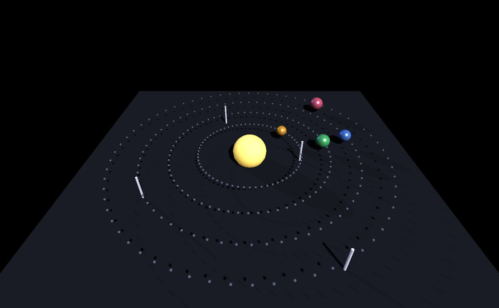

Session telemetry
=================

.. rst-class:: introduction

Session telemetry records a whole session to one file: every input the
platform delivered, every frame's time, every exception with its traceback,
and samples of the application's state as it ran. A command prints a report
from the file. The file can also be **replayed**: the same keys and clicks
arrive on the same frames, against the recorded clock, so you can reproduce
a failure that happened on someone else's machine.

.. _switching-it-on:

Switching it on
---------------

From outside the application, for example when asking a player to record a
problem, set ``OPENGLCONTEXT_TELEMETRY`` to a file path:

.. code-block:: bash

   OPENGLCONTEXT_TELEMETRY=/tmp/session.jsonl python -m twig_bb

With ``1`` (or ``auto``) instead of a path, each run writes a new file named
with the date, time and process id, under the user's application-data
directory:

.. code-block:: bash

   OPENGLCONTEXT_TELEMETRY=1 python -m twig_bb
   # ~/.config/OpenGLContext/telemetry/session-20260820-143011-4242.jsonl

From inside the application, for example from a "report a problem" menu
item, call ``startTelemetry``. Recording can start at any point in a
session, and the file then holds everything from that point on:

.. code-block:: python

   self.startTelemetry('/tmp/session.jsonl')   # None for the dated default
   ...
   self.stopTelemetry()

Until one of these happens, nothing is recorded and the recording code is
not installed, so an application that does not use telemetry pays no cost.

.. _what-is-in-it:

What the file holds
-------------------

The file is JSON lines, one record per line. Each record is written to disk
before the next one is accepted, so a session that is killed keeps
everything up to that moment.

.. list-table::
   :widths: auto
   :header-rows: 1

   * - ``kind``
     - Contents
   * - ``header``
     - When the session started, the command that started it, the process,
       the Python version and platform, the requested window, and every
       rendering environment variable that was set.
   * - ``input``
     - One input the platform delivered (a key, a character, a button, a
       wheel notch, pointer motion or a resize), with the time it arrived
       and **the frame that handled it**.
   * - ``frames``
     - A block of frames: each frame's wall-clock time, the time spent
       drawing, the loop's phase breakdown where the backend measures one
       (see :doc:`the loop trace <hud>`), and how many frames exceeded the
       stall threshold.
   * - ``entropy``
     - The session's :ref:`seed <randomness>`, and the state of the
       ordinary ``random`` and ``numpy.random`` generators.
   * - ``exception``
     - An exception and its traceback, from the main thread, another thread
       or a logged exception, with the frame the session had reached.
   * - ``log``
     - A logged warning or error, with its logger name.
   * - ``state``
     - Every section of the :doc:`developer overlay <hud>`, sampled every few
       seconds: the map, the player, the renderer's counts and whatever else
       the application registered there. The recording reuses the overlay's
       description of the application rather than keeping a second one.
   * - ``mark``
     - An application event recorded with ``mark()``; see :ref:`marks`.
   * - ``end``
     - How the session finished. A file with no ``end`` record was killed or
       is still being written.

A session at sixty frames a second writes a few kilobytes a minute. The file
has a size limit, 128 MB by default, set with
``OPENGLCONTEXT_TELEMETRY_MAX_MB``. Past the limit, input and frame times
are not written, but exceptions, marks and the ``end`` record still
are, and a ``truncated`` record notes the cut. A failure at the end of a
long session is therefore still recorded.

.. _marks:

Marking application events
--------------------------

The engine records what was pressed and how long each frame took. It has no
record of game events such as a level finishing loading, a match starting,
or the player picking up an item. Record these with ``mark()``. When a
session is several minutes long and the failure is at the end, the marks
are what a reader looks for first:

.. code-block:: python

   self.mark('level-loaded', map='ztn3dm1', bots=4)

Every context has ``mark()``, and it works whether the session is not
recording, recording, or replaying. There is no need to check first, so
there is no reason to guard the call. When nothing is recording it costs an
attribute read.

Mark fields are data: numbers, strings and numpy numbers, which are written
as plain numbers. A field can have any name, including ``name``, because the
mark's own name is passed positionally.

Mark whatever a reader would look for that the engine cannot record: the
level, the match, pickups, shots, the opponents' decisions.
``twig_bb.telemetry`` is a complete example for a game. It produces its
marks from the match's own event stream rather than from calls inside the
game rules.

.. _randomness:

Randomness
----------

If a game's world, loot, weapon spread or bot decisions come from a random
number generator, replaying the input alone does not reproduce the game: the
same keys with different random numbers give a different game. So each
session has a **seed**, owned by the engine in ``OpenGLContext.entropy``, and
the recording stores it.

The session seed
~~~~~~~~~~~~~~~~

.. code-block:: python

   from OpenGLContext import entropy

   entropy.seed()          # this session's seed, chosen once
   entropy.reseed(4242)    # start again from a number of your own

Setting ``OPENGLCONTEXT_SEED=4242`` fixes the whole session, including the
ordinary ``random`` and ``numpy.random`` generators. Use it for a
reproducible bug report, a regression test, or a level every player sees the
same way.

The ordinary generators are seeded only when a seed is set this way. Without
one, the engine chooses a seed for its own streams and does not touch
``random`` or ``numpy.random``, so an application's own ``random.seed(...)``
stays in effect. A recording does not change the session either: it stores
the state of those generators, and a replay restores it.

Named streams
~~~~~~~~~~~~~

The engine's own random draws come from named streams derived from the
seed. A game should use them too:

.. code-block:: python

   entropy.generator('loot')        # a numpy Generator, kept, advancing
   entropy.randomizer('bot-chat')   # the same idea, random.Random flavour

Streams with different names do not affect each other, so adding a new
stream does not change the numbers existing streams produce, and a seeded
world stays the same as the engine grows. Asking again for the same name
returns the same stream in its current state, not a fresh copy from the
start; otherwise a bot choosing a destination every few seconds would choose
the same place every time.

In the engine, :doc:`particle emitters <particles>` without their own
``seed``, the repeat jitter of ambient audio, and ``NavMesh.random_point()``
all draw from session streams. Each looks different every time the game is
played, and repeats exactly in a replay.

.. _reading:

Reading a session
-----------------

Read the file with the report command rather than by eye. The report
summarises the session: how it ended, frame times, exceptions, marks and
input:

.. code-block:: bash

   python -m OpenGLContext.telemetry /tmp/session.jsonl

.. code-block:: text

   2026-08-20T14:30:11+00:00  twig-bb ztn3dm1
     pid 4242, python 3.12.3, linux, 1280x720, core, seed 13097442885663472141
     ended: exception

   14,880 frames in 248.1s, 60.0 fps
     median 16.6ms, worst 812.4ms, 14 stalls
     where the time went: idle 187204ms, render 58911ms, poll 402ms

   1 exception(s):
     4:08.412  frame 14879  (fatal)
       Traceback (most recent call last):
         ...
       ValueError: no spawn point for team 2

   1 mark(s):
     0:03.204  frame 190  level-loaded map=ztn3dm1 bots=4

   input: 41,207 events -- pointer 38,110, keyboard 2,984, mousebutton 113

Options:

- ``--events`` lists every input in order instead of counting them by kind.
  Use it once a frame number tells you where to look.
- ``--marks`` lists every mark in order.
- ``--limit`` sets how many exceptions, marks and distinct warnings are
  shown (default 10). Beyond the limit, marks are counted by name and the
  first and last entries are printed, because a session is usually
  diagnosed from its end.

.. _replaying:

Replaying a session
-------------------

To replay a session, point the application at the file. It then takes its
input from the file instead of from the player:

.. code-block:: bash

   OPENGLCONTEXT_TELEMETRY_REPLAY=/tmp/session.jsonl python -m twig_bb

Each frame receives the input recorded for it, delivered just before the
frame ends, at the same point where the platform delivered it during
recording. The engine's time source (``OpenGLContext.events.systemtime``)
returns the time the recording had reached at that frame. Everything driven
by time follows: ``TimeSensor`` nodes, the animations they drive, and any
simulation that reads the engine's time. A frame that took 800 ms during
recording advances the world by 800 ms in the replay, however long it takes
to draw.

How the clock is kept
~~~~~~~~~~~~~~~~~~~~~

During a replay the clock holds one value for the whole of each frame. For
the replay to match, the recording must use the same kind of clock.
Otherwise a game that read the wall clock during recording would get a value
that depended on how far into the frame it asked, and the two runs would
measure the same interval differently by milliseconds. That is enough to put
a fire rate, a respawn or an animation one frame out, and everything after it
too. So while recording, the engine installs a clock that also reads the
wall-clock time once per frame and advances at the end of each frame by the
duration it writes to the file.

A capture's clock (a fixed step from a fixed start) already behaves this
way, and is stricter. A recording started while a capture clock is
installed uses that clock and leaves it in place. Both clocks are marked
``counts_frames``, which is how each identifies the other. Without this, the
two would take turns controlling time and a recorded capture would no longer
be repeatable.

To get a screenshot of the frame where something went wrong, combine the
replay with the auto-exit variables:

.. code-block:: bash

   OPENGLCONTEXT_TELEMETRY_REPLAY=/tmp/session.jsonl \
   OPENGLCONTEXT_AUTO_EXIT_FRAMES=14879 \
   OPENGLCONTEXT_AUTO_EXIT_CAPTURE_DIR=/tmp/shots python -m twig_bb

At the end of the recording the replay stops supplying input, reports this
once in the log and on the overlay, and the session continues with live
input.

A replay writes no recording of its own and does not modify the file, so a
file replays the same way every time.

Checking that a replay matches
~~~~~~~~~~~~~~~~~~~~~~~~~~~~~~

The engine can confirm that it delivered the same input against the same
clock, but not what the game did with it. The game's :ref:`marks <marks>`
record that. During a replay, each new mark is compared with the mark at the
same position in the file, by name, fields and frame. At the end, the replay
logs how they compared:

.. code-block:: text

   WARNING OpenGLContext.telemetry.record: replay of session.jsonl: 199 marks, all as recorded

If the replay diverged, the log line gives the first difference only, since
everything after it follows from it:

.. code-block:: text

   WARNING OpenGLContext.telemetry.record: replay of session.jsonl: 74 of 199 marks as recorded,
     then death target=player by=bot2 where the recording has death target=bot2 by=player

The same line appears in the :ref:`Session <overlay>` section of the
developer overlay during the replay, so a divergence is visible as it
happens. This needs no setup: any game that records marks has its replays
checked.

Limits of replay
~~~~~~~~~~~~~~~~

A session replays exactly as far as it depends only on its input and the
engine's clock. These things fall outside that:

- Reading the wall clock directly - code that calls ``time.time()`` is not
  on the recorded clock. Call
  ``OpenGLContext.events.systemtime.systemTime()`` instead. This also keeps
  the code in step during :doc:`video recording <recording>`.

- Private random generators - the session seed, the state of ``random`` and
  ``numpy.random``, and the :ref:`named streams <randomness>` are recorded
  and restored. A generator the application creates itself, such as a
  ``numpy.random.default_rng()`` seeded from the clock, is not. Create it
  with ``entropy.generator('name')`` to include it in the recording.

- The first frame - recording starts before the session draws anything,
  while a level loads or a menu is shown, and the file has no duration for
  that gap. An interval the game measures across the first recorded frame is
  not reproduced.

- Other differences between runs, such as thread scheduling that decides the
  order of events. A replay of such a session is close rather than
  identical, which is usually enough to reproduce the problem.

Scenes loaded in the background are handled: a scene loaded off the render
thread (``AsyncSceneMixin``) is added to the world on the same frame as in
the recording. If it is ready early it is held back, and if it is late the
replay waits for it.

.. _telemetry-demo:

Example: the telemetry demo
---------------------------

   ``python tests/telemetry_demo.py``: a session recorded, read back and
   replayed. Four bodies circle the lamp at different periods. Each time a
   body passes the gate post on its ring, the demo records a :ref:`mark
   <marks>`. With no ``OPENGLCONTEXT_TELEMETRY`` set, the demo calls
   ``startTelemetry()`` to record to a dated file. On exit it closes the
   file, reads it back and prints the report. Press ``space`` to flare the
   lamp, ``p`` to pause the orbits and ``m`` to mark a checkpoint; each adds
   a mark to the file.

Record a run with the auto-exit variables, so no one is at the keyboard and
the file holds frames and marks but no input, then read the file back:

.. code-block:: bash

   OPENGLCONTEXT_TELEMETRY=/tmp/orrery.jsonl OPENGLCONTEXT_AUTO_EXIT_FRAMES=450 \
   python tests/telemetry_demo.py
   python -m OpenGLContext.telemetry /tmp/orrery.jsonl

.. code-block:: text

   2026-08-21T03:14:15.667877+00:00  tests/telemetry_demo.py
     pid 1401636, python 3.12.3, linux, 300x300, core, seed 15227938117083888771
     ended: quit

   449 frames in 6.1s, 74.0 fps
     median 12.2ms, worst 85.6ms, 0 stalls
     where the time went: render 5940ms, idle 47ms, draw 46ms, cascade 5ms, poll 4ms, wait 1ms, repeats 1ms

   14 mark(s):
     lap 13, scene-ready 1
      0:00.026  frame 0  scene-ready bodies=4
      0:00.933  frame 61  lap body=amber lap=1
      0:01.439  frame 98  lap body=jade lap=1
      0:01.831  frame 130  lap body=amber lap=2
      0:02.233  frame 162  lap body=azure lap=1
     ... and 4 more
      0:04.236  frame 303  lap body=jade lap=3
      0:04.428  frame 319  lap body=azure lap=2
      0:04.536  frame 328  lap body=amber lap=5
      0:05.431  frame 401  lap body=amber lap=6
      0:05.630  frame 418  lap body=jade lap=4

   no input was recorded

   the application at  0:05.114 (frame 374), 2 sample(s) in the file:
     Frame: fps=83.41, frame ms=11.38, frames=375, viewport=300x300
     Loop: loop fps=75.37, loop ms=12.16, worst ms=22.28, stalls=1, last stall=render 86ms, render=13.04, idle=0.11, draw=0.09, cascade=0.01, poll=0.01, wait=0.00, repeats=0.00
     Session: recording=orrery.jsonl, seed=15227938117083888771, frames=374, records=21, size=22.5kB
     Render: profile=core, shadows=yes, ibl=yes, bloom=no, transmission=yes, instancing=yes, vsync=yes, shapes=266, draws=11, instanced=256 in 1 groups
     View: position=0, 8.2, 10.8
     Audio: audio=idle

The bodies take their positions from the engine's clock, which a
:ref:`replay <replaying>` drives from the recorded frame times. Every lap
falls on the same frame as in the recording, and each mark matches the
recorded one:

.. code-block:: bash

   OPENGLCONTEXT_TELEMETRY_REPLAY=/tmp/orrery.jsonl OPENGLCONTEXT_AUTO_EXIT_FRAMES=450 \
   python tests/telemetry_demo.py

.. code-block:: text

   replayed /tmp/orrery.jsonl
     14 marks, all as recorded

The demo's own telemetry code is short. It starts recording unless the
environment already started a session, and marks the events the engine
cannot record:

.. code-block:: python

   class TestContext(BaseContext):
       def OnInit(self):
           # A session the environment asked for is already installed here,
           # recording or replaying, and starting a second one would write a
           # file nobody asked for and take a replay's input away from it.
           if self.telemetry is None:
               self.startTelemetry()       # a path, or None for the dated default
           print('session: %s' % (self.telemetry.path,))
           self.mark('scene-ready', bodies=len(self.bodies))

       def OnIdle(self, event=None):
           seconds = self.motionTime()
           for body in self.bodies:
               laps = body.completed(seconds)
               if laps > body.laps:
                   body.laps = laps
                   self.mark('lap', body=body.name, lap=laps)
           self.triggerRedraw(1)

.. _overlay:

On the developer overlay
------------------------

A **Session** section appears on the :doc:`developer overlay <hud>` while a
session is being recorded or replayed, and only then.

- While recording, it shows the file name, the session's :ref:`seed
  <randomness>`, the current frame, the number of records written and the
  file size.
- While replaying, it shows the file name and progress through the
  recording. Once the game has recorded a mark, it also shows whether the
  replay :ref:`matches the recording <replaying>`.

A player asked to turn recording on can see that it is on, and someone
watching a replay can see when it has reached the end.

.. _telemetry-testing:

Recorded input and tests
------------------------

Input is recorded in the record format of ``OpenGLContext.events.synthetic``,
which ``OpenGLContext.testing.event_injector`` also uses. A test can
therefore drive a recorded session, and a hand-written test script can be
read by the same report command. See :doc:`offscreen` for dispatching these
records in a test.

.. code-block:: python

   {"type": "keyboard",    "key": "w", "state": 1, "modifiers": [0, 0, 0]}
   {"type": "mousebutton", "button": 0, "state": 1, "x": 100, "y": 200, "pick": true}
   {"type": "pointer",     "x": 100, "y": 200}
   {"type": "resize",      "width": 800, "height": 600}

``pick`` means the pointer event went through the selection pass, as a real
click does. It is delivered after the pass has found what is under the
cursor, and carries the node paths.

.. _environment:

Environment variables
---------------------

.. list-table::
   :widths: auto
   :header-rows: 1

   * - Variable
     - Effect
   * - ``OPENGLCONTEXT_TELEMETRY``
     - Record this session to the named file. ``1`` or ``auto`` writes a dated file
       under the user's application-data directory.
   * - ``OPENGLCONTEXT_TELEMETRY_REPLAY``
     - Replay the named file into this session instead of taking live input.
   * - ``OPENGLCONTEXT_TELEMETRY_MAX_MB``
     - The file size limit, in megabytes (default 128).
   * - ``OPENGLCONTEXT_SEED``
     - Fix this session's :ref:`randomness <randomness>`, including the
       ordinary ``random`` and ``numpy.random`` generators.

All four are in ``renderoptions.ENVIRONMENT``, so a subprocess capture does
not inherit them. A recording names one file for one session, and a child
process using the same name would overwrite its parent's file. A replay
drives the camera. A seed decides where scattered vegetation is placed. A
capture that needs a fixed random sequence sets the seed itself.

A file path that cannot be written produces a warning, and the session runs
without recording; the application still starts. The same applies to a
non-numeric value and to a replay file that contains no session.

See :doc:`environment` for the other environment variables.

.. _telemetry-modules:

Modules
-------

.. list-table::
   :widths: auto
   :header-rows: 1

   * - Module
     - Contents
   * - ``telemetry.recorder``
     - ``SessionRecorder``: the rules for what is written and when, with no
       GL, window or file.
   * - ``telemetry.journal``
     - ``SessionJournal``: the file, its header, its size limit, and handling
       of write failures.
   * - ``telemetry.record``
     - The connections to a context: hooks on its input entry points, the
       exception hooks, the logging relay, and starting and stopping
       recording.
   * - ``telemetry.replay``
     - ``Recording``, ``RecordedClock`` and ``Replay``: a recording as data,
       the engine clock driven from it, and input delivered a frame at a
       time.
   * - ``telemetry.report``
     - ``python -m OpenGLContext.telemetry``.
   * - ``entropy``
     - The session seed, the named streams derived from it, and saving and
       restoring the state of the ordinary generators.
   * - ``events.synthetic``
     - Conversion between input events and plain records, shared with the
       test event injector.
   * - ``ui.debugoverlay``
     - ``telemetry_provider``: the Session section.

The design is described in ``plans/SESSION-TELEMETRY.md``.
