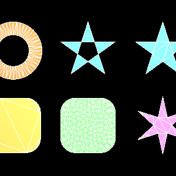
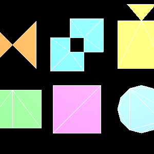

Tessellation
============

.. rst-class:: introduction

``tessellate()`` turns 2D outlines into triangles, so a filled shape such as a
letter, a floor plan, a lake or the cap on an extrusion can be drawn. It is a
**constrained Delaunay triangulation** with exact-sign predicates, in
`opengl_extrusions <https://github.com/mcfletch/opengl_extrusions>`__, and it
uses no OpenGL. It handles outlines that cross themselves, holes, coincident
vertices and T-junctions.

.. code-block:: python

   from opengl_extrusions import tessellate

   result = tessellate([outer_ring, hole_ring], winding='odd', min_angle=30.0)
   result.points        # (V, 2)
   result.triangles     # (T, 3), counter-clockwise

Each outline is an ``(N, 2)`` array of points forming a closed ring. The edge
from the last point back to the first is implied, and a repeated final point
is ignored.

Options
-------

- ``winding`` - the rule that decides which regions are solid: ``odd`` (the
  default, under which nested rings alternate between solid and hole),
  ``nonzero``, ``positive``, ``negative`` or ``abs_geq_two``.

- ``min_angle`` - refine the mesh until no triangle has an angle below this
  many degrees. It must be under 60. Targets above about 30 may not be
  reachable everywhere; the mesh is then refined as far as the point budget
  allows. An angle target adds triangles only where the outline forces thin
  ones.

- ``max_area`` - refine until no triangle is larger than this area. An area
  target subdivides evenly throughout.

- ``max_points`` - how many points refinement may add before it stops
  (default 5000).

- ``tolerance`` - the distance below which two vertices are merged. The
  default, ``None``, scales it to the size of the input.

Degenerate input (no outlines, an outline of two points, an outline with no
area) gives an empty result instead of an exception. A non-finite coordinate
or an unknown winding rule raises ``ValueError``.

   From ``tests/extrusions_tessellation.py``; the white lines are the triangle
   edges. Top: a letter O (two rings, one a hole), a pentagram by the odd rule
   (the doubly-wound middle comes out empty), the same by the nonzero rule.
   Bottom: a plain rounded square, the same refined to a maximum triangle area,
   and a star refined to a minimum angle.

   From ``tests/extrusions_preprocessing.py``: an outline crossing itself, two
   rings crossing, a T-junction, two shapes sharing an edge, near-duplicate
   vertices, and a ring closed by a repeated point.

Where the Engine Uses It
------------------------

- End caps of :doc:`swept geometry <extrusions>` are tessellated, so an
  extrusion of a contour with holes gets a cap with the same holes.
- The polygonal and outlined :doc:`3D text <text>` nodes tessellate the glyph
  outlines from the font.
- Any node that fills an authored outline, such as a floor plan, a lake or a
  plot of land, uses the same call.

Demonstrations
--------------

- ``tests/extrusions_tessellation.py`` -- tessellated faces with their
  triangles drawn

- ``tests/extrusions_preprocessing.py`` -- outlines that cross themselves,
  share edges or meet at a T-junction, and the result of preprocessing them

.. code-block:: bash

   python tests/extrusions_tessellation.py
