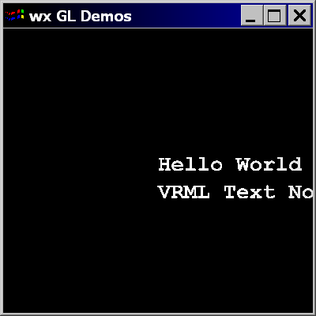

Text Nodes in OpenGLContext
===========================

.. rst-class:: introduction

VRML97's ``Text`` node draws strings in the scene, and its ``FontStyle`` node
chooses the face, size, style and layout. OpenGLContext draws text in two
ways: as flat, screen-aligned bitmap text from a texture atlas, or as
polygonal text built from a TrueType font's glyph outlines, which can also be
extruded into solid letters. Both work in the core and the compatibility
profile.

Text on a HUD or an overlay panel is drawn by the overlay renderer rather
than by a ``Text`` node; see :doc:`hud` and :doc:`overlayui`.

A first example
---------------

A ``Text`` node has two fields. ``string`` is an ``MFString``, one value per
line. ``fontStyle`` holds a ``FontStyle`` node. The ``Shape``'s
``Appearance`` colours the text, as it would any other geometry:

.. code-block:: text

   #VRML V2.0 utf8

   Shape {
     geometry Text {
       string [ "Hello World", "VRML Text Node" ]
       fontStyle FontStyle {
         family [ "TYPEWRITER", "SERIF" ]
         style [ "BOLD" ]
       }
     }
     appearance Appearance { material Material { diffuseColor 1,1,1 } }
   }

This is the start of ``tests/wrls/text_simple.wrl``. Open it with:

.. code-block:: bash

   oglc-view tests/wrls/text_simple.wrl

   ``tests/wrls/text_simple.wrl``: two lines in a typewriter face.

The FontStyle fields
--------------------

``family``
   The font face. The field is a list in preference order: the first name
   this machine has a font for is used, and the names after it are
   fallbacks. ``family [ "Gill Sans", "SANS" ]`` asks for Gill Sans and
   uses any installed sans-serif face if it is missing. A style with no
   family, or with only families that are not installed, gets the
   provider's default face. The VRML97 family names map to these faces:

   - ``SERIF`` - a Roman face
   - ``SANS`` - an Arial-like face
   - ``ROMAN`` - a Roman face
   - ``TYPEWRITER`` - a Courier-like face

   Any platform font name can also be given. With FontTools installed,
   OpenGLContext reads the installed font files for their face and family
   names. Matching by name is then more accurate, and the generic families
   above are matched against the fonts actually installed.

``style``
   Weight and slant. Any of these values, in any order; within each set,
   the first value that matches is used:

   - weight - ``thin``, ``extralight``, ``ultralight``, ``light``,
     ``normal``, ``regular``, ``plain``, ``medium``, ``semibold``,
     ``demibold``, ``bold``, ``extrabold``, ``ultrabold``, ``black``,
     ``heavy``
   - slant - ``italic``

``justify``
   Both values are read. The first places each line against the origin by
   its own width: ``BEGIN``, ``MIDDLE`` or ``END``. The second places the
   block of lines as a whole; ``FIRST``, the default, puts the first line's
   baseline on the origin.

``spacing``
   Multiplies the distance between baselines.

``topToBottom``
   Reverses the line order, as VRML97 specifies.

``horizontal``, ``leftToRight``
   Declared but not read. Text always runs horizontally, left to right.

The ``string`` field is Unicode. Whether a non-English string renders depends
on the chosen font having glyphs for it.

Font providers and formats
--------------------------

A :py:mod:`FontProvider <OpenGLContext.scenegraph.text.fontprovider>` turns a
``FontStyle`` into a font that can draw. Each provider serves one geometry
format:

- ``solid`` - filled polygonal glyphs, from FontTools
- ``outline`` - glyph outlines as lines, from FontTools
- ``bitmap`` - screen-aligned text, from the texture atlas, PyGame,
  wxPython or GLUT

A ``FontStyle``'s ``format`` field names the format to use, and a provider
of that format is tried first. If none can serve the style, the others are
tried in the order ``solid``, ``texture``, ``bitmap``. A provider registers
itself when its module is imported; importing
``OpenGLContext.scenegraph.text.toolsfont`` registers the FontTools
providers.

The provider returns a ``Font``. The ``Text`` node's render method calls the
font with the string to draw. The font builds or looks up each character,
measures it, and lays the lines out.

Bitmap text from the texture atlas
----------------------------------

Bitmap text is drawn by a shader-based provider. It draws each character as a
textured quad from a pre-rendered atlas of DejaVu Sans Mono. It uses vertex
arrays and a texture rather than ``glBitmap``, ``glRasterPos`` or display
lists, so it runs on an OpenGL 3.3 core-profile context and does not need a
GLUT display.

The provider registry puts this provider ahead of the other bitmap providers
in both profiles. In the :doc:`core profile <renderpasses>` the
fixed-function providers cannot run and are skipped. In the compatibility
profile they are fallbacks. The GLUT bitmap provider only works inside a live
GLUT context, because its routines crash without one.

The atlas has these limits:

- It holds one face, so ``family`` and ``style`` do not change atlas text.
- It holds the printable ASCII characters, 32 to 126. Any other character
  is drawn as ``?``.
- Its glyphs are anti-aliased and filtered linearly.

.. rst-class:: technical

``scripts/generate_font_atlas.py`` generates the atlas textures, at 10, 12,
14, 16, 18, 20, 24, 28 and 32 pixels. The renderer uses the atlas whose size
is closest to the requested character height.

Solid (extruded) text
---------------------

A :py:mod:`FontStyle3D <OpenGLContext.scenegraph.text.fontstyle3d>` produces
text as geometry. The glyph outlines are read from the TrueType file with
FontTools, tessellated into caps, and swept back along -Z to give the letters
depth. The result is an ordinary lit, shadowed and pickable surface. It sits
in the scene at the angle its ``Transform`` gives it, where atlas text always
faces the screen.

``FontStyle3D`` adds these fields to ``FontStyle``:

- ``thickness`` - how far back the glyph is swept, in the same units as
  ``size``. The default, 0, gives a flat cap with no sides.
- ``renderFront``, ``renderBack``, ``renderSides`` - which of the three
  surfaces are built. The default is the front only, which is the cheapest.
  All three give a closed solid.
- ``quality`` - how many line segments approximate each curve of an
  outline. The default is 3. Higher values are smoother and produce more
  triangles.

.. code-block:: python

   from OpenGLContext.scenegraph.basenodes import *
   from OpenGLContext.scenegraph.text import fontstyle3d

   Shape(
       appearance = Appearance( material = Material( diffuseColor = (.8,.8,.8) )),
       geometry = Text(
           string = [ "Solid Text" ],
           fontStyle = fontstyle3d.FontStyle3D(
               family = [ "SANS" ],
               size = .3,
               justify = "MIDDLE",
               thickness = .25,
               renderFront = 1, renderBack = 1, renderSides = 1,
           ),
       ),
   )

The solid provider draws in both profiles. In the compatibility profile it
uses display lists. In the :doc:`core profile <renderpasses>` it draws from a
vertex buffer of the glyph's positions and normals, with one draw call per
character. ``tests/solid_font.py`` is the demo, and the ``n`` key steps it
through the installed sans-serif faces; :doc:`tutorials/solid_font` walks
through it.

.. rst-class:: technical

Importing ``OpenGLContext.scenegraph.text.toolsfont`` registers the solid
provider. A ``FontStyle3D`` whose ``format`` is left at its default,
``"solid"``, then resolves to it.

Colour and anti-aliasing
------------------------

Text has no colour fields of its own. As in VRML97, the ``Shape``'s
appearance is applied to the text geometry. The atlas and PyGame bitmap
providers draw anti-aliased glyphs.

Further reading
---------------

- :doc:`tutorials/glprint` - bitmap text through WGL, after NeHe tutorial
  #13 (``tests/glprint.py``)
- ``tests/glutbitmapcharacter.py`` - GLUT bitmap characters
- :doc:`tessellation` - how the polygonal glyphs are tessellated
- the :py:mod:`OpenGLContext.scenegraph.text <OpenGLContext.scenegraph.text>`
  package reference
- the VRML97 specification of the `Text
  <http://www.web3d.org/resources/vrml_ref_manual/ch3-347.htm>`__ and
  `FontStyle <http://www.web3d.org/resources/vrml_ref_manual/ch3-320.htm>`__
  nodes
