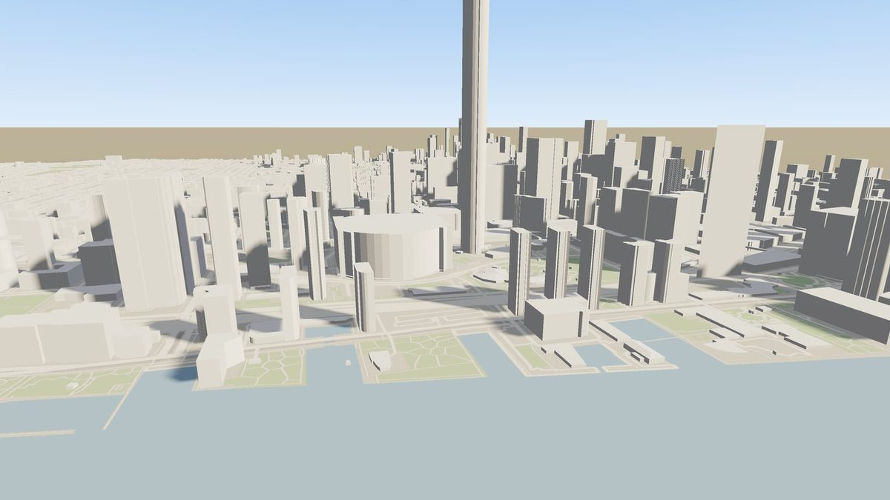

Streamed 3D Tiles
=================

.. rst-class:: introduction

OpenGLContext streams worlds too large to load at once. Such a world is stored
as an **OGC 3D Tiles** tileset: a tree of tiles, each a **glTF** model, with
finer tiles below coarser ones. Each frame, the engine picks the tiles that
give enough detail for the current view, loads missing tiles on background
threads, and unloads tiles when their memory exceeds a budget. The tile meshes
can also be added to a physics world as colliders, so a character walks on the
same surface it sees and a car drives on it. The technical notes on this page
refer to code under ``OpenGLContext/loaders/tiles3d/``.

Use this for a large world. :doc:`GLinting Steel <glisteel>` drives one, and
:doc:`Baking a world <baking>` describes how to make one. A landscape that
fits in memory does not need streaming: see :ref:`Terrain & Landscapes
<terrain-heightfield>` for the height-field path, which the :doc:`forest demo
<terrain>` uses.

   An OGC 3D Tiles dataset streamed from an octree, refined by screen-space error
   as the camera moves. City of Toronto 3D massing, Open Government Licence.

Quick start: walk a generated world
-----------------------------------

``oglc-terrain`` is installed with the package. From a source checkout, run
``python -m OpenGLContext.bin.terrain_view`` instead:

.. code-block:: bash

   oglc-terrain                         # walk the default procedural world
   oglc-terrain --fly                   # start in free-fly
   oglc-terrain --extent 4096 --levels 4   # a bigger world with a deeper tree (85 tiles)
   oglc-terrain --dem heightmap.png --height-scale 600   # a real heightmap
   oglc-terrain path/to/tileset.json    # view an existing 3D Tiles tileset
   oglc-terrain --size 1280x720 --sse 12 --memory 512    # window + quality/budget

Controls:

- ``W A S D`` move, and ``Q E`` turn.
- Hold ``Shift`` to sprint. ``Space`` jumps.
- ``G`` switches between walking and flying. While flying, ``R`` rises and
  ``F`` descends.
- ``-`` and ``=`` decrease and increase the speed of flying and sprinting.
  Flying is fast, for crossing a large world quickly.

The world is covered with instanced conifers and knee-high grass. The
vegetation is regenerated around you as you move, and the sun casts shadows
through the trees. Trees and grass are alpha-cut textured cards (procedural
bark, pine-needle and grass-blade textures), not solid geometry.
``--density`` sets how dense the vegetation is (lower is faster), and
``--no-vegetation`` removes it. See :doc:`Vegetation <vegetation>`.

.. rst-class:: technical

For a procedural or DEM world, the ground near the camera is a detailed
textured patch that follows the camera, using a photographic CC0 material. The
coarse streamed tiles are used only when viewing a ``tileset.json``. Materials
come from **ambientCG** (CC0) through ``loaders/cc0.py``, cached under the
per-user app-data directory with a provenance manifest, with a procedural
fallback when offline. The download and each map extracted from its archive
are size-capped (``cc0.MAX_ARCHIVE_BYTES``, ``cc0.MAX_MEMBER_BYTES``). Foliage
textures and textured glTF prototypes are in ``loaders/tiles3d/foliage.py``
(grass, bark and needle generators, an optional CC0 bark, alpha-MASK cards,
instanced). Shadows are the engine's cascaded shadow maps
(``OPENGLCONTEXT_SHADOWS``; see :doc:`Shadow mapping <shadows>`).

.. rst-class:: technical

The viewer is ``bin/terrain_view.py``. It sets ``OPENGLCONTEXT_RENDERER=pbr``
and the GLFW backend itself, because terrain tiles are PBR glTF and their
per-vertex colours render only under the PBR pass. Keys are bound on both
key-down and character events, because some Wayland/GLFW setups deliver only
character events. The character controller moves the camera from ``OnIdle``,
and the default free-fly navigator is unbound so that the two do not both
move it. Ground collision is analytic: each frame the avatar is clamped to
``height_fn(x, z)``, which matches the visible tiles exactly and cannot be
passed through at any frame rate, so the floor needs no collision mesh.
Vegetation is instanced (one shared prototype per layer) in two fields that
follow the camera (dense grass, sparse trees), with the full mesh near the
camera and a single cone far away. Water is a translucent plane at the water
level.

.. _tiles3d:

Viewing 3D Tiles datasets
-------------------------

.. rst-class:: technical

**3D Tiles support is experimental.** A city-sized dataset loads, streams and
can be walked. Known problems, recorded in ``plans/TILES3D-CITY-VIEWING.md``:
some tiles' geometry floats above the ground, the initial load fetches much
more of the dataset than the view needs, and the frame rate is around 30 fps
at city scale. The APIs described here may change.

``oglc-terrain`` works with generated and heightmap worlds. To open a
third-party OGC 3D Tiles dataset, such as a photogrammetry capture, a city
model or a GIS terrain, use ``oglc-view``:

.. code-block:: bash

   oglc-view path/to/tileset.json           # a local tileset
   oglc-view https://host/path/tileset.json     # stream a tileset from the web
   oglc-view tileset.json --sse 8           # more detail (lower screen-space error)
   oglc-view tileset.json --memory 1024     # bigger tile memory budget (MiB)
   oglc-view tileset.json --capture shot.png    # render one offscreen still, then exit

The source is a local path or an ``http(s)://`` URL. For a URL, the root
tileset, its tile content and any nested tilesets are fetched over the network
and cached on disk, so each tile downloads once. The cache is
``openglcontext/tiles3d`` in the user's cache directory:
``$XDG_CACHE_HOME`` (``~/.cache`` by default), or ``%LOCALAPPDATA%`` on
Windows. ``--cache-dir`` sets another. The viewer frames the whole tileset
at startup. Fly with the mouse and ``W A S D`` or the arrow keys. Tiles load
and unload by screen-space error as you move.

What the loader supports
~~~~~~~~~~~~~~~~~~~~~~~~

- Local files and ``http(s)://`` URLs for the root, tile content and nested
  tilesets, with an on-disk fetch cache.

- glTF/GLB and ``b3dm`` tile content. The loader unwraps a Batched 3D Model
  (``b3dm``) to its embedded GLB and renders it with the glTF loader.

- Box, sphere and geodetic ``region`` bounding volumes. Regions are converted
  to WGS 84 ECEF coordinates, as used by Cesium ion, Google Photorealistic 3D
  Tiles and most GIS tilesets.

- External (nested) tilesets. A tile whose content is another ``.json`` is
  loaded and added to the tree.

- Multiple contents per tile (3D Tiles 1.1 ``contents``), for example
  buildings and trees as separate glTF files in one tile.

- Tile transforms other than the identity.

- The glTF up axis. 3D Tiles frames are Z-up and glTF content is Y-up, so
  content is rotated a quarter turn into its tile's frame, as
  ``asset.gltfUpAxis`` specifies. The default is ``Y``. ``Z`` means the
  content is already in the tile frame, which is what the bakers in this
  project write. Without this rotation, a conforming export renders on its
  side.

The engine draws a Y-up world, so the viewer turns a Z-up dataset to match:

- A dataset in Earth-centred (ECEF) coordinates is moved to the origin, for
  32-bit float precision, and levelled at that point, so the ground lies in
  the XZ plane instead of tilting toward the centre of the Earth.

- A dataset in local coordinates is turned the same quarter turn as its
  content.

``--no-recenter`` turns off both, and shows the dataset in its own
coordinates.

.. rst-class:: technical

The loader is tested against Cesium's ``TilesetWithDiscreteLOD`` sample: a
``tileset.json`` with an ECEF root transform and a ``low→medium→high``
``b3dm`` chain of levels. The framed view selects the coarse tile, and flying
closer (or ``--sse 0.02``) refines to the finest. Like ``oglc-terrain``, the
viewer uses the core profile and the PBR renderer.

Limits
~~~~~~

- Point clouds (``.pnts``), instanced models (``.i3dm``), composite tiles
  (``.cmpt``) and implicit tiling (``.subtree``). The viewer skips these or
  reports an error, so Cesium's ``TilesetWithTreeBillboards`` (i3dm),
  ``TilesetWithRequestVolume`` (pnts) and ``SparseImplicit*`` samples do not
  render.

- Services that need an API key, such as Cesium ion and Google Photorealistic
  3D Tiles. The loader does not send authentication headers or tokens. Export
  or download the tiles first. Plain ``http(s)://`` tilesets stream without
  this.

- After a sudden camera jump, the view can have holes for a few frames. With
  REPLACE refinement, the coarse tiles are not kept loaded as a fallback.
  Gradual movement refines without holes.

.. _samples:

Sample datasets to try
~~~~~~~~~~~~~~~~~~~~~~

The `CesiumGS 3D Tiles sample tilesets
<https://github.com/CesiumGS/3d-tiles-samples>`__ (Apache 2.0) are small and
self-contained, and GitHub serves them without authentication. Stream them
directly from the URL, with no download step. These samples load:

.. code-block:: bash

   # Cesium "dragon" — b3dm, an ECEF transform and a low/medium/high LOD chain
   oglc-view https://raw.githubusercontent.com/CesiumGS/3d-tiles-samples/main/1.0/TilesetWithDiscreteLOD/tileset.json
   #   add --sse 0.02 to load the finest level of detail over the network

   # 1.1 glTF-native scene — houses and trees, several glTF contents per tile
   oglc-view https://raw.githubusercontent.com/CesiumGS/3d-tiles-samples/main/1.1/MetadataGranularities/tileset.json

   # 1.1 multiple-contents plane
   oglc-view https://raw.githubusercontent.com/CesiumGS/3d-tiles-samples/main/1.1/MultipleContents/tileset.json

Each tile is cached on its first fetch, so later runs need no network. To use
a local copy instead, clone the repository (``git clone
https://github.com/CesiumGS/3d-tiles-samples``) and pass the path to
``…/1.0/TilesetWithDiscreteLOD/tileset.json``; the result is the same.

The viewer also opens a tileset you make with ``oglc-terrain`` (see
:ref:`Making a world <making>`), a world :doc:`baked from an authored
description <baking>`, :doc:`a city exported from OpenStreetMap <osmcity>`,
or your own captures exported to 3D Tiles (RealityCapture, Cesium ion,
py3dtiles, and others).

.. _tiles3d-reach:

What a tileset may reach
------------------------

A ``tileset.json`` names its own tile files and nested tilesets. For a tileset
from anywhere other than this machine, whoever wrote it chose those URIs. They
follow the same rules as a glTF document's external references:

- A tileset served over ``http(s)`` may reference only its **own origin**: the
  scheme, host and port it was fetched from. The check is repeated on every
  redirect, so a tile URI cannot name another host or an address on the local
  network.

- A tileset loaded from disk may read only files **under its own directory**.

- Every tile file is **size-capped**: ``tiles3d.fetch.DEFAULT_MAX_TILE_BYTES``,
  256 MiB by default. For a dataset with larger tiles, pass ``max_bytes`` to
  ``read_bytes``.

- The files a world names in its ``extras`` -- the height and control maps, the
  tree table and each species' meshes and textures, the ground cover's cards
  and clumps, the zones document -- follow the same two rules. They resolve
  through ``tiles3d.fetch.beside(base, name)``, and a served world's files are
  fetched to the cache by ``tiles3d.fetch.local_copy(uri)``, so every reader
  is handed a path on this machine. A name outside the tileset's reach raises
  ``IOError`` and the world is not built, except for the zones document: a
  zones document that is refused or does not load is logged, and the world is
  built without zones.

The URL or path you give the viewer is not restricted: the viewer fetches what
you name, as ``curl`` would. The file it fetches is untrusted like any other.
Its size is capped, redirects of that first fetch must stay on the origin you
named (so a server cannot redirect it to a link-local address), and every URI
the file names follows the rules above. For a dataset split across two hosts,
pass your own resolver to ``build_runtime_tileset``. The rules are defined in
``loaders/resolver.py``; :doc:`Loading content you did not write <untrusted>`
describes them for every loader.

.. rst-class:: technical

The *number* of tiles a tileset may name is not limited. Each tile is capped,
and the loaded tiles are held to the memory budget, but a hostile tileset can
name any number of tiles and fill the on-disk fetch cache. This is recorded in
``plans/TILES3D-CITY-VIEWING.md``.

How it works
------------

A tileset is a ``tileset.json`` that describes a tree of bounding volumes,
with glTF meshes as tile content. Every frame, the runtime walks the tree. For
each tile it converts the tile's *geometric error* to a *screen-space error*
in pixels for the current camera. It refines a tile into its children only
while that error is above a threshold, so detail concentrates near the viewer.
Frustum culling skips tiles outside the view, which limits the number of
tiles in use.

.. rst-class:: technical

``screenspaceerror.py`` computes the perspective screen-space error.
``tileset.py`` parses the tree into world space; it parses box and sphere
volumes itself, because the py3dtiles reader rejects sphere volumes.
``traversal.py`` (``select_tiles``) returns a render set and a set of tiles
wanted soon. ``frustum.py`` extracts the frustum planes (Gribb-Hartmann) and
tests bounding spheres against them.

The traversal decides which tiles to stream:

- Wanted tiles that are not loaded are queued for loading in the background,
  nearest first.

- Finished loads are uploaded to GL, a limited number per frame.

- Tiles that are no longer wanted are unloaded, least recently wanted first,
  once the loaded tiles exceed the memory budget.

A tile that is still loading is replaced by its nearest loaded ancestor, so
the world gains detail as tiles arrive rather than showing holes.

.. rst-class:: technical

``loadmanager.py`` is the priority queue and worker pool; loads can be
cancelled. ``residency.py`` tracks each tile's state
(``UNLOADED→LOADING→READY→RENDERABLE``) and evicts least recently used tiles
under a byte budget. ``runtime.py`` (``TilesetRuntime.update``) runs these
steps each frame. Loading and glTF parsing run off the render thread; only
mounting and drawing run on the GL thread.

The runtime is mounted in the scene as a scenegraph node, ``TilesTerrain``, so
it renders, casts shadows and can be picked like any other geometry. Each
loaded tile can also add its mesh to a physics world as a static triangle-mesh
collider, which makes the terrain walkable.

.. rst-class:: technical

``scenegraph/tilesterrain.py`` is the node; call
``update_for_camera(camera, viewport_height, view_projection=…)`` each frame
before rendering. ``physics_colliders.py`` adds and removes colliders through
the runtime's ``on_renderable`` and ``on_evicted`` hooks. See
:doc:`Physics & Collision <physics>` for the character controller.

.. _making:

Making a world
--------------

The engine has three ways to generate a tileset. Each writes a
``tileset.json`` with its ``.glb`` tiles and returns the tileset's path.

.. code-block:: python

   from OpenGLContext.loaders.tiles3d import procedural, dem

   # 1. Procedural: hills, canyon, lake, mountains (per-vertex coloured, with skirts).
   procedural.build_terrain_tileset("world/", extent=2048, levels=3, tile_res=33)

   # 2. A real heightmap (grayscale DEM from QGIS/USGS/SRTM, any format PIL reads):
   dem.build_dem_tileset("dem.png", "world/", extent=4096,
                         height_scale=600, base=-40, levels=4)

   # 3. Your own function y = f(x, z) (numpy arrays in, heights out):
   procedural.build_terrain_tileset("world/", height_fn=my_height_fn)

Mount the result and update it from the camera each frame:

.. code-block:: python

   from OpenGLContext.scenegraph.tilesterrain import TilesTerrain
   terrain = TilesTerrain("world/tileset.json", max_sse=16.0,
                          physics_world=world)          # physics_world optional
   # in your render/idle callback, before the pass runs:
   terrain.update_for_camera(eye_xyz, viewport_height, view_projection=vp_matrix)

.. rst-class:: technical

A quadtree of depth *L* has ``sum(4**l)`` tiles for ``l`` from 0 to *L*-1.
Each tile is meshed at ``tile_res`` vertices per edge, so deeper tiles cover
less ground with the same vertex count, giving finer detail. The procedural
height field (value-noise fBM, ridged mountains, a carved canyon and a lake
basin) is ``procedural.terrain_height``; ``terrain_colors`` colours it by
height and slope. A skirt is dropped around every tile edge
(``terrain_patch(skirt_depth=…)``) so that no gaps show between neighbouring
tiles at different levels.

:ref:`Terrain profiles <terrainprofile>` describe the shipped landscape and
how to describe another. For a world with roads, water, vegetation and placed
props, use the octree baker instead; see :doc:`Baking a world <baking>`.

Tuning detail and memory
------------------------

.. list-table::
   :widths: auto
   :header-rows: 1

   * - Setting
     - Effect
   * - ``--sse`` / ``max_sse``
     - Screen-space-error target in pixels (default 16). Lower gives more detail:
       more tiles, at a higher cost.
   * - ``--memory`` / ``memory_budget``
     - Budget for loaded tiles (default 256 MiB; ``--memory`` is in MiB,
       ``memory_budget`` in bytes). A smaller budget unloads tiles sooner.
   * - ``--extent``, ``--levels``, ``--tile-res``
     - World size in metres, tree depth (and so tile count), and vertices along
       each tile edge.
   * - ``prefetch_factor``
     - How far ahead finer tiles load before they are needed (default 2.0).
       Reduces tiles appearing late while you move.
   * - ``hysteresis``
     - On ``TilesetRuntime`` (default 0). Keeps a tile refined until the error falls
       further below the threshold, so the level does not flicker at the threshold.
   * - ``--dem``, ``--height-scale``, ``--base``
     - Use a real heightmap. A negative ``--base`` lowers low areas below the water
       level, so they show as lakes or sea.

.. rst-class:: technical

``TilesetRuntime`` and ``TilesTerrain`` take these as constructor arguments.
Frustum culling is on when you pass a ``view_projection`` to
``update_for_camera``. Without it, tiles are chosen by distance only, which
suits tests but loads more tiles than a real view needs.

Caves, overhangs and other 3D shapes
------------------------------------

Tiles are ordinary glTF meshes, so terrain is not limited to a height surface.
A cave, an arch or an overhang is a tile with arbitrary geometry, streamed,
culled and collided like any other tile. A height field has one height per
point, so it cannot represent an overhang with open air between two solid
layers; a glTF tile can.

.. rst-class:: technical

``sample.build_overhang_tileset`` bakes a raised slab over the ground (solid,
then air, then solid) that streams, renders and gives a walkable collider. A
procedural cave baker (voxel or Transvoxel) would follow the same pattern.

Demos and tests
---------------

- ``oglc-terrain`` - the procedural/DEM viewer (above).

- ``oglc-view`` - stream and fly a real OGC 3D Tiles ``tileset.json`` (b3dm,
  region volumes, nested and ECEF tilesets).

- ``tests/tiles_landscape.py`` - an aerial view of terrain and vegetation.

- ``tests/tiles_walk.py`` - a first-person walk/fly.

- :doc:`GLinting Steel <glisteel>` - a full-size baked world streamed around a
  car, with its tiles as the surface the car drives on.

.. rst-class:: technical

The tests in ``tests/tiles3d/`` cover screen-space error, traversal,
residency, the load manager, the runtime, the frustum, procedural terrain,
DEMs, scattering and vegetation, geomorphing and skirts, and navigation
(gravity settles the avatar on the surface, walking follows it, flying
rises, and switching from flying to walking drops to the surface, including
on streamed colliders). Offscreen render regressions are in
``tests/unit/test_tiles_*_render.py``. Run the tile tests with ``python -m
pytest tests/tiles3d/``.
