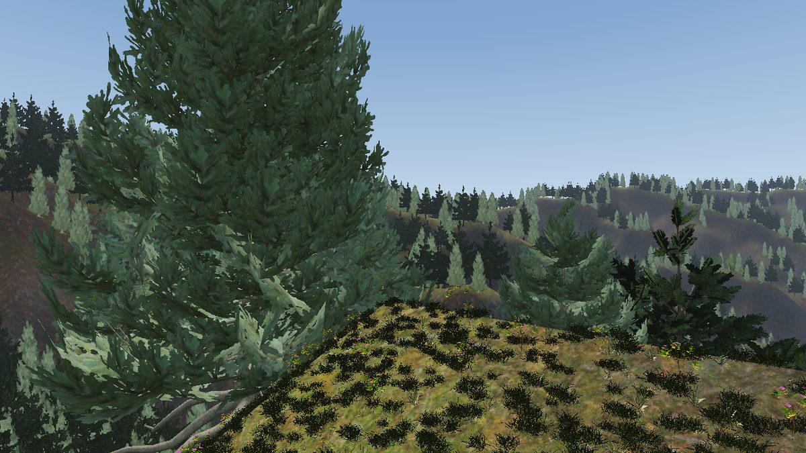

Vegetation
==========

.. rst-class:: introduction

``OpenGLContext.scenegraph.vegetation`` draws trees and ground cover in large
numbers. Plants are stored as **tables of positions**, not as scenegraph nodes,
and drawn as **instanced sets** chosen against the view each frame. Near the
camera a plant is real geometry; further away it is a flat card (an impostor);
between the two they cross-fade, so a tree changes from card to branches with
no visible step. Ground cover is not stored at all: it is scattered on a
world-anchored grid around the camera and re-chosen as the camera moves. All
plants read the same :ref:`canopy shade <canopyshade>`, so the ground under a
wood is dark. The application supplies the plant art; the toolkit ships none.

   The `forest demo <https://pypi.org/project/openglcontext-forest-demo/>`__
   (see :doc:`terrain`): half a million instanced trees and grass clumps on a
   real digital elevation model, walked at eye height.

There are two ways to add vegetation to a world:

- a :ref:`VegetationField <vegetationfield>` and :ref:`GroundCover
  <groundcover>`, held beside the terrain. Use these for a
  :ref:`height field <terrain-heightfield>` or for a large baked forest.
- :ref:`plants scattered into the tiles <intile>` of a :doc:`streamed world
  <tiles3d>`, which load and unload with the ground they stand on.

.. _vegetationfield:

A forest as one node: ``VegetationField``
-----------------------------------------

``OpenGLContext.scenegraph.vegetation.VegetationField`` draws a forest from a
table of tree positions. It makes one instanced draw per species for the
distant cards, and one more for the real geometry within ``NEAR_RADIUS``
(90 m) of the camera. It re-chooses both from the table when the camera moves
far enough to change them.

.. code-block:: python

   from OpenGLContext.scenegraph.vegetation import TreeSpecies, VegetationField
   forest = VegetationField(positions, yaws, heights,
                            [TreeSpecies(name='fir', mesh='fir.npz',
                                         solidTexture='fir_bark.png',
                                         foliageTexture='fir_branch.png',
                                         impostor='fir_imp.png')],
                            species_id=kind)
   forest.update(camera_position, facing=where_it_looks)   # once a frame

A ``TreeSpecies`` defines how one kind of tree is drawn:

- ``mesh`` - a ``.npz`` of named arrays holding a *solid* part (trunk and
  branches, opaque) and a *foliage* part (alpha-masked cards);
- ``solidTexture`` and ``foliageTexture`` - a texture for each part;
- ``impostor`` - the single card the tree becomes at a distance.

A ``TreeSpecies`` is a scenegraph node, and the forest keeps its species in
its ``species`` field, read when the forest is built. The field names match
the keys of a baked world's JSON (``to_json`` and ``from_json``).
``beside(directory)`` returns a copy with its file paths joined to
``directory``, ``located(where)`` a copy with each non-empty file name replaced
by ``where(name)``, and ``varied(cardWidth=0.6)`` a copy with those fields
changed; the original species is unchanged by each. ``beside`` uses the names
as given, so it is for species an application chose; ``TilesTerrain`` reads a
world's species through ``located`` with ``tiles3d.fetch.beside``, which keeps
them inside the world (:ref:`tiles3d-reach`).

The near mesh and the cards cross-fade in their shaders over a shared distance
band.

Choosing what to draw
~~~~~~~~~~~~~~~~~~~~~

Most of the cost of a four-kilometre forest is in the far cards, so
``update(position, facing=None, view=None)`` draws only those in view:

- ``view`` - the camera's view-projection matrix. The cards are chosen against
  the frustum. This is the best choice.
- ``facing`` - the direction the camera looks. The cards are chosen inside a
  cone around it. A cone does not match a frustum: when the camera looks down
  into a valley, trees near the camera fall inside the cone and trees along the
  line of sight fall outside it, which draws a hard edge across the forest. Use
  ``facing`` only when there is no matrix.
- neither - the cards are chosen by distance only. Use this for an orbiting or
  top-down view.

The margin around the view grows with distance. A frustum plane meets the
ground in a straight line, and cutting the cards exactly at the view shows a
straight edge in the forest whenever the view and the selection disagree
slightly. Selection is skipped while the camera is nearly still.

A baked world can carry its forest as a table: see :ref:`Baking a world
<vegetation>`.

.. _groundcover:

Ground cover: ``GroundCover``
-----------------------------

The floor of a wood is covered with a mix of plants, such as grass, fern,
nettle and shrub. Each has its own size and density, and grows in beds and
thickets with clear ground between them.
``OpenGLContext.scenegraph.vegetation.GroundCover`` draws a set of
``CoverSpecies`` at every distance from the camera.

.. code-block:: python

   from OpenGLContext.scenegraph.vegetation import (
       CoverSpecies, GroundCover, control_weight)

   cover = GroundCover(
       field,
       [CoverSpecies(name='grass', card='grass_card.png', clump='grass.glb',
                     clumpMesh='tuft_a', clumpFarMesh='tuft_a_far',
                     density=11.0, height=0.15, patchiness=0.25),
        CoverSpecies(name='shrub', card='shrub_card.png', clump='shrub.glb',
                     density=0.5, height=0.22, patchiness=0.8,
                     patchMetres=34.0, canopy=(0.3, 5.0))],
       mask=control_weight(control_image, ['grass', 'forest_floor'],
                           layers, field.extent),
       shade=terrain.shade, canopy=terrain.canopy_cover)
   cover.update(camera_position)                    # once a frame

``CoverSpecies`` is also a scenegraph node, kept in the cover's ``species``
field. ``clumpMesh`` and ``clumpFarMesh`` name meshes in the ``.glb``. A string
of digits that matches no mesh name selects the mesh at that position in the
file. With an empty ``clumpFarMesh`` the near mesh is drawn once over the
whole disc, with no second level.

Distance levels
~~~~~~~~~~~~~~~

Each species is drawn at three distances, because the detail the eye can see
falls off faster with distance than the cost of drawing it:

- Real geometry near the camera, in two levels of detail: the full mesh
  over the inner ``CLUMP_LOD_FRAC`` (0.45) of the disc's radius, and a
  decimated mesh over the rest. Most plants are in the outer ring, so that is
  where the triangle savings are.
- Cards beyond the geometry, at a lower density. They fade in where the
  geometry fades out.
- Coarse cards beyond those, sparser and larger, out to where the haze
  hides the ground.

Nothing is baked. A one-metre scatter over four kilometres would be sixteen
million instances, so each level is scattered on a *world-anchored* grid
around the camera and re-chosen as the camera moves. Each cell's position and
whether it holds a plant come from a hash of the cell, so nothing shifts or
pops as the disc re-centres. Each species uses its own salted grid, so
species do not compete for the same cells.

Because a cell's plant never changes, the scatter is kept by the block: the
grid is cut into squares at least 32 metres wide, and an eighth of the
disc's radius wide for a far rung whose disc is larger
(``vegetation.grid.ScatterBlocks``), each scattered the first time a disc
reaches it, with its plants' sizes and light, and kept while the camera is
within twice the disc's radius of it. A disc is assembled from the blocks it
reaches, so moving costs the ground newly reached, and driving back over
ground already covered costs nothing but the assembly. ``GroundCover.scattered``
counts the blocks scattered. Setting ``mask``, ``holes``, ``shade`` or
``canopy`` scatters everything again.

The scatter is the expensive half of the work and makes no GL calls.
``GroundCover(..., background=True)`` runs it on a worker thread
(``vegetation.streaming.BackgroundCompute``): ``update`` hands the scatter to
the worker and stages what it made on a later call, so no frame waits for it,
and ``wait(timeout)`` blocks until the worker is idle, for a capture or a
bake that wants the cover in place. A cover a streamed world carries
(``TilesTerrain``) is scattered this way, and ``TilesTerrain.wait_for_loads``
waits for it. A scatter that raises is logged and asked for again on the next
``update``. ``shutdown()`` stops the worker; a cover that is collected stops
its worker as well. Without ``background``, ``update`` scatters on the calling
thread; a caller with its own worker can run ``compute_near`` there and pass
the result to ``apply_near`` on the render thread.

``select`` is the per-frame step: it re-centres the drawn geometry on the
current camera. Without it, the disc lags behind the walker and the density of
the middle-distance cover pulses. Each geometry level is chosen
``CLUMP_SELECT_SLACK`` (1 m) past its radius, and chosen again only once the
camera has moved that far; the shader fades each level by its distance from
the live camera, so what is chosen early is not drawn until it is in reach.

.. _wheretheygrow:

Where each species grows
~~~~~~~~~~~~~~~~~~~~~~~~

Four settings decide where a species grows and how much of it there is.

``mask`` weights the ground by kind. The splat :ref:`control map
<controlmap>` already records where the grass and the leaf litter are, and a
baked world paints the road's corridor out of it.
``control_weight(image, wanted, layers, extent)`` turns that map into a mask:
``layers`` is the map's layer order and ``wanted`` the layers the cover grows
on. The map covers ``extent`` metres along both axes, its columns along x and
its rows along z, and need not be square. It must be fine enough for what it
masks: over four kilometres, 512 pixels are eight metres each, wider than a
road corridor.

``holes(x, z) -> mask`` removes cover where there is no ground, for example
over a tunnel's bore. It is the same function the terrain uses for drawing and
collision (:ref:`openings in the ground <holes>`). A height field returns a
height inside an opening as it does anywhere else, so without ``holes`` cover
would float in the tunnel mouth. A ``TilesTerrain`` passes its own ``holes``
to the cover it creates. For cover you build yourself, set ``cover.holes``.
``holes`` is separate from ``mask``: the mask weights the kinds of ground, and
an opening is no ground at all.

``patchiness`` sets how much a species clusters, from 0 to 1. At 0 a plant is
equally likely anywhere, which suits grass or small flowers. At 1 plants
gather in beds with bare ground between them. ``patchMetres`` is the width of
one bed. The beds are fixed in the world, so a stand of nettles is in the same place
each time you pass it, and each species has its own beds. ``density`` still
means plants per square metre: a patchy species is scattered on a finer grid
and then thinned.

``canopy`` is the range of tree cover a species grows in,
read from :ref:`terrain.canopy_cover <canopyclosure>`: 0 on open ground, 1
where the tree crowns cover every square metre. A lower bound above 0 keeps
a plant off open ground; a low upper bound keeps it out of a closed stand.
For example, ``canopy=(0.3, 5.0)`` puts shrubs where trees stand apart and
along the edges of clearings. A plant near the edge of its range still grows,
but smaller. With no range, the default, it grows anywhere. The range reads the canopy
*closure*, not the shade: see :ref:`canopyclosure`.

Other settings:

- ``density`` - plants per square metre, before any of the above thins them.
- ``height`` - the average height of a plant, in metres, not the maximum.
- ``density_scale`` - a multiplier on the density of every species in the
  set (default 1). A quality setting changes it to draw less cover in the same
  proportions; 0 draws none. A species with a ``density`` of 0 draws none.
- ``COVER_JITTER`` (1.7) - how far a plant may move from its grid cell. If
  plants stayed inside their cells, the set would still look like a grid of
  diagonal rows from thirty metres away.

.. _coverassets:

Plant assets
~~~~~~~~~~~~

A ``CoverSpecies`` names one ``.glb`` file and the mesh in it for each
distance level (``clumpMesh`` and ``clumpFarMesh``). One file holds every
variant of a plant and both levels of detail, sharing a single cutout texture.
A 1k RGBA texture is about a megabyte, so one file per level would repeat it.

``oglc-bake-plants``, in `OpenGLContext-editor
<https://github.com/mcfletch/openglcontext-editor>`__, builds such files from
published plant scans. It downloads the model, restores the cutout mask that a
JPEG base colour cannot hold, reduces each plant to the triangle budgets of the
two levels, renders the billboard from the geometry so the two match, and
writes a ``cover.json`` listing the species it made.

.. code-block:: bash

   oglc-bake-plants --out assets --per-asset 2 --patchiness 0.25 \
       grass_medium_01=11.0 grass_medium_02=4.0
   oglc-bake-plants --out assets --per-asset 1 --near 3000 --far 800 \
       --patchiness 0.8 --patch-metres 34 --canopy 0.3 5.0 shrub_04=0.5

A baked world can carry a whole cover set: see :ref:`Ground cover as a recipe
<cover>`.

.. _canopyshade:

Shade under the trees
---------------------

The shade a wood casts on its own floor is baked into the terrain once, not
computed each frame, because neither the trees nor the sun move. Give a
:ref:`splat terrain <terrain-heightfield>` the trunk positions and it darkens
its static shading under them:

.. code-block:: python

   terrain.canopy = forest.positions          # (N,3) trunk bases
   terrain.shading                            # the lit grid, in [0, 1]
   terrain.shade(x, z)                        # ...read by world position

A tree shades the area under its *crown*, not only the cell its trunk stands
in. The terrain settings are:

- ``canopy_crown`` - the crown width each tree's shade is spread over, in
  metres (default 7). The total is scaled so that one tree per crown area is a
  closed canopy. The shade then means the same at any grid resolution and any
  planting density.
- ``canopy_shade`` - how strongly a closed canopy darkens the ground (default
  1.3).
- ``canopy_deepest`` - the largest fraction of the light the canopy may remove
  (default 0.78).
- ``canopy_spread`` - how far the shadow is offset towards the sun, in metres
  (default 12), because a tree's shadow falls along the light rather than
  straight down.

Plants on shaded ground must be shaded too; grass lit as if in an open field
on ground darkened to a fifth looks lit from inside. The instance layout that
every vegetation node shares carries a shade value alongside position, yaw and
scale:

.. code-block:: python

   forest.lit_by(terrain.shade)               # every tree
   GroundCover(..., shade=terrain.shade)      # every clump and card
   cards.update_instances(points, yaws, scales, shades)   # or by hand

The shade defaults to 1, full sun. A world loaded through ``TilesTerrain``
connects all of this for you, because ``TilesTerrain`` holds both the ground
and the trees.

.. _canopyclosure:

Canopy closure
~~~~~~~~~~~~~~

The shade is *clamped*: past ``canopy_deepest``, more trees remove no more
light. That suits lighting but not planting, because a stand with gaps and a
closed stand are equally dark, and only the first has room for shrubs. The
terrain therefore also provides the canopy *closure*, unclamped: 0 on open
ground, 1 with one crown of tree over every square metre, and higher where
planting is denser:

.. code-block:: python

   terrain.closure                            # the cover grid
   terrain.canopy_cover(x, z)                 # ...read by world position

   CoverSpecies(name='shrub', ..., canopy=(0.3, 5.0))   # a band of it

``CoverSpecies.canopy`` reads this value (see :ref:`where each species grows
<wheretheygrow>`). The values are in crowns, so whether a stand counts as
sparse depends on how densely that world was planted.

.. _intile:

Vegetation in a tile
--------------------

The second method scatters plants onto the surface of a :doc:`streamed tile
<tiles3d>`, so they load and unload with the ground they stand on. The scatter
is deterministic and weighted by triangle area. A ``keep`` function filters
the placements, for example to grass elevations and away from water or peaks.
Every instance shares one prototype, so the :doc:`instancing <instancing>`
batcher draws them in one call. Trees use a distance level of detail: a full
mesh near the camera and a billboard far away. Grass is a dense layer of
blades, limited to a disc around the viewer.

.. code-block:: python

   from OpenGLContext.loaders.tiles3d.vegetation import (
       build_vegetation_lod, build_grass_patch)
   pos, nrm, col, idx = procedural.terrain_patch(-700, 700, -700, 700, 48)
   trees = build_vegetation_lod(pos, idx.reshape(-1, 3), near_mesh, far_billboard,
                                density=0.00035, seed=7, camera=eye,
                                near_distance=450,
                                keep=lambda p: (p[:,1] > 4) & (p[:,1] < 130))

.. rst-class:: technical

The code is in ``loaders/tiles3d/scatter.py`` (per-triangle uniform
barycentric sampling, seeded, with a ``keep`` mask) and
``loaders/tiles3d/vegetation.py`` (``group_from_scatter``,
``partition_by_distance``, ``build_vegetation_lod``, ``build_grass_patch``).

.. _footing:

Where a plant meets the ground
------------------------------

**A placement is the point the plant stands on.** Every vegetation path in the
engine uses this rule. The GPU nodes build it into their vertex data: a
billboard quad spans ``y`` from 0 to 1, ``load_clump_glb`` moves a clump's base
to ``y = 0``, and a tree mesh is modelled with the foot of its trunk at the
origin.

A scenegraph prototype can have its origin anywhere, and VRML's primitives are
centred on theirs. A ``Cone`` used as a shrub would be planted half its height
into the hill. ``group_from_scatter`` measures the prototype's bounds and
lifts it by its lowest point, so it stands on the placement like the GPU
nodes. A prototype already modelled with its foot at the origin is not moved.

.. code-block:: python

   shrub = Shape(geometry=Cone(bottomRadius=2.5, height=8.0), appearance=green)
   veg = build_vegetation_group(pos, idx.reshape(-1, 3), shrub, density=0.004, seed=1)

   group_from_scatter(placements, oak, sink=0.1)     # settle a root flare in
   group_from_scatter(placements, buoy, seat=False)  # modelled about its middle

- ``sink`` lowers the prototype into the ground by that distance, in the
  prototype's own units. Use it for a root flare or a boulder base that should
  sit in the ground rather than on it.
- ``seat=False`` uses the prototype's own origin as the contact point.

The seated prototype is wrapped once and shared by every instance, so the
scatter is still one draw.

.. rst-class:: technical

``OpenGLContext.loaders.assets.seated(node, sink=0)`` does the same for
anything else placed on a surface, such as a prop, a rock or a parked car.
``assets.bounds(node)`` is the measurement it uses: the box a subtree occupies
in its root's coordinates, with every ``Transform`` applied. It needs no GL
context.

.. _clearance:

Clearing trees from a road
--------------------------

Where a road runs on the ground, trees are cleared only from the corridor the
road was cut through, so the canopy can close over a forest road. Where the
road is *raised*, on an embankment, a causeway's retained fill or a bridge
deck, a tree beside it is rooted metres below the road surface, and a crown of
the same width would grow through the structure. There the clearance is the
corridor plus a crown's width. `OpenGLContext-editor
<https://github.com/mcfletch/openglcontext-editor>`__ applies this rule when it
bakes a world (``ProceduralWorld.outside_the_clearing``). :doc:`Roads <roads>`
describes the road itself.

Demos and source
----------------

``oglc-forest``, the `forest demo
<https://pypi.org/project/openglcontext-forest-demo/>`__, is a separate
distribution that uses these nodes at full size: 230,000 GPU-instanced trees
with impostor LOD, two layers of camera-following grass, and canopy shade over
a four-layer splat ground, walked at eye height. ``tests/tiles_vegetation.py``
is a small example.

.. rst-class:: technical

The nodes are in ``scenegraph/vegetation/`` (``field.py``, ``cover.py``,
``clumps.py``, ``billboards.py``, ``nearmesh.py``, ``grid.py``). The tests are
``tests/unit/test_vegetation_field.py`` and
``tests/unit/test_terrain_vegetation.py``. :doc:`Instanced Geometry
<instancing>` describes instancing in general, and :doc:`lod` describes
impostors.
