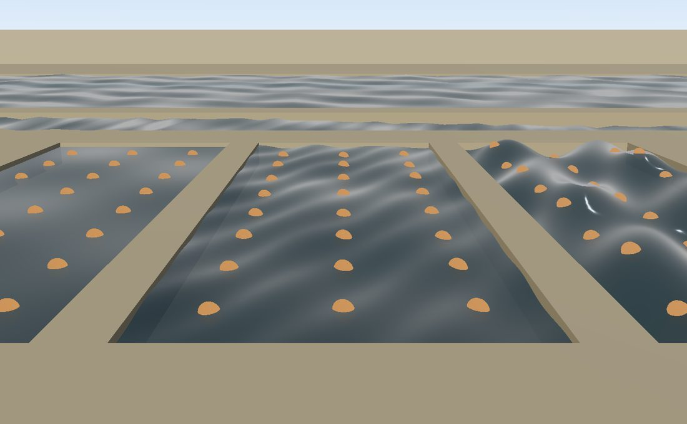

Water
=====

.. rst-class:: introduction

``OpenGLContext.scenegraph.water`` models water in two independent parts. The
**surface** is what you see from outside: a sheet on a lake, a ribbon down a
river, and a wave field you can query for its height. The **medium** is what
being inside the water does to the view, to the sound mix and to the body. A
game can use either part alone: it can have lakes that nobody enters, or flood
a level whose water is never drawn.

   ``python tests/water_demo.py``: three of the named styles side by side, with a
   river behind them. See :ref:`water-demo`.

.. code-block:: python

   from OpenGLContext.scenegraph.water import (
       STILL, BREEZE, FLOWING, CHOPPY, LAKE,   # how a body of water moves
       water_surface, water_ribbon, water_glints,   # meshes to draw it
       wave_height, wave_normal,        # the surface at a point and time
       Volume, Volumes, submerge,       # where the water is, and being in it
   )

How water moves: ``WaterStyle``
-------------------------------

A ``WaterStyle`` node describes how a body of water moves. Five styles are
predefined:

.. list-table::
   :widths: auto
   :header-rows: 1

   * - Field
     - Unit
     - ``STILL``
     - ``BREEZE``
     - ``FLOWING``
     - ``CHOPPY``
     - ``LAKE``
   * - ``amplitude``
     - metres, trough to crest
     - 0.0
     - 0.012
     - 0.09
     - 0.42
     - 0.16
   * - ``wavelength``
     - metres between crests
     - 11.0
     - 1.1
     - 4.5
     - 7.0
     - 9.0
   * - ``speed``
     - metres per second the crests travel
     - 0.0
     - 1.2
     - 1.6
     - 2.4
     - 0.8
   * - ``steepness``
     - radians the ripple tilts the normals, on top of the displacement
     - 0.045
     - 0.081
     - 0.063
     - 0.099
     - 0.059
   * - ``ripple``
     - metres the ripple's longest train repeats over
     - 11.0
     - 0.32
     - 11.0
     - 11.0
     - 11.0
   * - ``flow``
     - metres per second the surface drifts, ``(x, z)``
     - (0, 0)
     - (0, 0)
     - (1, 0)
     - (0, 0)
     - (0, 0)

- ``STILL`` is a pond. The surface does not move; the ripple is only in the
  normals, so it shows in the reflected light.
- ``BREEZE`` is a pond or small lake seen from its bank, ruffled by wind:
  waves about a metre apart and a centimetre high, and a ripple a hand's
  breadth across.
- ``FLOWING`` is a river. Small crests travel downstream and the surface drifts
  with them.
- ``CHOPPY`` is water in wind, with waves high enough to move the shoreline.
- ``LAKE`` is open water seen from a distance: a long, low swell, sized for a
  sheet hundreds of metres across.

A style is held in a mesh's ``waveStyle`` field. The five predefined styles
are shared nodes, as a VRML97 ``USE`` shares a node: every sheet built with
``LAKE`` moves by that one node, so setting ``LAKE.amplitude`` changes all of
them. For a style of your own, create a ``WaterStyle``, or start from a
predefined one with ``varied``, which returns a copy and leaves the original
unchanged:

.. code-block:: python

   from OpenGLContext.scenegraph.water import CHOPPY, WaterStyle

   storm = CHOPPY.varied(name='storm', amplitude=1.2)
   millpond = WaterStyle(name='millpond', steepness=0.02, ripple=0.2)

``ripple`` sets the scale the water is seen at, and the swell's
``wavelength`` should match it. A 20 m pond drawn with ``LAKE`` shows two or
three long rollers and glitter in bands metres wide, which does not look like
water; the same pond with ``BREEZE`` does.

Where ``flow`` is not zero, it also sets the direction the crests travel.
``style.moving()`` returns whether the style changes with time. Use it to skip
updating the clock for water that does not move.

The wave field
~~~~~~~~~~~~~~

The surface is the sum of **three crossing sine waves**, computed from
*world* position and time rather than from a mesh's own coordinates. This has
two results:

- Sheets that meet stay joined. A river flowing into a lake has the same height
  as the lake along the join, because both compute the same function at the
  same place.

- You can query the surface. ``wave_height(style, x, z, when)`` and
  ``wave_normal(style, x, z, when)`` take scalars or NumPy arrays and return the
  surface's height and normal there. Use them for buoyancy, a boat's waterline
  or a splash.

.. code-block:: python

   from OpenGLContext.scenegraph.water import CHOPPY, wave_height

   lift = wave_height(CHOPPY, boat[0], boat[2], when=context.time)

.. _surfaces:

Drawing water
-------------

A lake: ``water_surface``
~~~~~~~~~~~~~~~~~~~~~~~~~

.. code-block:: python

   mesh = water_surface(x0, x1, z0, z1, level=12.0,
                        resolution=33, style=CHOPPY, on_gpu=True)

``water_surface`` builds a flat sheet over a rectangle, at height ``level``.
``resolution`` is the number of vertices along each side. For still water the
ripple is in the normals, so resolution matters little. For choppy water it
limits how much of the wave the mesh can show: a mesh that is coarse compared
with the wavelength shows a flat sheet with odd normals. Use at least a few
vertices per ``wavelength``, or let :ref:`mesh_across <water-mesh-density>`
choose.

A river: ``water_ribbon``
~~~~~~~~~~~~~~~~~~~~~~~~~

.. code-block:: python

   mesh = water_ribbon(course, width=8.0, style=FLOWING, lift=0.15)

A sheet has one level, so it cannot follow a river downhill.
``water_ribbon`` builds a strip along a course instead. ``course`` is an
``(N, 3)`` array of world points giving where the water runs and how high it
is there. ``width`` is the width in metres: one number, or one per point for a
river that widens downstream. The surface lies *across the flow* at every
point, so a bend in the course is a bend in the ribbon. ``lift`` raises the
surface above the course, for a course that traces the river bed rather than
the water surface.

.. _glints:

A distant river: ``water_glints``
~~~~~~~~~~~~~~~~~~~~~~~~~~~~~~~~~

.. code-block:: python

   mesh = water_glints(course, width=8.0, spacing=60.0, style=FLOWING)

A river a kilometre away is two pixels wide and mostly hidden by trees. What
the eye sees is flashes of light from the surface between them.
``water_glints`` draws those flashes as a few small quads, in place of a full
ribbon. It is the river's far level of detail.

``spacing`` is the distance between glints, in metres. Increase it with
distance. A coarser tile also covers more ground, so a spacing that grows
with the tile's geometric error keeps the number of glints per tile roughly
constant. ``size`` is the fraction of the river's width each glint covers. The
glint positions depend on distance along the course, not on random numbers,
so a world baked twice has its glints in the same places.

.. _on_gpu:

Animating on the GPU: ``on_gpu``
~~~~~~~~~~~~~~~~~~~~~~~~~~~~~~~~

All three builders take ``on_gpu``. Without it, the wave is built into the
vertices at time ``when``. Use that for still water, or when you need the
mesh vertices to match the surface. With ``on_gpu=True``, the mesh is built
**flat** and the style is passed to the vertex shader, which displaces it:

.. code-block:: python

   mesh = water_surface(0, 200, 0, 200, level=0.0, style=CHOPPY, on_gpu=True)
   ...
   mesh.wave_time = context.time      # once a frame; nothing is re-uploaded

The mesh is uploaded once, and each frame sets only a few uniforms. Skinning
uses the same approach for a pose.

Do not use both methods on one mesh, or the wave is applied twice. ``Shape``
sets the wave uniforms for every shape it draws, turning the wave off for
shapes that are not water, so the ground beside a lake does not ripple.

The shadow depth program applies the wave too, so moving water casts the
shadow of its displaced shape.

.. _water-mesh-density:

How finely to mesh a sheet
~~~~~~~~~~~~~~~~~~~~~~~~~~

A sheet is meshed once across its whole area, so no single vertex count suits
both a pond and a lake. ``mesh_across(side, style)`` returns a vertex count
for a sheet ``side`` metres across, based on the style's *wavelength*:

- ``MESH_PER_WAVE`` (4) samples per wavelength;
- at most ``MESH_LIMIT`` (33) vertices across, because a sheet is one draw and
  its size counts in the frame and in the file of a baked world;
- at least ``MESH_FLOOR`` (9) vertices across for any style with a non-zero
  amplitude.

With too few vertices per wave, the wave aliases: it flattens, or shows up as
a longer wave that is not in the field. Two samples per wave is the Nyquist
limit. In practice, whether two samples land on the crests or on the zero
crossings depends on where the sheet starts. Measured over a 12 m sheet, two
samples per wave keep 73% of the wave's height and four keep 89%. Over 40 m,
the figures are 84% and 96%. For large sheets both settings reach
``MESH_LIMIT``, so the choice makes no difference there.

The fine ripple is not in the mesh. The fragment shader's ``waveRipple`` tilts
the surface normal, so the glitter looks the same at any mesh density and the
mesh only needs to carry the swell. The ripple is six trains of waves, with
lengths from 0.41 to 1.83 times the style's ``ripple`` and headings spread
around the compass, so no two repeat together and the surface does not tile.
On moving water each train travels at the speed a real water wave of its
length does, √(g/k), so long trains outrun short ones and the glitter changes
as it travels; still water's ripple does not move.

The ripple's strength varies across the surface in gusts. Two long, slow
trains, 23 and 37 times the ``ripple`` length, vary it from a tenth of
``steepness`` in the calmest patch to 1.6 times it in the gustiest, and drift
at 0.6 of the style's ``speed``. A ripple of one strength everywhere looks
like a texture laid over the water.

Each train also fades with the size of the pixel it lands in: it fades out as
its wavelength falls from four pixels to two, measured per fragment from the
derivative of the surface position. Far water is therefore a smooth mirror,
not a grid. ``wave_normal`` returns the unfiltered field.

.. _water-reflection:

What it reflects
~~~~~~~~~~~~~~~~

Water reflects the scene standing around it: the far bank, a jetty, a fire on
the shore. Water is one of the engine's :doc:`planar reflections
<reflections>`: each sheet in view is a mirror, drawn through the camera
mirrored in its plane, and read pushed by how far the ripple and swell tilt
the surface from flat. Where nothing was mirrored -- the sky -- it reflects the
environment probe. Water's Fresnel weights both, so the reflection is faint
looking straight down and strong across the surface at a glance.

Nothing has to be asked for: any geometry with a ``waveStyle`` is water, and
water is a mirror whatever its material. ``water_material()`` and the ``water``
hook give the material ``reflector.WATER``, redrawn every frame with the
ripple's distortion; a lake of one's own is ``WATER.varied(...)``.
``ContextDefinition.planarReflections`` (env
``OPENGLCONTEXT_PLANAR_REFLECTIONS``) switches every reflection off, water's
included, and the budget it draws within is :doc:`reflections`'.

Its limits, beside the reflections' own:

- Transparent things -- particles, glass -- are not in the reflection.
- A camera under the surface gets none: it is looking up through the water.

.. _media:

Being in the water: media and volumes
-------------------------------------

A ``Medium`` describes one substance from the inside. Three are predefined.
The values are chosen for games; no standard specifies them:

.. list-table::
   :widths: auto
   :header-rows: 1

   * - Name
     - ``visibility``
     - ``muffle``
     - ``harm``
   * - ``water``
     - 9 m
     - 0.75
     - 0
   * - ``slime``
     - 4.5 m
     - 0.85
     - 12 health per second
   * - ``lava``
     - 2 m
     - 0.90
     - 32 health per second

- ``visibility`` is the distance, in metres, over which the view fades to the
  medium's ``color``.
- ``color`` is in **linear** RGB. The fog blends in linear HDR before tone
  mapping, so the colours are much darker than water looks from above. Water
  *absorbs* light from what is behind it. A pale, long-range fog would look
  like haze in air.
- ``muffle`` is how much of the sound mix's high frequencies is removed, from
  0 to 1. The predefined values stay below 1, because complete silence sounds
  like a fault.
- ``harm`` is damage per second, for a game to apply.

A ``Medium`` is a scenegraph node with ``name``, ``color``, ``visibility``,
``muffle`` and ``harm`` fields. The substances are in the ``MEDIA`` dictionary
in ``OpenGLContext.scenegraph.water.medium``, keyed by name. A volume names
its substance, and every volume naming ``'lava'`` is inside the one
``MEDIA['lava']`` node, so changing that node's fields changes lava
everywhere. To add a substance, add a ``Medium`` to the dictionary:

.. code-block:: python

   from OpenGLContext.scenegraph.water import MEDIA, Medium

   MEDIA['acid'] = Medium(name='acid', color=(0.02, 0.05, 0.0),
                          visibility=3.0, muffle=0.8, harm=20.0)

A name that is not in ``MEDIA`` is treated as water (``UNKNOWN``), not as dry
air.

Where the water is
~~~~~~~~~~~~~~~~~~

.. code-block:: python

   from OpenGLContext.scenegraph.water import Volume, Volumes

   volumes = Volumes([
       Volume.below(minimum=(-40, -40), maximum=(40, 40), level=2.0, depth=30.0),
       Volume(minimum=(10, -8, 10), maximum=(14, -4, 14), medium='lava'),
   ])
   volumes.medium_at(point)               # 'water', 'lava' or '' for dry air

A ``Volume`` is an axis-aligned box in world metres. ``Volume.below`` makes the
box under a water level. The boundary counts as inside, so a body exactly at
the waterline is in the water. A ``Volume`` is a node whose ``minimum``,
``maximum`` and ``medium`` fields are the box and what fills it; the corners
are world coordinates wherever the node is held.

Where boxes overlap, ``medium_at(point, rule=...)`` chooses the result:

- ``'worst'`` (the default) returns the most harmful medium, for a body half in
  a pool and half in the lava beneath it;
- ``'smallest'`` returns the medium of the smallest box. Use it when the boxes
  are the bounds of a spatial partition, such as BSP leaves or tiles.

Putting the camera under water
~~~~~~~~~~~~~~~~~~~~~~~~~~~~~~

.. code-block:: python

   from OpenGLContext.scenegraph.water import medium_fog, submerge

   self.fog = medium_fog()                       # once, bound into the scene
   ...
   name = submerge(self, volumes, self.platform.position)   # once a frame

``medium_fog()`` returns a :ref:`Fog <fog>` node that starts switched off.
Call ``submerge`` once a frame with the viewer's position. It sets the
context's ``fog`` to the medium's colour and visibility, and sets the audio
engine's whole-mix :ref:`muffle <audio-muffle>` to the medium's ``muffle``. It
returns the name of the medium, or ``''`` for dry air, so the caller can report
it or apply ``harm``. Because the effect is fog with depth, not a coloured
overlay, nearby objects stay clear while distant ones fade.

Every part is optional:

- ``volumes`` may be ``None``, for a world with no water.
- A context with no ``fog`` attribute gets no fog change.
- On a machine with no sound, the audio device is not opened just to muffle
  silence.

``volumes`` can be any object with a ``medium_at(point)`` method. A game whose
water comes from a BSP's content flags can pass its own object, with no
conversion.

.. _water-demo:

Demo
----

``python tests/water_demo.py`` shows three of the named styles side by side over
one bed, with a ``water_ribbon`` running behind them along a course that drops
from one end to the other. Each pool holds a grid of floats placed on the
surface with ``wave_height`` once a frame, so you can see the scale of the
waves. Over one pool, ``STILL`` (left) is flat to the millimetre, ``FLOWING``
(middle) spans 0.34 m from trough to crest, and ``CHOPPY`` (right) spans
1.58 m. Every sheet is built with ``on_gpu=True``, so a frame costs five
``wave_time`` writes (the three pools, the lake and the river) and no
uploads. Behind the river is a 180 m ``LAKE``,
meshed by ``mesh_across``. The demo runs with ``OPENGLCONTEXT_SHADOWS=0``.

Keys:

- :kbd:`v` moves the camera under the middle pool, and prints the medium
  ``submerge`` found as the camera crosses the surface:

  .. code-block:: text

     medium under the camera: water
     medium under the camera: air

- :kbd:`h` prints the ``wave_height`` at each pool's centre:

  .. code-block:: text

     STILL    surface at +0.000 m (t=0.05s)
     FLOWING  surface at -0.020 m (t=0.05s)
     CHOPPY   surface at -0.283 m (t=0.05s)

- :kbd:`d` switches the lake between ``mesh_across`` and a fixed nine vertices
  across, and prints how much of the swell each keeps, measured against the
  wave field:

  .. code-block:: text

     lake 180 m across, meshed from its wavelength: 33 vertices, 1.6 samples per wave, keeps 98% of its swell
     lake 180 m across, meshed the old way:          9 vertices, 0.4 samples per wave, keeps 47% of its swell

  Nine vertices across 180 m is one every 22 m against a 9 m wave. That is
  less than one sample per wave, below the Nyquist limit, so the wave flattens
  and reappears as a longer wave.

A minimal application with a body of water, and a check for whether the
camera is in it:

.. code-block:: python

   import time

   from OpenGLContext.scenegraph.basenodes import Appearance, Shape, sceneGraph
   from OpenGLContext.scenegraph.water import (
       CHOPPY, Volume, Volumes, medium_fog, submerge, water_surface,
   )

   # Built once: 80 m square at sea level, meshed 65 x 65, moved by the card.
   sheet = water_surface(-40, 40, -40, 40, level=0.0, resolution=65,
                         style=CHOPPY, on_gpu=True)
   lake = Shape(geometry=sheet, appearance=Appearance(material=sheet.material))
   scene = sceneGraph(children=[lake, medium_fog()])

   # Where the water is, for a body that may end up inside it.
   volumes = Volumes([Volume.below(minimum=(-40, -40), maximum=(40, 40),
                                   level=0.0, depth=30.0)])
   start = time.monotonic()

   def step(context):
       """Once a frame: move the surface, and put the camera in or out of it."""
       sheet.wave_time = time.monotonic() - start
       return submerge(context, volumes, context.getViewPlatform().position)

.. _authoring:

Authoring water in a model
--------------------------

An artist can also mark water in the model. Give the lake's material a custom
property called ``OGLC_hook`` and export it, and the surface loads moving. The
``water`` kind is built in, so a tagged file opens in ``oglc-view`` as water
with nothing registered.

.. code-block:: javascript

   OGLC_hook = {"kind": "water", "style": "choppy", "depth": 6.0}

In Blender this is a custom property on the material, exported with
**Include ‣ Custom Properties** ticked; Blender 4.x needs no add-on for it.
The add-on in ``tools/blender/oglc_hook`` is the other way to author it: an
**Engine Hook** panel with a field for each parameter below, which writes the
extension form on export. ``OGLC_hook = "water"``, the kind on its own, is a
pond. :ref:`Engine hooks <hooks>` describes the mechanism, including how to
tag a node rather than a material and how to register a kind of your own.

.. list-table::
   :widths: auto
   :header-rows: 1

   * - Parameter
     - Default
     - Meaning
   * - ``style``
     - ``still``
     - ``still``, ``breeze``, ``flowing``, ``choppy`` or ``lake``, or an
       object naming one as its ``style`` and overriding any ``WaterStyle``
       field (``amplitude``, ``wavelength``, ``speed``, ``steepness``,
       ``ripple``, ``flow``): ``{"style": "breeze", "ripple": 0.3}`` is a finer
       ruffle. An unknown name draws a pond and logs a warning.
   * - ``material``
     - ``keep``
     - ``keep`` shades the surface with the material in the file. ``engine``
       uses ``water_material()`` instead.
   * - ``medium``
     - ``water``
     - ``water``, ``slime`` or ``lava``: what being inside it is like. Lava is
       this kind with another medium and another material. A name ``MEDIA``
       does not hold is water, with a warning.
   * - ``depth``
     - ``0.0``
     - How far below the surface the body reaches, in metres, at least 0. A
       surface has no thickness, so a sheet with no ``depth`` bounds a box
       that nothing is inside except exactly at the waterline.

A value that is no finite number is logged once and left at its default. A
written-out style's ``amplitude`` and ``steepness`` are at least 0 and its
``wavelength`` and ``ripple`` at least a centimetre (``STYLE_RANGES`` in
``scenegraph.water.gltf``).

Each tagged primitive becomes one ``WaterBody`` in
``scene.hook_data['water']``: the mesh whose wave a frame advances, the style
it moves with, and the ``Volume`` it fills, in world metres around that copy
of the surface. Two nodes sharing one tagged mesh are two bodies of water,
each with its own box.

.. code-block:: python

   scene = gltf.load_gltf("valley.glb")
   volumes = Volumes([body.volume for body in scene.hook_data.get('water', ())])
   ...
   submerge(self, volumes, self.platform.position)   # once a frame

The card holds the wave field, but something has to set the time.
``scene.advance(seconds)`` moves every body's surface and returns whether
anything changed. The viewer calls it from its idle; a game driving its own
loop calls it itself. A scene of still ponds returns ``False``, since their
ripple is in the normals and nothing needs redrawing.
``oglc-view --anim-time SECONDS`` holds the water at that time, as it holds the
animation, so a capture of a tagged lake is the same frame on every run.

The wave moves the sheet's vertices, so model the surface as a grid rather
than a single quad: a grid with a vertex every 30 to 50 cm moves as water,
while a four-cornered plane only tilts at its corners. Give the shore a bank
steeper than the swell is high, or the troughs uncover it and the crests
flood it.

``tools/blender/demos/lakeside.glb``, in a checkout of the OpenGLContext
repository (``tools/`` is not in the installed package), is a world authored
this way, built by
``tools/blender/demos/lakeside.py`` with the add-on's panel: a lake whose
material is tagged ``{"kind": "water", "style": "breeze", "depth": 2.0}`` in a
grass basin, with a jetty, a brazier and a campfire tagged as
:ref:`particle effects <authored-particles>`.
``oglc-view tools/blender/demos/lakeside.glb`` opens it through its own camera.

Limits
------

- No fluid simulation. The wave field is analytic (three sine waves), so it is
  cheap to evaluate and gives the same surface on every run. Water does not
  find its own level or pour.

- No physics body. Buoyancy and drag code can read ``wave_height``; the object
  being moved decides what to do with it.

- Water does not refract what is behind it. It is a blended :doc:`PBR <pbr>`
  material with an index of refraction of 1.33, which sets its reflectance;
  the bed shows through its transparency undisplaced.

- A volume is a box. To give a sloping river a medium, cut it into several
  boxes.

- The shoreline is where the mesh meets the ground. Nothing blends the edge,
  and a sheet that ends inside a hill shows its edge.
